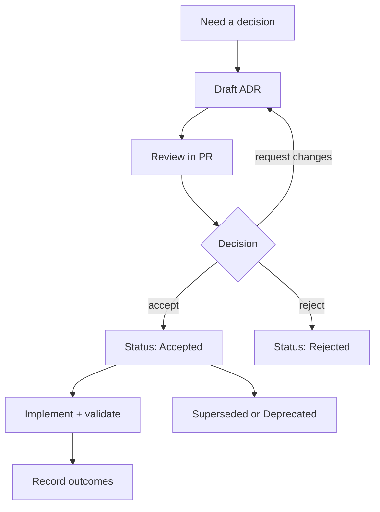

<!-- [KFM_META_BLOCK_V2]
doc_id: kfm://doc/3d3f7d0f-4d9b-4d67-9c6e-7d7b3c7cb6d5
title: docs/adr — Architecture Decision Records
type: standard
version: v1
status: draft
owners: TBD
created: 2026-02-24
updated: 2026-02-24
policy_label: public
related:
  - docs/README.md
  - docs/adr
tags: [kfm, adr, architecture, governance]
notes:
  - This README defines the ADR process + conventions for this repo.
  - Keep ADRs evidence-linked and reversible per KFM operating rules.
[/KFM_META_BLOCK_V2] -->

# docs/adr — Architecture Decision Records (ADRs)

> **Purpose:** A governed, auditable record of *why* we made key architecture and governance decisions.


**Owners:** `TBD` (set this to the team responsible for architecture/governance)  
**Scope:** Data → pipelines → catalogs/provenance → storage/indexing → governed APIs → Map/Story UI → Focus Mode AI  
**Location:** `docs/adr/` (this directory)

---

## Quick navigation

- [Why ADRs exist](#why-adrs-exist)
- [When an ADR is required](#when-an-adr-is-required)
- [Directory rules](#directory-rules)
- [ADR lifecycle](#adr-lifecycle)
- [How to create a new ADR](#how-to-create-a-new-adr)
- [ADR format requirements](#adr-format-requirements)
- [Index](#index)
- [FAQ](#faq)
- [Appendix](#appendix)

---

## Why ADRs exist

ADRs are part of the **trust membrane** for this project:

- **Correctness first:** future maintainers can see the reasoning, constraints, and evidence behind decisions.
- **Safety first:** risky decisions document mitigations, rollback plans, and policy boundaries.
- **Testability:** decisions include the *verification steps* that prove the change is safe and working.
- **Reversibility:** decisions include rollback strategy, migration plans, and promotion gates.

> **NOTE**
> ADRs are not “design docs.” They are **decision records**: small, focused, and durable.

---

## When an ADR is required

Write an ADR when a change affects **system shape**, **governance boundaries**, or **user-facing claims**.

### Common triggers

| Change type | ADR required? | Examples |
|---|---:|---|
| New data zone / promotion gate | ✅ | Raw→Work→Processed→Published rules, QA thresholds, audit record format |
| Provenance/catalog identity strategy | ✅ | Dataset IDs, checksums, lineage model, retention policies |
| Storage/indexing architecture | ✅ | Object store layout, vector index choice, partitioning, backup/restore approach |
| Governed API contracts | ✅ | OpenAPI changes, auth model, rate limits, error model, audit logging |
| UI ↔ API access boundary | ✅ | “UI never hits DB directly” enforcement, policy adapters |
| Security/privacy posture | ✅ | redaction rules, access control, secrets handling, threat model decisions |
| Model/AI Focus Mode behavior | ✅ | allowed tools, retrieval boundaries, citation requirements, refusal policy |
| Cross-cutting dependencies | ✅ | introducing a new DB, queue, GIS engine, auth provider, CI gate |
| Pure refactors / typo fixes | ❌ | no externally observable behavior change and no governance boundary change |

> **WARNING**
> If sensitivity/permissions are unclear, **default-deny**: generalize, redact, and flag “needs governance review.”

---

## Directory rules

### Where this fits in the repo

`docs/adr/` holds architecture decision records that justify **governed changes** across the end-to-end system.

### Acceptable inputs (what belongs here)

- One Markdown file per decision: `NNNN-short-slug.md`
- Small supporting diagrams (prefer Mermaid in the ADR)
- Minimal attachments (only when necessary; prefer text)

### Exclusions (what must not go here)

- Implementation guides, runbooks, or tutorials (put those in `docs/` elsewhere)
- Meeting notes/transcripts (store in the appropriate meeting-notes location)
- Secrets, credentials, or sensitive operational details
- Exact coordinates or targeting information for vulnerable/private/culturally restricted sites

---

## ADR lifecycle



### Status definitions

| Status | Meaning |
|---|---|
| Proposed | Drafted and under review; not yet the project’s decision |
| Accepted | Approved decision; implementation may be in progress |
| Rejected | Considered but not adopted (keep for history) |
| Deprecated | No longer recommended, but not replaced by a single ADR |
| Superseded | Replaced by another ADR (must link to the replacing ADR) |

---

## How to create a new ADR

1. **Pick a short title** that reads like a decision: “Adopt X for Y”, “Standardize Z”, “Enforce policy boundary …”
2. **Create the file** in this directory using the naming rule below.
3. **Copy the template** from [Appendix](#appendix) into your new ADR file.
4. **Fill it out completely**, especially:
   - options considered + tradeoffs
   - evidence / links to artifacts
   - rollout + rollback
   - validation / promotion gates
5. **Open a PR** with:
   - the ADR file
   - (if applicable) the smallest code/config change that implements the decision
6. **Update the Index** in this README (or keep it current via automation if your repo supports it).
7. After approval/merge, update status:
   - `Proposed → Accepted` (when the decision is approved)
   - link the implementing PR(s) and validation evidence

> **TIP**
> Keep ADRs small. If it takes more than ~1–2 pages to explain the decision, you likely need a separate design doc and the ADR should *link* to it.

---

## ADR file naming

**Preferred pattern:** `NNNN-short-slug.md`

- `NNNN` is a 4-digit sequence (e.g., `0007`)
- `short-slug` is lowercase and hyphenated

Examples:

- `0001-governed-api-boundary.md`
- `0002-data-zones-and-promotion-gates.md`
- `0003-vector-index-selection.md`

> **NOTE**
> If two PRs pick the same next number, resolve during review by renumbering one ADR (keep it mechanical: file name + title line).

---

## ADR format requirements

Every ADR MUST include:

- **Status** + **Date**
- **Decision statement** (one clear sentence)
- **Context** (the problem, constraints, and why now)
- **Options considered** (with tradeoffs)
- **Decision** (what we will do)
- **Consequences** (positive, negative, risks)
- **Verification / minimum checks** (how we prove this decision works)
- **Rollout and rollback plan**
- **Evidence links** (PRs, issues, benchmarks, policies, data samples, run receipts)

### Evidence discipline

Include *direct links* to the artifacts that justify the decision, such as:

- benchmark results, QA reports, run receipts
- policy docs or governance approvals
- API contracts (OpenAPI/GraphQL) and breaking-change assessment
- threat model notes and mitigations
- migration plans and reversibility proof

> **RULE OF THUMB**
> If the ADR contains a claim that would be user-facing (Map/Story UI or Focus Mode output), the ADR should point to the evidence that makes that claim defensible.

---

## Index

> Keep this table current. Add an entry when an ADR is created, and update status when it changes.

| ADR | Title | Status | Date | Owner | Notes |
|---:|---|---|---|---|---|
| _TBD_ | _Add your first ADR_ | _Proposed_ | _YYYY-MM-DD_ | _TBD_ | _Add link once file exists_ |

---

## FAQ

### Can I edit an old ADR?
Yes, but only for:
- status transitions (`Proposed → Accepted`, etc.)
- links to implementation/evidence
- clarifications that do **not** change the original decision

If the decision changes, write a **new ADR** and mark the old one **Superseded**.

### Where do “how-to” docs go?
Not here. ADRs are for **decisions**. Put how-to docs in the appropriate `docs/` section and link them from the ADR if needed.

### What about sensitive decisions?
If an ADR must reference restricted information, create a **public ADR** that documents the decision at a safe abstraction level and link to the restricted artifact in the appropriate restricted system/location (do not commit secrets to the repo).

---

## Appendix

<details>
<summary><strong>ADR template (copy/paste)</strong></summary>

```markdown
# ADR NNNN: <short decision title>

- **Status:** Proposed | Accepted | Rejected | Deprecated | Superseded
- **Date:** YYYY-MM-DD
- **Owners:** <team or names>
- **Deciders:** <role(s) or group>
- **Policy label:** public | restricted | ...
- **Related:** <issue/PR/doc links>

## Context

What problem are we solving? Why now?

- Constraints:
- Assumptions:
- Non-goals:

## Decision drivers

List the forces that matter (cost, latency, correctness, safety, governance, team skill, licensing, etc.).

## Options considered

### Option A: <name>
- Pros:
- Cons:
- Risks:
- Operational impact:

### Option B: <name>
- Pros:
- Cons:
- Risks:
- Operational impact:

## Decision

One sentence: **We will ...**

Explain the decision clearly and precisely.

## Consequences

### Positive
- ...

### Negative / Risks
- ...

### Tradeoffs
- ...

## Governance & policy impacts

- Data sensitivity / classification:
- Redaction needs:
- Access control changes:
- Audit/provenance requirements:
- Any CARE/FAIR or community constraints:

## Rollout plan

Step-by-step, including promotion gates and validation.

## Rollback plan

How we undo this safely. Include triggers for rollback.

## Verification (minimum checks)

Smallest set of checks needed to prove this decision works:
- [ ] Unit/integration tests:
- [ ] Data QA thresholds:
- [ ] Contract checks:
- [ ] Observability checks (logs/metrics/traces):
- [ ] Security checks:

## Evidence

Links to artifacts:
- ...
- ...

## Follow-ups

- [ ] ...
- [ ] ...

## Supersedes / Superseded by

- Supersedes: <ADR link or N/A>
- Superseded by: <ADR link or N/A>
```

</details>

---

<p align="right"><a href="#docsadr--architecture-decision-records-adrs">Back to top ↑</a></p>
