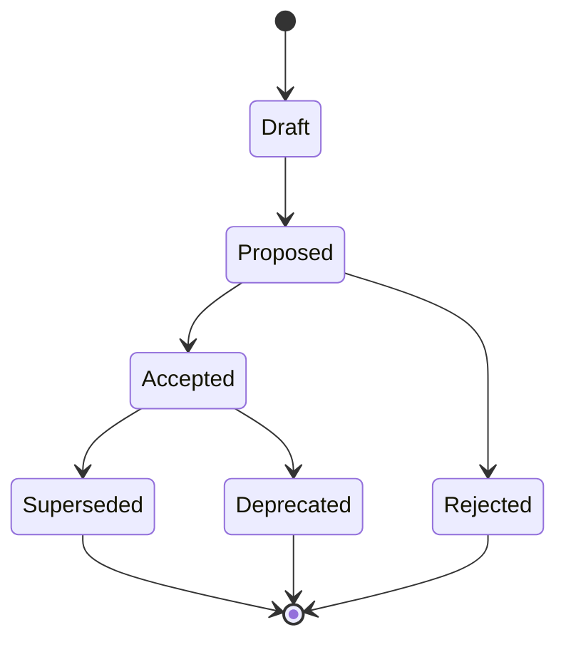

[KFM_META_BLOCK_V2]
doc_id: kfm://doc/0b6aa5b0-2f4d-4e91-9d3a-4a5f3b7b9b6a
title: Architecture Decision Records (ADR) — Index and Workflow
type: adr
version: v1
status: draft
owners: TBD
created: 2026-02-22
updated: 2026-02-22
policy_label: public
related:
  - kfm://doc/TBD-kfm-definitive-guide
tags:
  - kfm
  - governance
  - architecture
  - adr
notes:
  - This README defines the ADR workflow and serves as the ADR index.
[/KFM_META_BLOCK_V2]

# Architecture Decision Records
Decision log for **significant** KFM choices (architecture, governance, data contracts, and policy boundaries).

**Status:** `draft` • **Owners:** `TBD` • **Scope:** `repo-wide` • **Policy:** `public`

`type:adr-index` `map-first` `time-aware` `governed` `evidence-first` `cite-or-abstain`

---

## Navigation
- [Why ADRs exist](#why-adrs-exist)
- [When to write an ADR](#when-to-write-an-adr)
- [Folder and naming conventions](#folder-and-naming-conventions)
- [ADR lifecycle](#adr-lifecycle)
- [ADR template](#adr-template)
- [Merge and review gates](#merge-and-review-gates)
- [ADR index](#adr-index)
- [Appendix](#appendix)

---

## Why ADRs exist
ADRs are lightweight documentation that “ages well”: they preserve **what we decided** and **why**, including what we rejected and the tradeoffs we accepted.

They are especially valuable when decisions affect:
- the **truth path** (Raw → Work/Quarantine → Processed → Published),
- the **trust membrane** (no bypass around governed APIs/policy),
- **catalog + provenance contracts** (DCAT/STAC/PROV),
- deterministic identity (IDs/spec hashing),
- **policy labels**, redaction obligations, and export rules,
- bitemporal semantics (event/valid/transaction time),
- storage/index projection choices (rebuildability).

> [!NOTE]
> ADRs are not “design docs for everything.” They are for decisions where “cost of change” is high, or where governance requires an explicit, auditable choice.

[Back to top](#architecture-decision-records)

---

## When to write an ADR
Write an ADR when **any** of the following is true:

### Required (MUST)
- A PR changes or introduces a **core invariant** (policy, IDs, catalogs, trust membrane, promotion contract).
- A PR closes a tracked “gap” that affects architecture/governance, especially build-vs-buy and system boundary choices.
- A decision changes **runtime exposure** (what can be served/exported; evidence resolution; cache behavior; offline bundles).

### Strongly recommended (SHOULD)
- You are choosing between two plausible options and need to preserve the tradeoff record.
- You are introducing a new dependency, storage system, indexing strategy, or contract surface.
- You are changing cross-cutting schemas (OpenAPI, GraphQL, STAC/DCAT/PROV profiles, EvidenceRef schemes).

### Not an ADR (SHOULD NOT)
- Routine refactors with no external behavior change.
- Implementation details that can be reversed cheaply and don’t touch invariants/contracts.
- Temporary experiments (use an experiment note or spike doc, then elevate to ADR if adopted).

> [!WARNING]
> If uncertainty is high, use the ADR to explicitly document assumptions and the plan to validate them. Do not “bake in” implicit defaults.

[Back to top](#architecture-decision-records)

---

## Folder and naming conventions

### Location
All ADRs live in:
- `docs/adr/`

### File naming
Use a stable, sortable convention:

- `ADR-0001-short-title.md`
- `ADR-0002-another-decision.md`

Rules:
- **One ADR = one decision.**
- Do not reuse numbers.
- Titles should be short, specific, and grep-friendly.
- Once `Accepted`, the ADR body should be treated as **append-only**:
  - You MAY add clarifications, implementation notes, or links.
  - You MUST NOT rewrite history. If the decision changes, write a new ADR that **supersedes** the old one.

### Indexing rule
Every new ADR MUST be added to the table in this README under [ADR index](#adr-index).

[Back to top](#architecture-decision-records)

---

## ADR lifecycle



**Status meanings**
- `Draft`: under construction; not ready for decision.
- `Proposed`: ready for review; decision pending.
- `Accepted`: adopted; implementation may be in progress or complete.
- `Rejected`: not adopted; keep rationale.
- `Superseded`: replaced by a newer ADR (link required).
- `Deprecated`: decision is no longer recommended, but not necessarily replaced.

[Back to top](#architecture-decision-records)

---

## ADR template

Copy/paste this skeleton for a new ADR:

```md
[KFM_META_BLOCK_V2]
doc_id: kfm://doc/<uuid>
title: ADR-XXXX — <Short decision title>
type: adr
version: v1
status: draft
owners: <names or team>
created: YYYY-MM-DD
updated: YYYY-MM-DD
policy_label: public|restricted|...
related:
  - kfm://dataset/<slug>@<dataset_version_id>
  - kfm://story/<uuid>@v1
  - kfm://doc/<uuid>        # related doc(s)
tags:
  - adr
  - <topic>
notes:
  - <optional short notes>
[/KFM_META_BLOCK_V2]

# ADR-XXXX: <Short decision title>

## Summary
One paragraph: the decision and why it matters.

## Context
- What problem are we solving?
- What constraints apply? (policy, rebuildability, performance, scope, time, budget)
- What assumptions are we making?

## Decision
- The chosen option.
- What is explicitly in-scope vs out-of-scope.

## Alternatives considered
- Option A: <pros/cons, why not>
- Option B: <pros/cons, why not>
- (Add more only if they were seriously considered.)

## Consequences and tradeoffs
- Positive outcomes
- Negative outcomes / risks
- Operational impact (CI, runbooks, maintenance)

## Governance and policy impacts
- Policy labels affected
- Obligations introduced (redaction, generalization, export denial, notices)
- Any new review/approval requirements

## Evidence and references
List the evidence used to decide, preferably with resolvable refs.
- [CITATION: doc://...]
- [CITATION: dcat://...]
- [CITATION: prov://...]
- Links to benchmarks / experiments / PRs (if applicable)

## Rollback and reversibility plan
- What is the rollback trigger?
- What is reversible vs irreversible?
- Data migration rollback strategy (if any)

## Implementation plan
- Step 1: …
- Step 2: …
- Tests/CI gates to add or update
- Telemetry/monitoring changes

## Decision log
- YYYY-MM-DD: Draft created by <name>
- YYYY-MM-DD: Proposed for review
- YYYY-MM-DD: Accepted by <role or group>
```

> [!TIP]
> If the ADR touches contracts (OpenAPI/schemas), include a **minimal diff** (or link to one) and explicitly call out compatibility and migration.

[Back to top](#architecture-decision-records)

---

## Merge and review gates

### PR requirements (minimum)
- [ ] ADR is linked in the PR description when changing:
  - policy/authorization behavior
  - identity/hash rules
  - catalog/provenance contract shapes
  - trust membrane boundaries
  - promotion gates / publish rules
- [ ] ADR status is `Proposed` or `Accepted` (not `Draft`) before merge.
- [ ] Any new obligations are testable (CI checks or policy tests), not “hand-waved.”

### Policy-default posture
- If sensitivity/permissions are unclear: **default-deny** and document the needed governance decision in the ADR.
- If locations may be sensitive (cultural sites, private individuals, critical infrastructure): ADR MUST specify how geometry is generalized/redacted and how exports are constrained.

[Back to top](#architecture-decision-records)

---

## ADR index

> [!NOTE]
> Keep this table current. It is the fastest way to answer: “What did we decide, and where is it documented?”

| ADR | Title | Status | Date | Supersedes | Link |
|---:|---|---|---:|---|---|
| 0001 | _TBD_ | Draft | YYYY-MM-DD | — | `ADR-0001-tbd.md` |

<!--
Add new ADRs above this comment so the newest decisions are easiest to find.
-->

[Back to top](#architecture-decision-records)

---

## Appendix

<details>
<summary><strong>FAQ</strong></summary>

### Do ADRs replace design docs?
No. ADRs capture decisions and rationale. Larger designs can live elsewhere and be referenced from the ADR.

### Can we change an Accepted ADR?
Treat Accepted ADRs as historical records. If the decision changes, write a new ADR and mark the old one `Superseded`.

### What if we need to move fast?
Write a short ADR anyway. A “thin” ADR is better than losing the rationale and repeating the debate later.

</details>
