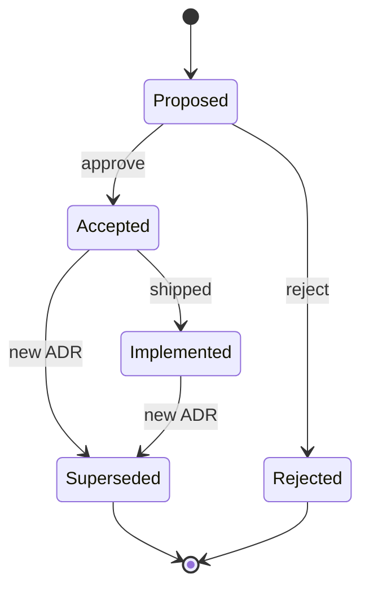

# ADRs
Decision log for Kansas Frontier Matrix (KFM): architecture, data, governance, and platform choices.

**Status:** Draft • **Owners:** TBD • **Location:** `docs/adr/` • **Last updated:** 2026-02-22


**Jump to:** [Quickstart](#quickstart) • [ADR index](#adr-index) • [Adding a new ADR](#adding-a-new-adr) • [ADR template](#adr-template) • [Review gates](#review-gates)

---

## Quickstart

1. **Read existing ADRs** to understand current decisions and constraints.
2. **Create a new ADR** when a choice changes system behavior, governance, interfaces/contracts, or operational posture.
3. **Link the ADR** to the code/config/contracts that implement it (PRs, schemas, policies, pipelines, UI).
4. **Keep the index table current** (add a row when the ADR is created; update status when accepted/superseded).

---

## What counts as an ADR

Write an ADR when you make a decision that is hard to reverse, crosses team boundaries, or affects:

- **Trust & governance:** policy labels, redaction rules, approval workflows, audit logging.
- **Truth path & data lifecycle:** promotion gates, immutability, provenance capture, versioning.
- **Contract surfaces:** API contracts (OpenAPI/GraphQL), schemas, catalog profiles (DCAT/STAC/PROV).
- **Architecture invariants:** layering, “trust membrane” boundaries, deployment topology.
- **Security posture:** threat model assumptions, secrets handling, supply-chain controls.

If the change is purely local/refactorable and does not affect contracts or governance, prefer a normal design doc or PR description.

---

## ADR lifecycle



**Status meanings**

| Status | Meaning | Typical next step |
|---|---|---|
| Proposed | Drafted, under review | Gather feedback, iterate |
| Accepted | Decision approved | Implement + link artifacts |
| Implemented | Decision shipped in code/config | Monitor, document learnings |
| Superseded | Replaced by a newer ADR | Link to replacement ADR |
| Rejected | Not proceeding | Capture why for future |

---

## ADR index

> Keep this table authoritative. If there are no ADRs yet, leave it empty except for the header.

| ID | Title | Status | Date | Area | Links |
|---:|---|---|---|---|---|
| 0000 | ADR process and template | Draft | 2026-02-22 | Docs | (this file) |

---

## Adding a new ADR

### 1) Pick the next ID and filename

Use a monotonically increasing 4-digit ID:

- `0001-short-title.md`
- `0002-another-decision.md`

Avoid dates in filenames (dates belong inside the ADR).

### 2) Use the template

Use the template in [ADR template](#adr-template). Copy it into a new file and fill it in.

### 3) Required content

Every ADR must include:

- **Context** (what problem are we solving, and why now?)
- **Decision** (what we chose)
- **Alternatives considered** (what we did *not* choose)
- **Consequences** (tradeoffs, risks, second-order effects)
- **Adoption plan** (migration/rollout steps; reversibility where possible)
- **Links** (PRs, issues, schemas, policies, runbooks)

### 4) Keep the MetaBlock hidden

This repo uses the **KFM MetaBlock v2** format (no YAML frontmatter).  
For ADRs, keep the MetaBlock **hidden** in an HTML comment so it doesn’t clutter the rendered page.

Example:

```text
<!--
[KFM_META_BLOCK_V2]
...
[/KFM_META_BLOCK_V2]
-->
```

### 5) Update the index

Add a row to the [ADR index](#adr-index) with the new ADR’s ID, title, status, date, area, and links.

---

## Review gates

ADRs are “docs,” but they are also **governed artifacts** when they affect policy, data releases, or externally visible contracts.

Minimum review expectations:

- **Architecture/infrastructure ADRs:** engineering review + operational readiness
- **Governance/policy ADRs:** steward/governance review + policy label check
- **Contract ADRs:** schema/API review + validation/CI impact check
- **Security ADRs:** threat-model check + least-privilege review

If sensitivity is unclear, **default-deny**: set `policy_label` conservatively and request governance review before publishing broadly.

---

## Directory layout

Recommended structure (this folder is the canonical ADR home):

```text
docs/
  adr/
    README.md
    0001-example-decision.md
    0002-another-decision.md
```

---

## Definition of Done

An ADR can be marked **Accepted** when:

- [ ] The decision is stated unambiguously (no “TBD” in the Decision section)
- [ ] Alternatives are documented (at least 2, unless truly not applicable)
- [ ] Tradeoffs and risks are explicit
- [ ] Links to implementing artifacts exist (PRs, code paths, schemas, policies)
- [ ] Adoption plan includes rollback/reversibility notes (or explains why not)
- [ ] The index table is updated
- [ ] MetaBlock is present and **hidden** (HTML comment)

---

## ADR template

<details>
<summary>Click to expand</summary>

### ADR NNNN: &lt;short title&gt;

**Status:** proposed  
**Date:** YYYY-MM-DD  
**Owners:** &lt;names/teams&gt;  
**Area:** &lt;governance | data | api | ui | infra | security | other&gt;

#### Context

What problem are we solving? What constraints matter (policy, performance, cost, correctness, time)?

#### Decision

What did we decide? Keep it short and testable.

#### Alternatives considered

1. Option A — why we did not choose it
2. Option B — why we did not choose it
3. Option C — (optional)

#### Consequences

- Positive:
- Negative:
- Risks:
- Follow-ups:

#### Adoption plan

- Step-by-step rollout plan
- Migration notes (if changing existing behavior)
- Reversibility/rollback plan

#### Links

- Issue/PR:
- Contracts/schemas:
- Policies:
- Runbooks:

```text
<!--
[KFM_META_BLOCK_V2]
doc_id: kfm://doc/<uuid>
title: ADR NNNN: <short title>
type: adr
version: v1
status: draft|review|published
owners: <names/teams>
created: YYYY-MM-DD
updated: YYYY-MM-DD
policy_label: public|restricted|...
related:
  - kfm://dataset/<slug>@<version>
tags:
  - adr
  - kfm
notes:
  - <short notes>
[/KFM_META_BLOCK_V2]
-->
```

</details>

---

[Back to top](#adrs)

<!--
[KFM_META_BLOCK_V2]
doc_id: kfm://doc/46621bc5-2fe7-453e-9658-61b862c48264
title: ADRs (Architecture Decision Records) — Index and process
type: guide
version: v1
status: draft
owners: TBD
created: 2026-02-22
updated: 2026-02-22
policy_label: public
related: []
tags:
  - kfm
  - adr
  - docs
notes:
  - MetaBlock intentionally hidden per repo doc conventions.
[/KFM_META_BLOCK_V2]
-->
