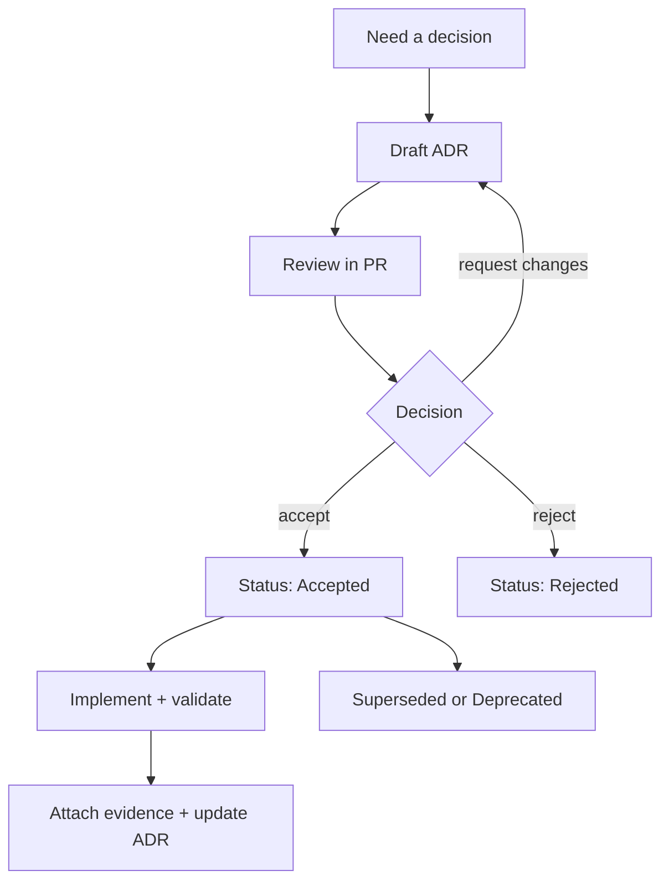
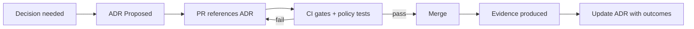

<!-- [KFM_META_BLOCK_V2]
doc_id: kfm://doc/3d3f7d0f-4d9b-4d67-9c6e-7d7b3c7cb6d5
title: docs/adr — Architecture Decision Records
type: standard
version: v1
status: draft
owners: TBD
created: 2026-02-24
updated: 2026-02-28
policy_label: public
related:
  - docs/README.md
  - docs/adr
tags: [kfm, adr, architecture, governance]
notes:
  - This README defines the ADR process + conventions for this repo.
  - Keep ADRs evidence-linked and reversible per KFM operating rules.
[/KFM_META_BLOCK_V2] -->

# docs/adr — Architecture Decision Records

> **Purpose:** A governed, auditable record of **why** we made key architecture + governance decisions for KFM.


**Owners:** `TBD` (set this to the team responsible for architecture/governance)  
**Scope:** Data → pipelines → catalogs/provenance → storage/indexing → governed APIs → Map/Story UI → Focus Mode  
**Location:** `docs/adr/`

---

## Quick navigation

- [Why ADRs exist](#why-adrs-exist)
- [Decision language and claim tagging](#decision-language-and-claim-tagging)
- [When an ADR is required](#when-an-adr-is-required)
- [Directory rules](#directory-rules)
- [ADR lifecycle](#adr-lifecycle)
- [ADR to PR to gates](#adr-to-pr-to-gates)
- [ADR file naming](#adr-file-naming)
- [ADR format requirements](#adr-format-requirements)
- [Index](#index)
- [FAQ](#faq)
- [Appendix](#appendix)

---

## Why ADRs exist

ADRs are part of KFM’s **trust membrane** and **truth path** discipline. They make decisions:

- **Auditable:** future maintainers can trace what changed and why.
- **Testable:** every major decision states the *minimum checks* that prove it is safe and working.
- **Reversible:** decisions document rollout + rollback triggers and mechanics.
- **Governed:** decisions document policy boundaries, sensitivity handling, and evidence obligations.

> **NOTE**
> ADRs are not long design docs. They are **decision records**: small, focused, and durable.
> If you need 10+ pages, write a design doc and have the ADR *link to it*.

### ADRs as “gap closure”

KFM treats unresolved gaps as governed work: track the gap, decide via an ADR, then implement in a PR with validation and rollback. Use ADRs to turn “unknowns” into reviewable progress.

---

## Decision language and claim tagging

### Normative keywords

Use these words intentionally:

- **MUST** = required to meet KFM governance posture.
- **SHOULD** = recommended unless you have a documented reason not to.
- **MAY** = optional.

### Claim tags

Within ADRs, label statements to preserve the trust membrane:

| Tag | Meaning | What you must include |
|---|---|---|
| **CONFIRMED** | Backed by repo artifacts (code, configs, receipts, validated catalogs, policy tests) | Links to evidence |
| **PROPOSED** | An option or plan being recommended | Rationale + tradeoffs + risks |
| **UNKNOWN** | Not yet verified | The smallest verification steps to confirm |

> **TIP**
> If you’re unsure, mark it **UNKNOWN** and write the minimum check that would make it **CONFIRMED**.

---

## When an ADR is required

Write an ADR when a change affects **system shape**, **governance boundaries**, or **user-facing trust guarantees**.

### Common triggers

| Change type | ADR required? | Examples |
|---|---:|---|
| Truth path / data lifecycle zones | ✅ | RAW/WORK/PROCESSED/CATALOG/PUBLISHED definitions or transitions |
| Promotion Contract gates | ✅ | identity/versioning, licensing, sensitivity, triplet validation, receipts, policy tests |
| Trust membrane boundary | ✅ | “clients never access storage directly”, PEP enforcement rules, evidence resolver role |
| Catalog/provenance contract | ✅ | DCAT/STAC/PROV cross-link requirements; EvidenceRef scheme changes |
| Governed API contracts | ✅ | OpenAPI changes, auth model, error model, audit logging |
| Focus Mode / Story publish behavior | ✅ | citation verification gate, abstain rules, evaluation harness expectations |
| Security / privacy / sensitivity posture | ✅ | redaction rules, access control, secrets handling, sensitive-location handling |
| Cross-cutting dependencies | ✅ | new DB, queue, GIS engine, policy engine, CI gate, storage/indexing strategy |
| Pure refactor / typo fix | ❌ | no externally observable behavior and no governance boundary change |

> **WARNING**
> If sensitivity/permissions are unclear, **default-deny**: generalize, redact, and flag “needs governance review.”

---

## Directory rules

### Where this fits in the repo

`docs/adr/` holds architecture decision records that justify **governed changes** across the end-to-end system.

### Acceptable inputs

- One Markdown file per decision: `NNNN-short-slug.md`
- Mermaid diagrams (preferred) when a diagram adds clarity
- Minimal attachments (only when necessary; prefer text + links)

### Exclusions

- Implementation guides, runbooks, tutorials (put those elsewhere in `docs/`)
- Meeting notes/transcripts (store where meeting notes belong)
- Secrets, credentials, restricted operational details
- Exact coordinates or targeting information for vulnerable/private/culturally restricted sites

### Suggested directory layout

```text
docs/adr/
  README.md
  0001-example-decision.md
  0002-another-decision.md
```

---

## ADR lifecycle



### Status definitions

| Status | Meaning |
|---|---|
| Proposed | Drafted and under review; not yet the project’s decision |
| Accepted | Approved decision; implementation may be in progress |
| Rejected | Considered but not adopted (keep for history) |
| Deprecated | No longer recommended, but not replaced by a single ADR |
| Superseded | Replaced by another ADR (must link to the replacing ADR) |

---

## ADR to PR to gates

ADRs exist to keep decisions **enforceable**.



### PR expectations when an ADR is in scope

A PR that introduces or changes a governed decision SHOULD include:

- the ADR file (or status update to an existing ADR)
- the smallest code/config change that implements the decision (when feasible)
- links to evidence artifacts produced by the change (receipts, reports, validation outputs)
- tests proving the decision does not break the trust membrane / promotion gates

> **NOTE**
> If the implementation cannot be shipped in the same PR as the ADR, the ADR MUST still include a rollout plan, rollback plan, and verification steps.

---

## ADR file naming

**Preferred pattern:** `NNNN-short-slug.md`

- `NNNN` is a 4-digit sequence (e.g., `0007`)
- `short-slug` is lowercase and hyphenated

Examples:

- `0001-governed-api-boundary.md`
- `0002-data-zones-and-promotion-contract.md`
- `0003-evidence-ref-scheme.md`

---

## ADR format requirements

Every ADR MUST include:

- **KFM MetaBlock v2 header** (as an HTML comment)
- **Status** + **Date**
- **Decision statement** (one clear sentence)
- **Context** (problem, constraints, why now)
- **Options considered** (with tradeoffs)
- **Decision** (what we will do)
- **Consequences** (positive, negative, risks)
- **Governance & policy impacts** (policy_label, obligations, redaction)
- **Verification** (minimum checks that prove it works)
- **Rollout and rollback plan**
- **Evidence links** (PRs, issues, benchmarks, run receipts, validation reports)

### Evidence discipline

Evidence links should point to artifacts that make the decision defensible:

- validation reports and QA summaries
- run receipts and checksums
- policy tests and contract tests
- catalog triplet validation outputs (DCAT/STAC/PROV cross-linking)
- threat model notes and mitigations

> **RULE OF THUMB**
> If the ADR contains a claim that could surface in Map/Story/Focus Mode, the ADR SHOULD link to evidence that makes that claim auditable.

---

## Index

> Keep this table current. Add an entry when an ADR is created, and update status when it changes.

| ADR | Title | Status | Date | Owners | Replaces | Notes |
|---:|---|---|---|---|---|---|
| _TBD_ | _Add your first ADR_ | _Proposed_ | _YYYY-MM-DD_ | _TBD_ | _N/A_ | _Add link once file exists_ |

---

## FAQ

### Can I edit an old ADR?
Yes, but only for:
- status transitions (`Proposed → Accepted`, etc.)
- links to implementation/evidence
- clarifications that do **not** change the original decision

If the decision changes, write a **new ADR** and mark the old one **Superseded**.

### Where do how-to docs go?
Not here. ADRs are for **decisions**. Put how-to docs in the appropriate `docs/` section and link them from the ADR if needed.

### What about sensitive decisions?
If an ADR must reference restricted information:
- write a **public ADR** at a safe abstraction level
- link to restricted artifacts in the appropriate restricted system/location
- do **not** commit secrets or sensitive operational details into the repo

### Do ADRs need a MetaBlock?
Yes. Use KFM MetaBlock v2 for ADRs so they can be indexed, filtered by policy_label, and served through governed doc surfaces if needed.

---

## Appendix

<details>
<summary><strong>ADR template (copy/paste)</strong></summary>

```markdown
<!-- [KFM_META_BLOCK_V2]
doc_id: kfm://doc/<uuid>
title: docs/adr/NNNN-<short-slug> — <short decision title>
type: adr
version: v1
status: draft|review|published
owners: <team or names>
created: YYYY-MM-DD
updated: YYYY-MM-DD
policy_label: public|restricted|...
related:
  - <issue/PR/doc links>
tags: [kfm, adr]
notes:
  - <short notes>
[/KFM_META_BLOCK_V2] -->

# ADR NNNN: <short decision title>

- **Status:** Proposed | Accepted | Rejected | Deprecated | Superseded
- **Date:** YYYY-MM-DD
- **Owners:** <team or names>
- **Deciders:** <role(s) or group>
- **Policy label:** public | restricted | ...
- **Related:** <issue/PR/doc links>

## Decision statement

One sentence: **We will ...**

## Context

What problem are we solving? Why now?

- Constraints:
- Assumptions:
- Non-goals:

## Decision drivers

List the forces that matter (correctness, safety, licensing, latency, cost, reversibility, team skills, etc.).

## Options considered

### Option A: <name>
- Pros:
- Cons:
- Risks:
- Operational impact:

### Option B: <name>
- Pros:
- Cons:
- Risks:
- Operational impact:

## Decision

Explain the decision clearly and precisely.

## Consequences

### Positive
- ...

### Negative / Risks
- ...

### Tradeoffs
- ...

## Governance & policy impacts

- Data sensitivity / classification:
- Redaction/generalization obligations:
- Access control changes:
- Audit/provenance requirements:
- Any CARE/FAIR or community constraints:

## Promotion Contract impacts

If this decision changes promotion gates, catalogs, identity, or runtime rules, enumerate what changes:

- Gate A (identity/versioning):
- Gate B (licensing/rights):
- Gate C (sensitivity/redaction plan):
- Gate D (catalog triplet validation):
- Gate E (run receipts/checksums):
- Gate F (policy + contract tests):

## Rollout plan

Step-by-step, including promotion gates and validation.

## Rollback plan

How we undo this safely. Include triggers for rollback.

## Verification

Smallest set of checks needed to prove this decision works:

- [ ] Unit/integration tests:
- [ ] Catalog validators + link checks:
- [ ] Policy tests (default-deny) + obligations enforced:
- [ ] EvidenceRefs resolve end-to-end (if applicable):
- [ ] Observability checks (logs/metrics/traces):
- [ ] Security checks:

## Evidence

Links to artifacts:
- ...
- ...

## Follow-ups

- [ ] ...
- [ ] ...

## Supersedes / Superseded by

- Supersedes: <ADR link or N/A>
- Superseded by: <ADR link or N/A>
```

</details>

---

<p align="right"><a href="#docsadr--architecture-decision-records">Back to top ↑</a></p>
