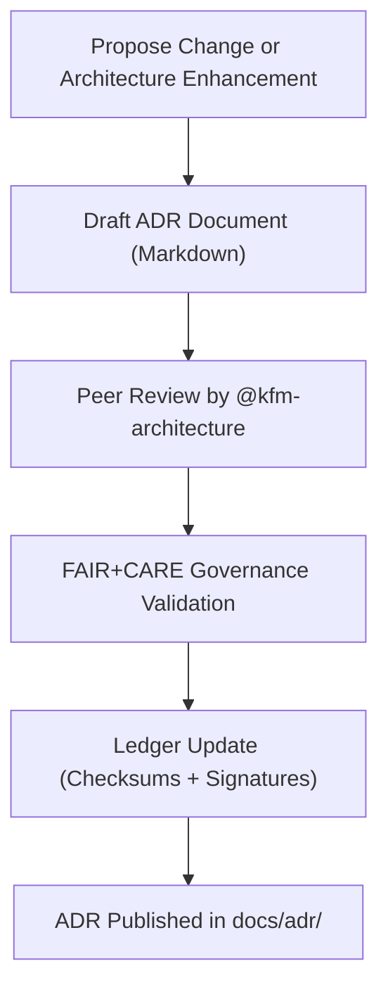

<div align="center">

# 🧩 **Kansas Frontier Matrix — Architecture Decision Records (ADR) Hub (v2.1.1 · Tier-Ω+∞ Certified)**  
`docs/adr/README.md`

**Mission:** Centralize all **Architecture Decision Records (ADRs)** for the **Kansas Frontier Matrix (KFM)** project.  
Each record captures the rationale, context, consequences, and governance validation for significant technical or ethical design choices.

[](../../docs/)
[](../../docs/standards/faircare-validation.md)
[](../../data/reports/audit/data_provenance_ledger.json)
[](../../LICENSE)

</div>

---

## 📚 Overview

The **Architecture Decision Record (ADR) system** ensures that every major technical, design, or governance decision in KFM  
is recorded transparently with full provenance, rationale, and FAIR+CARE ethical alignment.  

Each ADR file is self-contained, following MCP-DL standards and validated automatically through CI/CD pipelines.

---

## 🗂️ Directory Layout

```bash
docs/adr/
├── README.md                              # This file — ADR hub overview
├── ADR-0001-data-storage.md               # Decision: Data storage and versioning architecture
├── ADR-0002-ontology-mapping.md           # Decision: CIDOC CRM ontology mapping and reasoning
├── ADR-0003-ai-governance-framework.md    # Decision: AI governance and ethics framework integration
└── templates/
    ├── README.md
    ├── adr-decision-guide.md
    └── adr-template.md
```

---

## ⚙️ ADR Governance Workflow


<!-- END OF MERMAID -->

---

## 🧱 ADR Template Structure

Each ADR follows the **Platinum ADR Template v2.0**, which includes:

| Section | Description |
|:--|:--|
| **Title / ID** | Sequential number and short descriptive title. |
| **Date / Status** | Date of creation and current status (Proposed, Accepted, Superseded). |
| **Context** | Background information and justification for the decision. |
| **Decision** | Summary of the technical or design choice made. |
| **Consequences** | Benefits, drawbacks, and trade-offs. |
| **Governance Notes** | FAIR+CARE and ethical implications. |
| **Validation Reports** | Links to audits and ledger entries. |

---

## 🧠 FAIR + CARE Integration in ADRs

| Principle | Application in ADRs | Verification |
|:--|:--|:--|
| **Findable** | All ADRs indexed in manifest and searchable. | `releases/v*/manifest.zip` |
| **Accessible** | Stored in Markdown under CC-BY 4.0 license. | GitHub Pages |
| **Interoperable** | Machine-readable metadata header (YAML frontmatter). | CI Validator |
| **Reusable** | ADR templates reused for future decisions. | `docs/adr/templates/` |
| **Collective Benefit (CARE)** | All decisions reviewed for ethical and community impact. | Governance Council Review |

---

## 🔍 ADR Validation Workflows

| Workflow | Function | Output |
|:--|:--|:--|
| `policy-check.yml` | Validates ADR frontmatter and governance fields. | `reports/audit/policy_check.json` |
| `docs-validate.yml` | Checks syntax, links, and mermaid diagram validity. | `reports/validation/docs_validation.json` |
| `governance-ledger.yml` | Logs ADR checksums and reviewer approvals. | `data/reports/audit/data_provenance_ledger.json` |

---

## 🧩 ADR Status Categories

| Status | Description |
|:--|:--|
| **Proposed** | Under initial review and awaiting governance validation. |
| **Accepted** | Approved by the Architecture Council and logged in governance ledger. |
| **Deprecated** | Superseded by a newer ADR; retained for historical transparency. |
| **Rejected** | Considered but not implemented; rationale retained. |

---

## 🧾 ADR Cross-Reference Index

| ADR ID | Title | Date | Status | Ledger Reference |
|:--|:--|:--|:--|:--|
| **ADR-0001** | Data Storage & Versioning Model | 2025-10-04 | Accepted | `data_provenance_ledger.json` |
| **ADR-0002** | Ontology Mapping to CIDOC CRM | 2025-10-07 | Accepted | `data_provenance_ledger.json` |
| **ADR-0003** | AI Governance Framework Integration | 2025-10-15 | Accepted | `ai_hazards_ledger.json` |

---

## 🧮 Governance Integration

| Artifact | Purpose | Maintained By |
|:--|:--|:--|
| `data/reports/audit/data_provenance_ledger.json` | Records checksums and validation results for ADRs. | @kfm-governance |
| `reports/audit/policy_check.json` | Ensures all ADRs follow documentation standards. | @kfm-docs |
| `releases/v*/manifest.zip` | Contains signed and versioned ADR indices. | @kfm-architecture |
| `docs/standards/governance/` | Governing documentation for ADR ethics and compliance. | @kfm-governance |

---

## 🧾 Version History

| Version | Date | Author | Summary |
|:--|:--|:--|:--|
| **v2.1.1** | 2025-11-16 | @kfm-architecture | Updated ADR governance integration and FAIR+CARE compliance mapping. |
| v2.0.0 | 2025-10-25 | @kfm-governance | Standardized ADR template metadata and status categories. |
| v1.0.0 | 2025-10-04 | @kfm-architecture | Initial ADR documentation hub. |

---

<div align="center">

**Kansas Frontier Matrix © 2025**  
*“Every Decision Logged — Every Record Verified.”*  
📍 `docs/adr/README.md` — Central hub for Architecture Decision Records (ADRs) in the Kansas Frontier Matrix.

</div>

