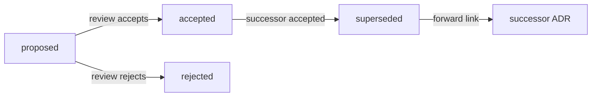

<!-- [KFM_META_BLOCK_V2]
doc_id: kfm://doc/adr-readme
title: docs/adr — Architecture Decision Records
type: standard
version: v1.2
status: draft; repository-grounded
owners:
  - Architecture steward
  - Docs steward
created: 2026-05-09
updated: 2026-07-22
policy_label: public
truth_posture: cite-or-abstain
responsibility_root: docs/
authority_surface: human-facing architecture decision records
related:
  - docs/adr/INDEX.md
  - docs/adr/ADR-template.md
  - docs/doctrine/directory-rules.md
  - docs/doctrine/authority-ladder.md
  - docs/registers/ADR_INDEX.md
  - docs/registers/DRIFT_REGISTER.md
  - tools/validators/validate_adr_index.py
  - tests/validators/test_validate_adr_index.py
  - .github/workflows/docs-control-plane.yml
tags: [kfm, governance, adr, decisions, audit, control-plane]
notes:
  - "Repository inventory is verified at main@43f1d97954debda98691b2685c1bb75c4b63c872."
  - "File presence does not accept a decision. Every numbered ADR remains proposed until explicit reviewed status evidence says otherwise."
  - "This README is the operating contract; docs/adr/INDEX.md is the canonical human inventory."
[/KFM_META_BLOCK_V2] -->

# `docs/adr/` — Architecture Decision Records

[](../doctrine/directory-rules.md)
[](./INDEX.md)
[](./INDEX.md)
[](../../tools/validators/validate_adr_index.py)
[](../../.github/CODEOWNERS)

Architecture Decision Records preserve why KFM made—or is considering—a consequential architectural choice. They are append-only governance memory: one decision per record, explicit status, evidence, consequences, alternatives, migration impact, and rollback.

> [!IMPORTANT]
> A tracked ADR is not automatically an accepted ADR. The current numbered corpus is **CONFIRMED present** and **proposed for governance purposes**. This pass does not accept, reject, supersede, renumber, rename, or substantively edit any decision record.

**Quick links:** [Verified snapshot](#verified-snapshot) · [Authority](#authority-and-boundaries) · [Inventory contract](#inventory-contract) · [Lifecycle](#decision-lifecycle) · [Naming](#naming-and-numbering) · [Authoring](#authoring-workflow) · [Validation](#validation) · [Review](#review-and-supersession) · [Open governance work](#open-governance-work)

---

## Verified snapshot

The table below is grounded in the tracked tree at `main@43f1d97954debda98691b2685c1bb75c4b63c872`.

| Surface | Verified state | Meaning |
| --- | ---: | --- |
| Direct Markdown files | 46 | Complete direct-child inventory for this snapshot |
| Numbered records | 28 | Unique, contiguous IDs `ADR-0001` through `ADR-0028` |
| Numbered source metadata | 15 `proposed`; 12 `draft`; 1 legacy `PROPOSED` | All normalize conservatively to effective status `proposed` |
| Verified accepted decisions | 0 | No numbered record declares reviewed `accepted` status |
| Explicit `NNNN` / `XXXX` placeholders | 4 | Unassigned scaffolds; not ADR numbers |
| Slug-only ADR scaffolds | 8 | Unassigned scaffolds; not accepted decision records |
| Template | 1 | [`ADR-template.md`](./ADR-template.md) |
| Index and support documents | 5 | This README, canonical index, two assessment/checklist documents, and `_next_move_log.md` |

The exact numbered records and unassigned scaffolds are listed in the [canonical ADR index](./INDEX.md). The human cross-register at [`docs/registers/ADR_INDEX.md`](../registers/ADR_INDEX.md) points to that inventory without maintaining a competing table.

## Authority and boundaries

Directory Rules §6.1 assigns Architecture Decision Records to `docs/adr/` inside the human-facing control plane. Authority resolves in this order:

1. KFM core invariants and doctrine.
2. Accepted ADRs that explicitly amend Directory Rules.
3. Directory Rules.
4. Per-root READMEs such as this file.
5. Domain dossiers and planning lineage.
6. Repository convention, which is evidence of implementation—not placement authority when it conflicts with the rules.

This directory owns decision records and their human inventory. It does not own:

| Responsibility | Canonical home |
| --- | --- |
| Object meaning | [`contracts/`](../../contracts/) |
| Machine-checkable shape | [`schemas/`](../../schemas/) |
| Allow, deny, restrict, or abstain rules | [`policy/`](../../policy/) |
| Enforceability proof | [`tests/`](../../tests/) |
| Repository-wide validation logic | [`tools/validators/`](../../tools/validators/) |
| Human registers and drift queues | [`docs/registers/`](../registers/) |
| Receipts and proofs | [`data/receipts/`](../../data/receipts/) and [`data/proofs/`](../../data/proofs/) |
| Release decisions, manifests, and rollback cards | [`release/`](../../release/) |
| Build, documentation, QA, and temporary outputs | [`artifacts/`](../../artifacts/) |

An ADR may direct changes in those homes, but it does not replace their contracts, schemas, policies, tests, receipts, proofs, or release objects.

## Inventory contract

The three human surfaces have distinct responsibilities:

| Path | Responsibility | Must not do |
| --- | --- | --- |
| [`README.md`](./README.md) | Operating rules for authoring, review, status, and validation | Duplicate the full record table |
| [`INDEX.md`](./INDEX.md) | Canonical human inventory of numbered records and unassigned scaffolds | Grant decision authority merely because a file is present |
| [`../registers/ADR_INDEX.md`](../registers/ADR_INDEX.md) | Cross-register pointer, ownership, consumers, and validation boundary | Maintain a second ADR row set |

The canonical index records two different facts:

- **Source metadata** reports what each file currently says: `proposed`, `draft`, or legacy unstructured `PROPOSED`.
- **Effective decision status** uses the Directory Rules vocabulary: `proposed`, `accepted`, `superseded`, or `rejected`.

`draft` and legacy `PROPOSED` normalize to `proposed`. A row may move to `accepted`, `superseded`, or `rejected` only when the record itself carries matching reviewed status evidence. The index cannot promote a decision independently.

## Decision lifecycle


```mermaid
flowchart LR
    P["proposed"] -->|review accepts| A["accepted"]
    P -->|review rejects| R["rejected"]
    A -->|successor accepted| S["superseded"]
    S -->|forward link| N["successor ADR"]
```

- **`proposed`** — under consideration; not binding.
- **`accepted`** — explicitly reviewed and in force for the decision it records.
- **`superseded`** — replaced by a later accepted ADR; retained with a forward link.
- **`rejected`** — considered and not adopted; retained as decision history.

Accepted, superseded, and rejected records are never deleted. A material change to an accepted decision requires a successor ADR rather than rewriting history.

## When an ADR is required

Directory Rules §2.4 requires an ADR before:

- adding, removing, or renaming a canonical root;
- promoting a compatibility root to canonical or deprecating a canonical root;
- changing the schema-home rule;
- splitting or merging a lifecycle phase;
- creating a parallel home for schemas, contracts, policy, sources, registries, releases, proofs, or receipts;
- bending a KFM core invariant.

Use an ADR for other cross-component choices when code, schema, or policy alone cannot preserve the rationale. Do not use an ADR for routine typo fixes, local refactors, runbooks, release decisions, or machine-shape changes that do not alter architecture.

## Naming and numbering

The target pattern is:

```text
ADR-NNNN-kebab-case-slug.md
```

Rules:

- `NNNN` is a permanent four-digit repository-wide ID.
- Claim the next number only after checking the canonical index, open pull requests, and active branches.
- The H1 must contain the same `ADR-NNNN` as the filename.
- New records use the current template and begin with effective status `proposed`.
- `ADR-NNNN-*` and `ADR-XXXX-*` filenames are placeholders, not reserved numeric decisions.
- Slug-only `ADR-*.md` scaffolds remain unassigned until a reviewed PR gives them a unique numeric ID.

Two tracked numbered records use legacy filenames containing spaces and an em dash (`ADR-0007` and `ADR-0028`). They remain indexed exactly as tracked. Renaming them is deferred because it requires inbound-link and history analysis; this convergence pass does not perform that migration.

## Authoring workflow

1. Read Directory Rules and confirm the change is ADR-class.
2. Inspect [`INDEX.md`](./INDEX.md), open ADR PRs, and active ADR branches for collisions.
3. Copy [`ADR-template.md`](./ADR-template.md) to the next `ADR-NNNN-kebab-case-slug.md` path.
4. Keep status `proposed`; identify owners, affected roots, evidence, alternatives, migration, and rollback.
5. Link any superseded ADRs in both directions.
6. Update [`INDEX.md`](./INDEX.md) in the same change.
7. Run the ADR validator and its tests.
8. Request the reviewers required by the affected roots. CODEOWNERS routing is not proof that review occurred.
9. On a reviewed status transition, update the record and index together; never let the index promote the record independently.

## Validation

Run from the repository root:

```bash
python tools/validators/validate_adr_index.py
python -m pytest tests/validators/test_validate_adr_index.py -q --strict-config --strict-markers
```

The validator checks:

- unique numbered IDs and exact index coverage;
- filename, H1, link target, and index-ID agreement;
- allowed effective status values and conservative source-status normalization;
- separation and complete inventory of explicit placeholders and slug-only scaffolds;
- non-duplicating canonical pointer behavior in `docs/registers/ADR_INDEX.md`;
- reciprocal supersession links when a record is marked `superseded` or names a predecessor.

The read-only [`docs-control-plane` workflow](../../.github/workflows/docs-control-plane.yml) runs the validator and its negative-path tests. A green result proves index coherence for the checked revision. It does not accept a decision, prove architecture implementation, approve policy, authorize release, or publish data.

## Review and supersession

| Change | Required review posture |
| --- | --- |
| New proposed ADR | Architecture steward plus affected subsystem owner |
| `proposed` → `accepted` | Explicit decision review from all named owners; implementation and migration gates as specified by the ADR |
| `proposed` → `rejected` | Explicit architecture review; retain the record |
| `accepted` → `superseded` | Accepted successor, forward/back links, and reviewed transition plan |
| Index or README maintenance | Docs and architecture review route |

[`CODEOWNERS`](../../.github/CODEOWNERS) currently routes `docs/adr/`, `docs/registers/`, `tools/validators/`, and `tests/` to `@bartytime4life`. That is a verified GitHub review route, not a `ReviewRecord`, acceptance decision, separation-of-duties proof, release approval, or publication authority.

## Open governance work

The following remain unresolved and are not silently normalized by this README:

- Human acceptance review for all 28 numbered ADRs.
- Metadata normalization for 12 `draft` records and legacy ADR-0007 without changing their conservative `proposed` status.
- Migration analysis for the two legacy space/em-dash filenames.
- Disposition of 12 unassigned placeholder or slug-only scaffolds.
- Resolution of repo-wide versus domain-local ADR placement where domain documents still describe competing patterns.
- Review of [`ADR-0011`](./ADR-0011-receipts-vs-proofs-vs-manifests-vs-catalog-separation.md), which remains proposed and therefore does not yet unlock `artifacts/release/` migration.
- `OPEN-DR-09-b` and the `artifacts/perf/` placement conflict.

Until those decisions are reviewed, use the conservative posture: inventory the file, keep the decision `proposed`, preserve reversibility, and do not grant authority by implication.

## Maintenance checklist

- [ ] Update `INDEX.md` whenever a numbered ADR or unassigned scaffold is added, removed through reviewed cleanup, assigned, or status-transitioned.
- [ ] Preserve unique IDs and exact filename/H1 agreement.
- [ ] Keep source metadata and effective decision status separate.
- [ ] Require reciprocal supersession links.
- [ ] Run the validator and negative-path tests.
- [ ] Update `updated:` and the verified snapshot when the inventory changes.
- [ ] Keep accepted and historical ADRs append-only.
- [ ] Record placement conflicts in the drift register instead of normalizing them.
- [ ] Keep receipts, proofs, policy, schemas, contracts, release objects, and data in their owning roots.

## Related

- [Canonical ADR index](./INDEX.md)
- [ADR template](./ADR-template.md)
- [Human ADR cross-register](../registers/ADR_INDEX.md)
- [Directory Rules](../doctrine/directory-rules.md)
- [Authority Ladder](../doctrine/authority-ladder.md)
- [Drift Register](../registers/DRIFT_REGISTER.md)
- [Verification Backlog](../registers/VERIFICATION_BACKLOG.md)
- [ADR index validator](../../tools/validators/validate_adr_index.py)
- [ADR validator tests](../../tests/validators/test_validate_adr_index.py)
- [Documentation control-plane workflow](../../.github/workflows/docs-control-plane.yml)
