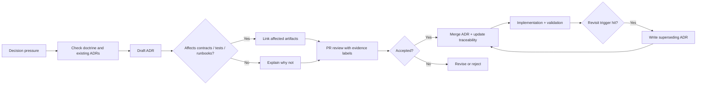

<!-- [KFM_META_BLOCK_V2]
doc_id: kfm://doc/<uuid-needs-verification>
title: Architecture Decision Records (ADR)
type: standard
version: v1
status: review
owners: <owners-needs-verification>
created: <YYYY-MM-DD-needs-verification>
updated: <YYYY-MM-DD-needs-verification>
policy_label: <policy-label-needs-verification>
related: [docs/adr/, docs/runbooks/, contracts/, policy/, tests/]
tags: [kfm, adr, architecture, governance, decision-records]
notes: [current repo tree was not directly mounted in this session; neighboring paths and first-wave ADR filenames beyond explicitly named items need verification]
[/KFM_META_BLOCK_V2] -->

# Architecture Decision Records (ADR)

Governed index, authoring contract, and first-wave backlog for consequential architecture decisions in KFM.

| Field | Value |
|---|---|
| Status | `review` |
| Owners | `<owners-needs-verification>` |
| Path | `docs/adr/README.md` |
| Role | Directory landing page for ADR authoring, review, backlog, and traceability |


**Quick jump:** [Scope](#scope) · [Repo fit](#repo-fit) · [Accepted inputs](#accepted-inputs) · [Directory tree](#directory-tree) · [Quickstart](#quickstart) · [Usage](#usage) · [Diagram](#diagram) · [Tables](#tables) · [Task list](#task-list) · [FAQ](#faq) · [Appendix](#appendix)

> [!IMPORTANT]
> This README is doctrine-grounded, but the current repository tree was **not** directly visible in this session. Neighboring paths, companion files, and the first-wave file list below are therefore written as **PROPOSED** or **NEEDS VERIFICATION** unless the repo itself confirms them.

---

## Scope

This directory records **consequential architecture decisions** for Kansas Frontier Matrix.

Use an ADR when a choice is expensive to reverse, crosses authority or trust boundaries, changes contract shape, alters policy grammar, affects release or correction lineage, changes route-family obligations, or materially shifts evidence visibility at the product surface.

This directory is **not** a scrapbook of implementation notes. It is the durable memory for the decisions that KFM cannot afford to rediscover every sprint.

[Back to top](#architecture-decision-records-adr)

## Repo fit

| Fit | Value | Status |
|---|---|---|
| Path | `docs/adr/README.md` | CONFIRMED target path |
| Intended upstream doctrine | `docs/kfm-master-design-manual.md` or equivalent canonical manual | PROPOSED / NEEDS VERIFICATION |
| Intended adjacent docs | `docs/runbooks/`, `docs/verification/` | PROPOSED / NEEDS VERIFICATION |
| Intended downstream consumers | `contracts/`, `policy/`, `tests/`, release review, contributor onboarding | PROPOSED / doctrine-grounded |
| Landing-page rule | This `README.md` is intended to be the directory hub. If a separate `docs/adr/index.md` exists or is later added, keep **one** canonical landing page and make the other a thin pointer. | PROPOSED |

### Why this directory matters

KFM’s governing doctrine treats architecture decisions as part of the trust system, not as optional commentary. In practice, that means ADRs should connect to the contracts, tests, runbooks, and rollout consequences they shape.

[Back to top](#architecture-decision-records-adr)

## Accepted inputs

This directory accepts decision records for choices such as:

- authority boundaries and allowed writes
- truth-path stages, promotion rules, and correction lineage
- shared contract grammar and first schema waves
- route-family obligations and public vs steward vs review boundaries
- Evidence Drawer, Focus, and other trust-visible surface contracts
- authoritative-versus-derived rules
- MapLibre-centered 2D shell and controlled 3D burden
- policy-engine choice, reason codes, and obligation registries
- thin-slice sequencing when governance or trust posture changes
- package boundaries, observability joins, and release proof requirements

## Exclusions

This directory does **not** own the following, and they should go elsewhere instead:

- transient debugging notes → PR thread, issue, or local dev notes
- incident-specific operating steps → `docs/runbooks/`
- executable policy bundles → `policy/`
- schemas, OpenAPI specs, and fixture payloads → `contracts/`
- test logic and harnesses → `tests/`
- raw design exploration without a decision pressure → design note, issue, or experiment record
- end-user narrative docs or product help → product or docs surface outside `docs/adr/`

[Back to top](#architecture-decision-records-adr)

## Directory tree

> [!NOTE]
> The tree below is a **PROPOSED starter shape**, not a confirmed live inventory.

```text
docs/adr/
├── README.md
├── traceability-table.md                 # PROPOSED companion
├── ADR-001-five-plane-model.md          # PROPOSED first wave
├── ADR-002-truth-path-stage-transition-registry.md
├── ADR-003-shared-contract-header-grammar.md
├── ADR-004-evidence-drawer-payload.md
├── ADR-005-focus-envelope-and-finite-outcomes.md
├── ADR-006-route-family-registry.md
├── ADR-007-authoritative-vs-derived-rules.md
├── ADR-008-maplibre-2d-shell-and-3d-burden.md
├── ADR-009-policy-engine-and-registries.md
├── ADR-010-hydrology-first-thin-slice.md
└── ADR-011-ADR-015-*.md                 # PROPOSED; exact filenames need verification
```

### Naming rule

```text
ADR-00X-short-kebab-case.md
```

Keep titles concrete. Prefer `ADR-003-shared-contract-header-grammar.md` over vague names like `ADR-003-architecture-overview.md`.

[Back to top](#architecture-decision-records-adr)

## Quickstart

1. Confirm that the issue is actually architectural.
2. Check this README and any existing ADRs before drafting a new one.
3. Create the next `ADR-XXX-...md` file.
4. State the **decision pressure** early.
5. Record meaningful alternatives, not just the chosen answer.
6. Link the affected contracts, policies, tests, and runbooks.
7. State validation, rollback, correction, and revisit triggers.
8. Open a PR that includes evidence labels and operational impact.

### Minimal author flow

```text
identify decision seam
→ check existing ADRs / doctrine
→ draft ADR
→ link affected contracts/tests/runbooks
→ open PR with evidence labels
→ merge or supersede
```

### PR expectation for ADR changes

A non-trivial ADR change should travel with:

- purpose and scope
- evidence label summary
- rollback or correction path
- linked docs changes
- linked tests or explicit rationale when no test changes are expected
- operational impact notes where runtime behavior could shift

[Back to top](#architecture-decision-records-adr)

## Usage

### Reading order

1. Start with this `README.md`.
2. Read the ADRs in dependency order, not in random chronological order.
3. Follow traceability from ADR → contracts → tests → runbooks.
4. Use superseding ADRs as the current position, but keep older ADRs for lineage.

### Status model used in this directory

| Label | Meaning here | Use with care |
|---|---|---|
| **CONFIRMED** | Directly supported by visible project doctrine or directly verified repo evidence | Use for doctrine and verified local reality |
| **PROPOSED** | Recommended target-state design consistent with doctrine but not directly verified in the mounted repo | Use for starter structures, file families, and backlog items |
| **UNKNOWN** | Not proven strongly enough in the current session | Use when repo fact, owner, route, or file presence was not directly inspected |
| **NEEDS VERIFICATION** | Review-layer cue for a path, owner, or artifact that should be checked before treating as settled repo fact | Useful for placeholders and adjacent paths |
| **INFERRED** | Narrow synthesis from multiple project sources, but not stated verbatim in one place | Keep separate from CONFIRMED doctrine |

### Record types

| Record | Use when | Do not use for |
|---|---|---|
| **ADR** | A consequential architecture or governance decision has been made or must be made | Ephemeral notes or local implementation trivia |
| **EXP** | Competing options need a bounded experiment and recommendation | Final accepted architecture position |
| **EVAL** | A low-ceremony review or scorecard is needed to assess drift, readiness, or architecture health | Replacing decision rationale that belongs in an ADR |

### Supersession rule

Do **not** silently overwrite architecture memory.

When a decision changes:

- create a new ADR that supersedes the old one
- link both records
- note migration implications
- keep the earlier record for lineage

### Traceability rule

Every meaningful ADR should point to what it changes:

- affected contracts
- affected tests
- affected runbooks
- rollback or correction implication
- revisit trigger

[Back to top](#architecture-decision-records-adr)

## Diagram


```mermaid
flowchart LR
    A[Decision pressure] --> B[Check doctrine and existing ADRs]
    B --> C[Draft ADR]
    C --> D{Affects contracts / tests / runbooks?}
    D -->|Yes| E[Link affected artifacts]
    D -->|No| F[Explain why not]
    E --> G[PR review with evidence labels]
    F --> G
    G --> H{Accepted?}
    H -->|Yes| I[Merge ADR + update traceability]
    H -->|No| J[Revise or reject]
    I --> K[Implementation + validation]
    K --> L{Revisit trigger hit?}
    L -->|Yes| M[Write superseding ADR]
    M --> I
```

[Back to top](#architecture-decision-records-adr)

## Tables

### First-wave ADR backlog

| ADR | Decision seam | Why it belongs here | Status |
|---|---|---|---|
| ADR-001 | Five-plane authority model and allowed writes | Freezes the main authority grammar | PROPOSED |
| ADR-002 | Truth-path stage-transition registry | Turns lifecycle doctrine into machine-checkable law | PROPOSED |
| ADR-003 | Shared contract header grammar and first schema wave | Enables diffable, reviewable interfaces | PROPOSED |
| ADR-004 | Evidence Drawer payload and visibility tiers | Keeps evidence operational at point of use | PROPOSED |
| ADR-005 | Focus envelope, finite outcomes, and citation policy | Bounds AI before broad adoption | PROPOSED |
| ADR-006 | Route family registry and trust obligations | Stabilizes public vs steward vs review boundaries | PROPOSED |
| ADR-007 | Authoritative-versus-derived rules | Keeps convenience layers subordinate to canonical truth | PROPOSED |
| ADR-008 | MapLibre-centered 2D shell and controlled 3D burden rubric | Locks renderer placement and 3D discipline | PROPOSED |
| ADR-009 | Policy engine choice and reason/obligation registries | Makes policy executable and reviewable | PROPOSED |
| ADR-010 | Hydrology-first thin slice and exit criteria | Establishes the first credible governed slice | PROPOSED |
| ADR-011–ADR-015 | Remaining seams from the same doctrine wave | Release proof-pack, correction propagation, package boundaries, and observability are named in doctrine, but exact file naming and ordering still need verification | PROPOSED / NEEDS VERIFICATION |

### What makes a decision “ADR-worthy”

| Signal | Usually write an ADR? | Why |
|---|---|---|
| Multi-team impact | Yes | Reversal cost is high |
| Contract shape changes | Yes | Downstream breakage and review need explicit memory |
| Policy or rights boundary change | Yes | Governance must remain inspectable |
| Pure refactor inside a package | Usually no | Prefer code review and local docs unless authority assumptions change |
| Thin-slice sequencing with trust consequences | Yes | Ordering itself becomes architecture |
| Cosmetic wording only | No | Keep ADRs high-signal |

[Back to top](#architecture-decision-records-adr)

## Task list

### Definition of done for a new ADR

- [ ] The decision crosses a real architecture, authority, trust, policy, or rollout boundary
- [ ] The decision pressure is explicit
- [ ] Meaningful alternatives were considered
- [ ] Rationale records tradeoffs, not just the outcome
- [ ] Affected contracts, policies, tests, and runbooks are named
- [ ] Validation plan is present
- [ ] Rollback or correction implication is present
- [ ] Revisit triggers are present
- [ ] PR includes evidence labels and docs impact
- [ ] If this ADR changes a prior decision, supersession is explicit

[Back to top](#architecture-decision-records-adr)

## FAQ

### When should I write an ADR instead of leaving a note in a PR?

Write an ADR when the decision will still matter after the PR is merged, especially if it changes authority assumptions, contract shape, trust behavior, or rollout sequencing.

### Can an ADR be edited?

Yes, but do not rewrite history. Small clarifications are fine. A changed decision should produce a **superseding ADR**, not a silent overwrite.

### What if repo reality disagrees with this README?

Treat repo reality as the stronger source for current implementation state once directly verified. Update this README and the affected ADRs incrementally, keeping lineage visible.

### Do experiments belong here?

Only when they contribute to a consequential decision. A bounded comparison can be recorded as an **EXP** record, but the accepted position should still land in an ADR.

[Back to top](#architecture-decision-records-adr)

## Appendix

<details>
<summary><strong>ADR core template</strong></summary>

```md
# ADR-XXX — Decision title

**Status:** proposed | accepted | superseded | rejected  
**Date:** YYYY-MM-DD  
**Supersedes:** <none-or-ADR-id>  
**Superseded by:** <none-or-ADR-id>

## Purpose
One sentence stating the decision in operational terms.

## Decision pressure
What ambiguity, risk, or cross-boundary cost forced this decision?

## Context
Relevant doctrine, constraints, stakeholders, assumptions, and current system pressure.

## Options considered
1. Option A
2. Option B
3. Option C
4. Do nothing / defer

## Decision
State the chosen option plainly.

## Rationale
Why this option, and what tradeoffs were accepted?

## Consequences
What changes now? What gets easier, harder, safer, or more constrained?

## Affected contracts / policies / tests / runbooks
- Contracts:
- Policies:
- Tests:
- Runbooks:

## Validation plan
How will the team know this decision is implemented correctly?

## Rollback / correction path
What happens if this decision proves wrong, incomplete, or unsafe?

## Revisit triggers
What evidence, scale change, tool change, or failure mode should force reconsideration?

## Evidence basis
- CONFIRMED:
- PROPOSED:
- UNKNOWN:
- NEEDS VERIFICATION:
```

</details>

<details>
<summary><strong>EXP and EVAL lightweight forms</strong></summary>

```md
# EXP-XXX — Decision experiment title

**Decision deadline:** YYYY-MM-DD

## Alternatives under test
-
-

## Evaluation criteria
-
-

## Test shape
What will be built, measured, or compared?

## Findings
What was learned?

## Recommendation
What should happen next?

## Residual uncertainty
What still remains open?
```

```md
# EVAL-XXX — Review name

## Artifact reviewed
-

## Quality attribute tested
-

## Issues found
-

## Severity
low | medium | high

## Action
-

## Owner
-

## Review date
YYYY-MM-DD
```

</details>

<details>
<summary><strong>Suggested traceability table columns</strong></summary>

| ADR | Status | Decision seam | Affected contracts | Affected tests | Affected runbooks | Supersedes | Superseded by | Last reviewed |
|---|---|---|---|---|---|---|---|---|

</details>

[Back to top](#architecture-decision-records-adr)
