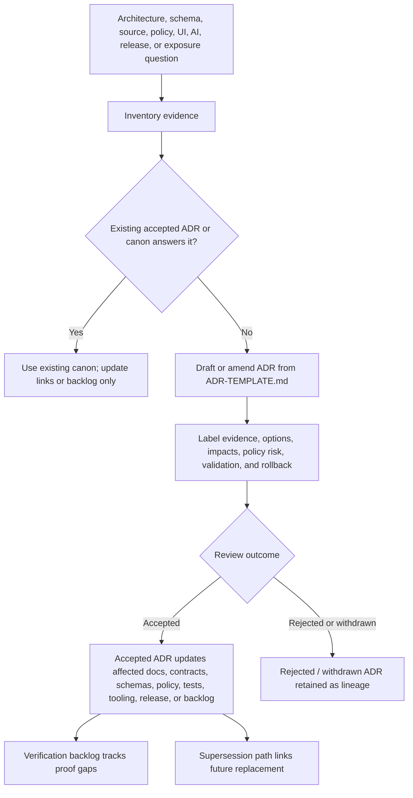

<!-- [KFM_META_BLOCK_V2]
doc_id: kfm://doc/TODO-uuid-docs-adr-readme
title: KFM Architecture Decision Records
type: standard
version: v1
status: draft
owners: OWNER_TBD_NEEDS_VERIFICATION
created: 2026-04-27
updated: 2026-05-02
policy_label: NEEDS VERIFICATION: public/restricted label
related: [docs/README.md, docs/adr/ADR-TEMPLATE.md, docs/adr/ADR-0001-schema-home.md, docs/adr/ADR-0002-governed-api-path-canonicalization.md, contracts/README.md, schemas/README.md, policy/README.md]
tags: [kfm, adr, documentation-control-plane, governance, architecture, decisions]
notes: [Revised from attached docs/adr/README.md draft; public GitHub snapshot was used for directory inventory; active checkout, owners, policy label, CI wiring, platform settings, and runtime evidence remain NEEDS VERIFICATION]
[/KFM_META_BLOCK_V2] -->

# KFM Architecture Decision Records

Governed decision records that preserve why KFM changes architecture, policy, schema homes, source authority, publication gates, and trust boundaries.

> [!IMPORTANT]
> **Status:** `experimental` README surface / `draft` content  
> **Owners:** `OWNER_TBD_NEEDS_VERIFICATION`  
> **Path:** `docs/adr/README.md`  
> **Role:** directory README, ADR index, decision-intake guide, and quality gate for Kansas Frontier Matrix.
>
> 
> 
> 
> 
> 
> 
>
> **Evidence mode for this revision:** `ATTACHED_MARKDOWN_REVISED` / `PUBLIC_GITHUB_SNAPSHOT_CHECKED` / `NO_LOCAL_MOUNTED_REPO` / `NO_RUNTIME_OR_PLATFORM_EVIDENCE`
>
> **Quick jumps:** [Scope](#scope) · [Repo fit](#repo-fit) · [Accepted inputs](#accepted-inputs) · [Exclusions](#exclusions) · [Directory inventory](#directory-inventory) · [Quickstart](#quickstart) · [Decision flow](#decision-flow) · [ADR inventory](#adr-inventory) · [ADR gates](#adr-gates) · [Authority posture](#source-authority-posture) · [Maintenance](#maintenance) · [FAQ](#faq) · [Appendix](#appendix-a--maintainer-review-checklist)

---

## Scope

`docs/adr/` is the home for **Architecture Decision Records** that preserve consequential KFM decisions after review.

An ADR belongs here when a decision changes, clarifies, constrains, or supersedes one of KFM’s trust-bearing boundaries:

- source authority, canon, lineage, exploratory intake, or external-source activation
- schema, contract, policy, fixture, validator, proof-object, receipt, or release-object homes
- governed API, public UI, MapLibre, Cesium, Focus Mode, model-runtime, or AI boundaries
- publication, promotion, correction, rollback, withdrawal, or supersession behavior
- rights, sensitivity, exact-location exposure, redaction, generalization, embargo, or public-release posture
- domain-lane architecture where a lane decision affects shared governance rules
- local exposure, reverse proxy, VPN, trusted third-party access, or security posture

> [!NOTE]
> ADRs are not implementation proof. An accepted ADR records a reviewed decision and its consequences. It does not, by itself, prove that routes, workflows, schemas, tests, dashboards, deployment settings, branch protections, platform rules, emitted proof objects, or runtime behavior already exist.

[Back to top](#kfm-architecture-decision-records)

---

## Repo fit

This README is both a **directory landing page** and a **governance checkpoint** for decision records.

| Direction | Link or path | Role | Current status |
|---|---|---|---|
| Current directory | `docs/adr/` | ADR index, decision template routing, and supersession surface | `CONFIRMED` in public GitHub snapshot / `NEEDS VERIFICATION` in active checkout |
| ADR template | [`ADR-TEMPLATE.md`](./ADR-TEMPLATE.md) | Canonical local template surface for new ADRs | `CONFIRMED` file presence in public snapshot / content review still recommended |
| Documentation hub | [`../README.md`](../README.md) | Documentation control-plane landing page | `CONFIRMED` public snapshot / active checkout recheck required |
| Contracts lane | [`../../contracts/README.md`](../../contracts/README.md) | Human-facing object meaning, compatibility, and contract semantics | `CONFIRMED` public snapshot / schema-home authority remains guarded |
| Schemas lane | [`../../schemas/README.md`](../../schemas/README.md) | Parent schema boundary and machine-shape routing | `CONFIRMED` public snapshot / canonical authority still requires ADR acceptance evidence |
| Policy lane | [`../../policy/README.md`](../../policy/README.md) | Decision logic for rights, sensitivity, runtime trust, correction, and release admissibility | `CONFIRMED` public snapshot / enforcement proof requires tests and platform evidence |
| Tests and fixtures | [`../../tests/`](../../tests/) | Executable verification and fixture evidence | `CONFIRMED` root path in public snapshot / detailed fixture status not reviewed here |
| Receipts and proofs | [`../../data/receipts/`](../../data/receipts/) · [`../../data/proofs/`](../../data/proofs/) | Process memory and proof-bearing object families | `CONFIRMED` root lifecycle lanes in public snapshot / emitted artifact status not reviewed here |
| Release surface | [`../../release/`](../../release/) | Release bundles, manifests, correction, withdrawal, and rollback references | `CONFIRMED` root path in public snapshot / release maturity not reviewed here |

> [!WARNING]
> A public GitHub directory listing proves file/path presence for that public snapshot only. It does not prove the active branch under review, local checkout state, hosted branch protection, required checks, secrets, deployment approvals, CI execution, emitted proof objects, dashboards, logs, or runtime behavior.

### Related control-plane indexes

- [`../registers/README.md`](../registers/README.md): register hub for authority ladder, drift, and verification backlog tracking.
- [`../runbooks/README.md`](../runbooks/README.md): operator procedures for publication, correction, stale projection, and rollback actions.

[Back to top](#kfm-architecture-decision-records)

---

## Accepted inputs

Use `docs/adr/` for decisions with durable architectural consequences.

| Accepted input | What belongs here | Minimum evidence |
|---|---|---|
| Schema-home decisions | Choosing the canonical machine-contract home and defining how `contracts/`, `schemas/`, validators, fixtures, and docs relate | Current repo tree, adjacent READMEs, affected schema consumers, validation plan, and rollback path |
| Source-authority decisions | Deciding how canon, lineage, exploratory packets, repo evidence, generated reports, and external standards relate | Source ledger, authority ladder, affected downstream docs, and explicit promotion criteria |
| Boundary decisions | Renderer, UI, API, AI, policy, review, promotion, release, or publication boundaries | Architecture docs, contract impacts, policy impacts, tests, and rollback path |
| Security and sensitivity decisions | Redaction, generalization, restricted access, exact-location handling, trusted-party exposure, local network exposure, or reverse-proxy posture | Rights/sensitivity evidence, policy obligations, steward/security review, and fail-closed behavior |
| Domain-lane decisions | Shared lane decisions that affect proof objects, source roles, public surfaces, cross-domain joins, or publication gates | Domain docs, fixture plan, validation plan, source-role review, and steward review needs |
| Correction and supersession decisions | Replacing, withdrawing, correcting, or rolling back a prior governing decision | Successor link, correction reason, downstream impact, validation, and no-loss lineage handling |

Every ADR must use the narrowest truthful labels where confidence matters: `CONFIRMED`, `INFERRED`, `PROPOSED`, `UNKNOWN`, `NEEDS VERIFICATION`, `CONFLICTED`, `LINEAGE`, or `SUPERSEDED`.

[Back to top](#kfm-architecture-decision-records)

---

## Exclusions

Do not put ordinary implementation notes here.

| Does not belong in `docs/adr/` | Put it here instead | Reason |
|---|---|---|
| Source inventories without a decision | `docs/registers/`, `data/registry/`, or source registry docs after path verification | A ledger is not automatically an ADR |
| Exploratory idea packets | Verified idea-intake path, backlog, or source-intake register | Ideas need promotion before becoming decision law |
| JSON Schema files | `schemas/contracts/v1/` or the repo-confirmed canonical schema home | Schemas are executable shape, not decision rationale |
| Human-facing contract explanations | `contracts/` or adjacent contract docs | Contracts explain meaning; ADRs record why authority changed |
| Policy rules | `policy/` plus policy tests | Policy is enforced separately from ADR prose |
| Test fixtures | `tests/fixtures/`, `tests/contracts/`, or repo-confirmed fixture home | Fixtures prove behavior; ADRs explain decisions |
| Runtime logs, receipts, proof packs | `data/receipts/`, `data/proofs/`, observability stores, or release artifacts | Emitted artifacts are evidence, not decisions |
| Generic architecture essays | `docs/architecture/` | ADRs should record a decision, alternatives, consequences, and rollback |
| Domain runbooks | `docs/runbooks/` | Runbooks guide operation; ADRs preserve why a path was chosen |
| Free-form model output or private reasoning | Governed AI receipts, reviewed public-safe summaries, or no storage | AI is interpretive and evidence-subordinate |
| Emergency or life-safety instructions | Official source guidance and official alerting systems | KFM must not convert ADR prose into operational emergency authority |

[Back to top](#kfm-architecture-decision-records)

---

## Directory inventory

The public GitHub snapshot inspected for this revision shows the following `docs/adr/` files. Recheck the active checkout before merging edits.

```text
docs/adr/
├── README.md
├── ADR-TEMPLATE.md
├── ADR-0001-schema-home.md
├── ADR-0002-governed-api-path-canonicalization.md
├── ADR-0003-source-ledger-authority.md
├── ADR-0004-evidencebundle-contract.md
├── ADR-0005-promotion-gate.md
├── ADR-0006-maplibre-layer-manifest.md
├── ADR-0007-governed-ai-runtime-envelope.md
├── ADR-0008-domain-lane-template.md
├── ADR-0009-sensitive-location-policy.md
├── ADR-0010-local-exposure-security.md
├── ADR-0011-catalog-proof-release-separation.md
├── ADR-0012-authority-boundary-compatibility-map.md
├── ADR-0241-policy-obligation-engine-and-release-gate.md
├── ADR-0427-consent-vc-and-revocation-delta.md
└── ADR-PROV-STAC-DCAT-CATALOG-MAPPING.md
```

> [!TIP]
> Keep accepted, superseded, withdrawn, rejected, deprecated, and corrected ADRs visible. KFM values correction lineage; deletion should be rare and justified by safety, privacy, rights, or security needs.

[Back to top](#kfm-architecture-decision-records)

---

## Quickstart

1. **Confirm the decision is ADR-worthy.** Use an ADR only when the decision affects architecture, governance, source authority, policy, publication, sensitivity, AI, UI trust, release, rollback, or shared domain-lane behavior.
2. **Search existing canon first.** Do not create a new ADR if an existing accepted ADR or canonical architecture doc already answers the question.
3. **Use the local template.** Start from [`ADR-TEMPLATE.md`](./ADR-TEMPLATE.md), not an improvised parallel template.
4. **Label evidence precisely.** Separate current repo evidence from doctrine, lineage, exploratory pressure, public GitHub snapshot evidence, and proposed implementation.
5. **List downstream effects.** Name affected docs, schemas, contracts, policy files, fixtures, validators, release objects, UI/API surfaces, receipts, proofs, and rollback targets.
6. **Review before acceptance.** Accepted ADRs should have a reviewer, validation evidence, a rollback or supersession path, and linked follow-up work where proof is incomplete.
7. **Update this README when the inventory changes.** The directory map should not lag behind actual ADR files.

Read-only inspection commands from the repository root:

```bash
git status --short
git branch --show-current
git rev-parse --show-toplevel

find docs/adr -maxdepth 1 -type f -name '*.md' | sort
sed -n '1,120p' docs/adr/README.md
sed -n '1,160p' docs/adr/ADR-TEMPLATE.md
```

> [!CAUTION]
> These commands prove only local checkout state. Hosted GitHub branch protection, required checks, Actions permissions, environment approvals, secrets, deployment settings, and runtime behavior need separate platform or runtime evidence.

[Back to top](#kfm-architecture-decision-records)

## Authority-boundary ADR set

The following ADRs should be reviewed together during reorganization work because they constrain where authority can live:

- [`ADR-0001-schema-home.md`](./ADR-0001-schema-home.md) — schema-home authority for machine-checkable contracts.
- [`ADR-0011-catalog-proof-release-separation.md`](./ADR-0011-catalog-proof-release-separation.md) — keeps catalog, proof, and release object families distinct.
- [`ADR-0012-authority-boundary-compatibility-map.md`](./ADR-0012-authority-boundary-compatibility-map.md) — compatibility guardrails for `contracts/` vs `schemas/` and `policy/` vs `policies/`.
- [`ADR-0013-policy-home-authority.md`](./ADR-0013-policy-home-authority.md) — proposed canonical policy-home decision (`policy/`) and compatibility posture for `policies/`.

If a proposed move or merge conflicts with these ADRs, treat that action as blocked pending explicit supersession.

---

## Usage

### When an ADR is required

Create or update an ADR when a change would otherwise let maintainers disagree about what is authoritative.

| Trigger | ADR required? | Why |
|---|---:|---|
| Choosing or changing canonical schema location | Yes | Prevents `contracts/` vs `schemas/` drift |
| Introducing a source-authority rule | Yes | Prevents exploratory material from becoming accidental canon |
| Adding or changing a public release pathway | Yes | Publication is a governed state transition |
| Changing governed API implementation path | Yes | Public clients must not split across trust-boundary implementations |
| Changing renderer, shell, Evidence Drawer, or Focus Mode authority | Yes | UI and AI are downstream of evidence, policy, review, and release state |
| Adding a live source connector | Usually | Source role, rights, cadence, terms, sensitivity, and release rules matter |
| Defining sensitive-location release behavior | Yes | Archaeology, ecology, cultural, infrastructure, and private contexts fail closed |
| Renaming a local helper script | Usually no | Not durable architecture unless it changes gates or authority |
| Creating a one-off fixture | Usually no | Fixtures support a decision; they are not the decision itself |
| Changing branch protection or workflow enforcement claims | Usually | Platform enforcement should be reviewable and not implied by YAML alone |

### Status values

| Status | Meaning | Required handling |
|---|---|---|
| `proposed` | Draft decision under review | May guide discussion, not implementation law |
| `accepted` | Current governing decision for stated scope | Must be linked from affected docs or registers |
| `rejected` | Considered and declined | Preserve rationale when useful |
| `superseded` | Replaced by a newer ADR or stronger evidence | Keep visible; link successor |
| `withdrawn` | Retired without replacement or removed before governing | Keep reason and safe-use note |
| `deprecated` | Historical decision should not be extended without a successor | Preserve lineage and migration notes |

[Back to top](#kfm-architecture-decision-records)

---

## Decision flow


```mermaid
flowchart TD
    A[Architecture, schema, source, policy, UI, AI, release, or exposure question]
    B[Inventory evidence]
    C{Existing accepted ADR or canon answers it?}
    D[Use existing canon; update links or backlog only]
    E[Draft or amend ADR from ADR-TEMPLATE.md]
    F[Label evidence, options, impacts, policy risk, validation, and rollback]
    G{Review outcome}
    H[Accepted ADR updates affected docs, contracts, schemas, policy, tests, tooling, release, or backlog]
    I[Rejected / withdrawn ADR retained as lineage]
    J[Verification backlog tracks proof gaps]
    K[Supersession path links future replacement]

    A --> B
    B --> C
    C -- Yes --> D
    C -- No --> E
    E --> F
    F --> G
    G -- Accepted --> H
    G -- Rejected or withdrawn --> I
    H --> J
    H --> K
```

[Back to top](#kfm-architecture-decision-records)

---

## ADR inventory

This inventory reflects file presence in the public GitHub snapshot checked during this revision. It does not replace reading each ADR before relying on its status.

| ADR file | Decision area | Status signal for this README |
|---|---|---|
| [`ADR-0001-schema-home.md`](./ADR-0001-schema-home.md) | Canonical schema home for machine contracts | File present; content reviewed as `proposed` / draft; acceptance evidence still required |
| [`ADR-0002-governed-api-path-canonicalization.md`](./ADR-0002-governed-api-path-canonicalization.md) | Governed API path canonicalization | File present; content reviewed as `accepted`; implementation/CI proof still requires verification |
| [`ADR-0003-source-ledger-authority.md`](./ADR-0003-source-ledger-authority.md) | Source ledger and authority posture | File present; status `NEEDS REVIEW` before relying on it |
| [`ADR-0004-evidencebundle-contract.md`](./ADR-0004-evidencebundle-contract.md) | EvidenceBundle contract | File present; status `NEEDS REVIEW` before relying on it |
| [`ADR-0005-promotion-gate.md`](./ADR-0005-promotion-gate.md) | Promotion gate and release transition | File present; status `NEEDS REVIEW` before relying on it |
| [`ADR-0006-maplibre-layer-manifest.md`](./ADR-0006-maplibre-layer-manifest.md) | MapLibre layer manifest | File present; status `NEEDS REVIEW` before relying on it |
| [`ADR-0007-governed-ai-runtime-envelope.md`](./ADR-0007-governed-ai-runtime-envelope.md) | Governed AI runtime envelope | File present; status `NEEDS REVIEW` before relying on it |
| [`ADR-0008-domain-lane-template.md`](./ADR-0008-domain-lane-template.md) | Domain-lane template | File present; status `NEEDS REVIEW` before relying on it |
| [`ADR-0009-sensitive-location-policy.md`](./ADR-0009-sensitive-location-policy.md) | Sensitive-location policy | File present; status `NEEDS REVIEW` before relying on it |
| [`ADR-0010-local-exposure-security.md`](./ADR-0010-local-exposure-security.md) | Local exposure and security | File present; status `NEEDS REVIEW` before relying on it |
| [`ADR-0011-catalog-proof-release-separation.md`](./ADR-0011-catalog-proof-release-separation.md) | Catalog/proof/release separation | File present; status `NEEDS REVIEW` before relying on it |
| [`ADR-0013-policy-home-authority.md`](./ADR-0013-policy-home-authority.md) | Canonical policy home authority (`policy/` vs `policies/`) | File present; status `proposed`; acceptance evidence still required |
| [`ADR-0241-policy-obligation-engine-and-release-gate.md`](./ADR-0241-policy-obligation-engine-and-release-gate.md) | Policy obligation engine and release gate | File present; status `NEEDS REVIEW` before relying on it |
| [`ADR-0427-consent-vc-and-revocation-delta.md`](./ADR-0427-consent-vc-and-revocation-delta.md) | Consent, verifiable credentials, and revocation delta | File present; status `NEEDS REVIEW` before relying on it |
| [`ADR-PROV-STAC-DCAT-CATALOG-MAPPING.md`](./ADR-PROV-STAC-DCAT-CATALOG-MAPPING.md) | PROV/STAC/DCAT catalog mapping | File present; status `NEEDS REVIEW` before relying on it |
| [`ADR-TEMPLATE.md`](./ADR-TEMPLATE.md) | ADR authoring template | File present; use for new ADRs unless superseded by an accepted template decision |

> [!IMPORTANT]
> Do not infer acceptance from filename, numbering, or presence. Read the ADR status, evidence basis, validation notes, and supersession fields before treating it as governing.

[Back to top](#kfm-architecture-decision-records)

---

## ADR gates

An ADR is not ready for acceptance until it passes these checks.

- [ ] Has one clear decision, not a bundle of unrelated preferences.
- [ ] Uses KFM truth labels where confidence materially matters.
- [ ] Identifies evidence basis and distinguishes doctrine, repo evidence, public snapshot evidence, lineage, exploratory input, external standards, and proposed implementation.
- [ ] Names affected object families such as `SourceDescriptor`, `EvidenceRef`, `EvidenceBundle`, `PolicyDecision`, `RuntimeResponseEnvelope`, `DecisionEnvelope`, `RunReceipt`, `AIReceipt`, `LayerManifest`, `ReleaseManifest`, `CatalogMatrix`, `CorrectionNotice`, `WithdrawalNotice`, `RollbackReference`, or `ReviewRecord` when applicable.
- [ ] Lists affected docs, contracts, schemas, policy, fixtures, validators, workflows, UI/API surfaces, receipts, proofs, release objects, and rollback records.
- [ ] States security, rights, sensitivity, source-role, exact-location, or public-release consequences.
- [ ] Defines validation needed before implementation, acceptance, or publication.
- [ ] Defines rollback, withdrawal, correction, or supersession path.
- [ ] Does not claim route names, DTOs, workflows, CI enforcement, branch protection, tests, dashboards, deployment behavior, or emitted proof objects unless direct evidence supports them.
- [ ] Adds follow-up items to the verification backlog when proof is missing.
- [ ] Updates this README and any affected index/register after merge.

[Back to top](#kfm-architecture-decision-records)

---

## Source authority posture

KFM ADRs follow this authority order when claims conflict.

| Rank | Source class | How ADRs should use it |
|---:|---|---|
| 1 | Active mounted checkout and runtime evidence | Current files, tests, workflows, configs, schemas, logs, dashboards, emitted artifacts, branch state, and runtime traces outrank prose for implementation claims |
| 2 | Accepted ADRs and current repo-native standards | Governing decisions and local conventions control their stated scope |
| 3 | Current public GitHub snapshot | Useful for public-main file/path presence; still recheck active branch, platform settings, and runtime behavior |
| 4 | Current KFM doctrine and canonical architecture docs | Governs meaning, invariants, trust posture, and decision standards |
| 5 | Existing normative Markdown | Controls local conventions when directly inspected and not contradicted by stronger evidence |
| 6 | Domain-lane and subsystem reports | Supports lane-specific burdens and shared object-family pressure |
| 7 | New Ideas, prior PDFs, scaffold reports, and exploratory packets | Design pressure or lineage only until promoted through source intake, tests, review, and release state |
| 8 | External official standards and source docs | Used for version-sensitive facts, standards, and source-system behavior |
| 9 | General references | Conceptual support only; never project authority by itself |

> [!CAUTION]
> Repetition is not authority. A decision repeated in multiple PDFs is still not implementation proof unless a current repo file, test, workflow, emitted artifact, platform setting, or runtime trace supports it.

[Back to top](#kfm-architecture-decision-records)

---

## Maintenance

Keep this README synchronized with the actual ADR lane.

### Definition of done for this README

- [ ] KFM Meta Block v2 is present and synchronized with title, status, owners, related links, tags, and notes.
- [ ] Top impact block includes status, owners, path, evidence mode, badges, and quick links.
- [ ] Repo fit lists confirmed or clearly bounded upstream/downstream surfaces.
- [ ] Accepted inputs and exclusions are present.
- [ ] Directory inventory matches the current ADR directory.
- [ ] ADR inventory distinguishes file presence from acceptance.
- [ ] Decision flow diagram is still accurate.
- [ ] ADR gates match current template and governance expectations.
- [ ] Source authority posture does not overstate implementation evidence.
- [ ] Long appendix material is folded under `<details>`.
- [ ] Link health is checked from `docs/adr/README.md`.
- [ ] Owner and policy label placeholders are resolved or remain explicitly searchable.

### Safe update loop

```bash
# Inspect current ADR files.
find docs/adr -maxdepth 1 -type f -name '*.md' | sort

# Check headings and likely status lines.
for file in docs/adr/*.md; do
  printf '\n--- %s ---\n' "$file"
  sed -n '1,35p' "$file"
done

# Search for overclaims before merge.
grep -RInE 'production|deployed|required checks|branch protection|runtime behavior|dashboard|emitted proof|CONFIRMED' docs/adr/*.md
```

[Back to top](#kfm-architecture-decision-records)

---

## FAQ

### Do ADRs replace architecture docs?

No. Architecture docs describe the system. ADRs record specific decisions, alternatives, consequences, verification needs, and rollback paths.

### Can an ADR approve public release?

No. An ADR can define or change a release rule. Actual publication still needs policy checks, evidence support, source-role support, sensitivity handling, review state, receipts, proof objects, release manifests, correction path, and rollback readiness.

### Can an ADR cite exploratory packets?

Yes, but only as exploratory design pressure or lineage. The ADR must say what evidence promotes the idea into a decision and what remains unverified.

### Should every ADR include the KFM Meta Block?

For standard Markdown ADRs, yes unless a stronger repo-local exception is accepted. Keep the visible title synchronized with the meta block title, filename, and ADR index entry.

### What happens when an ADR is wrong?

Supersede, withdraw, or correct it visibly. Keep the old decision available as lineage unless removal is required for safety, privacy, rights, or security reasons.

### Can the ADR template in this README replace `ADR-TEMPLATE.md`?

No. This README should point to `ADR-TEMPLATE.md`. A large inline template here would create template drift and a parallel authority surface. Use the appendix checklist below only as a maintainer review aid.

[Back to top](#kfm-architecture-decision-records)

---

## Appendix A — Maintainer review checklist

<details>
<summary><strong>Use this before merging a new or revised ADR</strong></summary>

| Check | Pass condition |
|---|---|
| Decision clarity | One decision is stated clearly in the `Decision` section |
| Evidence separation | Doctrine, active repo evidence, public snapshot evidence, implementation evidence, exploratory input, lineage, and external standards are not collapsed |
| KFM invariants | Truth path, trust membrane, governed API, cite-or-abstain, policy, review, release, correction, and rollback are preserved |
| Implementation restraint | No unverified implementation maturity claims |
| Downstream updates | Affected docs, registers, contracts, schemas, policy, tests, fixtures, validators, backlog, release objects, receipts, and proof lanes are listed |
| Security and sensitivity | Rights, sovereignty, cultural sensitivity, exact location, private data, security exposure, and local access posture are handled or marked `NEEDS VERIFICATION` |
| Reversibility | Rollback, withdrawal, correction, or supersession path exists |
| Link hygiene | Relative links resolve from `docs/adr/` after active-checkout verification |
| Meta block | KFM Meta Block v2 is present and synchronized with title/status/owners |
| Template alignment | ADR uses `ADR-TEMPLATE.md` or explicitly explains a repo-local exception |
| Acceptance evidence | Proposed decisions are not marked accepted until validation evidence and review state support the upgrade |

</details>

[Back to top](#kfm-architecture-decision-records)
