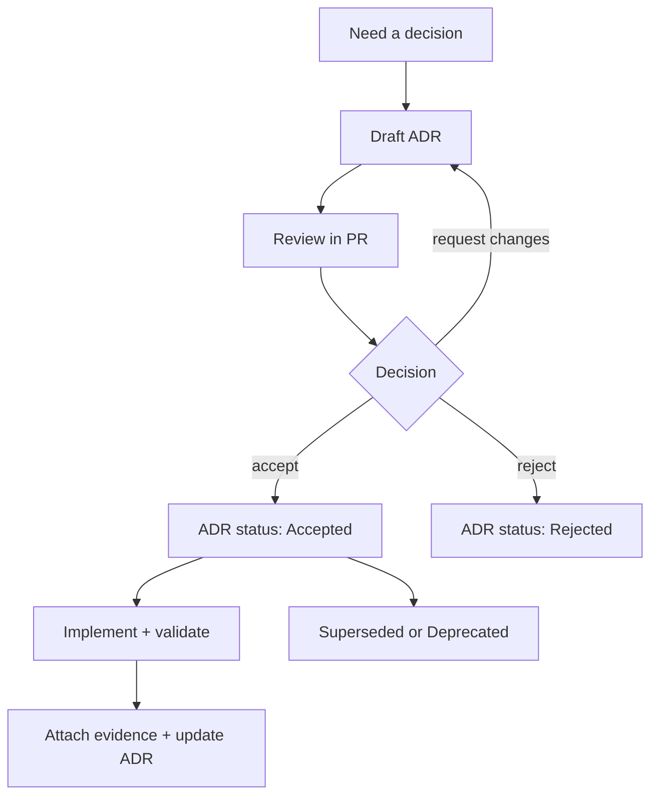

<!-- [KFM_META_BLOCK_V2]
doc_id: kfm://doc/3d3f7d0f-4d9b-4d67-9c6e-7d7b3c7cb6d5
title: docs/adr — Architecture Decision Records
type: standard
version: v1
status: draft
owners: TBD
created: 2026-02-24
updated: 2026-03-05
policy_label: public
related:
  - docs/README.md
  - docs/adr
tags: [kfm, adr, architecture, governance]
notes:
  - This README defines the ADR process + conventions for this repo.
  - Keep ADRs evidence-linked and reversible per KFM operating rules.
[/KFM_META_BLOCK_V2] -->

# docs/adr — Architecture Decision Records
A governed, auditable record of **why** KFM made key architecture + governance decisions.

> **Purpose:** ADRs are small, durable **decision records**. They do not replace design docs; they point to them.


 <!-- TODO: wire to generated index job -->
   <!-- TODO: wire to CI gate -->

---

## Impact
- **Status:** `draft`
- **Owners:** `TBD` (set the team responsible for architecture/governance)
- **Applies to:** Data → pipelines → catalogs/provenance → storage/indexing → governed APIs → Map/Story UI → Focus Mode
- **Location:** `docs/adr/`
- **Non-negotiables (KFM posture):**
  - **Trust membrane:** UI/clients do not access storage/DB directly; all access crosses governed APIs + policy boundary.
  - **Fail-closed:** governance/policy gates default-deny when evidence is missing.
  - **Promotion discipline:** RAW → WORK → PROCESSED → PUBLISHED gated by catalogs + validation + receipts.
  - **Focus Mode:** cite-or-abstain with auditable evidence references.

> **IMPORTANT**
> This README is normative. It **does not assert** that optional tooling or placeholder files exist.
> Anything marked **TODO** or **optional** is a **plan**, not a claim about current repo state.

---

## Quick navigation
- [Why ADRs exist](#why-adrs-exist)
- [Decision language and claim tagging](#decision-language-and-claim-tagging)
- [When an ADR is required](#when-an-adr-is-required)
- [Quickstart](#quickstart)
- [ADR lifecycle](#adr-lifecycle)
- [Directory conventions](#directory-conventions)
  - [Directory invariants](#directory-invariants)
  - [Recommended directory layout](#recommended-directory-layout)
  - [Placement rules](#placement-rules)
- [ADR format requirements](#adr-format-requirements)
- [Index](#index)
- [Definition of done](#definition-of-done)
- [FAQ](#faq)
- [Appendix](#appendix)

---

## Why ADRs exist
ADRs are part of KFM’s **trust membrane** and **truth path** discipline. They make decisions:

- **Auditable:** future maintainers can trace what changed and why.
- **Testable:** decisions state the *minimum checks* that prove they are safe and working.
- **Reversible:** decisions document rollout + rollback triggers and mechanics.
- **Governed:** decisions document policy boundaries, sensitivity handling, and evidence obligations.

> **NOTE**
> ADRs should be small and link-first.
> If you need 10+ pages, write a design doc and have the ADR **link to it**.

### ADRs as “gap closure”
KFM treats unresolved gaps as governed work: identify the gap → decide via ADR → implement in PR → attach evidence → enforce via gates.

---

## Decision language and claim tagging

### Normative keywords
Use these words intentionally:

- **MUST** = required to meet KFM governance posture.
- **SHOULD** = recommended unless you have a documented reason not to.
- **MAY** = optional.

### Claim tags (inside ADRs)
Within ADRs, label meaningful claims to preserve the trust membrane:

| Tag | Meaning | Minimum requirement |
|---|---|---|
| **CONFIRMED** | Backed by repo artifacts (code, configs, receipts, validated catalogs, policy tests) | Link to evidence |
| **PROPOSED** | An option or plan being recommended | Rationale + tradeoffs + risks |
| **UNKNOWN** | Not yet verified | Smallest verification steps to confirm |

> **TIP**
> If you’re unsure, mark it **UNKNOWN** and write the smallest check that would make it **CONFIRMED**.

---

## When an ADR is required
Write an ADR when a change affects **system shape**, **governance boundaries**, or **user-facing trust guarantees**.

### Common triggers

| Change type | ADR required? | Examples |
|---|---:|---|
| Data lifecycle zones | ✅ | RAW/WORK/PROCESSED/PUBLISHED definitions or transitions |
| Promotion gates | ✅ | identity/versioning, licensing, sensitivity, catalog validation, receipts |
| Trust membrane boundary | ✅ | “clients never access storage directly”, Policy Enforcement Point rules |
| Catalog/provenance contract | ✅ | DCAT/STAC/PROV profiles; EvidenceRef/EvidenceBundle scheme |
| Governed API contracts | ✅ | OpenAPI changes, authZ model, error model, audit logging |
| Focus Mode behavior | ✅ | cite-or-abstain gate, evaluation harness expectations |
| Security/privacy/sensitivity posture | ✅ | redaction rules, access control, secrets handling |
| Cross-cutting dependencies | ✅ | new DB/queue/GIS engine/policy engine/CI gate strategy |
| Pure refactor / typo fix | ❌ | no observable behavior change, no governance boundary change |

> **WARNING**
> If sensitivity/permissions are unclear, **default-deny**: generalize/redact and flag “needs governance review”.

---

## Quickstart

### Create a new ADR (author workflow)
1. Pick the next available ADR number `NNNN`.
2. Create a slug: `short-slug` (lowercase, hyphenated).
3. Create the file: `docs/adr/NNNN-short-slug.md`
4. Fill the ADR template completely (see [Appendix](#appendix)).
5. Add an entry to the [Index](#index).
6. Open a PR referencing the ADR and (ideally) the smallest implementing change.
7. After merge, update the ADR status and attach evidence links (PR, receipts, validation outputs).

### Minimal shell snippet
```bash
# Pick NNNN manually (or via tooling if you add it later)
NNNN=0001
SLUG="governed-api-boundary"
FILE="docs/adr/${NNNN}-${SLUG}.md"

# Create from template if present; otherwise copy from Appendix
cp docs/adr/TEMPLATE.md "$FILE"

# (Optional) generate a UUID for doc_id
python - <<'PY'
import uuid
print(uuid.uuid4())
PY
```

> **NOTE**
> If your template file does not exist yet, copy the template from the Appendix into a new `docs/adr/TEMPLATE.md`
> as a follow-up PR. Treat that as documentation plumbing, not a decision record.

---

## ADR lifecycle


```mermaid
flowchart TD
  A[Need a decision] --> B[Draft ADR]
  B --> C[Review in PR]
  C --> D{Decision}
  D -->|accept| E[ADR status: Accepted]
  D -->|request changes| B
  D -->|reject| F[ADR status: Rejected]
  E --> G[Implement + validate]
  G --> H[Attach evidence + update ADR]
  E --> I[Superseded or Deprecated]
```

### ADR status values
| ADR status | Meaning |
|---|---|
| Proposed | Drafted and under review; not yet the project’s decision |
| Accepted | Approved decision; implementation may be in progress |
| Rejected | Considered but not adopted (keep for history) |
| Deprecated | No longer recommended, but not replaced by a single ADR |
| Superseded | Replaced by another ADR (must link to the replacing ADR) |

> **IMPORTANT**
> **ADR status** (Proposed/Accepted/…) is the decision state.
> The MetaBlock **status** (draft/review/published) is the *document lifecycle* for indexing/workflow.

---

## Directory conventions

### Where this fits in the repo
`docs/adr/` holds architecture decision records that justify **governed changes** across the end-to-end KFM system.

### Acceptable inputs
- One Markdown file per decision: `NNNN-short-slug.md`
- Mermaid diagrams (preferred) when a diagram adds clarity
- Optional “dossier” folders for supporting material **linked** from the ADR

### Exclusions
- Implementation guides, runbooks, tutorials (put those elsewhere in `docs/`)
- Meeting notes/transcripts (store where meeting notes belong)
- Secrets, credentials, restricted operational details
- Exact coordinates or targeting information for vulnerable/private/culturally restricted sites

---

### Directory invariants
These are non-negotiable rules for keeping ADRs usable as governed artifacts:

1. **Stable identity**
   - ADR numbers **MUST NOT** be reused.
   - `doc_id` in the MetaBlock **MUST** be stable (do not regenerate on edits).

2. **Small + link-first**
   - ADRs are decision records; supporting detail belongs in linked docs, PRs, or run receipts.
   - Do not embed large binaries or datasets here.

3. **Generated stays generated**
   - If you add `_generated/`, treat it as **never** hand-edited (CI regenerates it).

4. **No secrets**
   - Never commit credentials, tokens, or restricted operational steps into `docs/adr/`.

5. **Reversible by design**
   - Every **Accepted** ADR MUST include rollback triggers + rollback mechanics (not just “we can revert”).

---

### Recommended directory layout
This layout is **recommended**. Create the pieces you need; do not assume optional files exist.

```text
docs/adr/
├─ README.md                          # This file (process + conventions)
├─ INDEX.md                           # Recommended index (human or generated)
├─ TEMPLATE.md                        # Recommended single-source ADR template
│
├─ _generated/                        # Optional: generated artifacts (never hand-edit)
│  ├─ adr-index.json                  # Optional: machine index for UI/search
│  └─ adr-index.md                    # Optional: generated Markdown index
│
├─ tools/                             # Optional: scripts to enforce ADR invariants
│  ├─ README.md                       # Optional: how to run tools locally/CI
│  ├─ adr-next-number.*               # Optional: print next available NNNN
│  ├─ adr-lint.*                      # Optional: lint ADRs (required sections, MetaBlock present)
│  └─ adr-indexer.*                   # Optional: regenerate index/_generated/*
│
├─ dossiers/                          # Optional: supporting material per ADR (link from ADR)
│  ├─ README.md                       # Optional: dossier rules
│  └─ 0006-example-decision/
│     └─ ...
│
└─ NNNN-short-slug.md                 # ADRs live directly under docs/adr/
```

> **TIP**
> Prefer Mermaid diagrams inside the ADR over storing exported diagrams in `assets/`.
> If you must add screenshots/exports, ensure they contain no sensitive information and are policy-labeled appropriately.

---

### Placement rules

#### Where ADR files live
- ADR Markdown files live at: `docs/adr/NNNN-short-slug.md`
- Optional supporting material lives at: `docs/adr/dossiers/NNNN-short-slug/*`
- Optional generated indexes live at: `docs/adr/_generated/*`

#### What goes in a dossier vs the ADR
Use a dossier when any of the following is true:

- the decision needs more than one diagram
- you need a longer rationale or analysis than fits in the ADR
- you want to attach a threat model, benchmark plan, or migration plan

Dossiers MUST NOT include secrets or large data. If you must reference restricted material, store it in the restricted system and link from the ADR at an abstraction-safe level.

---

## ADR format requirements
Every ADR MUST include:

- **KFM MetaBlock v2 header** (HTML comment)
- **ADR status** + **Date**
- **Decision statement** (one clear sentence)
- **Context** (problem, constraints, why now)
- **Options considered** (with tradeoffs)
- **Decision** (what we will do)
- **Consequences** (positive, negative, risks)
- **Governance & policy impacts** (policy_label, obligations, redaction)
- **Verification** (minimum checks that prove it works)
- **Rollout and rollback plan**
- **Evidence links** (PRs, issues, receipts, validation reports)

### Evidence discipline
Evidence links should point to artifacts that make the decision defensible:

- validation reports and QA summaries
- run receipts and checksums
- policy tests and contract tests
- catalog validation outputs (DCAT/STAC/PROV cross-linking)
- threat model notes and mitigations

> **RULE OF THUMB**
> If the ADR contains a claim that could surface in Map/Story/Focus Mode, the ADR SHOULD link to evidence that makes that claim auditable.

---

## Index
Keep this table current. Add an entry when an ADR is created, and update status when it changes.

> **NOTE**
> If you later automate indexing, treat this table as either:
> - the canonical human-maintained index, or
> - a generated artifact (in which case move it to `_generated/` and document the generator).

| ADR | Title | ADR status | Date | Owners | Supersedes | Notes |
|---:|---|---|---|---|---|---|
| _TBD_ | _Add your first ADR_ | _Proposed_ | _YYYY-MM-DD_ | _TBD_ | _N/A_ | _Add link once file exists_ |

---

## Definition of done
Use this checklist as the “gate” for ADR quality.

### DoD for a Proposed ADR (ready for review)
- [ ] File name matches `NNNN-short-slug.md`
- [ ] MetaBlock present with **stable** `doc_id`
- [ ] ADR status is **Proposed**
- [ ] Decision statement is one sentence (“We will …”)
- [ ] At least 2 options considered (or explicit justification why not)
- [ ] Governance & policy impacts section completed
- [ ] Verification section includes concrete checks (not “test it”)
- [ ] Rollout + rollback plans are specific and actionable
- [ ] Links included for any referenced PRs/issues/docs (or marked TODO)

### DoD for an Accepted ADR (ready to rely on)
- [ ] ADR status updated to **Accepted**
- [ ] PR(s) implementing the decision are linked
- [ ] Evidence links added (receipts, validation outputs, policy tests)
- [ ] Rollback triggers + mechanics included and realistic
- [ ] Any contract changes reflected in schemas/tests (or explicitly tracked as follow-up)

---

## FAQ

### Can I edit an old ADR?
Yes, but only for:
- status transitions (`Proposed → Accepted`, etc.)
- links to implementation/evidence
- clarifications that do **not** change the original decision

If the decision changes, write a **new ADR** and mark the old one **Superseded**.

### Where do how-to docs go?
Not here. ADRs are for **decisions**. Put how-to docs in the appropriate `docs/` section and link them from the ADR if needed.

### What about sensitive decisions?
If an ADR must reference restricted information:
- write a **public ADR** at a safe abstraction level
- link to restricted artifacts in the appropriate restricted system/location
- do **not** commit secrets or sensitive operational details into the repo

### Do ADRs need a MetaBlock?
Yes. Use KFM MetaBlock v2 for ADRs so they can be indexed, filtered by `policy_label`, and served through governed doc surfaces if needed.

---

## Appendix

<details>
<summary><strong>ADR template (copy/paste)</strong></summary>

```markdown
<!-- [KFM_META_BLOCK_V2]
doc_id: kfm://doc/<uuid>
title: docs/adr/NNNN-<short-slug> — <short decision title>
type: adr
version: v1
status: draft|review|published
owners: <team or names>
created: YYYY-MM-DD
updated: YYYY-MM-DD
policy_label: public|restricted|...
related:
  - <issue/PR/doc links>
tags: [kfm, adr]
notes:
  - <short notes>
[/KFM_META_BLOCK_V2] -->

# ADR NNNN: <short decision title>

- **ADR status:** Proposed | Accepted | Rejected | Deprecated | Superseded
- **Date:** YYYY-MM-DD
- **Owners:** <team or names>
- **Deciders:** <role(s) or group>
- **Policy label:** public | restricted | ...
- **Related:** <issue/PR/doc links>

## Decision statement
One sentence: **We will ...**

## Context
What problem are we solving? Why now?

- Constraints:
- Assumptions:
- Non-goals:

## Decision drivers
List the forces that matter (correctness, safety, licensing, latency, cost, reversibility, team skills, etc.).

## Options considered

### Option A: <name>
- Pros:
- Cons:
- Risks:
- Operational impact:

### Option B: <name>
- Pros:
- Cons:
- Risks:
- Operational impact:

## Decision
Explain the decision clearly and precisely.

## Consequences

### Positive
- ...

### Negative / Risks
- ...

### Tradeoffs
- ...

## Governance & policy impacts
- Data sensitivity / classification:
- Redaction/generalization obligations:
- Access control changes:
- Audit/provenance requirements:
- Any CARE/FAIR or community constraints:

## Promotion Contract impacts
If this decision changes promotion gates, catalogs, identity, or runtime rules, enumerate what changes:

- Gate A (identity/versioning):
- Gate B (licensing/rights):
- Gate C (sensitivity/redaction plan):
- Gate D (catalog validation):
- Gate E (run receipts/checksums):
- Gate F (policy + contract tests):

## Rollout plan
Step-by-step, including promotion gates and validation.

## Rollback plan
How we undo this safely. Include triggers for rollback.

## Verification
Smallest set of checks needed to prove this decision works:

- [ ] Unit/integration tests:
- [ ] Catalog validators + link checks:
- [ ] Policy tests (default-deny) + obligations enforced:
- [ ] EvidenceRefs resolve end-to-end (if applicable):
- [ ] Observability checks (logs/metrics/traces):
- [ ] Security checks:

## Evidence
Links to artifacts:
- ...
- ...

## Follow-ups
- [ ] ...
- [ ] ...

## Supersedes / Superseded by
- Supersedes: <ADR link or N/A>
- Superseded by: <ADR link or N/A>
```

</details>

---

<p align="right"><a href="#docsadr--architecture-decision-records">Back to top ↑</a></p>
