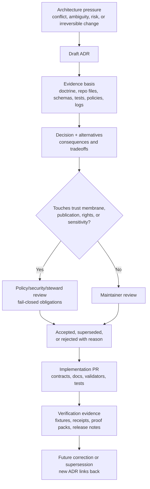

<!-- [KFM_META_BLOCK_V2]
doc_id: kfm://doc/NEEDS-VERIFICATION
title: Architecture Decision Records (`docs/adr/`)
type: standard
version: v1
status: draft
owners: NEEDS-VERIFICATION
created: 2026-04-22
updated: 2026-04-22
policy_label: NEEDS-VERIFICATION
related: [NEEDS-VERIFICATION]
tags: [kfm, adr, architecture, governance, documentation-control-plane]
notes: [
  Target path requested by user: docs/adr/README.md.
  Current-session workspace did not expose a mounted KFM Git repository, so owners, doc_id, policy_label, adjacent links, and existing ADR inventory remain NEEDS VERIFICATION.
  This README is grounded in the KFM pipeline/control-plane doctrine, ADR index backlog, and surfaced KFM Markdown conventions; implementation status is not upgraded beyond draft.
]
[/KFM_META_BLOCK_V2] -->

<a id="top"></a>

# Architecture Decision Records (`docs/adr/`)

Decision-control surface for KFM architecture choices that affect governance, contracts, publication, evidence flow, trust boundaries, or long-term maintenance.

> [!IMPORTANT]
> **Status:** `experimental` · **Document status:** `draft`  
> **Owners:** `NEEDS VERIFICATION`  
> **Path:** `docs/adr/README.md`  
> **Repo fit:** ADR directory README under `docs/`; upstream/downstream links remain **NEEDS VERIFICATION** until the mounted checkout, `CODEOWNERS`, and adjacent docs are inspected.  
> **Quick jumps:** [Scope](#scope) · [Repo fit](#repo-fit) · [Accepted inputs](#accepted-inputs) · [Exclusions](#exclusions) · [Directory tree](#directory-tree) · [Decision lifecycle](#decision-lifecycle) · [ADR template](#adr-template) · [Priority ADR index](#priority-adr-index) · [Review gates](#review-gates) · [FAQ](#faq) · [Appendix](#appendix)


> [!NOTE]
> ADRs are not decorative history. In KFM, an ADR is a reviewable commitment record: it should preserve the context, evidence, alternatives, consequences, verification requirements, and rollback or supersession path for consequential architecture decisions.

---

## Scope

`docs/adr/` is the home for **Architecture Decision Records** that explain why KFM chooses one durable path over another.

Use an ADR when a decision materially affects one or more of these surfaces:

| Decision area | ADR-worthy trigger | Example decision |
|---|---|---|
| **Governance** | Authority, review, promotion, source status, or evidence posture changes. | Source ledger authority model. |
| **Contracts / schemas** | Canonical machine-readable home, schema versioning, or compatibility changes. | `schemas/contracts/v1` versus another contract home. |
| **Evidence flow** | `EvidenceRef`, `EvidenceBundle`, citation validation, proof, receipt, or catalog closure changes. | EvidenceBundle minimum contract. |
| **Publication** | Release, promotion, rollback, correction, or public-safe materialization behavior changes. | Catalog/proof/release separation. |
| **Policy / sensitivity** | Rights, sovereignty, sensitive location, restricted access, or fail-closed rules change. | Sensitive-location policy. |
| **UI / API / AI** | Governed API boundary, MapLibre layer contract, Evidence Drawer payload, Focus Mode, or model-runtime envelope changes. | Governed AI runtime response envelope. |
| **Operations / exposure** | Local deployment, reverse proxy, VPN, firewall, secrets, CI, or branch-protection posture changes. | Local exposure security posture. |

A small implementation note belongs near the code or in a runbook. A durable choice that future maintainers must understand belongs here.

<p align="right"><a href="#top">Back to top ↑</a></p>

---

## Repo fit

> [!WARNING]
> **NEEDS VERIFICATION:** Current-session evidence did not include the mounted KFM repository. The fit map below is the intended relationship for `docs/adr/README.md`; verify every path before merge.

| Relationship | Path or surface | Status |
|---|---|---|
| Target file | `docs/adr/README.md` | **PROPOSED by this draft** |
| Parent docs surface | `docs/README.md` | **NEEDS VERIFICATION** |
| Decision records | `docs/adr/ADR-0001-*.md`, `docs/adr/ADR-0002-*.md`, … | **PROPOSED / NEEDS VERIFICATION** |
| Source authority neighbor | `docs/registers/SOURCE_LEDGER.md` | **PROPOSED / NEEDS VERIFICATION** |
| Verification backlog neighbor | `docs/registers/VERIFICATION_BACKLOG.md` | **PROPOSED / NEEDS VERIFICATION** |
| Contract neighbor | `schemas/contracts/v1/` or repo-confirmed schema home | **CONFLICTED until ADR-0001** |
| Policy neighbor | `policy/` | **NEEDS VERIFICATION** |
| Test neighbor | `tests/` | **NEEDS VERIFICATION** |
| Release evidence neighbors | `data/receipts/`, `data/proofs/`, `release/` | **NEEDS VERIFICATION** |

**Upstream:** documentation control-plane doctrine, source authority register, verification backlog, and repo-level governance standards.

**Downstream:** schema home, source registry, EvidenceBundle contracts, promotion gates, MapLibre layer manifests, governed-AI runtime envelopes, sensitive-location policy, local-exposure security, and catalog/proof/release separation.

<p align="right"><a href="#top">Back to top ↑</a></p>

---

## Accepted inputs

Add or revise ADRs here when the record contains all of the following:

- A specific decision question, not a vague preference.
- The evidence basis used to make the decision.
- Alternatives considered, including “do nothing” when relevant.
- Consequences for contracts, schemas, policy, validators, tests, docs, API, UI, data lifecycle, or release artifacts.
- Verification required before implementation claims can be made.
- Rollback, migration, or supersession path.
- Clear truth labels where implementation status is uncertain: `CONFIRMED`, `INFERRED`, `PROPOSED`, `UNKNOWN`, or `NEEDS VERIFICATION`.

Good ADR subjects include:

| Good ADR subject | Why it belongs here |
|---|---|
| `ADR-0001-schema-home.md` | Prevents duplicate contract authority between `contracts/` and `schemas/`. |
| `ADR-0002-source-ledger-authority.md` | Defines how source status controls doctrine, lineage, exploratory packets, and implementation claims. |
| `ADR-0004-promotion-gate.md` | Promotion is a governed state transition, not a file move. |
| `ADR-0008-sensitive-location-policy.md` | Exact-location release can create real-world harm and must fail closed. |
| `ADR-0009-local-exposure-security.md` | A local system exposed through firewall, reverse proxy, or VPN needs explicit boundary rules. |

<p align="right"><a href="#top">Back to top ↑</a></p>

---

## Exclusions

These materials should **not** be stored as ADRs.

| Does not belong in `docs/adr/` | Put it here instead | Reason |
|---|---|---|
| Machine-readable JSON Schemas | `schemas/contracts/v1/` or repo-confirmed schema home | ADRs explain decisions; schemas enforce contracts. |
| OpenAPI or runtime interface files | `contracts/api/` or repo-confirmed API contract home | API contracts need executable validation. |
| Rego policy modules | `policy/` | Policies must be testable and fail closed. |
| Source descriptors | `data/registry/` or repo-confirmed source registry | Source identity belongs in a registry, not a narrative record. |
| Run receipts and validation reports | `data/receipts/` | Receipts are process memory, not decisions. |
| Proof packs and signature bundles | `data/proofs/` | Proofs are release evidence, not architecture rationale. |
| Published datasets, PMTiles, COGs, scenes, or generated artifacts | `data/published/` or release-controlled artifact storage | Published outputs must stay downstream of promotion. |
| Raw, work, or quarantine data | `data/raw/`, `data/work/`, `data/quarantine/` | Never normalize public decision docs into lifecycle storage. |
| Generic notes with no decision | Nearby README, runbook, issue, or design note | ADRs should remain durable and reviewable. |

<p align="right"><a href="#top">Back to top ↑</a></p>

---

## Directory tree

```text
docs/adr/
├── README.md                                # This file
├── ADR-0001-schema-home.md                  # PRESENT in current branch / status: proposed
├── ADR-0002-source-ledger-authority.md      # PROPOSED / priority high
├── ADR-0003-evidencebundle-contract.md      # PROPOSED / priority high
├── ADR-0004-promotion-gate.md               # PROPOSED / priority high
├── ADR-0005-maplibre-layer-manifest.md      # PROPOSED / priority medium
├── ADR-0006-governed-ai-runtime-envelope.md # PROPOSED / priority medium
├── ADR-0007-domain-lane-template.md         # PROPOSED / priority medium
├── ADR-0008-sensitive-location-policy.md    # PROPOSED / priority high
├── ADR-0009-local-exposure-security.md      # PROPOSED / priority high
└── ADR-0010-catalog-proof-release-separation.md # PROPOSED / priority high
```

> [!NOTE]
> This tree is a first-wave ADR map. `ADR-0001-schema-home.md` is present in the current branch; other entries remain proposed placeholders unless separately added.

<p align="right"><a href="#top">Back to top ↑</a></p>

---

## Decision lifecycle


```mermaid
flowchart TD
    A[Architecture pressure<br/>conflict, ambiguity, risk, or irreversible change] --> B[Draft ADR]
    B --> C[Evidence basis<br/>doctrine, repo files, schemas, tests, policies, logs]
    C --> D[Decision + alternatives<br/>consequences and tradeoffs]
    D --> E{Touches trust membrane,<br/>publication, rights, or sensitivity?}
    E -->|Yes| F[Policy/security/steward review<br/>fail-closed obligations]
    E -->|No| G[Maintainer review]
    F --> H[Accepted, superseded,<br/>or rejected with reason]
    G --> H
    H --> I[Implementation PR<br/>contracts, docs, validators, tests]
    I --> J[Verification evidence<br/>fixtures, receipts, proof packs, release notes]
    J --> K[Future correction or supersession<br/>new ADR links back]
```

### Lifecycle rules

1. **Draft before implementation** when the decision affects canonical paths, public trust, policy, release, or cross-domain contracts.
2. **Accept only after review** by the appropriate owners or stewards.
3. **Do not delete superseded ADRs** unless repo policy explicitly says otherwise; preserve lineage and link to the replacement.
4. **Never use an ADR to override current implementation evidence silently.** If docs and code conflict, state the conflict and open a verification item.
5. **Implementation PRs must cite the ADR** when they rely on a decision recorded here.

<p align="right"><a href="#top">Back to top ↑</a></p>

---

## ADR template

Use this template for new decision records unless the mounted repo provides a stricter template.

```markdown
<!-- [KFM_META_BLOCK_V2]
doc_id: kfm://doc/NEEDS-VERIFICATION
title: ADR-0000: <Decision title>
type: standard
version: v1
status: draft
owners: NEEDS-VERIFICATION
created: YYYY-MM-DD
updated: YYYY-MM-DD
policy_label: NEEDS-VERIFICATION
related: [NEEDS-VERIFICATION]
tags: [kfm, adr]
notes: [Replace placeholders before acceptance; keep truth labels visible where implementation evidence is incomplete.]
[/KFM_META_BLOCK_V2] -->

# ADR-0000: <Decision title>

One-line decision purpose.

| Field | Value |
|---|---|
| Status | proposed / accepted / superseded |
| Date | YYYY-MM-DD |
| Decision area | contracts / policy / docs / workflow / release / UI / API / AI / security |
| Related contradictions | NEEDS VERIFICATION |
| Related objects | SourceDescriptor / EvidenceBundle / DecisionEnvelope / ReleaseManifest / CatalogMatrix / LayerManifest / other |
| Owners | NEEDS VERIFICATION |

## Context

What pressure, ambiguity, conflict, risk, or irreversible cost made this decision necessary?

## Decision

What is the chosen path?

## Alternatives considered

- Alternative A:
- Alternative B:
- Do nothing:

## Evidence used

| Evidence | Status | What it supports |
|---|---|---|
|  | CONFIRMED / PROPOSED / UNKNOWN |  |

## Consequences

What changes for docs, contracts, schemas, source registries, policy, validators, tests, CI, API, UI, data lifecycle, release, rollback, or operations?

## Verification required

What must be checked before implementation claims are upgraded?

## Rollback or supersession path

How can the decision be reversed, migrated, or superseded without hiding lineage?
```

### Quickstart

```bash
# Illustrative only — verify repo numbering and template conventions first.
$EDITOR docs/adr/ADR-0011-short-decision-title.md
```

> [!TIP]
> Keep the first ADR PR small. A schema-home ADR, source-ledger ADR, or promotion-gate ADR should land with only the minimum docs, fixtures, and validation hooks needed to prove the decision is reviewable.

<p align="right"><a href="#top">Back to top ↑</a></p>

---

## Priority ADR index

This table records the **first-wave ADR backlog** implied by the current KFM control-plane doctrine. Status remains `PROPOSED` until the individual ADR exists and is reviewed.

| ADR | Decision needed | Priority | Why it matters |
|---|---:|---:|---|
| `ADR-0001-schema-home.md` | Canonical home for schema-bearing contracts. | High | Prevents duplicate or divergent `contracts/` versus `schemas/` authority. |
| `ADR-0002-source-ledger-authority.md` | How source status, authority, lineage, and exploratory material are ranked. | High | Keeps doctrine, repo evidence, prior reports, and exploratory ideas from collapsing into one authority class. |
| `ADR-0003-evidencebundle-contract.md` | Minimum EvidenceBundle / EvidenceRef resolution contract. | High | Makes cite-or-abstain behavior testable. |
| `ADR-0004-promotion-gate.md` | Promotion gate model and release state transition rules. | High | Prevents “publication” from becoming a file move. |
| `ADR-0005-maplibre-layer-manifest.md` | Layer manifest contract for MapLibre delivery. | Medium | Keeps renderer sources, style layers, evidence payloads, and release state separate. |
| `ADR-0006-governed-ai-runtime-envelope.md` | Finite runtime envelope for governed AI responses. | Medium | Keeps model output subordinate to evidence, policy, and review. |
| `ADR-0007-domain-lane-template.md` | Repeatable template for hydrology, habitat, fauna, flora, hazards, archaeology, roads, settlements, and other lanes. | Medium | Reduces duplicated domain-lane scaffolding while preserving domain-specific policy. |
| `ADR-0008-sensitive-location-policy.md` | Handling of rare species, archaeology, critical infrastructure, cultural sensitivity, and other exact-location risks. | High | Prevents public exposure of sensitive geometry. |
| `ADR-0009-local-exposure-security.md` | Security posture for local systems exposed through home firewall, reverse proxy, or VPN. | High | Keeps least privilege, deny-by-default access, and auditability explicit. |
| `ADR-0010-catalog-proof-release-separation.md` | Separation of catalog records, receipts, proof packs, release manifests, and published artifacts. | High | Prevents derived views or release evidence from becoming canonical truth. |

<p align="right"><a href="#top">Back to top ↑</a></p>

---

## Operating rules

### Truth posture

Use the narrowest truthful label.

| Label | Use in ADRs |
|---|---|
| `CONFIRMED` | Verified from mounted repo files, tests, schemas, workflows, logs, generated artifacts, or controlling attached doctrine. |
| `INFERRED` | Strongly suggested by evidence but not directly proved. |
| `PROPOSED` | Recommended design or path not yet verified as implementation. |
| `UNKNOWN` | Not verifiable from current evidence. |
| `NEEDS VERIFICATION` | Specific check required before relying on the claim. |

### KFM invariants to preserve

Every ADR should explicitly call out any impact to these invariants when relevant:

- `RAW -> WORK / QUARANTINE -> PROCESSED -> CATALOG / TRIPLET -> PUBLISHED`
- Public clients and normal UI surfaces use governed interfaces, not canonical/internal stores.
- EvidenceRef resolves to EvidenceBundle before consequential claims.
- Cite-or-abstain is the default truth posture.
- Promotion is a governed state transition, not a file move.
- AI is interpretive only; EvidenceBundle outranks generated language.
- Receipts, proofs, catalogs, manifests, reviews, corrections, and published artifacts remain separate.
- Rights, sovereignty, sensitivity, and precise-location exposure fail closed when unclear.

<p align="right"><a href="#top">Back to top ↑</a></p>

---

## Review gates

Use this checklist before accepting or implementing an ADR.

### Required before ADR acceptance

- [ ] KFM Meta Block V2 is present and placeholders are resolved or explicitly marked.
- [ ] Exactly one H1 is present.
- [ ] Status is one of `proposed`, `accepted`, or `superseded`.
- [ ] Owners are confirmed or marked `NEEDS VERIFICATION`.
- [ ] Context names the actual pressure or conflict.
- [ ] Decision is specific enough to implement.
- [ ] Alternatives considered are not strawmen.
- [ ] Evidence table separates `CONFIRMED`, `PROPOSED`, and `UNKNOWN`.
- [ ] Consequences include affected files, contracts, schemas, policy, tests, and rollback when relevant.
- [ ] Verification required is concrete.
- [ ] Supersession or rollback path is explicit.
- [ ] Links to related docs are relative or clearly marked `NEEDS VERIFICATION`.

### Required before implementation claims

- [ ] Mounted repo has been inspected.
- [ ] Target paths and naming conventions are verified.
- [ ] Existing ADRs and neighboring docs are preserved or migrated.
- [ ] Schema, policy, validator, and CI homes are confirmed.
- [ ] Valid and invalid fixtures exist for contract-impacting decisions.
- [ ] No public path reads `RAW`, `WORK`, `QUARANTINE`, or unpublished candidate data directly.
- [ ] No model, MapLibre layer, generated summary, or derived artifact is treated as root truth.
- [ ] Rollback does not require deleting lineage.

<p align="right"><a href="#top">Back to top ↑</a></p>

---

## FAQ

<details>
<summary><strong>When is an ADR required instead of a normal docs update?</strong></summary>

Use an ADR when the choice is durable, cross-cutting, risk-bearing, or hard to reverse. A normal docs update can explain how to use an existing decision; an ADR records why KFM chose that decision.

</details>

<details>
<summary><strong>Can an ADR contain code snippets?</strong></summary>

Yes, but snippets should be illustrative unless copied from verified repo files. Use language-tagged fences and label pseudocode clearly.

</details>

<details>
<summary><strong>Can an ADR supersede doctrine?</strong></summary>

Not silently. If an ADR proposes changing controlling KFM doctrine, it must name the conflict, explain why the change is safer or more accurate, identify review owners, and preserve rollback or supersession lineage.

</details>

<details>
<summary><strong>Should rejected ideas be kept?</strong></summary>

Usually yes. A rejected alternative can prevent future churn if it records why that path was unsafe, unverified, too broad, or inconsistent with KFM trust law.

</details>

<details>
<summary><strong>What if implementation evidence conflicts with an accepted ADR?</strong></summary>

Open a correction or supersession ADR. Do not edit history to make the old decision appear correct. Current implementation evidence should be stated plainly, and the correction path should preserve lineage.

</details>

<p align="right"><a href="#top">Back to top ↑</a></p>

---

## Appendix

<details>
<summary><strong>ADR intake checklist</strong></summary>

| Question | Required answer |
|---|---|
| What decision is being made? | One sentence. |
| Why now? | Trigger, conflict, risk, or dependency. |
| What evidence is admissible? | Docs, repo files, tests, contracts, schemas, policy, logs, generated artifacts, or authoritative external source. |
| What changes if accepted? | Affected docs, paths, contracts, policy, CI, runtime, data lifecycle, UI, AI, release, or operations. |
| What breaks if wrong? | Trust, safety, maintainability, public release, compatibility, review, or rollback risk. |
| How is it verified? | Concrete checks, fixtures, tests, review gates, or runtime evidence. |
| How is it rolled back? | Revert, alias, migration, deprecation, supersession, or correction notice. |

</details>

<details>
<summary><strong>Suggested naming pattern</strong></summary>

```text
ADR-0001-schema-home.md
ADR-0002-source-ledger-authority.md
ADR-0003-evidencebundle-contract.md
ADR-0004-promotion-gate.md
```

Use lowercase kebab-case after the number. Keep numbers stable once reviewed.

</details>

<details>
<summary><strong>Minimum evidence table pattern</strong></summary>

| Evidence | Status | Supports | Limits |
|---|---|---|---|
| KFM doctrine document | CONFIRMED doctrine | Intended governance posture | Does not prove current repo implementation |
| Mounted repo file | CONFIRMED implementation | Current path or behavior | Only current at inspected commit |
| Prior PDF-only plan | LINEAGE / PROPOSED | Continuity and design pressure | Not current repo proof |
| External official source | NEEDS VERIFICATION unless freshly checked | Current standard, API, or source fact | Does not override KFM doctrine |

</details>

<p align="right"><a href="#top">Back to top ↑</a></p>
