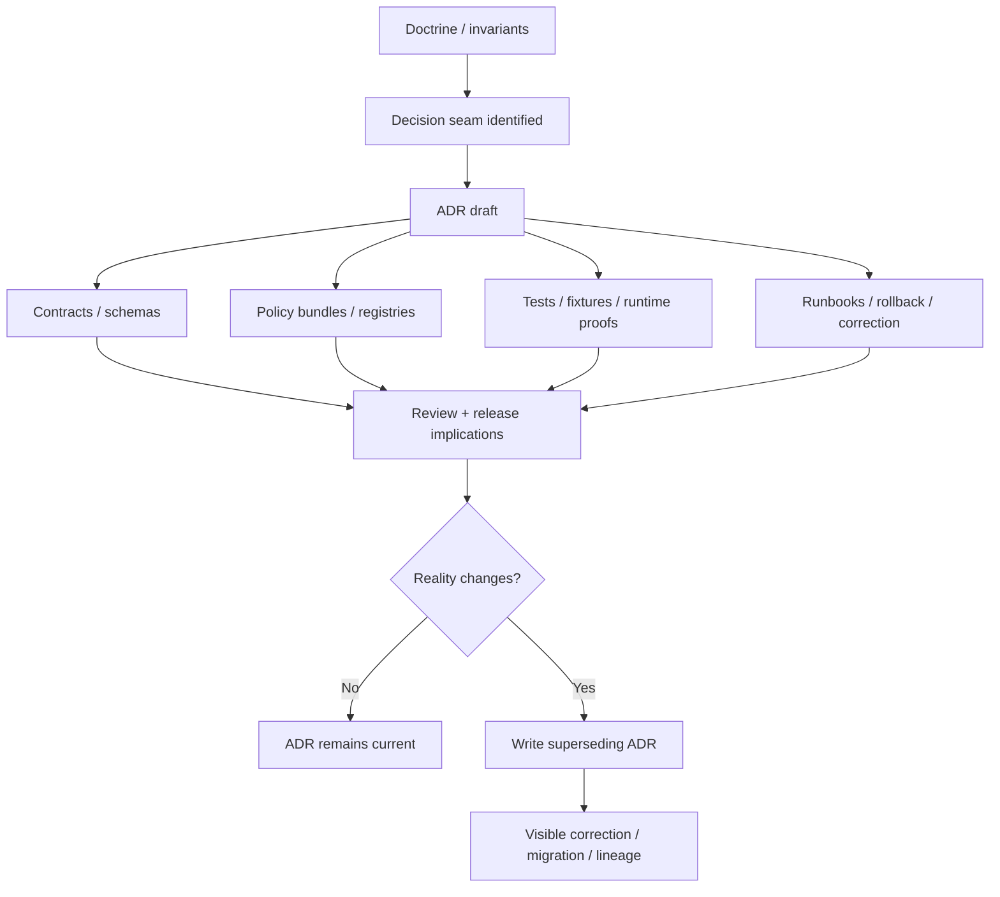

<!-- [KFM_META_BLOCK_V2]
doc_id: kfm://doc/<uuid-needs-verification>
title: Architecture Decision Records (ADR)
type: standard
version: v1
status: review
owners: <owners-needs-verification>
created: <YYYY-MM-DD-needs-verification>
updated: <YYYY-MM-DD-needs-verification>
policy_label: <policy-label-needs-verification>
related: [docs/adr/, docs/runbooks/, contracts/, policy/, tests/]
tags: [kfm, adr, architecture, governance, decision-records]
notes: [current repo tree was not directly mounted in this session; neighboring paths, existing ADR inventory, owners, and first-wave filenames beyond this README need verification]
[/KFM_META_BLOCK_V2] -->

# Architecture Decision Records (ADR)

Governed index, authoring contract, and traceability surface for consequential architecture decisions in KFM.

| Field | Value |
|---|---|
| Status | `review` |
| Owners | `<owners-needs-verification>` |
| Path | `docs/adr/README.md` |
| Role | Directory landing page for ADR authoring, supersession, review, and downstream traceability |


**Quick jump:** [Scope](#scope) · [Repo fit](#repo-fit) · [Accepted inputs](#accepted-inputs) · [Directory tree](#directory-tree) · [Quickstart](#quickstart) · [Usage](#usage) · [Diagram](#diagram) · [Tables](#tables) · [Task list](#task-list) · [FAQ](#faq) · [Appendix](#appendix)

> [!IMPORTANT]
> This README is doctrine-grounded, but the mounted repository tree was **not** directly visible in this session. Only the target path above came from the task input. All other directory inventory, companion files, relative links, and current ADR count are therefore marked **INFERRED**, **PROPOSED**, or **NEEDS VERIFICATION** unless the repo itself confirms them.

---

## Scope

This directory records **consequential architecture decisions** for Kansas Frontier Matrix.

Use an ADR when a decision is expensive to reverse, crosses an authority or trust boundary, changes contract shape, alters policy grammar, changes runtime outcomes, affects release or correction lineage, or materially changes what a public or steward surface is allowed to claim.

This directory is **not** a scrapbook of implementation trivia. It is the durable memory for decisions KFM cannot afford to rediscover every sprint.

### What makes a decision consequential in KFM

A change usually belongs here when it touches one or more of these seams:

- truth-path stages or promotion law
- trust membrane or allowed writes
- authoritative-versus-derived boundaries
- contract families, reason codes, or obligation registries
- route-family obligations for public, steward, review, or runtime surfaces
- Evidence Drawer, Focus, or other trust-visible shell behavior
- correction visibility, supersession, rollback, or stale-state handling
- thin-slice sequencing when ordering itself changes system trust

[Back to top](#architecture-decision-records-adr)

## Repo fit

| Fit | Value | Status |
|---|---|---|
| Path | `docs/adr/README.md` | CONFIRMED target path from task |
| Upstream doctrine | KFM master manuals, replacement-grade blueprint/manual, verification doctrine, UI doctrine, and related canonical architecture references outside this directory | CONFIRMED doctrinal dependency / NEEDS VERIFICATION for exact repo paths |
| Adjacent surfaces | [`../runbooks/`](../runbooks/) · [`../../contracts/`](../../contracts/) · [`../../policy/`](../../policy/) · [`../../tests/`](../../tests/) | PROPOSED relative links / NEEDS VERIFICATION |
| Downstream consequences | Contract waves, policy bundles, fixtures/tests, runbooks, release proofs, correction handling, and trust-visible shell behavior | CONFIRMED doctrinal consequence |
| Hub rule | Keep **one** canonical ADR landing page. If another ADR index exists, make it a thin pointer rather than a competing source of truth. | INFERRED |

### Why this directory matters

KFM doctrine treats architecture as a governed system, not just a code layout. Decisions about truth-path transitions, route families, review artifacts, runtime envelopes, and correction behavior have downstream consequences in contracts, policy bundles, runbooks, tests, and release proofs. ADRs are where that memory stays inspectable.

[Back to top](#architecture-decision-records-adr)

## Accepted inputs

This directory accepts decision records for choices such as:

- authority boundaries and permitted write paths
- truth-path stage transitions and promotion law
- contract families and first schema waves
- route families and trust obligations
- Evidence Drawer, Focus Mode, and runtime outcome rules
- authoritative-versus-derived boundaries
- 2D-first shell rules and burden-bearing 3D exceptions
- reason/obligation registries and policy grammar
- thin-slice sequencing when trust posture changes
- correction, rollback, stale-visible, or supersession behavior

## Exclusions

This directory does **not** own the following, and they should go elsewhere instead:

- transient debugging notes → issue, PR discussion, or local dev notes
- incident-specific operating steps → `docs/runbooks/`
- executable policy bundles and decision logic → `policy/`
- schemas, OpenAPI specs, fixtures, and examples → `contracts/` and related fixture/test directories
- test harnesses and assertions → `tests/`
- raw design exploration with no decision pressure → design note, issue, or experiment record
- end-user help, product walkthroughs, or narrative documentation → product/docs surfaces outside `docs/adr/`

[Back to top](#architecture-decision-records-adr)

## Directory tree

> [!NOTE]
> The tree below is a **PROPOSED starter shape** for this directory. It is intentionally conservative and should be reconciled against the mounted repo before publish.

```text
docs/adr/
├── README.md
├── ADR-001-trust-membrane-and-five-plane-logic.md
├── ADR-002-truth-path-and-promotion-law.md
├── ADR-003-contract-families-and-first-schema-wave.md
├── ADR-004-route-families-and-trust-obligations.md
├── ADR-005-evidence-drawer-focus-and-runtime-outcomes.md
├── ADR-006-correction-lineage-and-surface-states.md
├── ADR-007-hydrology-first-thin-slice.md
├── ADR-008-rights-sensitivity-and-generalization-rules.md
└── ADR-009-authoritative-vs-derived-delivery-boundary.md
```

### Naming rule

```text
ADR-00X-short-kebab-case.md
```

Prefer names that identify the decision seam, not vague summaries.

Good:
- `ADR-003-contract-families-and-first-schema-wave.md`
- `ADR-007-hydrology-first-thin-slice.md`

Avoid:
- `ADR-003-architecture-overview.md`
- `ADR-007-misc-notes.md`

### Status rule for individual ADRs

Use a small, durable status set inside each ADR:

- `proposed`
- `accepted`
- `superseded`
- `rejected`

Do not silently rewrite decision history. A changed decision should usually produce a **new ADR** that supersedes the older one.

[Back to top](#architecture-decision-records-adr)

## Quickstart

1. Confirm that the issue is genuinely architectural.
2. Read this `README.md` and scan existing ADRs before drafting a new one.
3. State the **decision pressure** up front.
4. Record meaningful alternatives, not just the chosen answer.
5. Name the affected contracts, policies, tests, runbooks, and release/correction consequences.
6. State what would prove the decision implemented correctly.
7. State rollback, correction, or supersession triggers.
8. Open a review PR with evidence labels and downstream update notes.

### Minimal author flow

```text
identify decision seam
→ check doctrine + existing ADRs
→ draft ADR
→ name affected contracts / policy / tests / runbooks
→ open PR with evidence labels
→ accept / reject / supersede
```

### PR expectation for ADR changes

A non-trivial ADR change should travel with:

- the decision seam and its pressure
- evidence labels (`CONFIRMED`, `INFERRED`, `PROPOSED`, `UNKNOWN`)
- affected downstream artifacts
- validation and rollback expectations
- explicit note when no contract or test delta is expected
- correction or supersession implications where relevant

[Back to top](#architecture-decision-records-adr)

## Usage

### Read in dependency order, not by date alone

A useful reading order is:

1. this landing page
2. doctrine-shaping ADRs first
3. route / contract / runtime ADRs next
4. slice- or lane-specific ADRs after that
5. superseding ADRs before relying on older ones operationally

### Truth labels used in this directory

| Label | Meaning here | Not the same as |
|---|---|---|
| **CONFIRMED** | Directly supported by visible current-session doctrine or explicit repo/task evidence | A guess about unmounted code |
| **INFERRED** | Conservative structural completion strongly implied by doctrine and needed to close an obvious seam | Verified implementation |
| **PROPOSED** | Recommended target-state naming, structure, or decision sequencing | Something already deployed |
| **UNKNOWN** | Not verified strongly enough in the current session | A gap to smooth away with prose |
| **NEEDS VERIFICATION** | Review-layer warning that a path, owner, artifact, or local convention must be checked before publish | Finalized repo fact |

### Minimum authoring contract for each ADR

| ADR section | What it must answer |
|---|---|
| **Purpose** | What decision is being recorded? |
| **Decision pressure** | What ambiguity, risk, or architectural seam forced the decision? |
| **Decision** | What was chosen? |
| **Alternatives considered** | What serious options were rejected or deferred? |
| **Consequences** | What gets easier, harder, safer, or more constrained? |
| **Downstream impact** | Which contracts, policy bundles, tests, runbooks, or release behaviors change? |
| **Verification** | What proves the decision is implemented correctly? |
| **Rollback / correction** | What happens if this decision proves incomplete, wrong, or unsafe? |
| **Revisit triggers** | What future condition should force reconsideration or supersession? |

### Supersession and correction rule

Do **not** overwrite architecture memory.

When a decision changes:

1. create a new ADR
2. mark the older record as superseded
3. link both directions
4. name migration, rollback, and correction consequences

### Traceability rule

Every meaningful ADR should point to what it changes:

- contracts or schema families
- policy bundles or reason/obligation registries
- tests, fixtures, or runtime proof cases
- runbooks, rollback notes, or correction drills
- risks or mitigations, where a risk register exists

[Back to top](#architecture-decision-records-adr)

## Diagram


```mermaid
flowchart TD
    A[Doctrine / invariants] --> B[Decision seam identified]
    B --> C[ADR draft]
    C --> D[Contracts / schemas]
    C --> E[Policy bundles / registries]
    C --> F[Tests / fixtures / runtime proofs]
    C --> G[Runbooks / rollback / correction]
    D --> H[Review + release implications]
    E --> H
    F --> H
    G --> H
    H --> I{Reality changes?}
    I -->|No| J[ADR remains current]
    I -->|Yes| K[Write superseding ADR]
    K --> L[Visible correction / migration / lineage]
```

[Back to top](#architecture-decision-records-adr)

## Tables

### Doctrine-grounded ADR seams

| Candidate ADR seam | Why it belongs here | Backlog status |
|---|---|---|
| Trust membrane and five-plane logic | It fixes where authority lives and what must not bypass governed interfaces | PROPOSED |
| Truth path and promotion law | It governs stage transitions, release artifacts, and the difference between build and publish | PROPOSED |
| Contract families and first schema wave | It turns doctrine into machine-checkable structures such as `DecisionEnvelope`, `ReviewRecord`, and `CorrectionNotice` | PROPOSED |
| Route families and trust obligations | It stabilizes what catalog, feature, map, evidence, export, Focus, and review surfaces owe the user | PROPOSED |
| Evidence Drawer, Focus, and runtime outcomes | It governs `ANSWER`, `ABSTAIN`, `DENY`, and `ERROR` behavior and keeps trust visible at point of use | PROPOSED |
| Authoritative-versus-derived boundary | It prevents graph, search, tile, cache, scene, or summary layers from becoming silent authority | PROPOSED |
| Correction lineage and surface states | It preserves supersession, withdrawal, stale-visible, generalized, and denied states as first-class behavior | PROPOSED |
| Hydrology-first thin slice | It records why hydrology is the smallest public-safe proof lane and what “end to end” must include | PROPOSED |
| Rights, sensitivity, and generalization rules | It controls exact-location handling, public-safe publication, and steward escalation | PROPOSED |

### Minimum downstream references per ADR

| Downstream surface | What to name explicitly in the ADR | Why |
|---|---|---|
| Contracts / schemas | affected contract family, example payloads, fixture implications | Prevents doctrine drift |
| Policy | reason codes, obligation codes, deny/allow consequences | Makes policy reviewable |
| Tests / fixtures | negative-path cases, invalid fixtures, runtime proof cases | Keeps claims executable |
| Runbooks | publication, rollback, stale-visible, correction, review steps | Aligns ops with doctrine |
| UI / trust surfaces | Evidence Drawer, Focus, export, compare, review visibility changes | Keeps shell behavior honest |
| Release / correction | manifest / proof-pack implications, supersession note, rollback posture | Preserves lineage |

### What usually does **not** need an ADR

| Change type | Usually ADR-worthy? | Why |
|---|---|---|
| Pure code refactor inside a package | Usually no | Prefer code review unless authority or trust behavior changes |
| Cosmetic wording only | No | Keep ADRs high-signal |
| Schema rename with no contract meaning change | Usually no | Note it in changelog or implementation docs instead |
| New governance boundary, route family, or public claim class | Yes | Reversal cost and trust impact are high |
| Thin-slice sequencing that changes what proves the system | Yes | Ordering becomes architecture |
| Rights/sensitivity handling change | Yes | Publication burden changes materially |

[Back to top](#architecture-decision-records-adr)

## Task list

### Definition of done for a new ADR

- [ ] The decision crosses a real architecture, authority, trust, policy, or rollout boundary
- [ ] The decision pressure is explicit
- [ ] At least one meaningful alternative is recorded
- [ ] The chosen decision is stated plainly
- [ ] Affected contracts, policy bundles, tests, and runbooks are named or intentionally scoped out
- [ ] Verification expectations are present
- [ ] Rollback, correction, or supersession implications are present
- [ ] Revisit triggers are present
- [ ] Evidence labels are used honestly
- [ ] If the ADR changes a prior decision, supersession is explicit

[Back to top](#architecture-decision-records-adr)

## FAQ

### When should I write an ADR instead of leaving a note in a PR?

Write an ADR when the decision will still matter after the PR is merged, especially if it changes truth-path behavior, contract shape, route obligations, runtime outcomes, review/promotion law, or correction lineage.

### Can an ADR be edited after acceptance?

Yes for small clarifications, typo fixes, and better links. No for silently changing the decision itself. Changed decisions should usually be handled by a **superseding ADR**.

### What if repo reality disagrees with this README?

Mounted repo reality is stronger for current implementation state once directly verified. Update this README and the affected ADRs incrementally, but keep lineage visible instead of rewriting history as if the older position never existed.

### Should risks link to ADRs?

Yes, when a risk register exists. If a risk is shaped by an architectural choice, the risk and mitigation trail should point back to the relevant ADR.

[Back to top](#architecture-decision-records-adr)

## Appendix

<details>
<summary><strong>ADR core template</strong></summary>

```md
# ADR-XXX — Decision title

**Status:** proposed | accepted | superseded | rejected  
**Date:** YYYY-MM-DD  
**Supersedes:** <none-or-ADR-id>  
**Superseded by:** <none-or-ADR-id>

## Purpose
One sentence stating the decision in operational terms.

## Decision pressure
What ambiguity, risk, or cross-boundary cost forced this decision?

## Context
Relevant doctrine, constraints, stakeholders, assumptions, and current system pressure.

## Alternatives considered
1. Option A
2. Option B
3. Option C
4. Defer / do nothing

## Decision
State the chosen option plainly.

## Consequences
What changes now? What gets easier, harder, safer, or more constrained?

## Affected downstream surfaces
- Contracts / schemas:
- Policy:
- Tests / fixtures:
- Runbooks:
- UI / trust surfaces:
- Release / correction:

## Verification
How will the team know this decision is implemented correctly?

## Rollback / correction
What happens if the decision proves wrong, incomplete, or unsafe?

## Revisit triggers
What evidence, scale change, tool change, or failure mode should force reconsideration?

## Evidence basis
- CONFIRMED:
- INFERRED:
- PROPOSED:
- UNKNOWN:
- NEEDS VERIFICATION:
```

</details>

<details>
<summary><strong>Suggested starter ADR titles</strong></summary>

```text
ADR-001 — Trust membrane and five-plane logic
ADR-002 — Truth path and promotion law
ADR-003 — Contract families and first schema wave
ADR-004 — Route families and trust obligations
ADR-005 — Evidence Drawer, Focus, and runtime outcomes
ADR-006 — Correction lineage and surface states
ADR-007 — Hydrology-first thin slice
ADR-008 — Rights, sensitivity, and generalization rules
ADR-009 — Authoritative-versus-derived delivery boundary
```

All titles above are **PROPOSED** starter candidates, not confirmed repo inventory.

</details>

<details>
<summary><strong>Suggested traceability table columns</strong></summary>

| ADR | Status | Decision seam | Affected contracts | Affected policy | Affected tests | Affected runbooks | Supersedes | Superseded by | Last reviewed |
|---|---|---|---|---|---|---|---|---|---|

</details>

[Back to top](#architecture-decision-records-adr)