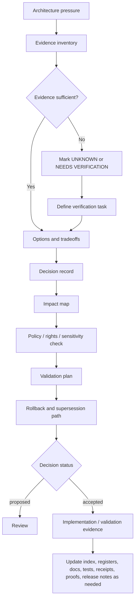

<!-- [KFM_META_BLOCK_V2]
doc_id: kfm://doc/NEEDS-VERIFICATION-docs-adr-readme
title: Architecture Decision Records
type: standard
version: v1
status: review
owners: OWNER_TBD_NEEDS_VERIFICATION
created: NEEDS_VERIFICATION-YYYY-MM-DD
updated: 2026-05-06
policy_label: NEEDS_VERIFICATION
related: [../../README.md, ../README.md, ./ADR-TEMPLATE.md, ./ADR-0001-schema-home.md, ./ADR-0002-responsibility-root-monorepo.md, ../registers/DRIFT_REGISTER.md]
tags: [kfm, adr, architecture-decision, governance, evidence, rollback, supersession]
notes: [Directory README for KFM Architecture Decision Records. Live repository inventory, owners, created date, policy label, ADR numbering policy, CODEOWNERS, and CI enforcement remain NEEDS VERIFICATION before this index is marked stable.]
[/KFM_META_BLOCK_V2] -->

<a id="top"></a>

# Architecture Decision Records

Directory index and governance guide for Kansas Frontier Matrix architecture decisions.

<div align="left">


</div>

> [!IMPORTANT]
> **Target path:** `docs/adr/README.md`  
> **Status:** active directory index / coverage `NEEDS VERIFICATION`  
> **Owners:** `OWNER_TBD_NEEDS_VERIFICATION`  
> **Primary job:** help maintainers find, write, review, supersede, and reconcile KFM Architecture Decision Records without turning proposed designs into implementation proof.  
> **Trust rule:** an ADR records a decision and review burden. Enforcement still requires repository evidence such as validators, fixtures, workflows, receipts, proofs, release artifacts, runtime logs, or directly inspected implementation files.

## Quick jumps

| Start here | Maintain the index | Review discipline |
|---|---|---|
| [Scope](#scope) | [ADR inventory](#adr-inventory) | [Review checklist](#review-checklist) |
| [Repo fit](#repo-fit) | [Naming and numbering](#naming-and-numbering) | [Evidence and truth labels](#evidence-and-truth-labels) |
| [Accepted inputs](#accepted-inputs) | [Decision flow](#decision-flow) | [Rollback and supersession](#rollback-and-supersession) |
| [Exclusions](#exclusions) | [Inventory commands](#inventory-commands) | [Open verification](#open-verification) |

---

## Scope

`docs/adr/` is the human-facing decision ledger for KFM architecture choices.

Use this directory for durable decisions that materially affect repository structure, source authority, evidence flow, contracts, schemas, policy homes, public-client boundaries, release posture, correction lineage, rollback behavior, UI trust surfaces, governed AI boundaries, or other architecture-significant choices.

ADRs in KFM should answer five questions clearly:

1. **What was decided?**
2. **What evidence supports the decision?**
3. **What remains unverified?**
4. **What KFM trust boundary or lifecycle rule does it protect?**
5. **How can it be validated, superseded, corrected, or rolled back?**

> [!NOTE]
> KFM uses ADRs as part of the governance surface. They are not status theater, implementation logs, or generic essays. A good ADR makes future review easier by preserving evidence, tradeoffs, rejected options, validation burden, and rollback path.

[Back to top](#top)

---

## Repo fit

| Relationship | Path | Status | Role |
|---|---|---:|---|
| This index | `docs/adr/README.md` | `TARGET / NEEDS VERIFICATION IN ACTIVE CHECKOUT` | Directory landing page for ADR navigation and review rules. |
| Project landing page | [`../../README.md`](../../README.md) | `NEEDS VERIFICATION` | Should explain KFM identity, trust law, responsibility roots, and proof-slice posture. |
| Docs root | [`../README.md`](../README.md) | `NEEDS VERIFICATION` | Should link to this ADR index if the docs root is active. |
| ADR template | [`./ADR-TEMPLATE.md`](./ADR-TEMPLATE.md) | `LISTED / NEEDS VERIFICATION` | Standard ADR structure and review checklist if present and current. |
| Schema-home decision | [`./ADR-0001-schema-home.md`](./ADR-0001-schema-home.md) | `LISTED / NEEDS VERIFICATION` | Machine-schema authority decision or proposal. |
| Responsibility-root decision | [`./ADR-0002-responsibility-root-monorepo.md`](./ADR-0002-responsibility-root-monorepo.md) | `LISTED / NEEDS VERIFICATION` | Responsibility-root layout decision if present and accepted. |
| Drift register | [`../registers/DRIFT_REGISTER.md`](../registers/DRIFT_REGISTER.md) | `LISTED / NEEDS VERIFICATION` | Useful destination for unresolved authority drift if active. |

### Why ADRs belong under `docs/`

Directory discipline in KFM treats root folders as responsibility boundaries, not topic buckets. ADRs are human-facing governance records, so they belong under `docs/adr/` rather than as a new root-level decision folder.

### Upstream inputs

This directory is downstream of:

- KFM doctrine and trust law;
- Directory Rules and responsibility-root discipline;
- current repository evidence;
- accepted ADRs and successor ADRs;
- source authority, policy, schema, release, correction, and rollback doctrine.

### Downstream consumers

This directory should inform:

- root and directory READMEs;
- `contracts/`, `schemas/`, `policy/`, `tests/`, `fixtures/`, `tools/`, `data/`, and `release/` documentation;
- reviewers deciding whether a change needs an ADR;
- validators or CI checks that enforce ADR-backed placement rules;
- release, rollback, and correction reviews when decisions affect public-facing claims.

[Back to top](#top)

---

## Accepted inputs

Place or maintain these in `docs/adr/`:

- accepted, proposed, rejected, withdrawn, deprecated, or superseded Architecture Decision Records;
- ADR templates;
- ADR indexes and review guides;
- decision records for repository structure, schema home, contract home, policy home, source authority, evidence closure, release boundaries, correction, rollback, governed UI, map rendering, local exposure, and governed AI runtime boundaries;
- decision records for domain-lane admission when the decision changes cross-domain governance, publication, source, policy, or lifecycle behavior;
- supersession notes when an ADR is replaced by a stronger ADR or direct implementation evidence;
- small supporting appendices only when they clarify decision review and do not become a second policy, schema, source, or proof home.

[Back to top](#top)

---

## Exclusions

Do **not** use `docs/adr/` as the primary home for the following:

| Excluded item | Put it here instead | Why |
|---|---|---|
| Machine-checkable schemas | `schemas/` or the ADR-accepted schema home | ADR prose is not machine validation authority. |
| Semantic contract docs | `contracts/` | Contracts explain object meaning and compatibility. |
| Policy rules | `policy/` or the verified policy home | Policy must remain executable or policy-owned. |
| Source descriptors and source registries | `data/registry/`, `control_plane/`, or verified source registry homes | Source authority needs structured records. |
| Receipts, proofs, release manifests, rollback cards | `data/receipts/`, `data/proofs/`, `release/`, or verified proof/release homes | Emitted trust objects are not ADR text. |
| Runtime code, app code, validators, scripts | `apps/`, `packages/`, `tools/`, `scripts/` | ADRs decide; implementation belongs in implementation roots. |
| Exploratory ideas or speculative source packets | `docs/intake/`, `docs/reports/`, or verified idea-intake/archive homes | Exploratory material must not become governing by placement. |
| Emergency or life-safety instructions | Official source guidance, not KFM ADRs | KFM ADRs are governance records, not alerting instructions. |
| Private chain-of-thought or direct model prompts | Governed AI contracts, public-safe summaries, and receipts only | AI remains interpretive and evidence-subordinate. |

[Back to top](#top)

---

## Directory tree

> [!WARNING]
> This tree is an **expected directory shape**, not proof of the active checkout. Re-run [inventory commands](#inventory-commands) before treating any file as present.

```text
docs/adr/
├── README.md
├── ADR-TEMPLATE.md
├── ADR-0001-schema-home.md
├── ADR-0002-responsibility-root-monorepo.md
└── ADR-*.md
```

### Minimum healthy state

A healthy ADR directory has:

- one index that clearly distinguishes decision state from enforcement state;
- one template or documented local ADR structure;
- successor links for superseded decisions;
- a naming or numbering policy;
- a way to reconcile ADRs with registers, schemas, contracts, policies, fixtures, tests, receipts, proofs, and release notes.

[Back to top](#top)

---

## Maintainer quickstart

Run these steps before adding, editing, accepting, or superseding an ADR.

1. **Inventory current ADRs.** Do not trust a stale index.
2. **Check adjacent authority.** Look for related docs, registers, schemas, contracts, policies, tests, and release artifacts.
3. **Label truth narrowly.** Separate accepted decision, proposed implementation, and verified enforcement.
4. **Map impact.** Identify affected roots and trust boundaries.
5. **Define validation.** State what would prove the decision is implemented.
6. **Define rollback.** State how the decision can be reversed without deleting history.
7. **Update this index.** Keep navigation and supersession visible.

[Back to top](#top)

---

## ADR inventory

> [!WARNING]
> This inventory is **not guaranteed exhaustive**. Treat entries below as `LISTED` or `SURFACED` until the active checkout is inspected. Do not mark coverage complete until the commands in [Inventory commands](#inventory-commands) have been run on the branch where this README will be committed.

### Foundation and directory control

| ADR | Decision area | Status in this index | Notes |
|---|---|---:|---|
| [`ADR-TEMPLATE.md`](./ADR-TEMPLATE.md) | ADR authoring standard | `LISTED / NEEDS VERIFICATION` | Use as the default ADR structure only if it is present and not superseded. |
| [`ADR-0001-schema-home.md`](./ADR-0001-schema-home.md) | Canonical schema home | `LISTED / NEEDS VERIFICATION` | Verify decision status and acceptance gates before treating schema placement as enforced. |
| [`ADR-0002-responsibility-root-monorepo.md`](./ADR-0002-responsibility-root-monorepo.md) | Responsibility-root layout | `LISTED / NEEDS VERIFICATION` | Verify that it is accepted and current before using it as placement authority. |
| `ADR-0014-truth-path.md` | Truth path | `SURFACED / NEEDS VERIFICATION` | Verify title, file existence, status, and relationship to current trust-law docs. |
| `ADR-0015-promotion-contract.md` | Promotion contract | `SURFACED / NEEDS VERIFICATION` | Verify whether this is active, superseded, or merged into release-gate ADRs. |
| `ADR-0016-spec-hash.md` | Deterministic spec hash | `SURFACED / NEEDS VERIFICATION` | Verify relationship to receipt, proof, release, and content-hash docs. |
| `ADR-0017-meta-block-v2.md` | KFM Meta Block v2 | `SURFACED / NEEDS VERIFICATION` | Verify whether it governs all standard docs or only selected docs. |

### Core trust objects and publication

| ADR | Decision area | Status in this index | Notes |
|---|---|---:|---|
| `ADR-0205-pr-002-evidence-closure.md` | Evidence closure | `SURFACED / NEEDS VERIFICATION` | Verify whether it is PR-specific or still active governance. |
| `ADR-0203-source-ledger-authority.md` | Source ledger authority | `SURFACED / NEEDS VERIFICATION` | Verify source-ledger canonical home and successor links. |
| `ADR-0204-evidencebundle-contract.md` | EvidenceBundle contract | `SURFACED / NEEDS VERIFICATION` | Verify schema, contract, policy, and EvidenceRef alignment. |
| `ADR-0005-promotion-gate.md` | Promotion gate | `SURFACED / NEEDS VERIFICATION` | Verify relation to release manifests and policy obligation gates. |
| `ADR-0011-catalog-proof-release-separation.md` | Catalog / proof / release separation | `SURFACED / NEEDS VERIFICATION` | Keep prominent because KFM separates catalog, proof, release, publication, and rollback. |
| `ADR-0018-prov-stac-dcat-catalog-mapping.md` | Catalog standards mapping | `SURFACED / NEEDS VERIFICATION` | Verify current STAC/DCAT/PROV profile alignment. |
| `ADR-0241-policy-obligation-engine-and-release-gate.md` | Policy obligation and release gate | `SURFACED / NEEDS VERIFICATION` | Verify whether this supersedes older policy-home or promotion-gate decisions. |

### Policy, security, sensitivity, and consent

| ADR | Decision area | Status in this index | Notes |
|---|---|---:|---|
| `ADR-0201-policy-home.md` | Policy home | `SURFACED / NEEDS VERIFICATION` | Renumbered to restore sequence before ADR-0202; verify status and supersession links are current. |
| `ADR-0009-sensitive-location-policy.md` | Sensitive location policy | `SURFACED / NEEDS VERIFICATION` | High-risk public exposure decision; verify policy and domain links. |
| `ADR-0010-local-exposure-security.md` | Local exposure security | `SURFACED / NEEDS VERIFICATION` | Verify runtime, security docs, and enforcement evidence. |
| `ADR-0013-policy-home-authority.md` | Policy-home authority | `SURFACED / NEEDS VERIFICATION` | Verify relationship to `ADR-0201-policy-home.md`. |
| `ADR-0427-consent-vc-and-revocation-delta.md` | Consent, VC, revocation delta | `SURFACED / NEEDS VERIFICATION` | Sensitive governance area; verify owners and policy label before public use. |

### UI, map, runtime, and governed AI

| ADR | Decision area | Status in this index | Notes |
|---|---|---:|---|
| `ADR-0003-maplibre-renderer-boundary.md` | MapLibre renderer boundary | `SURFACED / NEEDS VERIFICATION` | Verify relationship to MapLibre operating architecture docs. |
| `ADR-0206-maplibre-layer-manifest.md` | LayerManifest / MapLibre layer governance | `SURFACED / NEEDS VERIFICATION` | Verify schema and layer registry links. |
| `ADR-0207-governed-ai-runtime-envelope.md` | Governed AI runtime envelope | `SURFACED / NEEDS VERIFICATION` | Verify runtime envelope schema, citation validation, and AI receipt links. |

### Hydrology proof lane

| ADR | Decision area | Status in this index | Notes |
|---|---|---:|---|
| `ADR-0303-hydrology-source-descriptor-activation-gates.md` | Hydrology source activation gates | `SURFACED / NEEDS VERIFICATION` | Verify source registry and rights gate links. |
| `ADR-0304-hydrology-first-proof-lane.md` | Hydrology as first proof lane | `SURFACED / NEEDS VERIFICATION` | Verify relation to current proof-slice docs. |
| `ADR-0305-hydrology-source-documentation-verification.md` | Hydrology source documentation verification | `SURFACED / NEEDS VERIFICATION` | Verify whether this collides with another `ADR-0305` or is a distinct successor. |
| `ADR-0306-hydrology-connector-contract-and-offline-simulation.md` | Hydrology connector and offline simulation | `SURFACED / NEEDS VERIFICATION` | Verify connector test evidence and fixture homes. |
| `ADR-0307-hydrology-wbd-metadata-probe.md` | WBD metadata probe | `SURFACED / NEEDS VERIFICATION` | Verify whether current source probes supersede it. |
| `ADR-0310-hydrology-wbd-terms-rights-review.md` | WBD rights review | `SURFACED / NEEDS VERIFICATION` | Verify current rights/source terms. |
| `ADR-0311-hydrology-synthetic-release-governance.md` | Synthetic hydrology release governance | `SURFACED / NEEDS VERIFICATION` | Verify release, proof, and published-data guardrails. |

### Templates and domain-lane governance

| ADR | Decision area | Status in this index | Notes |
|---|---|---:|---|
| `ADR-0208-domain-lane-template.md` | Domain-lane ADR template | `SURFACED / NEEDS VERIFICATION` | Verify whether this is active or superseded by `ADR-TEMPLATE.md`. |

[Back to top](#top)

---

## Naming and numbering

KFM ADR filenames may show multiple patterns. Treat numbers as helpful labels, not as the sole source of identity, until the ADR registry is verified.

| Pattern | Example | Status | Guidance |
|---|---|---:|---|
| Canonical ADR prefix | `ADR-0001-schema-home.md` | `LISTED / NEEDS VERIFICATION` | Preferred for new repo-wide ADRs only if no newer convention is accepted. |
| Numeric-only legacy prefix | `0001-truth-path.md` | `SURFACED / NEEDS VERIFICATION` | Do not rename without successor links and migration notes. |
| Topic-specific ADR prefix | `ADR-PROV-STAC-DCAT-CATALOG-MAPPING.md` | `SURFACED / NEEDS VERIFICATION` | Preserve until a verified successor or registry entry resolves it. |
| Date-ish or packet-derived ID | `ADR-0427-consent-vc-and-revocation-delta.md` | `SURFACED / NEEDS VERIFICATION` | Verify whether ID encodes date, packet, or decision family. |
| Duplicate numeric prefixes | multiple `ADR-0202`, `ADR-0305`, etc. | `SURFACED / CONFLICT WATCH` | Do not assume number uniqueness until a registry resolves collisions. |

### New ADR naming rule

Use the verified repository convention. If no newer convention is accepted, use this conservative form:

```text
docs/adr/ADR-<nnnn>-<short-kebab-title>.md
```

For cross-domain, policy-significant, or source-sensitive ADRs, keep the title short and put nuance inside the ADR body rather than the filename.

> [!CAUTION]
> Do not rename existing ADR files just to normalize style. ADR filenames are link targets. Renames require successor links, migration notes, index updates, and reviewer approval.

[Back to top](#top)

---

## Evidence and truth labels

KFM ADRs should use the narrowest truthful label available.

| Label | Use in ADRs |
|---|---|
| `CONFIRMED` | Verified from current repository evidence, current command output, surfaced project docs, tests, schemas, manifests, receipts, proofs, logs, workflows, or direct source content. |
| `INFERRED` | Conservative synthesis strongly implied by evidence but not direct proof. |
| `PROPOSED` | Decision, path, implementation, schema, policy, validator, or process recommendation not verified as current behavior. |
| `UNKNOWN` | Not verified strongly enough to state as fact. |
| `NEEDS VERIFICATION` | A concrete check can retire uncertainty. |
| `CONFLICTED` | Evidence, naming, path, authority, or source role materially disagrees or is ambiguous. |
| `LINEAGE` | Historically important prior material that informs continuity but is not current implementation proof. |
| `SUPERSEDED` | Replaced by stronger repo evidence, successor ADR, or newer accepted doctrine. |
| `DENY`, `ABSTAIN`, `ERROR` | System outcomes, not rhetorical emphasis. Use when describing runtime, policy, or promotion behavior. |

> [!IMPORTANT]
> An ADR can be `accepted` as a decision while implementation enforcement remains `NEEDS VERIFICATION`. Keep those states separate.

[Back to top](#top)

---

## Decision flow


```mermaid
flowchart TD
  A[Architecture pressure] --> B[Evidence inventory]
  B --> C{Evidence sufficient?}
  C -->|No| D[Mark UNKNOWN or NEEDS VERIFICATION]
  D --> E[Define verification task]
  C -->|Yes| F[Options and tradeoffs]
  E --> F
  F --> G[Decision record]
  G --> H[Impact map]
  H --> I[Policy / rights / sensitivity check]
  I --> J[Validation plan]
  J --> K[Rollback and supersession path]
  K --> L{Decision status}
  L -->|proposed| M[Review]
  L -->|accepted| N[Implementation / validation evidence]
  N --> O[Update index, registers, docs, tests, receipts, proofs, release notes as needed]
```

### ADR status lifecycle

| Status | Meaning | Minimum review burden |
|---|---|---|
| `proposed` | Decision is under review and not yet governing. | Evidence basis, options, risks, and open verification. |
| `accepted` | Decision governs its stated scope. | Review approval plus impact map, validation plan, and rollback path. |
| `rejected` | Decision was considered and declined. | Rejected rationale and reopen conditions. |
| `superseded` | Replaced by a newer ADR or stronger evidence. | Successor link and migration/compatibility notes. |
| `withdrawn` | Removed before governing or because scope changed. | Reason and historical note. |
| `deprecated` | Historical but should not be extended. | Replacement or caution note. |

[Back to top](#top)

---

## When a change needs an ADR

Create or update an ADR when a change affects a KFM trust boundary.

| Decision area | ADR usually required? | Examples |
|---|---:|---|
| Root layout or responsibility roots | Yes | New top-level root, compatibility-root migration, domain-root exception. |
| Canonical schema, contract, or policy home | Yes | Moving machine schemas, splitting `contracts/` and `schemas/`, policy-home changes. |
| Evidence closure or citation behavior | Yes | EvidenceBundle shape, EvidenceRef resolution rules, cite-or-abstain behavior. |
| Publication, release, proof, or rollback | Yes | Promotion gates, ReleaseManifest, proof pack, rollback card, correction lineage. |
| Public-client trust boundary | Yes | Public API access pattern, map shell truth states, Evidence Drawer, Focus Mode. |
| Sensitive data release posture | Yes | Rare species, archaeology, living-person data, DNA/genomic data, critical infrastructure, exact locations. |
| Runtime AI boundary | Yes | Model adapters, runtime envelopes, citation validation, AI receipts, direct model access. |
| Domain-lane internal modeling only | Sometimes | Required if it changes shared governance, public surfaces, source authority, or lifecycle behavior. |
| Small copy edit | Usually no | Typo, link fix, wording improvement with no decision change. |

> [!TIP]
> When in doubt, write an ADR stub with `proposed` status and a short evidence gap. It is safer to close a stub than to hide an architecture-significant decision in a casual README edit.

[Back to top](#top)

---

## Review checklist

Before accepting an ADR, reviewers should be able to check every box.

- [ ] Decision scope is explicit.
- [ ] Evidence basis is listed and truth-labeled.
- [ ] Unsupported claims are marked `PROPOSED`, `UNKNOWN`, or `NEEDS VERIFICATION`.
- [ ] Affected responsibility roots are named.
- [ ] KFM lifecycle impact is described: `RAW -> WORK/QUARANTINE -> PROCESSED -> CATALOG/TRIPLET -> PUBLISHED`.
- [ ] Public-client and UI trust impact is described when relevant.
- [ ] Policy, rights, sensitivity, sovereignty, living-person, cultural, infrastructure, or exact-location risks are considered when relevant.
- [ ] Validation plan names concrete evidence that would prove enforcement.
- [ ] Rollback or supersession path is described.
- [ ] Related registers, docs, schemas, contracts, policies, fixtures, tests, receipts, proofs, release manifests, or correction notes are listed.
- [ ] New ADR appears in [ADR inventory](#adr-inventory).
- [ ] Superseded ADRs keep lineage and successor links.

[Back to top](#top)

---

## Rollback and supersession

### Supersession rules

When a decision is replaced:

1. Mark the old ADR `superseded` or add a visible supersession note.
2. Link to the successor ADR.
3. Preserve the old ADR as lineage.
4. Update this index.
5. Update any affected register, README, schema, policy, test, validator, source descriptor, receipt, proof, release manifest, correction notice, or rollback card.
6. Explain whether the successor is a documentation correction, implementation migration, policy change, source-authority change, public-surface change, or release-state change.

### Rollback rules

When an ADR-backed implementation must be rolled back:

1. Identify the release, proof, receipt, schema, policy, source artifact, or public surface affected.
2. Preserve rollback evidence.
3. Avoid silent file moves that hide prior authority.
4. Restore or block public surfaces before repairing internal conveniences.
5. Record the correction or withdrawal path when public claims were affected.

> [!WARNING]
> A rollback that deletes decision history weakens KFM. Preserve decision lineage even when implementation is reverted.

[Back to top](#top)

---

## Inventory commands

Run these from the repository root on the branch where the ADR index will be committed.

```bash
# Confirm repository context.
git rev-parse --show-toplevel
git status --short
git branch --show-current

# List ADR files.
find docs/adr -maxdepth 1 -type f -name '*.md' | sort

# Show ADR status-like lines.
grep -RInE '^(status:|Status:|## Status|# ADR|title:|superseded|Superseded|decision|Decision)' docs/adr || true

# Find incoming ADR links from docs.
grep -RInE 'docs/adr/|ADR-[0-9A-Za-z_-]+\.md|ADR-TEMPLATE\.md' README.md docs contracts schemas policy tests tools data release 2>/dev/null || true

# Look for likely numbering collisions.
find docs/adr -maxdepth 1 -type f -name 'ADR-*.md' \
  | sed -E 's#.*/(ADR-[0-9]{4}).*#\1#' \
  | sort \
  | uniq -d
```

If the repository uses a different search tool or file layout, adapt the commands and record the adaptation in [Open verification](#open-verification).

[Back to top](#top)

---

## Open verification

| Item | Status | Why it matters |
|---|---:|---|
| ADR owners / CODEOWNERS | `NEEDS VERIFICATION` | Review burden should be explicit before this index is stable. |
| Complete ADR inventory | `NEEDS VERIFICATION` | The supplied draft lists surfaced ADRs, but active-checkout coverage is not proven here. |
| ADR numbering policy | `NEEDS VERIFICATION` | Duplicate numeric prefixes may exist and need registry treatment. |
| ADR status registry | `NEEDS VERIFICATION` | Individual files may use different status blocks and maturity language. |
| Supersession map | `NEEDS VERIFICATION` | Policy-home, promotion, hydrology, and evidence-closure ADRs may overlap. |
| CI enforcement | `UNKNOWN` | ADR-backed checks must be proven by workflow/test evidence before claimed. |
| Metadata block policy | `NEEDS VERIFICATION` | ADRs may use KFM Meta Block v2, but directory README requirements should be confirmed. |
| Policy label for this index | `NEEDS VERIFICATION` | Do not infer public/restricted classification from path alone. |
| Related registers | `NEEDS VERIFICATION` | Drift, authority, object-family, and source-ledger registers should cross-link if active. |
| Current branch inventory | `NEEDS VERIFICATION` | Re-run inventory on the branch where this README will be committed. |
| Relative links in this README | `NEEDS VERIFICATION` | Links should be checked against the active checkout before commit. |

[Back to top](#top)

---

## Maintainer note

The root should stay boring; the ADR directory should stay traceable.

Do not make every disagreement an ADR. Do make every governance-significant decision inspectable before it becomes hard to unwind.
