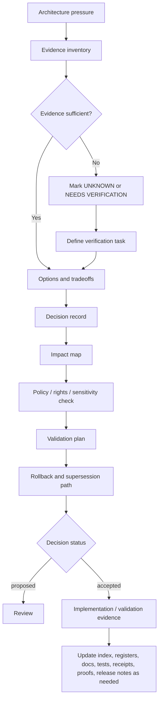

<!-- [KFM_META_BLOCK_V2]
doc_id: kfm://doc/NEEDS-VERIFICATION-docs-adr-readme
title: Architecture Decision Records
type: standard
version: v1
status: review
owners: OWNER_TBD_NEEDS_VERIFICATION
created: NEEDS_VERIFICATION-YYYY-MM-DD
updated: 2026-05-06
policy_label: NEEDS_VERIFICATION
related: [../../README.md, ../README.md, ./ADR-TEMPLATE.md, ./ADR-0001-schema-home.md, ./ADR-0002-responsibility-root-monorepo.md, ../registers/DRIFT_REGISTER.md]
tags: [kfm, adr, architecture-decision, governance, evidence, rollback, supersession]
notes: [Directory README for KFM Architecture Decision Records. Existing index was thin and listed only two foundational ADRs; connector evidence surfaced additional ADR files, so inventory completeness remains NEEDS VERIFICATION. Owners, created date, policy label, ADR numbering policy, CODEOWNERS, and CI enforcement must be verified before marking this index stable.]
[/KFM_META_BLOCK_V2] -->

<a id="top"></a>

# Architecture Decision Records

Directory index and governance guide for Kansas Frontier Matrix architecture decisions.

<div align="left">


</div>

> [!IMPORTANT]
> **Path:** `docs/adr/README.md`  
> **Status:** active directory index / coverage `NEEDS VERIFICATION`  
> **Owners:** `OWNER_TBD_NEEDS_VERIFICATION`  
> **Primary job:** help maintainers find, write, review, supersede, and reconcile KFM Architecture Decision Records without turning proposed designs into implementation proof.  
> **Do not use this index as proof that a decision is enforced.** ADRs record architecture decisions and review burden; enforcement still requires repository files, validators, fixtures, workflows, receipts, proofs, runtime evidence, or release artifacts.

## Quick jumps

| Start here | Maintain the index | Review discipline |
|---|---|---|
| [Scope](#scope) | [ADR inventory](#adr-inventory) | [Review checklist](#review-checklist) |
| [Repo fit](#repo-fit) | [Naming and numbering](#naming-and-numbering) | [Evidence and truth labels](#evidence-and-truth-labels) |
| [Accepted inputs](#accepted-inputs) | [Decision flow](#decision-flow) | [Rollback and supersession](#rollback-and-supersession) |
| [Exclusions](#exclusions) | [Inventory commands](#inventory-commands) | [Open verification](#open-verification) |

---

## Scope

`docs/adr/` stores KFM Architecture Decision Records: durable decisions that materially affect repository structure, source authority, evidence flow, contracts, schemas, policies, public-client boundaries, release posture, correction lineage, rollback behavior, UI trust surfaces, governed AI boundaries, or other architecture-significant choices.

ADRs in KFM should answer five questions clearly:

1. **What was decided?**
2. **What evidence supports the decision?**
3. **What remains unverified?**
4. **What KFM trust boundary or lifecycle rule does it protect?**
5. **How can it be validated, superseded, corrected, or rolled back?**

> [!NOTE]
> KFM uses ADRs as part of the governance surface. They are not status theater, implementation logs, or generic essays. A good ADR makes future review easier by preserving evidence, tradeoffs, rejected options, validation burden, and rollback path.

[Back to top](#top)

---

## Repo fit

| Relationship | Path | Status | Role |
|---|---|---:|---|
| This index | `docs/adr/README.md` | `CONFIRMED path / revised content PROPOSED` | Directory landing page for ADR navigation and review rules. |
| Project landing page | [`../../README.md`](../../README.md) | `CONFIRMED` | KFM identity, trust law, responsibility roots, proof-slice posture. |
| Docs root | [`../README.md`](../README.md) | `CONFIRMED` | Minimal docs scaffold; should link back here when expanded. |
| ADR template | [`./ADR-TEMPLATE.md`](./ADR-TEMPLATE.md) | `CONFIRMED` | Standard ADR structure and review checklist. |
| Schema-home decision | [`./ADR-0001-schema-home.md`](./ADR-0001-schema-home.md) | `CONFIRMED` | Machine-schema authority proposal and acceptance gates. |
| Responsibility-root decision | [`./ADR-0002-responsibility-root-monorepo.md`](./ADR-0002-responsibility-root-monorepo.md) | `CONFIRMED` | Accepted root-layout decision. |
| Drift register | [`../registers/DRIFT_REGISTER.md`](../registers/DRIFT_REGISTER.md) | `CONFIRMED by connector search / NEEDS VERIFICATION for current use` | Useful destination for unresolved authority drift. |

### Upstream inputs

This directory is downstream of:

- KFM doctrine and trust law;
- Directory Rules and responsibility-root discipline;
- project-wide source authority, policy, schema, release, and correction doctrine;
- current repository evidence;
- accepted ADRs and successor ADRs.

### Downstream consumers

This directory should inform:

- root and directory READMEs;
- `contracts/`, `schemas/`, `policy/`, `tests/`, `fixtures/`, `tools/`, `data/`, and `release/` documentation;
- reviewers deciding whether a change needs an ADR;
- validators or CI checks that enforce ADR-backed placement rules;
- release, rollback, and correction reviews when decisions affect public-facing claims.

[Back to top](#top)

---

## Accepted inputs

Place or maintain these in `docs/adr/`:

- accepted, proposed, rejected, withdrawn, deprecated, or superseded Architecture Decision Records;
- ADR templates;
- ADR indexes and review guides;
- decision records for repository structure, schema home, contract home, policy home, source authority, evidence closure, release boundaries, correction, rollback, governed UI, map rendering, local exposure, and governed AI runtime boundaries;
- decision records for domain-lane admission when the decision changes cross-domain governance, publication, source, policy, or lifecycle behavior;
- supersession notes when an ADR is replaced by a stronger ADR or direct implementation evidence;
- small supporting appendices only when they clarify decision review and do not become a second policy, schema, source, or proof home.

[Back to top](#top)

---

## Exclusions

Do **not** use `docs/adr/` as the primary home for the following:

| Excluded item | Put it here instead | Why |
|---|---|---|
| Machine-checkable schemas | `schemas/` or the ADR-accepted schema home | ADR prose is not machine validation authority. |
| Semantic contract docs | `contracts/` | Contracts explain object meaning and compatibility. |
| Policy rules | `policy/` | Policy must remain executable or policy-owned. |
| Source descriptors and source registries | `data/registry/`, `control_plane/`, or verified source registry homes | Source authority needs structured records. |
| Receipts, proofs, release manifests, rollback cards | `data/receipts/`, `data/proofs/`, `release/`, or verified proof/release homes | Emitted trust objects are not ADR text. |
| Runtime code, app code, validators, scripts | `apps/`, `packages/`, `tools/`, `scripts/` | ADRs decide; implementation belongs in implementation roots. |
| Exploratory ideas or speculative source packets | `docs/intake/`, `docs/reports/`, or verified idea-intake/archive homes | Exploratory material must not become governing by placement. |
| Emergency or life-safety instructions | Official source guidance, not KFM ADRs | KFM ADRs are governance records, not alerting instructions. |
| Private chain-of-thought or direct model prompts | Governed AI contracts, public-safe summaries, and receipts only | AI remains interpretive and evidence-subordinate. |

[Back to top](#top)

---

## ADR inventory

> [!WARNING]
> This inventory is **not yet guaranteed exhaustive**. The previous index listed only `ADR-0001-schema-home.md` and `ADR-0002-responsibility-root-monorepo.md`; connector search surfaced additional ADR files and naming patterns. Re-run the inventory commands below against the active checkout before marking coverage complete.

### Foundational and directory-control ADRs

| ADR | Decision area | Status in this index | Notes |
|---|---|---:|---|
| [`ADR-TEMPLATE.md`](./ADR-TEMPLATE.md) | ADR authoring standard | `CONFIRMED` | Use as the default ADR structure unless an accepted local convention supersedes it. |
| [`ADR-0001-schema-home.md`](./ADR-0001-schema-home.md) | Canonical schema home | `CONFIRMED / proposed-draft decision` | Proposes `schemas/contracts/v1/` as canonical machine-contract home; acceptance gates remain visible. |
| [`ADR-0002-responsibility-root-monorepo.md`](./ADR-0002-responsibility-root-monorepo.md) | Responsibility-root layout | `CONFIRMED / accepted decision` | Establishes that root folders are repo-wide responsibility boundaries, not topic buckets. |
| `0001-truth-path.md` | Truth path | `SURFACED / NEEDS VERIFICATION` | Verify title, status, and relationship to current trust-law docs. |
| `0002-promotion-contract.md` | Promotion contract | `SURFACED / NEEDS VERIFICATION` | Verify whether superseded by promotion-gate or release ADRs. |
| `0003-spec-hash.md` | Deterministic spec hash | `SURFACED / NEEDS VERIFICATION` | Verify relationship to receipt/proof/release hashing docs. |
| `0004-meta-block-v2.md` | KFM Meta Block v2 | `SURFACED / NEEDS VERIFICATION` | Verify whether it governs all standard docs or only selected docs. |

### Core trust-object and publication ADRs

| ADR | Decision area | Status in this index | Notes |
|---|---|---:|---|
| `ADR-0002-pr-002-evidence-closure.md` | Evidence closure | `SURFACED / NEEDS VERIFICATION` | Verify whether it is PR-specific or still active governance. |
| `ADR-0003-source-ledger-authority.md` | Source ledger authority | `SURFACED / NEEDS VERIFICATION` | Verify source-ledger canonical home and successor links. |
| `ADR-0004-evidencebundle-contract.md` | EvidenceBundle contract | `SURFACED / NEEDS VERIFICATION` | Verify schema/contract/policy alignment. |
| `ADR-0005-promotion-gate.md` | Promotion gate | `SURFACED / NEEDS VERIFICATION` | Verify relation to release manifests and policy obligation gates. |
| `ADR-0011-catalog-proof-release-separation.md` | Catalog / proof / release separation | `SURFACED / NEEDS VERIFICATION` | Should remain prominent because KFM separates proof, release, and publication. |
| `ADR-PROV-STAC-DCAT-CATALOG-MAPPING.md` | Catalog standards mapping | `SURFACED / NEEDS VERIFICATION` | Verify current STAC/DCAT/PROV profile alignment. |
| `ADR-0241-policy-obligation-engine-and-release-gate.md` | Policy obligation and release gate | `SURFACED / NEEDS VERIFICATION` | Verify whether this supersedes older policy-home or promotion-gate decisions. |

### Policy, security, sensitivity, and consent ADRs

| ADR | Decision area | Status in this index | Notes |
|---|---|---:|---|
| `ADR-0002-policy-home.md` | Policy home | `SURFACED / NEEDS VERIFICATION` | Possible numbering collision with responsibility-root ADR; verify status and supersession. |
| `ADR-0009-sensitive-location-policy.md` | Sensitive location policy | `SURFACED / NEEDS VERIFICATION` | High-risk public exposure decision; verify policy and domain links. |
| `ADR-0010-local-exposure-security.md` | Local exposure security | `SURFACED / NEEDS VERIFICATION` | Verify runtime/security docs and enforcement evidence. |
| `ADR-0013-policy-home-authority.md` | Policy-home authority | `SURFACED / NEEDS VERIFICATION` | Verify relationship to `ADR-0002-policy-home.md`. |
| `ADR-0427-consent-vc-and-revocation-delta.md` | Consent, VC, revocation delta | `SURFACED / NEEDS VERIFICATION` | Sensitive governance area; verify owners and policy label before public use. |

### UI, map, runtime, and governed-AI ADRs

| ADR | Decision area | Status in this index | Notes |
|---|---|---:|---|
| `ADR-0003-maplibre-renderer-boundary.md` | MapLibre renderer boundary | `SURFACED / NEEDS VERIFICATION` | Verify relationship to MapLibre operating architecture docs. |
| `ADR-0006-maplibre-layer-manifest.md` | LayerManifest / MapLibre layer governance | `SURFACED / NEEDS VERIFICATION` | Verify schema and layer registry links. |
| `ADR-0007-governed-ai-runtime-envelope.md` | Governed AI runtime envelope | `SURFACED / NEEDS VERIFICATION` | Verify runtime envelope schema, citation validation, and AI receipt links. |

### Hydrology proof-lane ADRs

| ADR | Decision area | Status in this index | Notes |
|---|---|---:|---|
| `ADR-0003-hydrology-source-descriptor-activation-gates.md` | Hydrology source activation gates | `SURFACED / NEEDS VERIFICATION` | Verify source registry and rights gate links. |
| `ADR-0004-hydrology-first-proof-lane.md` | Hydrology as first proof lane | `SURFACED / NEEDS VERIFICATION` | Verify relation to current proof-slice docs. |
| `ADR-0004-hydrology-source-documentation-verification.md` | Hydrology source documentation verification | `SURFACED / NEEDS VERIFICATION` | Number collision with proof-lane ADR; verify intent and status. |
| `ADR-0005-hydrology-connector-contract-and-offline-simulation.md` | Hydrology connector and offline simulation | `SURFACED / NEEDS VERIFICATION` | Verify connector test evidence and fixture homes. |
| `ADR-0006-hydrology-wbd-metadata-probe.md` | WBD metadata probe | `SURFACED / NEEDS VERIFICATION` | Verify whether current source probes supersede it. |
| `ADR-0007-hydrology-wbd-terms-rights-review.md` | WBD rights review | `SURFACED / NEEDS VERIFICATION` | Verify current rights/source terms. |
| `ADR-0008-hydrology-synthetic-release-governance.md` | Synthetic hydrology release governance | `SURFACED / NEEDS VERIFICATION` | Verify release/proof/published-data guardrails. |

### Templates and domain-lane governance

| ADR | Decision area | Status in this index | Notes |
|---|---|---:|---|
| `ADR-0008-domain-lane-template.md` | Domain-lane ADR template | `SURFACED / NEEDS VERIFICATION` | Verify whether this is active or superseded by `ADR-TEMPLATE.md`. |

[Back to top](#top)

---

## Naming and numbering

KFM ADR filenames currently show multiple patterns. Treat numbers as helpful labels, not as the sole source of identity, until the ADR registry is verified.

| Pattern | Example | Status | Guidance |
|---|---|---:|---|
| Canonical ADR prefix | `ADR-0001-schema-home.md` | `CONFIRMED` | Preferred for new repo-wide ADRs unless a newer convention is accepted. |
| Numeric-only legacy prefix | `0001-truth-path.md` | `SURFACED / NEEDS VERIFICATION` | Preserve as lineage; do not silently rename without migration notes. |
| Topic-specific ADR prefix | `ADR-PROV-STAC-DCAT-CATALOG-MAPPING.md` | `SURFACED / NEEDS VERIFICATION` | Keep if already linked; consider registry entry for discoverability. |
| Date-ish or packet-derived ID | `ADR-0427-consent-vc-and-revocation-delta.md` | `SURFACED / NEEDS VERIFICATION` | Verify whether ID encodes date, packet, or decision family. |
| Duplicate numeric prefixes | multiple `ADR-0002`, `ADR-0004`, etc. | `SURFACED / CONFLICT WATCH` | Do not assume number uniqueness until a registry resolves collisions. |

### New ADR naming rule

Use the verified repository convention. If no newer convention is accepted, use:

```text
docs/adr/ADR-<nnnn>-<short-kebab-title>.md
```

For cross-domain, policy-significant, or source-sensitive ADRs, keep the title short and put nuance inside the ADR body rather than the filename.

> [!CAUTION]
> Do not rename existing ADR files just to normalize style. ADR names are link targets. Renames require successor links, migration notes, and index updates.

[Back to top](#top)

---

## Evidence and truth labels

KFM ADRs should use the narrowest truthful label available.

| Label | Use in ADRs |
|---|---|
| `CONFIRMED` | Verified from current repository evidence, current command output, surfaced project docs, tests, schemas, manifests, receipts, proofs, logs, workflows, or direct source content. |
| `INFERRED` | Conservative synthesis strongly implied by evidence but not direct proof. |
| `PROPOSED` | Decision, path, implementation, schema, policy, validator, or process recommendation not verified as current behavior. |
| `UNKNOWN` | Not verified strongly enough to state as fact. |
| `NEEDS VERIFICATION` | A concrete check can retire uncertainty. |
| `CONFLICTED` | Evidence, naming, path, authority, or source role materially disagrees or is ambiguous. |
| `LINEAGE` | Historically important prior material that informs continuity but is not current implementation proof. |
| `SUPERSEDED` | Replaced by stronger repo evidence, successor ADR, or newer accepted doctrine. |
| `DENY`, `ABSTAIN`, `ERROR` | System outcomes, not rhetorical emphasis. Use when describing runtime, policy, or promotion behavior. |

> [!IMPORTANT]
> An ADR can be `accepted` as a decision while implementation enforcement remains `NEEDS VERIFICATION`. Keep those states separate.

[Back to top](#top)

---

## Decision flow


```mermaid
flowchart TD
  A[Architecture pressure] --> B[Evidence inventory]
  B --> C{Evidence sufficient?}
  C -->|No| D[Mark UNKNOWN or NEEDS VERIFICATION]
  D --> E[Define verification task]
  C -->|Yes| F[Options and tradeoffs]
  E --> F
  F --> G[Decision record]
  G --> H[Impact map]
  H --> I[Policy / rights / sensitivity check]
  I --> J[Validation plan]
  J --> K[Rollback and supersession path]
  K --> L{Decision status}
  L -->|proposed| M[Review]
  L -->|accepted| N[Implementation / validation evidence]
  N --> O[Update index, registers, docs, tests, receipts, proofs, release notes as needed]
```

### ADR status lifecycle

| Status | Meaning | Minimum review burden |
|---|---|---|
| `proposed` | Decision is under review and not yet governing. | Evidence basis, options, risks, and open verification. |
| `accepted` | Decision governs its stated scope. | Review approval plus impact map and rollback path. |
| `rejected` | Decision was considered and declined. | Rejected rationale and reopen conditions. |
| `superseded` | Replaced by a newer ADR or stronger evidence. | Successor link and migration/compatibility notes. |
| `withdrawn` | Removed before governing or because scope changed. | Reason and historical note. |
| `deprecated` | Historical but should not be extended. | Replacement or caution note. |

[Back to top](#top)

---

## When a change needs an ADR

Create or update an ADR when a change affects any of these KFM trust boundaries:

| Decision area | ADR usually required? | Examples |
|---|---:|---|
| Root layout or responsibility roots | Yes | New top-level root, compatibility-root migration, domain-root exception. |
| Schema, contract, or policy authority | Yes | Schema home, contract home, policy home, object-family authority. |
| Evidence flow | Yes | `EvidenceRef`, `EvidenceBundle`, source ledger, citation validation, evidence closure. |
| Publication and rollback | Yes | Promotion gates, release manifests, catalog/proof/release separation, correction lineage. |
| Public-client access | Yes | Governed API boundary, UI shell trust state, public tile admission, Focus Mode behavior. |
| AI or model runtime behavior | Yes | Runtime envelopes, AI receipts, citation validation, local model exposure. |
| Source activation | Usually | New authoritative source family, rights-sensitive connector, stewardship review path. |
| Sensitive public exposure | Yes | Archaeology, rare species, infrastructure, living persons, DNA/genomics, land/title, cultural or precise-location data. |
| Domain thin slice with repo-wide effects | Usually | Hydrology proof lane, habitat/fauna crossovers, source-role patterns reused across domains. |
| Routine typo or formatting fix | Usually no | Use normal doc review unless it changes meaning or status. |

[Back to top](#top)

---

## Inventory commands

Run these from the repository root before changing this index.

```bash
# Current ADR file inventory.
find docs/adr -maxdepth 1 -type f -name '*.md' | sort

# Fast title/status scan.
grep -nE '^(# |title: |status: |updated: |owners: |policy_label: )' docs/adr/*.md

# Find possible successor/supersession links.
grep -nE 'supersed|withdrawn|deprecated|replaced|successor|rollback|CONFLICTED|NEEDS VERIFICATION' docs/adr/*.md

# Find duplicate numeric labels in filenames.
find docs/adr -maxdepth 1 -type f -name '*.md' \
  | sed -E 's#.*/(ADR-)?([0-9]{4}).*#\2#' \
  | sort \
  | uniq -c \
  | sort -nr
```

> [!NOTE]
> These commands inspect files; they do not prove decision enforcement. Pair them with validator, CI, fixture, policy, release, and runtime evidence when making implementation claims.

[Back to top](#top)

---

## Review checklist

Use this checklist for ADR additions, ADR revisions, and changes to this index.

### ADR quality bar

- [ ] ADR has one clear decision.
- [ ] Evidence basis separates `CONFIRMED`, `PROPOSED`, `UNKNOWN`, `NEEDS VERIFICATION`, `CONFLICTED`, and `LINEAGE`.
- [ ] The ADR does not treat prior reports, repeated proposals, or generated plans as current implementation proof.
- [ ] Options considered and rejected options are preserved.
- [ ] KFM lifecycle impact is stated.
- [ ] Public-client and governed API boundary impact is stated.
- [ ] Policy, rights, sensitivity, release, correction, and rollback impacts are checked.
- [ ] Validation plan includes negative-path behavior where material.
- [ ] Supersession and rollback path is explicit.
- [ ] Related READMEs, registries, docs, contracts, schemas, policies, fixtures, tests, receipts, proofs, and release artifacts are updated or listed as follow-up.
- [ ] Placeholders are searchable and specific, not vague `TBD`.

### Index quality bar

- [ ] New ADR appears in [ADR inventory](#adr-inventory).
- [ ] Status is updated without overstating enforcement.
- [ ] Duplicate numbering or naming collisions are marked.
- [ ] Superseded or deprecated ADRs remain discoverable.
- [ ] Relative links work from `docs/adr/README.md`.
- [ ] The index does not claim complete coverage unless a current inventory was run.
- [ ] The index does not claim CI, policy, validator, or release enforcement unless direct evidence is linked.

[Back to top](#top)

---

## Rollback and supersession

ADRs should be reversible as governance records even when the implementation they describe is not immediately reversible.

### Supersession rules

When a decision is replaced:

1. Mark the old ADR `superseded` or add a visible supersession note.
2. Link to the successor ADR.
3. Preserve the old ADR as lineage.
4. Update this index.
5. Update any affected register, README, schema, policy, test, validator, source descriptor, receipt, proof, release manifest, correction notice, or rollback card.
6. Explain whether the successor is a documentation correction, implementation migration, policy change, source-authority change, public-surface change, or release-state change.

### Rollback rules

When an ADR-backed implementation must be rolled back:

1. Identify the release, proof, receipt, schema, policy, or source artifact affected.
2. Preserve rollback evidence.
3. Avoid silent file moves that hide prior authority.
4. Restore or block public surfaces before repairing internal conveniences.
5. Record the correction or withdrawal path when public claims were affected.

> [!WARNING]
> A rollback that deletes decision history weakens KFM. Preserve decision lineage even when implementation is reverted.

[Back to top](#top)

---

## Open verification

| Item | Status | Why it matters |
|---|---:|---|
| ADR owners / CODEOWNERS | `NEEDS VERIFICATION` | Review burden should be explicit before this index is stable. |
| Complete ADR inventory | `NEEDS VERIFICATION` | Connector search surfaced more ADRs than the prior index listed. |
| ADR numbering policy | `NEEDS VERIFICATION` | Duplicate numeric prefixes were surfaced and need registry treatment. |
| ADR status registry | `NEEDS VERIFICATION` | Individual files may use different status blocks and maturity language. |
| Supersession map | `NEEDS VERIFICATION` | Policy-home, promotion, hydrology, and evidence closure ADRs may overlap. |
| CI enforcement | `UNKNOWN` | ADR-backed checks must be proven by workflow/test evidence before claimed. |
| Metadata block policy | `NEEDS VERIFICATION` | ADRs use KFM Meta Block v2, but directory README requirements should be confirmed. |
| Policy label for this index | `NEEDS VERIFICATION` | Do not infer public/restricted classification from path alone. |
| Related registers | `NEEDS VERIFICATION` | Drift, authority, object-family, and source-ledger registers should cross-link if active. |
| Current branch inventory | `NEEDS VERIFICATION` | Re-run inventory on the branch where this README will be committed. |

[Back to top](#top)

---

## Maintainer note

The root should stay boring; the ADR directory should stay traceable.

Do not make every disagreement an ADR. Do make every governance-significant decision inspectable before it becomes hard to unwind.
