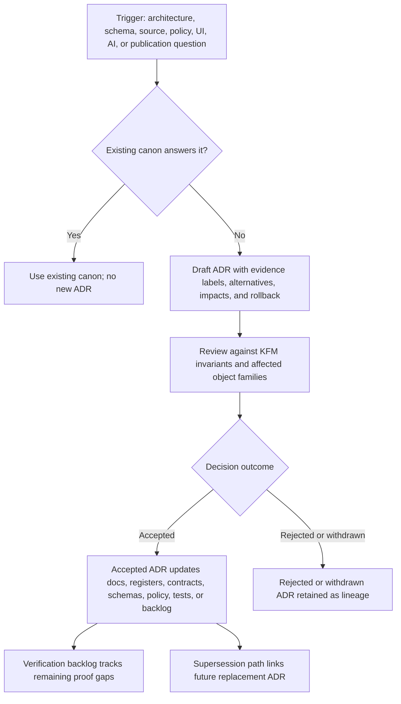

<!-- [KFM_META_BLOCK_V2]
doc_id: kfm://doc/TODO-uuid-docs-adr-readme
title: KFM Architecture Decision Records
type: standard
version: v1
status: draft
owners: TODO: confirm architecture/documentation owners
created: 2026-04-27
updated: 2026-04-27
policy_label: TODO: confirm public/restricted label
related: [docs/README.md, docs/registers/AUTHORITY_LADDER.md, docs/registers/SOURCE_LEDGER.md, docs/registers/VERIFICATION_BACKLOG.md, schemas/contracts/v1/]
tags: [kfm, adr, documentation-control-plane, governance, architecture]
notes: [Generated as repo-ready draft for docs/adr/README.md; related paths and owners need mounted-repo verification]
[/KFM_META_BLOCK_V2] -->

# KFM Architecture Decision Records

Governed decisions that explain why KFM changes its architecture, policy, schema homes, source authority, and trust boundaries.

> [!IMPORTANT]
> **Status:** experimental · **Owners:** TODO: confirm architecture/documentation owners · **Path:** `docs/adr/README.md`  
> **Role:** directory README, ADR intake guide, and decision-record quality gate for Kansas Frontier Matrix.
>
> 
> 
> 
> 
> 
>
> **Quick jumps:** [Scope](#scope) · [Repo fit](#repo-fit) · [Inputs](#inputs) · [Exclusions](#exclusions) · [Directory tree](#directory-tree) · [Quickstart](#quickstart) · [Decision flow](#decision-flow) · [ADR gates](#adr-gates) · [Template](#appendix-a--adr-template)

---

## Scope

`docs/adr/` is the home for **Architecture Decision Records** that preserve consequential KFM decisions after review.

An ADR belongs here when the decision changes, clarifies, or constrains one of KFM’s trust-bearing boundaries:

- source authority, canon, lineage, or exploratory intake
- schema, contract, policy, fixture, validator, or proof-object homes
- governed API, public UI, MapLibre, Cesium, Focus Mode, or AI boundaries
- publication, promotion, correction, rollback, or withdrawal behavior
- rights, sensitivity, redaction, generalization, or public-release posture
- domain-lane architecture where the decision affects shared governance rules

> [!NOTE]
> ADRs are not implementation proof. An accepted ADR records a reviewed decision and its consequences. It does not prove that routes, workflows, schemas, tests, dashboards, deployment settings, or runtime behavior already exist.

[Back to top](#kfm-architecture-decision-records)

---

## Repo fit

This README is both a **directory landing page** and a **governance checkpoint** for decision records.

| Direction | Link or path | Role | Status |
|---|---|---|---|
| Current directory | `docs/adr/` | ADR index and templates | NEEDS VERIFICATION |
| Upstream docs landing | [docs/README.md](../README.md) | Canonical documentation entry point | NEEDS VERIFICATION |
| Upstream authority register | [docs/registers/AUTHORITY_LADDER.md](../registers/AUTHORITY_LADDER.md) | Source hierarchy and authority rules | NEEDS VERIFICATION |
| Upstream source ledger | [docs/registers/SOURCE_LEDGER.md](../registers/SOURCE_LEDGER.md) | Source status and evidence continuity | NEEDS VERIFICATION |
| Upstream verification backlog | [docs/registers/VERIFICATION_BACKLOG.md](../registers/VERIFICATION_BACKLOG.md) | Open proof gaps created by decisions | NEEDS VERIFICATION |
| Downstream schemas | [schemas/contracts/v1/](../../schemas/contracts/v1/) | Machine-checkable shapes affected by ADRs | NEEDS VERIFICATION |
| Downstream policy | [policy/](../../policy/) | Release/runtime admissibility and denial logic | NEEDS VERIFICATION |
| Downstream fixtures | [tests/fixtures/](../../tests/fixtures/) | Valid/invalid examples required by decisions | NEEDS VERIFICATION |
| Downstream receipts/proofs | [data/receipts/](../../data/receipts/) · [data/proofs/](../../data/proofs/) | Emitted process memory and validation proof | NEEDS VERIFICATION |

> [!WARNING]
> The links above are repo-relative targets expected by current KFM doctrine and planning materials. Verify them in the mounted repository before publishing this README as `published`.

[Back to top](#kfm-architecture-decision-records)

---

## Inputs

Use `docs/adr/` for decisions with durable architectural consequences.

| Accepted input | What belongs here | Minimum evidence |
|---|---|---|
| Schema-home decisions | Choosing between `contracts/`, `schemas/contracts/v1/`, or another canonical machine-contract home | Current repo tree, adjacent README files, affected schema users |
| Source-authority decisions | Deciding how canon, lineage, exploratory packets, and current repo evidence relate | Source ledger, authority ladder, affected downstream docs |
| Boundary decisions | Renderer, UI, API, AI, policy, review, promotion, or publication boundaries | Architecture docs, contract impacts, policy impacts, rollback path |
| Security/sensitivity decisions | Redaction, generalization, private access, exact-location handling, local exposure posture | Rights/sensitivity evidence, policy obligations, fail-closed behavior |
| Domain-lane decisions | Shared lane decisions that affect proof objects, source roles, public surfaces, or publication gates | Domain docs, fixture plan, validation plan, steward review needs |

Every ADR must state whether its claims are **CONFIRMED**, **INFERRED**, **PROPOSED**, **UNKNOWN**, or **NEEDS VERIFICATION**.

[Back to top](#kfm-architecture-decision-records)

---

## Exclusions

Do not put ordinary implementation notes here.

| Does not belong in `docs/adr/` | Put it here instead | Reason |
|---|---|---|
| Source inventories without a decision | `docs/registers/` or source registry docs | A ledger is not automatically an ADR |
| Exploratory idea packets | `docs/intake/` or idea index | Ideas need promotion before becoming decision law |
| JSON Schema files | `schemas/contracts/v1/` or repo-confirmed schema home | Schemas are executable shape, not decision rationale |
| Policy rules | `policy/` | Policy is enforced separately from ADR prose |
| Test fixtures | `tests/fixtures/` or repo-confirmed fixture home | Fixtures prove behavior; ADRs explain decisions |
| Runtime logs, receipts, proof packs | `data/receipts/`, `data/proofs/`, or release artifacts | Emitted artifacts are evidence, not decisions |
| Generic architecture essays | `docs/architecture/` | ADRs should record a decision, alternatives, consequences, and rollback |
| Domain runbooks | `docs/runbooks/` | Runbooks guide operation; ADRs preserve why a path was chosen |

[Back to top](#kfm-architecture-decision-records)

---

## Directory tree

Actual contents are **NEEDS VERIFICATION** until the mounted repo is inspected.

```text
docs/adr/
├── README.md
├── ADR-0001-schema-home.md                  # PROPOSED / NEEDS VERIFICATION
├── ADR-0002-source-ledger-authority.md      # PROPOSED / NEEDS VERIFICATION
├── ADR-0003-policy-release-boundary.md      # OPTIONAL CANDIDATE
├── ADR-0004-renderer-trust-boundary.md      # OPTIONAL CANDIDATE
└── _archive/                                # OPTIONAL: superseded or withdrawn ADRs, if repo convention allows
```

> [!TIP]
> Keep accepted, superseded, withdrawn, and rejected ADRs visible. KFM values correction lineage; deletion should be rare and justified.

[Back to top](#kfm-architecture-decision-records)

---

## Quickstart

1. **Confirm the decision is ADR-worthy.** Use an ADR only when the decision affects architecture, governance, source authority, policy, publication, sensitivity, AI, UI trust, or shared domain-lane behavior.
2. **Search existing canon first.** Do not create a new ADR if an existing accepted ADR or canonical architecture doc already answers the question.
3. **Create a draft ADR.** Use the template in [Appendix A](#appendix-a--adr-template).
4. **Label evidence precisely.** Separate current repo evidence from doctrine, lineage, exploratory pressure, and proposed implementation.
5. **List downstream effects.** Name affected docs, schemas, contracts, policy files, fixtures, validators, release objects, UI/API surfaces, and rollback targets.
6. **Review before acceptance.** Accepted ADRs should have a reviewer, a rollback or supersession path, and a verification plan.

Example filenames:

```text
docs/adr/ADR-0001-schema-home.md
docs/adr/ADR-0002-source-ledger-authority.md
```

[Back to top](#kfm-architecture-decision-records)

---

## Usage

### When an ADR is required

Create or update an ADR when a change would otherwise let maintainers disagree about what is authoritative.

| Trigger | ADR required? | Why |
|---|---:|---|
| Choosing canonical schema location | Yes | Prevents `contracts/` vs `schemas/` drift |
| Introducing a source-authority rule | Yes | Prevents exploratory material from becoming accidental canon |
| Adding a new public release pathway | Yes | Publication is a governed state transition |
| Changing renderer, shell, or Focus Mode authority | Yes | UI and AI are downstream of evidence, policy, and release state |
| Adding a live source connector | Usually | Source rights, role, cadence, and public-release rules matter |
| Renaming a local helper script | Usually no | Not durable architecture unless it changes gates or authority |
| Creating a one-off fixture | Usually no | Fixtures support a decision; they are not the decision itself |

### Status values

| Status | Meaning | Required handling |
|---|---|---|
| `proposed` | Draft decision under review | May guide discussion, not implementation law |
| `accepted` | Current governing decision | Must be linked from affected docs or registers |
| `superseded` | Replaced by a newer ADR | Keep visible; link successor |
| `withdrawn` | Retired without replacement | Keep reason and safe-use note |
| `rejected` | Considered and declined | Preserve rationale when useful |

[Back to top](#kfm-architecture-decision-records)

---

## Decision flow


```mermaid
flowchart TD
    A[Trigger: architecture, schema, source, policy, UI, AI, or publication question]
    B{Existing canon answers it?}
    C[Use existing canon; no new ADR]
    D[Draft ADR with evidence labels, alternatives, impacts, and rollback]
    E[Review against KFM invariants and affected object families]
    F{Decision outcome}
    G[Accepted ADR updates docs, registers, contracts, schemas, policy, tests, or backlog]
    H[Rejected or withdrawn ADR retained as lineage]
    I[Verification backlog tracks remaining proof gaps]
    J[Supersession path links future replacement ADR]

    A --> B
    B -- Yes --> C
    B -- No --> D
    D --> E
    E --> F
    F -- Accepted --> G
    F -- Rejected or withdrawn --> H
    G --> I
    G --> J
```

[Back to top](#kfm-architecture-decision-records)

---

## Candidate ADR registry

This table is a starter register, not proof that the files exist.

| ADR | Decision area | Why it matters | Current posture |
|---|---|---|---|
| `ADR-0001-schema-home.md` | Schema and contract authority | KFM planning repeatedly flags schema-home ambiguity. A first ADR should decide how `contracts/`, `schemas/`, fixtures, validators, and docs relate. | PROPOSED / NEEDS VERIFICATION |
| `ADR-0002-source-ledger-authority.md` | Source authority and source ledger | KFM needs visible separation among canon, lineage, exploratory material, repo evidence, emitted artifacts, and external standards. | PROPOSED / NEEDS VERIFICATION |
| `ADR-0003-policy-release-boundary.md` | Promotion, proof, and release | Public release should remain a governed transition with receipts, proof objects, review state, and rollback. | OPTIONAL CANDIDATE |
| `ADR-0004-renderer-trust-boundary.md` | MapLibre/Cesium/UI trust boundary | Renderer and shell decisions must preserve the trust membrane and keep UI/AI downstream of evidence. | OPTIONAL CANDIDATE |

[Back to top](#kfm-architecture-decision-records)

---

## ADR gates

An ADR is not ready for acceptance until it passes these checks.

- [ ] Has one clear decision, not a bundle of unrelated preferences.
- [ ] Uses KFM truth labels where confidence materially matters.
- [ ] Identifies evidence basis and distinguishes doctrine from implementation proof.
- [ ] Names affected object families such as `SourceDescriptor`, `EvidenceBundle`, `EvidenceRef`, `PolicyDecision`, `RuntimeResponseEnvelope`, `RunReceipt`, `LayerManifest`, `ReleaseManifest`, `CorrectionNotice`, or `ReviewRecord` when applicable.
- [ ] Lists affected docs, schemas, contracts, policy, fixtures, validators, workflows, UI/API surfaces, and release artifacts.
- [ ] States security, rights, sensitivity, or public-release consequences.
- [ ] Defines validation needed before implementation or publication.
- [ ] Defines rollback, withdrawal, or supersession path.
- [ ] Does not claim route names, DTOs, workflows, tests, dashboards, deployment behavior, or emitted proof objects unless direct repo/runtime evidence supports them.
- [ ] Adds follow-up items to the verification backlog when proof is missing.

[Back to top](#kfm-architecture-decision-records)

---

## Source authority posture

KFM ADRs follow this authority order:

| Rank | Source class | How ADRs should use it |
|---:|---|---|
| 1 | Mounted repo evidence | Current files, tests, workflows, configs, schemas, logs, emitted artifacts, and runtime traces outrank prose for implementation claims |
| 2 | Current KFM doctrine and canonical architecture | Governs meaning, invariants, trust posture, and decision standards |
| 3 | Existing normative Markdown | Controls local conventions when directly inspected |
| 4 | Domain-lane and subsystem reports | Supports lane-specific burdens and shared object-family pressure |
| 5 | New Ideas and exploratory packets | Design pressure only until promoted through source intake, tests, review, and release state |
| 6 | External official standards and source docs | Used for version-sensitive facts, standards, and source-system behavior |
| 7 | General references | Conceptual support only; never project authority by itself |

> [!CAUTION]
> Repetition is not authority. A decision repeated in multiple PDFs is still not implementation proof unless a current repo file, test, workflow, emitted artifact, or runtime trace supports it.

[Back to top](#kfm-architecture-decision-records)

---

## FAQ

### Do ADRs replace architecture docs?

No. Architecture docs describe the system. ADRs record specific decisions, alternatives, consequences, verification needs, and rollback paths.

### Can an ADR approve public release?

No. An ADR can define or change a release rule. Actual publication still needs policy checks, evidence support, review state, receipts, proof objects, release manifests, and rollback readiness.

### Can an ADR cite exploratory packets?

Yes, but only as exploratory design pressure. The ADR must say what evidence promotes the idea into a decision and what remains unverified.

### Should every ADR include the KFM Meta Block?

Yes for standard Markdown ADRs unless a stronger repo-local exception is verified. Keep the visible title synchronized with the meta block title.

### What happens when an ADR is wrong?

Supersede, withdraw, or correct it visibly. Keep the old decision available as lineage unless removal is required for safety, privacy, rights, or security reasons.

[Back to top](#kfm-architecture-decision-records)

---

## Appendix A — ADR template

<details>
<summary><strong>Copy this template into a new ADR file</strong></summary>

```markdown
<!-- [KFM_META_BLOCK_V2]
doc_id: kfm://doc/TODO-uuid
title: ADR-0000 — <Decision Title>
type: standard
version: v1
status: draft
owners: TODO: confirm owner(s)
created: YYYY-MM-DD
updated: YYYY-MM-DD
policy_label: TODO: confirm public/restricted label
related: [docs/adr/README.md]
tags: [kfm, adr]
notes: [Draft ADR; replace TODO values before acceptance]
[/KFM_META_BLOCK_V2] -->

# ADR-0000 — <Decision Title>

One-sentence decision purpose.

> [!IMPORTANT]
> **Status:** proposed  
> **Decision area:** docs / contracts / schemas / policy / workflow / release / UI / AI / domain lane  
> **Owner(s):** TODO  
> **Review state:** TODO  
> **Supersedes:** none / ADR-####  
> **Related:** `docs/adr/README.md`

## Context

What problem forces a decision?

Use truth labels when confidence matters:

- **CONFIRMED:** directly supported by current repo evidence, attached doctrine, or visible artifacts.
- **INFERRED:** conservative synthesis from strong evidence.
- **PROPOSED:** intended design or future implementation.
- **UNKNOWN:** not verified.
- **NEEDS VERIFICATION:** concrete check required.

## Decision

State the decision clearly.

## Alternatives considered

| Alternative | Why not chosen |
|---|---|
|  |  |

## Evidence used

| Evidence | Role | Truth label |
|---|---|---|
|  |  |  |

## Consequences

### Positive consequences

- 

### Tradeoffs and risks

- 

### Affected surfaces

| Surface | Impact |
|---|---|
| Docs |  |
| Contracts/schemas |  |
| Policy |  |
| Fixtures/tests |  |
| Validators/CI |  |
| API/UI/runtime |  |
| Receipts/proofs/release |  |

## Verification required

- [ ] 
- [ ] 

## Rollback or supersession path

How can this decision be reverted, superseded, or withdrawn without hiding lineage?

## Acceptance checklist

- [ ] Evidence basis is visible.
- [ ] Repo/runtime claims are not over-stated.
- [ ] Affected files and object families are listed.
- [ ] Validation and rollback are defined.
- [ ] Related docs/registers/backlog updates are identified.
```

</details>

[Back to top](#kfm-architecture-decision-records)

---

## Appendix B — Maintainer review checklist

<details>
<summary><strong>Use this before merging a new or revised ADR</strong></summary>

| Check | Pass condition |
|---|---|
| Decision clarity | One decision is stated in the `Decision` section |
| Evidence separation | Doctrine, repo evidence, exploratory input, and external standards are not collapsed |
| KFM invariants | Truth path, trust membrane, governed API, cite-or-abstain, policy, review, and rollback are preserved |
| Implementation restraint | No unverified implementation maturity claims |
| Downstream updates | Affected docs/registers/contracts/schemas/policy/tests/backlog are listed |
| Security and sensitivity | Rights, sovereignty, cultural sensitivity, exact location, private data, and local exposure are handled or marked `NEEDS VERIFICATION` |
| Reversibility | Rollback, withdrawal, or supersession path exists |
| Link hygiene | Relative links resolve after mounted-repo verification |
| Meta block | KFM Meta Block v2 is present and synchronized with title/status/owners |

</details>

[Back to top](#kfm-architecture-decision-records)
