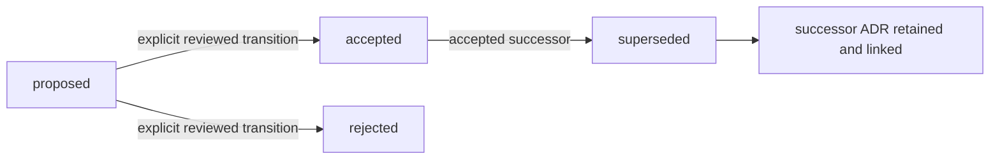

<!-- [KFM_META_BLOCK_V2]
doc_id: kfm://doc/adr-readme
title: docs/adr — Architecture Decision Records
type: standard
version: v1.8
status: draft; repository-grounded
owners:
  - Architecture steward
  - Docs steward
created: 2026-05-09
updated: 2026-08-14
policy_label: public
truth_posture: cite-or-abstain
responsibility_root: docs/
owning_root: docs/
responsibility: Human-facing ADR operating guidance and inventory summary derived from the canonical docs/adr/INDEX.md without independent decision-status authority.
authority_surface: human-facing architecture decision records
related:
  - docs/adr/INDEX.md
  - docs/adr/ADR-template.md
  - docs/doctrine/directory-rules.md
  - docs/doctrine/authority-ladder.md
  - docs/registers/ADR_INDEX.md
  - docs/registers/DRIFT_REGISTER.md
  - tools/validators/validate_adr_index.py
  - tests/validators/test_validate_adr_index.py
  - .github/workflows/docs-control-plane.yml
tags: [kfm, governance, adr, decisions, audit, control-plane]
notes:
  - "ADR-0036 is newly registered as proposed and records a candidate planning-encyclopedia carrier, single-writer, generated-mirror, and scaffold-disposition decision; registration is not acceptance."
  - "ADR-0035 remains proposed and does not yet make repository-wide numbering or pointer-only domain indexes binding."
  - "File presence does not accept a decision. ADR-0029 is accepted through explicit project-owner ratification and a matching source/index transition; the other 35 numbered ADRs remain proposed."
  - "This README is the operating contract; docs/adr/INDEX.md is the canonical human inventory."
[/KFM_META_BLOCK_V2] -->

# `docs/adr/` — Architecture Decision Records

[](../doctrine/directory-rules.md)
[](./INDEX.md)
[](./INDEX.md)
[](../../tools/validators/validate_adr_index.py)
[](../../.github/CODEOWNERS)

Architecture Decision Records preserve why KFM made—or is considering—a consequential architectural choice. They are append-only governance memory: one decision per record, explicit status, evidence, consequences, alternatives, migration impact, validation, correction, and rollback.

> [!IMPORTANT]
> A tracked ADR is not automatically accepted. ADR-0029 is the first accepted numbered record through explicit project-owner ratification and a synchronized source/index transition; ADR-0001 through ADR-0028 and ADR-0030 through ADR-0036 remain proposed. This status summary does not independently promote any decision.

**Quick links:** [Verified snapshot](#verified-snapshot) · [Authority](#authority-and-boundaries) · [Inventory](#inventory-contract) · [Lifecycle](#decision-lifecycle) · [ADR triggers](#when-an-adr-is-required) · [Naming](#naming-and-numbering) · [Authoring](#authoring-workflow) · [Validation](#validation) · [Review](#review-and-supersession) · [Open work](#open-governance-work)

---

## Verified snapshot

The current inventory snapshot is prepared against `main@860fc390ffa303785d3d6c726571265175f6cc0f` plus the proposed ADR-0036 packet.

| Surface | Verified state | Meaning |
|---|---:|---|
| Direct Markdown files | 54 | Complete direct-child inventory after adding ADR-0036 |
| Numbered records | 36 | Unique, contiguous IDs `ADR-0001` through `ADR-0036` |
| Numbered source metadata | 22 `proposed`; 12 `draft`; 1 legacy `PROPOSED`; 1 `accepted` | The first three classes normalize to `proposed`; ADR-0029 normalizes to `accepted` |
| Verified accepted decisions | 1 | ADR-0029 carries matching source/index `accepted` status and explicit owner-ratification evidence |
| Explicit `NNNN` / `XXXX` placeholders | 4 | Unassigned scaffolds; not ADR numbers |
| Slug-only ADR scaffolds | 8 | Unassigned scaffolds; not accepted decision records |
| Template | 1 | [`ADR-template.md`](./ADR-template.md) |
| Index and support documents | 5 | This README, canonical index, two assessment/checklist documents, and `_next_move_log.md` |

The exact numbered records and unassigned scaffolds are listed in the [canonical ADR index](./INDEX.md). The human cross-register at [`docs/registers/ADR_INDEX.md`](../registers/ADR_INDEX.md) points to that inventory without maintaining a competing table.

## Authority and boundaries

Directory Rules §9.1 assigns Architecture Decision Records to `docs/adr/` inside the human-facing control plane. Authority resolves in this order:

1. KFM core invariants and doctrine.
2. Accepted ADRs that explicitly amend Directory Rules.
3. Directory Rules.
4. Per-root READMEs such as this file.
5. Domain dossiers and planning lineage.
6. Repository convention, which is implementation evidence—not placement authority when it conflicts with the rules.

This directory owns decision records and their human inventory. It does not own:

| Responsibility | Canonical home |
|---|---|
| Object meaning | [`contracts/`](../../contracts/) |
| Machine-checkable shape | [`schemas/`](../../schemas/) |
| Allow, deny, restrict, or abstain rules | [`policy/`](../../policy/) |
| Enforceability proof | [`tests/`](../../tests/) |
| Repository-wide validation logic | [`tools/validators/`](../../tools/validators/) |
| Human registers and drift queues | [`docs/registers/`](../registers/) |
| Receipts and proofs | [`data/receipts/`](../../data/receipts/) and [`data/proofs/`](../../data/proofs/) |
| Release decisions, manifests, and rollback cards | [`release/`](../../release/) |
| Build, documentation, QA, and temporary outputs | [`artifacts/`](../../artifacts/) |

An ADR may direct changes in those homes, but it does not replace their contracts, schemas, policies, tests, receipts, proofs, or release objects.

## Inventory contract

The three human surfaces have distinct responsibilities:

| Path | Responsibility | Must not do |
|---|---|---|
| [`README.md`](./README.md) | Operating rules for authoring, review, status, and validation | Duplicate the full record table |
| [`INDEX.md`](./INDEX.md) | Canonical human inventory of numbered records and unassigned scaffolds | Grant decision authority merely because a file is present |
| [`../registers/ADR_INDEX.md`](../registers/ADR_INDEX.md) | Cross-register pointer, ownership, consumers, and validation boundary | Maintain a second ADR row set |

The canonical index records:

- **Source metadata** — what each file currently says: `proposed`, `draft`, legacy `PROPOSED`, `accepted`, `superseded`, or `rejected`.
- **Effective decision status** — conservative Directory Rules status: `proposed`, `accepted`, `superseded`, or `rejected`.

`draft` and legacy `PROPOSED` normalize to `proposed`. A row may move to `accepted`, `superseded`, or `rejected` only when the record itself carries matching reviewed status evidence. The index cannot promote a decision independently.

## Decision lifecycle


```mermaid
flowchart LR
    P["proposed"] -->|explicit reviewed transition| A["accepted"]
    P -->|explicit reviewed transition| R["rejected"]
    A -->|accepted successor| S["superseded"]
    S --> N["successor ADR retained and linked"]
```

- **`proposed`** — under consideration; not binding. A merged proposal remains proposed.
- **`accepted`** — explicitly reviewed and in force for the decision's stated scope.
- **`superseded`** — replaced by a later accepted ADR; retained with reciprocal links.
- **`rejected`** — considered and not adopted; retained as decision history.

Accepted, superseded, and rejected records are never deleted. A material change to an accepted decision requires a successor ADR rather than rewriting history.

## When an ADR is required

Directory Rules require an accepted ADR before implementation that:

- adds a canonical, conditional, or compatibility root;
- renames, merges, splits, retires, promotes, or reclassifies a root;
- changes lifecycle, evidence, release, or public-boundary authority;
- changes an object family's authority owner;
- creates or preserves parallel writable authority;
- bends a KFM trust, evidence, sensitivity, correction, or rollback invariant;
- makes a semantic identity or compatibility change that cannot be treated as local refinement;
- changes adopted Directory Rules or another accepted architecture decision.

An ADR is strongly recommended when a choice spans several roots or bounded contexts, changes public/governed interfaces, changes deterministic identity or replay, changes AI/runtime/provider boundaries, changes source roles or sensitivity, introduces a long-lived compatibility profile, or is likely to be re-litigated.

Do not create an ADR merely for typo repair, local refactoring, runbooks, release instances, or machine-shape changes that do not alter architecture.

## Naming and numbering

The target pattern is:

```text
ADR-NNNN-kebab-case-slug.md
```

Rules:

- `NNNN` is a permanent four-digit repository-wide ID.
- Claim the next number only after checking the canonical index, open pull requests, active branches, and recent merges.
- The H1 must contain the same `ADR-NNNN` as the filename.
- New records use the current template and begin with effective status `proposed`.
- `ADR-NNNN-*`, `ADR-XXXX-*`, and slug-only files are unassigned scaffolds until reviewed assignment.
- Proposed [`ADR-0035`](./ADR-0035-repository-wide-adr-identity-numbering-and-domain-indexing.md) would make the repository-wide identity and pointer-only domain-index model binding; it remains under review.
- Proposed [`ADR-0036`](./ADR-0036-planning-encyclopedia-carrier-single-writer-and-scaffold-disposition.md) would admit one planning-encyclopedia lane and one chapter-source/generated-mirror model; it remains under review.

Two numbered records use legacy filenames containing spaces and an em dash (`ADR-0007` and `ADR-0028`). Renaming them remains deferred pending inbound-link and history analysis.

## Authoring workflow

1. Read Directory Rules and confirm the change is ADR-class.
2. Inspect [`INDEX.md`](./INDEX.md), open ADR PRs, active ADR branches, and recent merges for collisions.
3. Copy [`ADR-template.md`](./ADR-template.md) to a collision-free `ADR-NNNN-kebab-case-slug.md` path.
4. Keep status `proposed`; identify owners, affected roots, evidence, alternatives, migration, validation, correction, and rollback.
5. Link any superseded ADRs in both directions.
6. Update [`INDEX.md`](./INDEX.md) in the same change.
7. Update this summary and the cross-register when inventory counts or open-work posture changes.
8. Run the ADR validator and negative-path tests.
9. Request reviewers required by affected roots. CODEOWNERS routing is not proof that review occurred.
10. On a reviewed status transition, update the record and index together; never let the index promote the record independently.

## Validation

Run from the repository root:

```bash
python tools/validators/validate_adr_index.py
python -m pytest tests/validators/test_validate_adr_index.py -q --strict-config --strict-markers
```

The validator checks:

- unique numbered IDs and exact index coverage;
- filename, H1, link target, and index-ID agreement;
- allowed effective status values and conservative source-status normalization;
- complete separation and inventory of explicit and slug-only scaffolds;
- non-duplicating pointer behavior in `docs/registers/ADR_INDEX.md`;
- reciprocal supersession links.

The read-only [`docs-control-plane` workflow](../../.github/workflows/docs-control-plane.yml) runs the validator and its negative-path tests. A green result proves checked-revision coherence only. It does not accept a decision, prove architecture implementation, authorize release, or publish data.

## Review and supersession

| Change | Required review posture |
|---|---|
| New proposed ADR | Architecture steward plus affected subsystem owner |
| `proposed` → `accepted` | Explicit decision review from all named owners; implementation and migration gates as specified by the ADR |
| `proposed` → `rejected` | Explicit architecture review; retain the record |
| `accepted` → `superseded` | Accepted successor, reciprocal links, and reviewed transition plan |
| Index or README maintenance | Docs and architecture review route |

[`CODEOWNERS`](../../.github/CODEOWNERS) currently routes `docs/adr/`, `docs/registers/`, `tools/validators/`, and `tests/` to `@bartytime4life`. That is a verified review route, not a `ReviewRecord`, acceptance decision, separation-of-duties proof, release approval, or publication authority.

## Open governance work

- Human acceptance review for the remaining 35 proposed numbered ADRs; ADR-0029's single-owner bootstrap exception retains a later independent-review trigger.
- Metadata normalization for 12 `draft` records and legacy ADR-0007 without changing conservative `proposed` status.
- Migration analysis for the two legacy space/em-dash filenames.
- Disposition of 12 unassigned placeholder or slug-only scaffolds.
- Acceptance or rejection of ADR-0035 before repository-wide numbering and domain-indexing guidance becomes binding.
- Acceptance or rejection of ADR-0036 before the encyclopedia scaffold is admitted or populated.
- Review of [`ADR-0011`](./ADR-0011-receipts-vs-proofs-vs-manifests-vs-catalog-separation.md) before `artifacts/release/` migration.
- Resolution of `OPEN-DR-09-b` and the `artifacts/perf/` placement conflict.

Until each proposal is reviewed, inventory the file, keep the decision `proposed`, preserve reversibility, and do not grant authority by implication.

## Maintenance checklist

- [ ] Update `INDEX.md` whenever a numbered ADR or unassigned scaffold is added, assigned, removed through reviewed cleanup, or status-transitioned.
- [ ] Preserve unique IDs and exact filename/H1 agreement.
- [ ] Keep source metadata and effective status separate.
- [ ] Require reciprocal supersession links.
- [ ] Run the validator and negative-path tests.
- [ ] Update `updated:` and the verified snapshot when inventory changes.
- [ ] Keep accepted and historical ADRs append-only.
- [ ] Record placement conflicts in the drift register instead of normalizing them.
- [ ] Keep receipts, proofs, policy, schemas, contracts, release objects, and data in their owning roots.

## Related

- [Canonical ADR index](./INDEX.md)
- [ADR template](./ADR-template.md)
- [Human ADR cross-register](../registers/ADR_INDEX.md)
- [Directory Rules](../doctrine/directory-rules.md)
- [Authority Ladder](../doctrine/authority-ladder.md)
- [Drift Register](../registers/DRIFT_REGISTER.md)
- [Verification Backlog](../registers/VERIFICATION_BACKLOG.md)
- [ADR index validator](../../tools/validators/validate_adr_index.py)
- [ADR validator tests](../../tests/validators/test_validate_adr_index.py)
- [Documentation control-plane workflow](../../.github/workflows/docs-control-plane.yml)
