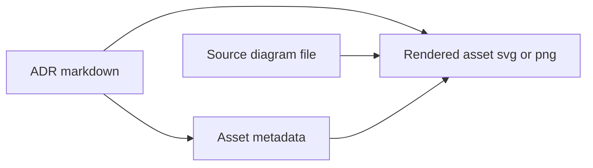

<!-- [KFM_META_BLOCK_V2]
doc_id: kfm://doc/4e4983fe-df8f-45aa-9d17-69eefd8bdc3c
title: ADR Assets
type: standard
version: v1
status: draft
owners: TBD
created: 2026-03-01
updated: 2026-03-01
policy_label: restricted
related:
  - kfm://doc/TODO-adr-index
tags: [kfm, adr, assets]
notes:
  - Directory documentation for Architecture Decision Record (ADR) supporting assets.
  - Keep provenance and licensing alongside binaries; prefer diff-friendly formats.
[/KFM_META_BLOCK_V2] -->

# ADR Assets
**One-line purpose:** A governed home for images/diagrams/screenshots referenced by ADRs—kept stable, attributable, and reviewable.


> [!NOTE]
> This README assumes ADR markdown files live in `docs/adr/` and reference assets via relative paths like `./assets/...`.
> If your ADRs live elsewhere, update the link examples below to match the actual structure.

## Quick navigation
- [Where this fits](#where-this-fits)
- [What lives here](#what-lives-here)
- [Directory structure](#directory-structure)
- [Naming and provenance](#naming-and-provenance)
- [How to reference assets from an ADR](#how-to-reference-assets-from-an-adr)
- [How to add or modify an asset](#how-to-add-or-modify-an-asset)
- [Governance and safety](#governance-and-safety)
- [Definition of done](#definition-of-done)
- [Appendix](#appendix)

---

## Where this fits
This directory is intended to sit under:

- `docs/adr/` — Architecture Decision Records (ADRs)
- `docs/adr/assets/` — **this folder**, containing supporting visuals (and their provenance)

**Goal:** keep ADR visuals close to the ADRs that reference them, while still enforcing governance (license, sensitivity, reviewability).

---

## What lives here

### Acceptable inputs
**REQUIRED:** assets must be attributable (source + license) and safe for the repo’s intended visibility.

Common, acceptable file types:

- **Diagram sources (preferred, diff-friendly):**
  - `*.mmd` (Mermaid source)
  - `*.drawio` (diagrams.net)
  - `*.excalidraw` (Excalidraw)
- **Rendered exports (for GitHub + docs sites):**
  - `*.svg` (preferred for diagrams)
  - `*.png` (when raster is necessary)
  - `*.pdf` (only when required for print fidelity)
- **Sidecar metadata (strongly recommended):**
  - `*.asset.yml` (or `*.asset.json`) describing provenance, license, sensitivity, and intended use

### Exclusions
**DO NOT** put these in `docs/adr/assets/`:

- Raw datasets, large binaries, or anything that belongs in the data “truth path” zones (`RAW/WORK/PROCESSED/...`)  
- Secrets or credentials (API keys, tokens, private endpoints)
- Personally identifying information (PII) or private operational details
- Copyrighted images/diagrams without a clear license or permission to redistribute
- Sensitive location details that increase risk of harm or targeting (use redacted/coarsened visuals instead)

> [!WARNING]
> ADR assets are still “published artifacts” in practice: if the repo is shared, these images share too. Default-deny when sensitivity is unclear.

---

## Directory structure

### Recommended structure
Keep assets grouped by ADR so references stay obvious and avoid name collisions.

```text
docs/adr/assets/                                              | # ADR assets (diagrams/media) with provenance + licensing + policy posture
├─ README.md                                                  | # Asset rules: naming, generation, licensing, sensitivity checks, commit policy
│
├─ adr-0001/                                                  | # Assets for ADR-0001 (keep scoped; no cross-ADR reuse here)
│  ├─ adr-0001--context--flow.mmd                             | # Mermaid source (authoritative) for ADR-0001 context flow diagram
│  ├─ adr-0001--context--flow.svg                             | # Rendered export (generated from .mmd; commit only if policy allows)
│  └─ adr-0001--context--flow.asset.yml                       | # Asset manifest (source hash, generator/tool versions, license, policy_label, notes)
│
├─ adr-0042/                                                  | # Assets for ADR-0042 (keep scoped; no cross-ADR reuse here)
│  ├─ adr-0042--trust-membrane--sequence.mmd                  | # Mermaid source for ADR-0042 trust membrane sequence diagram
│  ├─ adr-0042--trust-membrane--sequence.svg                  | # Rendered export (generated from .mmd; commit only if policy allows)
│  └─ adr-0042--trust-membrane--sequence.asset.yml            | # Asset manifest (provenance, license, sensitivity notes, generation recipe)
│
└─ shared/                                                    | # Shared ADR assets (reusable across multiple ADRs)
   ├─ icons/                                                  | # Shared icons (prefer SVG; must be licensed + policy-safe)
   └─ legend/                                                 | # Shared legend components (symbols/colors explained; keep consistent)
```

> [!TIP]
> Prefer **`svg + source`** pairs. If you can’t regenerate the export deterministically, reviewers can’t confidently validate what changed.

### How ADRs, sources, and exports relate


---

## Naming and provenance

### File naming convention
**REQUIRED (recommended standard):**
```
adr-<NNNN>--<short-slug>--<kind>.<ext>
```

Examples:
- `adr-0007--decision-record--overview.svg`
- `adr-0007--decision-record--overview.mmd`
- `adr-0007--decision-record--overview.asset.yml`

Rules:
- `NNNN` is zero-padded ADR number (stable ID)
- `short-slug` is kebab-case, no spaces
- `kind` is a short descriptor like `flow`, `sequence`, `component`, `wireframe`, `screenshot`

### Metadata sidecar
**STRONGLY RECOMMENDED:** include a sidecar per asset export.

Example `*.asset.yml`:
```yaml
asset_id: adr-0042--trust-membrane--sequence
adr: adr-0042
title: Trust membrane request flow
formats:
  source: adr-0042--trust-membrane--sequence.mmd
  export: adr-0042--trust-membrane--sequence.svg
license:
  spdx: CC-BY-4.0 # or "Proprietary" with explicit permission notes
  attribution: "Author or org"
provenance:
  created_by: "TBD"
  created_at: "2026-03-01"
  tool: "Mermaid"
sensitivity:
  policy_label: restricted
  redactions: []
notes:
  - "Keep node labels generic; avoid internal hostnames."
```

> [!NOTE]
> If your repo already defines a canonical manifest format, adapt this example to match it. The key is: **license + provenance + sensitivity** must be reviewable.

---

## How to reference assets from an ADR

### Referencing a rendered image
From an ADR located at `docs/adr/adr-0042-*.md`, use a relative link:

```markdown

```

### Linking to the source (encouraged)
```markdown
Source: [`adr-0042--trust-membrane--sequence.mmd`](./assets/adr-0042/adr-0042--trust-membrane--sequence.mmd)
```

### Accessibility expectations
- Always include **alt text** that explains what the diagram conveys.
- If the diagram is dense, include a short textual summary in the ADR so the decision remains readable without the image.

---

## How to add or modify an asset

### Add a new asset
1. Create (or identify) the ADR number: `adr-NNNN`
2. Create the ADR asset folder (if missing): `docs/adr/assets/adr-NNNN/`
3. Add the **source** file (`.mmd`, `.drawio`, etc.)
4. Export a **rendered** version (`.svg` preferred)
5. Add a sidecar metadata file (`*.asset.yml`)
6. Reference the rendered asset from the ADR using a **relative path**
7. Ensure the asset matches governance rules (below)

### Modify an existing asset
1. Update the **source** first (prefer diff-friendly edits)
2. Re-export the rendered file
3. Update sidecar metadata (`updated_at`, redactions, license notes if changed)
4. Confirm the ADR still renders correctly in GitHub preview

> [!TIP]
> Keep changes “reviewable”: if the export is binary-heavy, include a short ADR note describing what changed and why.

---

## Governance and safety

### Policy posture
- **Default-deny** when sensitivity or rights are unclear.
- Do not embed operational secrets, internal endpoints, or any non-public identifiers.
- If the ADR concerns protected or vulnerable places: **do not include precise coordinates** in any diagrams; use coarse geography or redacted maps.

### Licensing requirements
- Every third-party image must have:
  - a clear license (ideally SPDX identifier), and
  - attribution (when required)
- If you cannot document rights, you cannot commit the asset.

### Redaction expectations
If an asset would expose sensitive details:
- Replace with a redacted version (blurred/removed text, generalized maps)
- Record redaction rationale in `*.asset.yml`
- Prefer text-based diagrams over screenshots when possible

---

## Definition of done

### Minimum checks before merge
- [ ] ADR references use **relative paths** (no brittle external links)
- [ ] Asset file name follows `adr-NNNN--slug--kind.ext`
- [ ] Source and export are both present (or rationale documented if source unavailable)
- [ ] Sidecar metadata includes **license + provenance + sensitivity**
- [ ] Alt text exists and is meaningful
- [ ] No secrets, PII, or sensitive operational details included
- [ ] Diagram text is readable in GitHub UI (not microscopic)

---

## Appendix

<details>
<summary><strong>Recommended formats and when to use them</strong></summary>

- **Mermaid (`.mmd`)**: best for flow/sequence diagrams; diff-friendly and easy to regenerate.
- **SVG**: best export for diagrams (scales, smaller than PNG for line art).
- **PNG**: use for screenshots or raster-only visuals; keep compressed and cropped.
- **PDF**: only if necessary for print fidelity or multi-page visuals.

</details>

---

<a id="back-to-top"></a>
**Back to top:** [Quick navigation](#quick-navigation)
