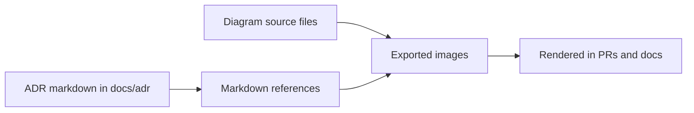
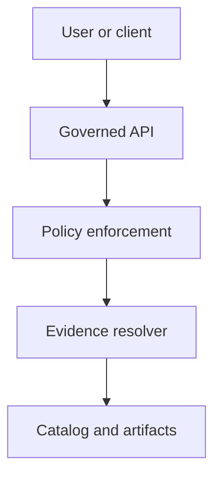

<!-- [KFM_META_BLOCK_V2]
doc_id: kfm://doc/3c8f3d4a-2a2b-4a8c-a7d8-2b0a5f0e6c2e
title: ADR Diagram Assets
type: standard
version: v1
status: draft
owners: TBD
created: 2026-03-01
updated: 2026-03-01
policy_label: public
related:
  - ../../README.md
  - ../README.md
tags:
  - kfm
  - adr
  - diagrams
notes:
  - Directory contract for diagram sources + exports referenced by ADRs.
[/KFM_META_BLOCK_V2] -->

<a id="top"></a>

# docs/adr/assets/diagrams — ADR diagram assets
**Purpose:** A single home for diagram sources and rendered images referenced by Architecture Decision Records (ADRs) under `docs/adr/`.


**Owners:** TBD (set via CODEOWNERS / stewardship process)

---

## Quick navigation
- [Purpose](#purpose)
- [Where this fits](#where-this-fits)
- [What belongs here](#what-belongs-here)
- [What must not go here](#what-must-not-go-here)
- [Naming conventions](#naming-conventions)
- [How ADRs reference diagrams](#how-adrs-reference-diagrams)
- [Diagram registry](#diagram-registry)
- [Review checklist](#review-checklist)
- [Directory tree](#directory-tree)
- [Appendix: templates](#appendix-templates)

---

## Purpose
This directory holds **diagram assets** that support ADRs:
- **Editable sources** (preferred when feasible) so diagrams can evolve via diffable changes.
- **Rendered exports** for reliable viewing in GitHub, PDFs, static sites, etc.

> [!NOTE]
> ADRs should remain readable as plain markdown, but diagrams are often the clearest way to show
> architecture boundaries, data flows, trust surfaces, and “what changes” between options.

---

## Where this fits
Typical relationship (conceptual):



If your repository uses a different ADR location (e.g., `docs/architecture/adr/`), keep this directory **as the single canonical diagram store** and adjust links accordingly.

---

## What belongs here
### Accepted file types
Prefer **text-based, reviewable** formats first, then stable image exports:

| Category | Preferred | Allowed | Notes |
|---|---|---|---|
| Diagram sources | `.mmd` (Mermaid), `.puml` (PlantUML) | `.drawio` | Text diffs are easiest to review. If using draw.io, always export an `.svg`. |
| Rendered exports | `.svg` | `.png` | Prefer SVG for clarity and diff tooling. Use PNG when SVG is too heavy or incompatible. |
| Supporting assets | `.md` (small notes), `.txt` | `.json` (rare) | Keep supporting files minimal; avoid duplicating ADR text here. |

### Content expectations
- Diagrams must be **tightly scoped** to a decision and reference the ADR id they belong to.
- Include **alt text** and **short captions** in ADRs so readers understand the intent without decoding every symbol.

---

## What must not go here
> [!WARNING]
> This directory is documentation-adjacent, which makes it easy to accidentally leak sensitive or unstable details.

Do **not** store:
- Secrets (tokens, keys), credentials, internal-only URLs, private IPs, or hostnames.
- Sensitive site coordinates, or anything that could enable targeting of vulnerable locations.
- Large binary blobs without a corresponding editable source (e.g., a PNG with no `.mmd`/`.drawio` source).
- Dataset extracts, logs, or run receipts (those belong in governed data/report locations, not ADR assets).
- Vendor-proprietary diagrams / assets unless licensing is explicit and compatible.

---

## Naming conventions
> [!NOTE]
> These conventions are **recommended** for consistency; adjust only if the repo already has a different enforced pattern.

### Recommended filename pattern (PROPOSED)
Use ADR id + short slug + diagram kind:

```
adr-<NNN>__<short_slug>__<diagram_kind>.<ext>
```

Examples:
- `adr-012__trust-membrane__context.mmd`
- `adr-012__trust-membrane__context.svg`
- `adr-012__trust-membrane__sequence.svg`
- `adr-041__catalog-triplet__dataflow.mmd`

### Diagram kinds (suggested controlled vocabulary)
- `context`, `container`, `component`
- `sequence`, `dataflow`, `state`, `deployment`
- `threatmodel`, `decisiontree`

---

## How ADRs reference diagrams
From an ADR markdown file located at `docs/adr/adr-012-...md`, reference diagrams with a **relative path**:

```md


_Figure: Trust membrane boundaries and allowed calls for ADR-012._
```

If you keep a Mermaid source file (`.mmd`), **still export** an `.svg` for reliable rendering across targets.

---

## Diagram registry
If diagrams start to grow, maintain a lightweight registry in this README (or a sibling `registry.md`) so reviewers can verify every diagram is tied to an ADR.

| ADR | Diagram | Source | Export | Notes |
|---:|---|---|---|---|
| ADR-___ | ___ | `___ .mmd/.drawio/.puml` | `___ .svg/.png` | One line purpose |

---

## Review checklist
Use this checklist in PR review when diagrams change:

- [ ] Filename includes ADR id (e.g., `adr-012__...`)
- [ ] ADR markdown links correctly to the exported diagram
- [ ] Export exists for every non-image source file (`.mmd/.drawio/.puml → .svg/.png`)
- [ ] Diagram contains no secrets, internal endpoints, or sensitive coordinates
- [ ] Diagram is readable at 100% zoom (no microscopic fonts)
- [ ] Changes are reversible (source is present; exports can be regenerated)

---

## Directory tree
Example layout:

```text
docs/
  adr/
    adr-012-trust-membrane.md
    assets/
      diagrams/
        README.md
        adr-012__trust-membrane__context.mmd
        adr-012__trust-membrane__context.svg
        adr-012__trust-membrane__sequence.svg
```

---

## Appendix: templates
<details>
<summary><strong>Mermaid starter template</strong> (copy/paste)</summary>



</details>

<details>
<summary><strong>Caption template</strong> (recommended)</summary>

```md


_Figure: One sentence describing what decision boundary or flow this diagram clarifies._
```

</details>

---

[Back to top](#top)
