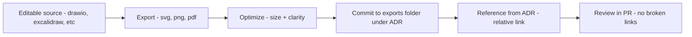

<!-- [KFM_META_BLOCK_V2]
doc_id: kfm://doc/1f2f0f5e-0b6e-4a4a-92ff-9f224b5a0a3c
title: ADR Asset Exports
type: standard
version: v1
status: draft
owners: KFM Maintainers (TODO)
created: 2026-03-01
updated: 2026-03-01
policy_label: public
related:
  - docs/adr/README.md
  - docs/adr/assets/README.md
tags:
  - kfm
  - adr
  - assets
  - exports
notes:
  - Exported (rendered) binaries used by ADRs (Architecture Decision Records).
  - Keep exports reproducible and traceable back to editable sources.
[/KFM_META_BLOCK_V2] -->

# ADR Asset Exports
Exported (rendered) binary assets referenced by ADRs — **reviewable, reproducible, and safe to publish**.


**Status:** Draft • **Owners:** `KFM Maintainers (TODO)` • **Scope:** ADR-only exports

**Quick nav:** [Purpose](#purpose) • [Where this fits](#where-this-fits-in-the-repo) • [What belongs here](#what-belongs-here) • [What-must-not-go-here](#what-must-not-go-here) • [Naming](#naming-and-folder-conventions) • [Workflow](#export-workflow) • [Checklist](#definition-of-done-for-a-new-export) • [Directory layout](#suggested-directory-layout) • [FAQ](#faq)

---

## Purpose

This directory contains **exported/rendered assets** used inside ADRs, such as:

- Diagrams exported from an editable source file (e.g., `.drawio`, `.excalidraw`, `.pptx`, `.key`, `.fig`, etc.)
- Rendered images for a markdown ADR (e.g., `.png`, `.svg`, `.pdf`)
- “Frozen” visuals that must remain stable across viewers (e.g., GitHub rendering differences)

**Principle:** exports are **derived artifacts**. Wherever possible, an export must be traceable to a source file and the ADR that uses it.

---

## Where this fits in the repo

ADRs live under the documentation tree (often under a `docs/**/adr/` area). This folder is the **binary-export side** of ADR assets: it exists so ADR markdown can reference stable images that survive tool/version drift.

If your repo uses `docs/architecture/adr/` rather than `docs/adr/`, this directory can still be used the same way — only the relative link paths change. (Keep it consistent within the repo.)

---

## What belongs here

### Allowed asset types (recommended)
| Type | Extensions | Use when | Notes |
|---|---|---|---|
| Vector diagrams | `.svg` | Most architecture diagrams | Preferred: diff-friendly and scalable |
| Raster images | `.png`, `.jpg` | Screenshots, raster-only visuals | Prefer `.png` for diagrams/screenshots |
| PDF exports | `.pdf` | Print-ready exports | Use for large diagrams or multi-page |
| Supporting bundles | `.zip` | Rare, only if needed | Must include rationale + source pointer |

### Required coupling (normative)
Every export **MUST** have:
1. A clear link to an ADR (via folder + filename convention), and  
2. A clear link to its editable source (either stored in `docs/adr/assets/src/` or referenced in the ADR text).

---

## What must NOT go here

**Do not** commit any of the following into `exports/`:

- **Sensitive or restricted** location information (exact coordinates, site locations, vulnerable facility layouts, etc.)
- **Unlicensed media** or images with unclear reuse rights
- **Generated artifacts with no source** (no “mystery PNGs”)
- Large “dump files” (raw exports, uncompressed videos, etc.) that belong in release artifacts or external storage
- Anything that should be served through a governed API boundary instead of the repo

> **WARNING:** If an export contains data-derived content (e.g., a map screenshot), treat it as a governed artifact: ensure attribution/rights are satisfied and do not leak restricted data.

---

## Naming and folder conventions

### Folder per ADR (preferred)
Use one folder per ADR, so reviewing and cleaning is easy:

- `ADR-XXXX__short-slug/` (e.g., `ADR-0017__policy-labels/`)

Inside each ADR folder, prefer semantic names:

- `context-diagram.v1.svg`
- `decision-flow.v2.svg`
- `ui-mock.v1.png`

### Filename format (recommended)
```
ADR-XXXX__short-slug__<asset-name>.v<revision>.<ext>
```

Examples:
- `ADR-0023__index-store__dataflow.v1.svg`
- `ADR-0023__index-store__tradeoffs-table.v1.png`

---

## Export workflow



### Practical rules
- Prefer **SVG** for diagrams whenever possible.
- Optimize exports (minify SVG, compress PNG) so diffs and clones stay fast.
- Keep exports **stable** (avoid re-exporting everything on small edits).

---

## Definition of Done for a new export

- [ ] The ADR markdown links to the export via **relative path**
- [ ] The export is placed under the correct ADR folder
- [ ] The editable source exists (in-repo or explicitly linked)
- [ ] The asset is readable at 100% zoom (no tiny fonts)
- [ ] No restricted/sensitive data is visible
- [ ] Rights/attribution are satisfied if third-party media is included
- [ ] File size is reasonable (optimize before commit)

---

## Suggested directory layout

> This is a **recommended** structure. If your repo already uses a different ADR asset layout, keep the README aligned with reality.

```
docs/adr/
  ADR-0001-some-decision.md
  ADR-0002-other-decision.md
  assets/
    exports/                      # <-- you are here
      ADR-0001__some-decision/
        context-diagram.v1.svg
      ADR-0002__other-decision/
        decision-tree.v1.png
    src/                          # (optional) editable sources
      ADR-0001__some-decision.drawio
      ADR-0002__other-decision.excalidraw
```

---

## FAQ

### Why commit exports at all if GitHub can render Mermaid?
Because:
- not all ADR visuals are Mermaid,
- some diagrams originate in design tools,
- exports can be used in PDFs, slide decks, and review systems consistently.

### Should exports be considered “canonical”?
No — exports are *derived*. The “canonical” thing is the ADR text plus its editable source artifact. Exports exist to make review and consumption easy.

### What if an ADR needs a restricted diagram?
Do **not** commit it here. Use a restricted channel/store governed by policy (repo-private area, encrypted store, or served through the API boundary), and reference it via an approved mechanism.

---

<a id="top"></a>
Back to top: [ADR Asset Exports](#adr-asset-exports)
