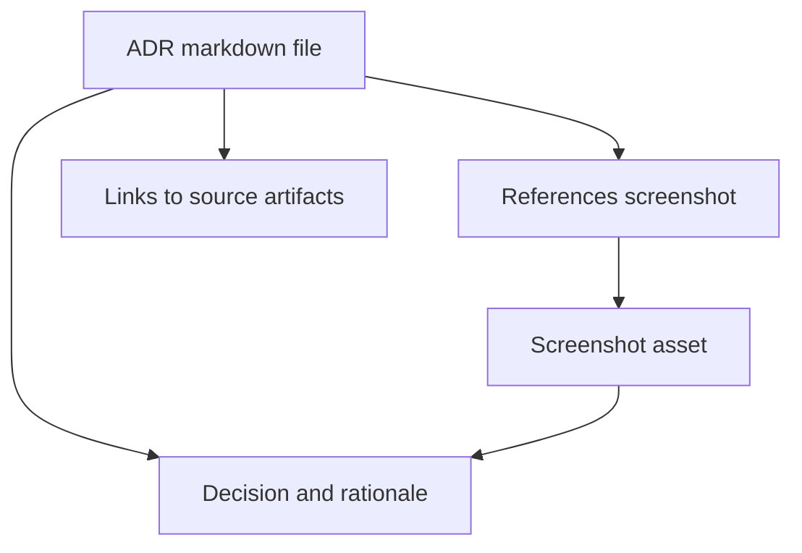

<!-- [KFM_META_BLOCK_V2]
doc_id: kfm://doc/4cc438a2-35e9-4c48-ae5e-690e33ce2e11
title: ADR Screenshots Assets
type: standard
version: v1
status: draft
owners: TBD
created: 2026-03-01
updated: 2026-03-01
policy_label: restricted
related:
  - docs/adr/
  - docs/adr/assets/
tags: [kfm, adr, assets, screenshots]
notes:
  - This directory stores screenshots that are referenced by ADRs.
  - Default-deny: treat new screenshots as restricted until reviewed/redacted.
[/KFM_META_BLOCK_V2] -->

# ADR Screenshots Assets
Evidence-supporting screenshots referenced by Architecture Decision Records (ADRs).


---

## Quick navigation
- [Purpose](#purpose)
- [Where this fits](#where-this-fits)
- [Directory layout](#directory-layout)
- [Naming conventions](#naming-conventions)
- [Governance and safety](#governance-and-safety)
- [How to add a screenshot](#how-to-add-a-screenshot)
- [Reference patterns](#reference-patterns)
- [Appendix](#appendix)

---

## Purpose
This folder contains **screenshots that are embedded in ADR markdown files** to make decisions easier to review later (UI states, diagrams captured from tools, console output, dashboards, etc.).

Screenshots are **supporting evidence**, not the only evidence. When possible, ADRs should also link to the underlying source artifacts (configs, logs, specs, PRs) so the decision is reproducible.

> **NOTE**
> Keep screenshots small, readable, and attributable. If a screenshot can’t be shared safely, don’t commit it—add a redacted alternative or describe it in text.

[Back to top](#quick-navigation)

---

## Where this fits
**Repo location (this file):**
- `docs/adr/assets/screenshots/README.md`

**Typical usage:**
- ADRs typically live under `docs/adr/`
- An ADR references one or more images from `docs/adr/assets/screenshots/…`



[Back to top](#quick-navigation)

---

## Directory layout
Current directory (minimum required):

```
docs/adr/assets/screenshots/
  README.md
  <image files live here>
```

Recommended (optional) organization (keeps assets from different ADRs from colliding):

```
docs/adr/assets/screenshots/
  README.md
  adr-0001/
    adr-0001--decision-title--2026-03-01--v1.png
  adr-0002/
    adr-0002--decision-title--2026-03-01--v1.png
```

> **TIP**
> If you don’t have ADR numeric IDs, use the ADR filename slug instead (example: `adr--pep-policy-boundary/…`).

[Back to top](#quick-navigation)

---

## Naming conventions
Use stable, grep-friendly names so reviewers can trace images to the ADR that uses them.

### Recommended filename format
`adr-<id-or-slug>--<short-topic>--<yyyy-mm-dd>--v<nn>.<ext>`

Examples:
- `adr-0012--policy-enforcement-boundary--2026-03-01--v1.png`
- `adr-pep-boundary--api-request-flow--2026-03-01--v2.webp`

### File formats
| Format | Use when | Notes |
|---|---|---|
| `.png` | Default for UI screenshots and console output | Lossless, predictable |
| `.webp` | Large UI captures that still need good quality | Prefer when size is a problem |
| `.svg` | Only for vector diagrams (not “screenshots”) | Keep text selectable |

### Versioning rule
Do **not** overwrite screenshots that have shipped in a decision record.
- If an image needs to change, add a new file (`--v2`) and update the ADR link.

[Back to top](#quick-navigation)

---

## Governance and safety
This directory is part of the documentation surface area and must respect KFM governance norms (evidence-first, policy-aware, default-deny when unclear).

### Never commit these
- Secrets (tokens, passwords, API keys), cookies, bearer headers
- Personal data (names, emails, phone numbers) unless explicitly permitted
- Precise coordinates or directions to vulnerable/private/culturally restricted sites
- Internal-only endpoints or infrastructure details that raise security risk

### Redaction expectations
If a screenshot is useful but contains sensitive content:
- Prefer **regenerating the screenshot** in a safe test environment
- Otherwise blur/blackout sensitive regions and note the redaction in the ADR text

> **WARNING**
> When in doubt, treat the screenshot as **restricted** and keep it out of version control until governance review clears it.

### Review checklist
Before committing, confirm:
- [ ] No secrets or credentials are visible
- [ ] No sensitive personal data is visible
- [ ] Any location-sensitive content is generalized/redacted
- [ ] The ADR includes enough context to interpret the screenshot (caption + why it matters)
- [ ] The ADR links to the underlying “source of truth” artifact(s) where feasible

[Back to top](#quick-navigation)

---

## How to add a screenshot
1. **Capture**
   - Use a deterministic source if possible (exported diagram, saved dashboard state).
2. **Sanitize**
   - Remove/blur secrets, personal data, and sensitive locations.
3. **Optimize**
   - Keep files reasonably small (rule of thumb: aim for < 1–2 MB).
4. **Place**
   - Save under `docs/adr/assets/screenshots/` (optionally inside an ADR-specific subfolder).
5. **Reference**
   - Link it from the ADR markdown using a relative path.
6. **Document**
   - Add 1–2 lines in the ADR describing *what the screenshot shows* and *where it came from*.

[Back to top](#quick-navigation)

---

## Reference patterns
### In an ADR markdown file
Typical relative reference (from `docs/adr/<adr-file>.md`):

```md

```

### Captioning pattern
Keep captions close to the image and connect them to the decision:

```md
_Figure 1. API request flow at decision time. This diagram supports the decision to enforce policy at the governed API boundary._
```

[Back to top](#quick-navigation)

---

## Appendix
<details>
<summary>Optional sidecar metadata template</summary>

If you need stronger traceability (recommended for complex or sensitive screenshots), add a sidecar file next to the image:

`<image>.meta.yml`

```yaml
id: adr-0012--policy-enforcement-boundary--2026-03-01--v1
captured_at: 2026-03-01T00:00:00-06:00
source:
  type: diagram-export
  tool: drawio
  ref: docs/adr/assets/diagrams/adr-0012.drawio
policy_label: restricted
redactions:
  - area: top-right
    reason: internal hostnames
notes:
  - "Keep this screenshot in sync with ADR-0012 rationale."
```
</details>

[Back to top](#quick-navigation)
