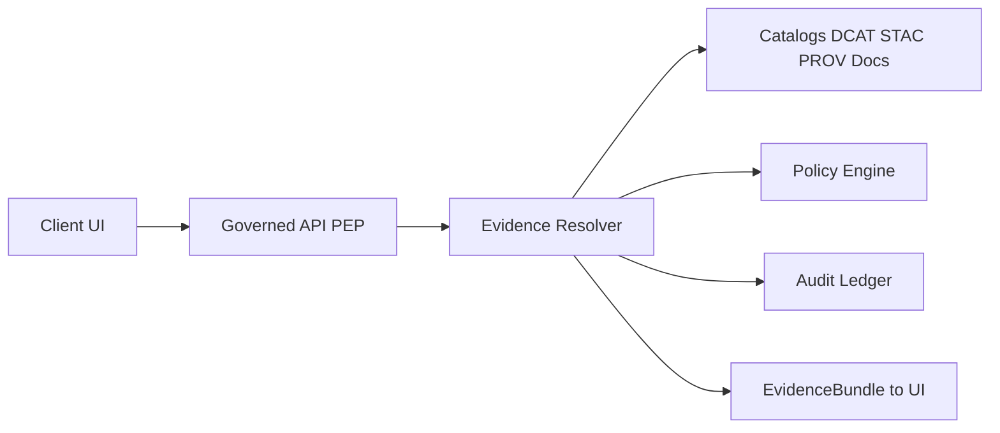
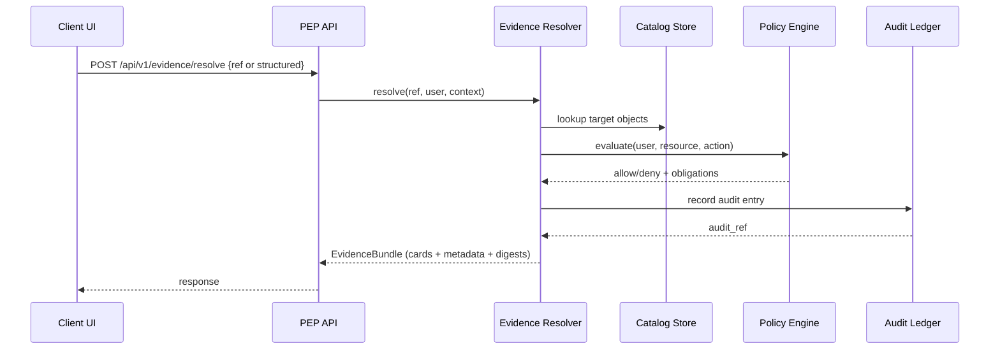

<!-- [KFM_META_BLOCK_V2]
doc_id: kfm://doc/9f6f8b9f-2a6f-43b4-9cf4-7e39ee9d0a8c
title: ADR 0006 Dossier — EvidenceRef & EvidenceBundle Resolution
type: standard
version: v1
status: draft
owners: TODO (assign steward + eng owner)
created: 2026-03-01
updated: 2026-03-01
policy_label: public
related:
  - ../../0006-evidence-ref-and-bundle-resolution.md   # TODO: confirm ADR path/name
  - ../../../standards/KFM_DCAT_PROFILE.md             # TODO: confirm path
  - ../../../standards/KFM_STAC_PROFILE.md             # TODO: confirm path
  - ../../../standards/KFM_PROV_PROFILE.md             # TODO: confirm path
  - ../../../governance/REVIEW_GATES.md                # TODO: confirm path
tags: [kfm, adr, dossiers, evidence, provenance, policy, api, ui]
notes:
  - Dossier expands ADR 0006 into concrete contracts, test vectors, and thin-slice implementation guidance.
[/KFM_META_BLOCK_V2] -->

# ADR 0006 Dossier: EvidenceRef & EvidenceBundle Resolution
**Purpose:** define how *citations* become *inspectable, policy-safe evidence* across Map Explorer, Story Nodes, and Focus Mode.


> [!NOTE]
> This dossier is **additive glue**, not a repo-wide rewrite. It exists to make ADR 0006 *buildable, testable, and reversible*.

---

## Quick navigation
- [Why this exists](#why-this-exists)
- [Decision snapshot](#decision-snapshot)
- [Key concepts](#key-concepts)
- [EvidenceRef](#evidenceref)
- [EvidenceBundle](#evidencebundle)
- [Bundle resolution contract](#bundle-resolution-contract)
- [CI gates and anti-hallucination checks](#ci-gates-and-anti-hallucination-checks)
- [UI integration expectations](#ui-integration-expectations)
- [Risks and mitigations](#risks-and-mitigations)
- [Thin-slice implementation plan](#thin-slice-implementation-plan)
- [Open questions](#open-questions)
- [Directory contract](#directory-contract)

---

## Why this exists
KFM’s “trust membrane” depends on one invariant:

> **No user-facing claim ships without evidence that is resolvable, inspectable, and policy-allowed.**

This dossier is the concrete spec for:
- **EvidenceRef**: what we store in features/stories/answers as “a citation”
- **EvidenceBundle**: what we show to humans (cards) and what we return to machines (digests + metadata)
- **Resolver behavior**: how we turn the former into the latter, **fail-closed**, with **audit references**

[⬆️ Back to top](#adr-0006-dossier-evidenceref--evidencebundle-resolution)

---

## Decision snapshot

### What’s confirmed vs proposed vs unknown
| Topic | Status | Meaning in practice | Where to verify |
|---|---:|---|---|
| Citation is **EvidenceRef**, not pasted URLs | **Confirmed** | Stories + Focus Mode cite only EvidenceRefs | ADR 0006 + KFM guide excerpts (see sources in response notes) |
| Minimal scheme set: `dcat://`, `stac://`, `prov://`, `doc://`, `graph://` | **Confirmed** | Resolver must handle these schemes (at least) | Profiles + resolver contract tests |
| EvidenceRefs are parseable without network calls | **Confirmed** | Grammar must be unambiguous; resolver rejects invalid syntax | Resolver parser + CI lint |
| Resolver must accept EvidenceRef **or structured reference** | **Confirmed** | UI can pass `{dataset_version_id, record_id, span}` when needed | API contract |
| Resolver applies policy and returns obligations | **Confirmed** | Same EvidenceRef may resolve differently for different roles | Policy pack + tests |
| EvidenceBundle is immutable by digest; includes policy, rights, provenance, artifacts | **Confirmed** | Cache safely; rehosting doesn’t break citations | Bundle schema + tests |
| Exact EvidenceRef grammar details | **Proposed here** | ABNF + examples below | Convert to Confirmed by implementing parser + fixtures |
| Exact endpoint request/response schema | **Proposed here** | JSON schema + OpenAPI patch | Convert to Confirmed by publishing OpenAPI + contract tests |
| Where catalogs live (repo paths, object store layout, etc.) | **Unknown** | Don’t hardcode paths in clients | Confirm repo structure + deployment config |

> [!WARNING]
> If an item is **Unknown**, this dossier treats it as **default-deny** and requires a verification step before promotion.

[⬆️ Back to top](#adr-0006-dossier-evidenceref--evidencebundle-resolution)

---

## Key concepts
- **EvidenceRef**: a stable, parseable reference to an immutable dataset version + (optional) span/asset/row.
- **EvidenceBundle**: the resolver output: human cards + machine metadata + digests + audit references.
- **Obligation**: a required transformation or UX notice (e.g., “geometry generalized”, “remove attributes”).
- **Policy label**: a classification input (e.g., public, restricted, public_generalized).
- **Fail-closed**: if we can’t resolve **or** can’t authorize, we return a denial without leaking sensitive metadata.

---

## EvidenceRef

### Principles
EvidenceRefs must:
1. Resolve to a **stable, inspectable view** (not a fragile URL)
2. Encode an **immutable dataset version**
3. Survive rehosting (canonical IDs; not environment-specific paths)
4. Be **parseable locally** (no network calls required to parse)
5. Be resolvable into DCAT/STAC/PROV/Docs/Graph *without guessing*

### Minimal supported scheme set (confirmed)
- `dcat://...@...`
- `stac://...#asset=...`
- `prov://...`
- `doc://sha256:...#page=...&span=...:...`
- `graph://...` (optional early if graph is enabled)

### Proposed grammar (ABNF-like)
This is a **proposal** meant to be converted into:
- a shared parser library (server + UI)
- fixture-based tests (valid + invalid)

```text
EvidenceRef = Scheme "://" Body [ "#" Fragment ]

Scheme     = "dcat" / "stac" / "prov" / "doc" / "graph"

; --- Scheme-specific bodies (PROPOSED minimal forms) ---

; Dataset and/or distribution references
dcat-body  = dataset-id "@" dataset-version [ "/" dcat-subpath ]
dcat-subpath = "distribution" "/" dist-id

; STAC asset references
stac-body  = stac-path
stac-path  = *( pchar / "/" )            ; collection/item identifiers, no spaces
Fragment   = stac-fragment / doc-fragment / *( pchar / "&" / "=" / ":" )
stac-fragment = "asset=" asset-key

; PROV references (run/activity/entity)
prov-body  = prov-kind "/" prov-id
prov-kind  = "run" / "activity" / "entity" / "agent"

; Document references pinned by content digest
doc-body   = "sha256:" hex-digest
doc-fragment = "page=" 1*DIGIT "&span=" 1*DIGIT ":" 1*DIGIT

; Graph references (entity/edge)
graph-body = graph-kind "/" graph-id
graph-kind = "entity" / "edge"

dataset-id      = 1*( ALPHA / DIGIT / "_" / "-" )
dataset-version = 1*( ALPHA / DIGIT / "_" / "-" / "." )
dist-id         = 1*( ALPHA / DIGIT / "_" / "-" / "." )
asset-key       = 1*( ALPHA / DIGIT / "_" / "-" / "." )
prov-id         = 1*( ALPHA / DIGIT / "_" / "-" / ":" / "." )
graph-id        = 1*( ALPHA / DIGIT / "_" / "-" / ":" / "." )
hex-digest      = 64HEXDIG
pchar           = ALPHA / DIGIT / "_" / "-" / "." / ":" / "@" / "%"
```

### Examples
> These examples are intentionally “boring” and deterministic.

```text
# DCAT dataset version (common case)
dcat://noaa_ncei_storm_events@2026-02.abcd1234

# PROV run
prov://run/2026-02-20T12:34Z.abcd

# Document: pin by sha256, cite page + OCR span (character offsets)
doc://sha256:abcdabcdabcdabcdabcdabcdabcdabcdabcdabcdabcdabcdabcdabcdabcdabcd#page=12&span=1832:1935

# STAC asset (example)
stac://sentinel2/2026-02-19/item-000123#asset=visual

# Graph entity (example)
graph://entity/kfm:place:wichita
```

### Structured reference input (confirmed behavior)
The resolver may accept a structured reference when the caller has the pieces but does not want to build a string (or when a ref points to a specific record/span):

```json
{
  "dataset_version_id": "2026-02.abcd1234",
  "record_id": "row:12345",
  "span": { "page": 12, "start": 1832, "end": 1935 },
  "kind": "doc"
}
```

> [!TIP]
> Keep EvidenceRef parsing **separate** from resolution. Parsing is purely syntactic and must be deterministic.

[⬆️ Back to top](#adr-0006-dossier-evidenceref--evidencebundle-resolution)

---

## EvidenceBundle

### Required properties (confirmed)
An EvidenceBundle must include (minimum):
- **bundle_id** + digest (stable identifier for caching, immutability)
- **policy decision** + obligations applied
- **rights/license metadata**
- **dataset_version_id**
- **artifact digests** (and links only if allowed)
- **provenance links** (PROV/run receipts)
- **audit_ref** (to replay / review)

Bundles:
- are **immutable by digest**
- can include **multiple evidence cards**
- must not include restricted artifacts for unauthorized roles

### Human vs machine split
**Human:** cards that can be rendered consistently (Evidence Drawer / Focus citations)  
**Machine:** structured metadata + digests + stable IDs

### Proposed canonical JSON shape (based on documented template)
```json
{
  "bundle_id": "sha256:bundle...",
  "dataset_version_id": "2026-02.abcd1234",
  "title": "Storm event record: 2026-02-19",
  "policy": {
    "decision": "allow",
    "policy_label": "public",
    "obligations_applied": []
  },
  "license": {
    "spdx": "CC-BY-4.0",
    "attribution": "Source org"
  },
  "provenance": {
    "run_id": "kfm://run/2026-02-20T12:00:00Z.abcd"
  },
  "artifacts": [
    {
      "href": "processed/events.parquet",
      "digest": "sha256:2222",
      "media_type": "application/x-parquet"
    }
  ],
  "checks": {
    "catalog_valid": true,
    "links_ok": true
  },
  "audit_ref": "kfm://audit/entry/123",
  "cards": [
    {
      "type": "dataset",
      "title": "NOAA Storm Events",
      "subtitle": "Dataset version 2026-02.abcd1234",
      "badges": ["public", "CC-BY-4.0"]
    },
    {
      "type": "provenance",
      "title": "Run receipt",
      "subtitle": "kfm://run/2026-02-20T12:00:00Z.abcd"
    }
  ]
}
```

> [!NOTE]
> `cards[]` is how we avoid “UI logic in the client.” The server returns renderable cards so UI stays thin and consistent.

[⬆️ Back to top](#adr-0006-dossier-evidenceref--evidencebundle-resolution)

---

## Bundle resolution contract

### What “resolution” means
Resolution is the **policy-aware** mapping:

> `EvidenceRef` → `EvidenceBundle`

Resolution must work consistently for:
- feature click (Map Explorer)
- story citation click (Story Nodes)
- Focus Mode citations (answers)

### Required endpoint
- `POST /api/v1/evidence/resolve`

### Required behaviors (confirmed)
- Accept `EvidenceRef` **or** structured reference
- Apply policy, return allow/deny + obligations
- Return EvidenceBundle (cards + machine metadata + digests + audit refs)
- Usable from the UI in **≤ 2 calls**
- Fail closed if unresolvable/unauthorized (and return policy-safe errors)

### Proposed request/response (OpenAPI-ready shape)
```json
// Request
{
  "ref": "dcat://noaa_ncei_storm_events@2026-02.abcd1234",
  "context": {
    "story_id": "kfm://story/<uuid>",
    "intended_policy_label": "public"
  }
}
```

```json
// Response (allow)
{
  "decision": "allow",
  "bundle": { "... EvidenceBundle ..." }
}
```

```json
// Response (deny - fail closed)
{
  "decision": "deny",
  "error": {
    "code": "EVIDENCE_DENIED",
    "message": "Not authorized for requested evidence.",
    "policy_label": "restricted",
    "obligations": [
      { "type": "show_notice", "message": "Evidence exists but is restricted." }
    ]
  }
}
```

> [!WARNING]
> In deny responses, **do not leak** sensitive metadata (titles, precise locations, filenames) beyond what policy allows.

### Resolution pipeline (reference)


### Interaction sequence


[⬆️ Back to top](#adr-0006-dossier-evidenceref--evidencebundle-resolution)

---

## CI gates and anti-hallucination checks

### Minimum required checks (confirmed direction)
CI must verify:
- DCAT/STAC/PROV schemas validate
- Cross-links resolve (DCAT ↔ STAC ↔ PROV)
- Evidence resolver contract tests:
  - public evidence resolves to bundle with allowed artifacts
  - restricted evidence returns 403-style denial **without sensitive leakage**
- `spec_hash` stability tests
- golden tests for canonicalization / deterministic outputs

### Citation linting (confirmed direction)
Before merging a Story Node:
- syntax check for EvidenceRefs
- resolver check (in test env)
- policy check (allowed for story’s policy label)
- rights check (rights metadata exists when media is included)

> [!IMPORTANT]
> A Story Node cannot be merged if citations fail.

### Proposed gate checklist (turn into CI)
- [ ] `evidence_ref_lint`: parse + normalize + reject ambiguous
- [ ] `evidence_resolve_contract`: public allow + restricted deny/no leak
- [ ] `bundle_hash_golden`: bundle_id stable for the same inputs
- [ ] `catalog_link_check`: all promoted datasets have consistent cross-links
- [ ] `story_publish_gate`: requires review_state + resolvable citations

[⬆️ Back to top](#adr-0006-dossier-evidenceref--evidencebundle-resolution)

---

## UI integration expectations

### Evidence Drawer (Map Explorer)
Baseline expectation:
- a user clicks a feature → evidence drawer opens
- drawer shows **license + dataset version**
- keyboard navigation works

### Story Nodes
- citations open the same evidence drawer
- publish gate checks review state + resolvable citations

### Focus Mode
- cite-or-abstain
- citations must resolve via evidence resolver
- evaluation harness uses golden queries and blocks regressions

> [!TIP]
> Keep evidence UX consistent: “click → resolve → view bundle” should feel identical across Map, Story, Focus.

[⬆️ Back to top](#adr-0006-dossier-evidenceref--evidencebundle-resolution)

---

## Risks and mitigations

| Risk | Why it matters | Mitigation (expected) |
|---|---|---|
| Non-resolvable citations | Broken trust surface; stories can’t publish | Resolver contract + citation linting in CI + publish gate |
| Sensitive location leakage | Harmful targeting; policy breach | Restricted precise + public generalized derivatives; redaction tests; default-deny |
| Licensing violation | Legal + reputational | Rights metadata gate; metadata-only mode; steward review |
| Hash drift / version confusion | “Same ref, different bundle” breaks reproducibility | Canonical JSON hashing + golden hash tests + store hashed spec |

[⬆️ Back to top](#adr-0006-dossier-evidenceref--evidencebundle-resolution)

---

## Thin-slice implementation plan

> [!NOTE]
> Each slice must be reviewable, reversible, and should improve the system even if later slices slip.

### Slice 0 — Contracts first
Deliver:
- `schemas/evidence_ref.schema.json` (or equivalent)
- `schemas/evidence_bundle.schema.json`
- fixtures: valid + invalid EvidenceRefs; example bundles
- parser library used by server + UI

DoD:
- CI fails on invalid fixtures
- parser normalizes but does not resolve

### Slice 1 — Resolver MVP (single pilot dataset)
Deliver:
- `POST /api/v1/evidence/resolve` implemented for:
  - `dcat://` dataset version refs
  - `prov://run/...` refs
  - (optional) one `doc://` example
- default-deny policy wiring (even if policy is “stubbed” behind an interface)

DoD:
- public evidence resolves
- restricted evidence denies without leakage
- bundle_id is stable for same input + policy context

### Slice 2 — Wire to UI evidence drawer
Deliver:
- EvidenceDrawer calls resolver
- renders cards + license/version
- e2e: feature click and citation click both open same bundle view

DoD:
- keyboard navigation verified
- evidence drawer reachable in ≤2 calls

### Slice 3 — Publish gate + Focus verifier
Deliver:
- story publish gate blocks on unresolvable/unauthorized citations
- Focus Mode citation verification hard gate
- golden tests prevent regressions

DoD:
- merge blocked on citation failures
- replayable audit refs in Focus output

[⬆️ Back to top](#adr-0006-dossier-evidenceref--evidencebundle-resolution)

---

## Open questions
Track these as issues and resolve via ADR patches (small diffs).

1. **Canonical dataset_id syntax** (allowed characters, namespacing rules)
2. **Bundle hashing standard** (e.g., RFC 8785 canonical JSON; what fields included in digest)
3. **Error model** (exact codes, which fields safe to return on deny)
4. **Graph enablement** (when `graph://` becomes required vs optional)
5. **Evidence distribution strategy** (repo vs object store vs OCI artifacts by digest)
6. **Doc span stability** (OCR versioning and span mapping across OCR reruns)

---

## Directory contract

### Where this fits
This folder is an **ADR dossier**: deeper design + test vectors + implementation slices for ADR 0006.

### Acceptable inputs (what belongs here)
- resolver contract drafts (OpenAPI patches)
- EvidenceRef grammar + parser test vectors
- example bundles (public + restricted)
- UX notes for Evidence Drawer rendering
- CI gate descriptions (how to fail closed)
- small diagrams (Mermaid preferred)

### Exclusions (what must not go here)
- production source code (put code under `src/` with tests)
- large binary datasets
- secrets, tokens, credentials
- anything that would bypass policy or expose restricted locations/fields

### Proposed folder tree
<details>
<summary>Planned contents (create as needed)</summary>

```text
docs/adr/dossiers/0006-evidence-ref-and-bundle-resolution/
├── README.md
├── examples/
│   ├── evidence_ref.valid.txt
│   ├── evidence_ref.invalid.txt
│   ├── evidence_bundle.public.json
│   └── evidence_bundle.restricted.json
├── diagrams/
│   └── evidence_resolution.mmd
└── notes/
    ├── open-questions.md
    └── api-contract-notes.md
```

</details>

[⬆️ Back to top](#adr-0006-dossier-evidenceref--evidencebundle-resolution)# Dossier: ADR 0006

Supporting material for `0006-evidence-ref-and-bundle-resolution.md`.
