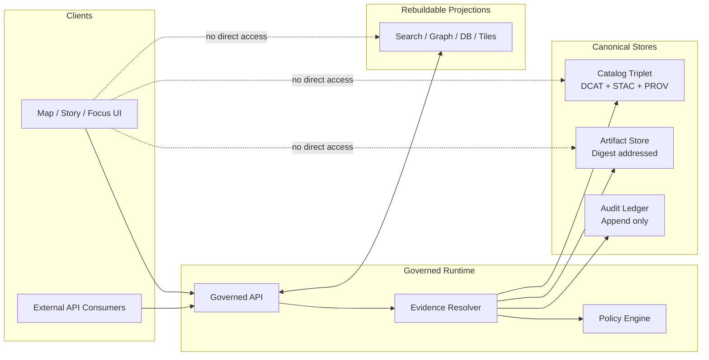
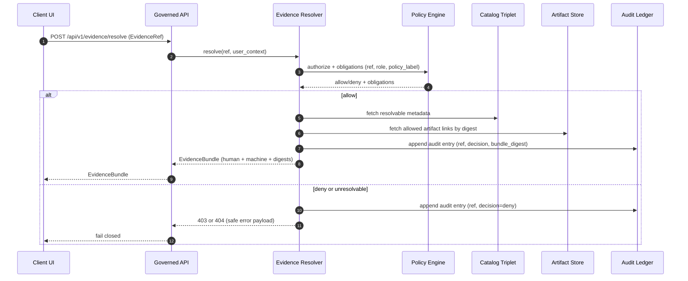
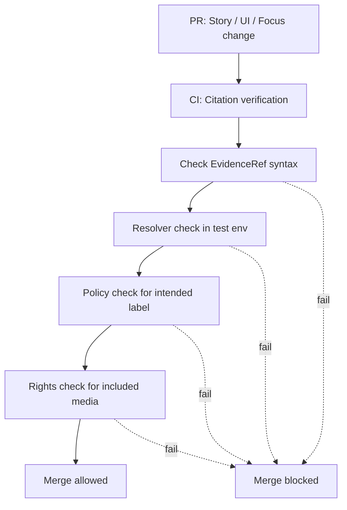

<!-- [KFM_META_BLOCK_V2]
doc_id: kfm://doc/a8a3b4d0-4c61-4c0a-8e52-9b2b1845c9cf
title: ADR 0006 Diagrams — EvidenceRef & EvidenceBundle Resolution
type: standard
version: v1
status: draft
owners: KFM Maintainers (TODO: set CODEOWNERS)
created: 2026-03-01
updated: 2026-03-01
policy_label: restricted
related:
  - docs/adr/dossiers/0006-evidence-ref-and-bundle-resolution/
tags: [kfm, adr, evidence, diagrams]
notes:
  - Directory README documenting diagram conventions + registry for ADR 0006.
[/KFM_META_BLOCK_V2] -->

# ADR 0006 — EvidenceRef & EvidenceBundle Resolution Diagrams

**Purpose:** Visual reference for how KFM resolves `EvidenceRef` → policy-filtered `EvidenceBundle` (and how that is enforced in API/UI/CI).


> NOTE: Treat diagrams as **governed artifacts**. If a diagram contradicts the ADR, the diagram is wrong (or the ADR needs an explicit change).

---

## Quick links

- [Overview](#overview)
- [Directory contract](#directory-contract)
- [Diagram registry](#diagram-registry)
- [Core diagrams](#core-diagrams)
- [Conventions](#conventions)
- [Rendering](#rendering)
- [Definition of Done](#definition-of-done)
- [Appendix](#appendix)

---

## Overview

ADR 0006 covers how the platform resolves citations and evidence links:

- **EvidenceRefs are not free-form URLs.** They are stable, scheme-qualified references (e.g., `dcat://…`, `stac://…`, `prov://…`, `doc://…`, `graph://…`).
- The **evidence resolver**:
  - accepts an `EvidenceRef` (or structured reference),
  - applies **policy** (allow/deny + obligations),
  - returns an **EvidenceBundle** containing *human* cards + *machine* metadata + digests + audit references,
  - stays **bounded** (UI should resolve evidence in ≤ 2 calls),
  - **fails closed** if a ref is unresolvable or unauthorized.

This folder exists so reviewers and implementers can quickly answer:

- “What happens when someone clicks a citation or feature?”
- “Where does policy apply?”
- “What must CI enforce to prevent uncited narratives?”

---

## Directory contract

### Where it fits

`docs/adr/dossiers/0006-evidence-ref-and-bundle-resolution/diagrams/` contains diagrams that are **owned by ADR 0006** and referenced by dossier docs + implementation tasks.

### Directory layout

**Recommended** (adjust if your repo uses a different convention):

```text
diagrams/                                              # Shared diagram hub (sources + exports; policy-safe; linted where possible)
├─ README.md                                           # This file (diagram registry + naming conventions + export rules)
├─ src/                                                # OPTIONAL: editable diagram sources (preferred over binaries)
│  ├─ D0006-*.mmd                                      # Mermaid sources (lint-friendly; preferred)
│  └─ D0006-*.puml                                     # PlantUML sources (if Mermaid is insufficient)
└─ rendered/                                           # OPTIONAL: deterministic exports (for tooling/viewers that need SVG/PNG)
   └─ D0006-*.svg                                      # Rendered SVG exports (generated; commit only if policy allows)
```

### Acceptable inputs

- Diagram sources:
  - Mermaid (`.mmd`) — preferred
  - PlantUML (`.puml`) — optional
  - Draw.io (`.drawio`) — only if exported to SVG and the source is committed
- Rendered outputs:
  - SVG (`.svg`) preferred
  - PNG (`.png`) allowed for screenshots only
- Small supporting assets (icons) **only if licensed** and policy-safe.

### Exclusions

- Large binaries without editable source (no source = no merge).
- Diagrams that include **restricted coordinates**, PII, secrets, internal tokens.
- Vendor diagrams or images without clear rights.

> WARNING: If a diagram must include restricted implementation detail, treat it as **restricted** and trigger governance review.

---

## Diagram registry

This table is the **index** for ADR 0006 diagrams. Keep it accurate.

| ID | Title | What it explains | Source | Rendered | Status |
|---:|---|---|---|---|---|
| D0006-01 | Trust membrane + evidence resolution context | Component boundaries & stores | (in this README) | n/a | draft |
| D0006-02 | Evidence resolution sequence | Request → policy → bundle → audit | (in this README) | n/a | draft |
| D0006-03 | Citation verification in CI | Syntax → resolve → policy → rights gates | (in this README) | n/a | draft |
| D0006-04 | Evidence bundle shape | Required fields & immutability | (snippet) | n/a | draft |

> TODO: Once extracted into files, set `Source` to `src/<file>.mmd` and `Rendered` to `rendered/<file>.svg`.

---

## Core diagrams

### D0006-01 — Context: trust membrane + evidence resolution



### D0006-02 — Sequence: resolving an EvidenceRef



### D0006-03 — CI gate: citation verification must fail closed



### D0006-04 — EvidenceBundle shape (illustrative)

This is a **minimal, human-inspectable** bundle shape. Treat it as a contract sketch unless the dossier defines a stricter schema.

```json
{
  "bundle_id": "sha256:bundle...",
  "dataset_version_id": "2026-02.abcd1234",
  "title": "Example record",
  "policy": {
    "decision": "allow",
    "policy_label": "public",
    "obligations_applied": []
  },
  "license": { "spdx": "CC-BY-4.0", "attribution": "Source org" },
  "provenance": { "run_id": "kfm://run/<run-id>" },
  "artifacts": [
    { "href": "processed/<file>", "digest": "sha256:<digest>", "media_type": "application/x-parquet" }
  ],
  "checks": { "catalog_valid": true, "links_ok": true },
  "audit_ref": "kfm://audit/<entry-id>"
}
```

---

## Conventions

### Diagram naming

Use stable IDs so ADR text, issues, and code comments can refer to diagrams without ambiguity:

- `D0006-<NN>-<slug>.mmd` (preferred)
- Example: `D0006-02-evidence-resolve-sequence.mmd`

### Diagram scope rules

- Diagrams **must** show where policy decisions happen (and where they do *not*).
- Diagrams **must** show the trust membrane boundary: client → governed API → repositories → stores.
- Diagrams **must not** imply “best effort” evidence resolution. If a ref can’t resolve, we fail closed.

### When you add a new diagram

1. Add it to the registry table.
2. Link it from the dossier decision record (so reviewers see it).
3. If it affects runtime behavior, add/adjust a CI test or contract note.

---

## Rendering

GitHub renders Mermaid in Markdown automatically. If you need **exported SVGs**:

```bash
# Optional: render Mermaid to SVG (requires Node + mermaid-cli)
# PROPOSED convention: keep sources in src/ and exports in rendered/
npx --yes @mermaid-js/mermaid-cli -i src/D0006-01-context.mmd -o rendered/D0006-01-context.svg
```

> TIP: Keep rendered artifacts deterministic (pin tool versions) if you commit them.

---

## Definition of Done

A diagram change (or new diagram) is “done” when:

- [ ] Registry row exists (ID, title, purpose, source, status).
- [ ] Source diagram is committed (Mermaid/PlantUML/etc.).
- [ ] Diagram does **not** introduce restricted leakage (reviewed).
- [ ] Dossier doc links to the diagram.
- [ ] Any new requirement implied by the diagram is reflected in:
  - [ ] contract text, and/or
  - [ ] policy tests, and/or
  - [ ] resolver integration tests.

---

## Appendix

<details>
<summary>Minimum verification steps (repo hygiene)</summary>

When you have the live repo tree available:

1. Confirm what diagram source formats are already used in this repo (Mermaid vs PlantUML vs Draw.io).
2. List files in this folder and update the registry table to match reality.
3. Ensure every diagram referenced by ADR 0006 has a stable filename and is link-checked in CI.

</details>

<details>
<summary>Legend</summary>

- **EvidenceRef**: scheme-qualified reference to inspectable evidence.
- **EvidenceBundle**: policy-filtered, digest-addressed resolved view (human + machine fields).
- **Obligations**: required redaction/generalization/actions returned by policy evaluation.
- **Fail closed**: deny by default; do not guess; do not return partial sensitive hints.

</details>

---

[Back to top](#adr-0006--evidenceref--evidencebundle-resolution-diagrams)
