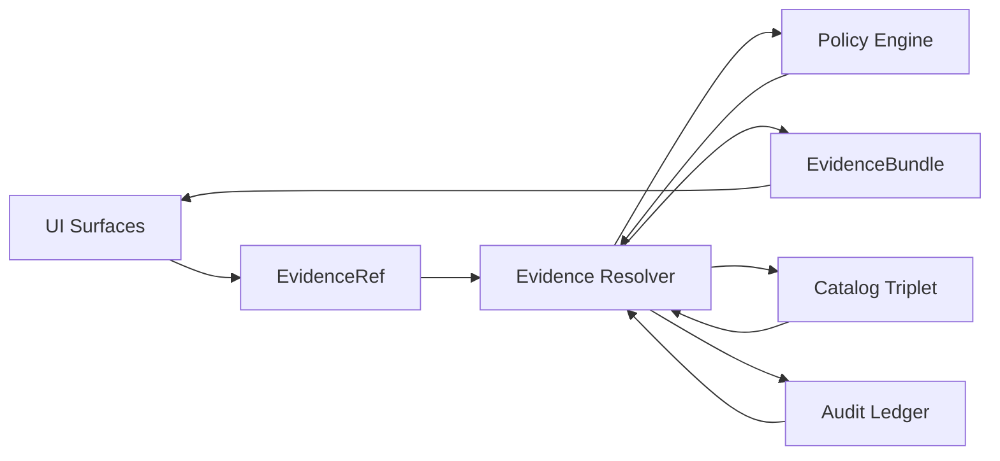

<!-- [KFM_META_BLOCK_V2]
doc_id: kfm://doc/8a2b7f6c-3c9f-4f2d-bc63-2e0dfc2b0c5a
title: ADR-0006 Evidence — EvidenceRef & EvidenceBundle Resolution
type: standard
version: v1
status: draft
owners: TODO (set CODEOWNERS / steward group)
created: 2026-03-01
updated: 2026-03-01
policy_label: public
related:
  - ../README.md
  - ../../README.md
  - ../../0006-evidence-ref-and-bundle-resolution.md
tags: [kfm, adr, evidence, citations, resolver]
notes:
  - Fixtures + test vectors proving EvidenceRef parsing + EvidenceBundle resolution + fail-closed policy behavior.
[/KFM_META_BLOCK_V2] -->

# ADR-0006 Evidence — EvidenceRef & EvidenceBundle Resolution

> **Purpose:** Store *proof artifacts* (fixtures, examples, expected outputs) showing that **EvidenceRefs resolve into policy-filtered EvidenceBundles** and that failures are **fail-closed** (no guessing, no leakage).


<!-- TODO: add CI badge once workflow name/path confirmed -->

## Quick navigation

- [Why this folder exists](#why-this-folder-exists)
- [Where it fits](#where-it-fits)
- [What lives here](#what-lives-here)
- [What must not live here](#what-must-not-live-here)
- [Contract we are proving](#contract-we-are-proving)
- [EvidenceRef schemes](#evidenceref-schemes)
- [EvidenceBundle shape](#evidencebundle-shape)
- [Test vector matrix](#test-vector-matrix)
- [Proposed directory layout](#proposed-directory-layout)
- [Definition of done](#definition-of-done)
- [Appendix](#appendix)

---

## Why this folder exists

ADR-0006 establishes a repo-wide rule:

- A “citation” is an **EvidenceRef**, not a pasted URL.
- The system resolves EvidenceRefs through the **evidence resolver** into an **EvidenceBundle** (human-view + machine metadata + digests + audit refs).
- Publishing (Story Nodes) and answering (Focus Mode) are **gated** on resolvable, policy-allowed citations.

This folder is the *evidence dossier* for that rule:
- reviewers can inspect examples,
- CI can run contract tests using fixtures,
- maintainers can evolve the contract without breaking trust surfaces.

[Back to top](#adr-0006-evidence--evidenceref--evidencebundle-resolution)

---

## Where it fits

This directory lives under:

- `docs/adr/dossiers/0006-evidence-ref-and-bundle-resolution/evidence/`

It is **not** the product’s runtime evidence store. It is:
- documentation evidence,
- test vectors,
- schema/contract examples,
- reviewer-ready artifacts.

[Back to top](#adr-0006-evidence--evidenceref--evidencebundle-resolution)

---

## What lives here

**Acceptable inputs (expected):**
- Example **EvidenceRefs** for each supported scheme (public + restricted cases).
- Example **EvidenceBundle** payloads (allow + deny; obligations applied; no leakage).
- Example **policy decisions** (fixture inputs/outputs) used to validate deny-by-default behavior.
- Example **document span citations** (page + span) for OCR/doc workflows.
- “Golden” expected outputs used by contract tests (resolver responses, error envelopes).
- Notes about invariants and what each vector is proving.

[Back to top](#adr-0006-evidence--evidenceref--evidencebundle-resolution)

---

## What must not live here

⚠️ **Never commit**:
- raw upstream datasets, large binaries, or mirrored copyrighted content,
- restricted coordinates, sensitive site locations, or privileged metadata,
- secrets, tokens, credentials, private URLs,
- any PII (even in “example” form).

If an example needs to model restricted content, do so with **synthetic placeholders** (fake digests, fake IDs) and ensure the *expected response* demonstrates **policy-safe denial**.

[Back to top](#adr-0006-evidence--evidenceref--evidencebundle-resolution)

---

## Contract we are proving

### Resolver contract (behavioral)

The evidence resolver must:

1. **Accept EvidenceRefs** (scheme-based) *or* a structured reference (dataset_version + record id + span).
2. **Apply policy** (allow/deny + obligations) and return policy-safe error behavior.
3. Return an **EvidenceBundle** containing:
   - human view (renderable card),
   - machine metadata (JSON),
   - artifact links only when allowed,
   - digests + dataset_version identifiers,
   - audit references.
4. Be usable from the UI in **≤ 2 calls**:
   - click feature → resolve evidence → view bundle
   - click citation → resolve evidence → view same bundle

### CI contract (minimum tests)

Minimum CI checks for this ADR’s contract include:
- “public” evidence resolves to a bundle with allowed artifacts
- “restricted” evidence returns **403** with **no sensitive metadata leakage**
- resolver inputs are parseable and validated (no “guessing”)
- cross-link + catalog integrity (EvidenceRefs resolve deterministically)

[Back to top](#adr-0006-evidence--evidenceref--evidencebundle-resolution)

---

## EvidenceRef schemes

A minimal supported set (expand only with an ADR update):

| Scheme | Resolves to | Example (illustrative) | Notes |
|---|---|---|---|
| `dcat://...` | Dataset / distribution metadata | `dcat://noaa_ncei_storm_events@2026-02.abcd1234` | Dataset identity + versioned lookup |
| `stac://...` | Collection / item / asset metadata | `stac://collection/noaa_storm_events/item/123#asset=cog` | May include `#asset=` selector |
| `prov://...` | Provenance for a run | `prov://run/2026-02-20T12:34Z.abcd` | Must map to PROV bundle / receipt |
| `doc://...` | Governed docs + page/span citation | `doc://sha256:abcd...#page=12&span=1832:1935` | Spans should be stable for the referenced artifact |
| `graph://...` | Entity relationships (if enabled) | `graph://entity/kfm://place/<uuid>` | Optional projection; cannot bypass resolver |

### Parsing rules (non-negotiable)

- EvidenceRefs must be **parseable without network calls**.
- The resolver must validate syntax and return **policy-safe errors**.

[Back to top](#adr-0006-evidence--evidenceref--evidencebundle-resolution)

---

## EvidenceBundle shape

**Minimum bundle fields** (template; illustrative only):

```json
{
  "bundle_id": "sha256:bundle...",
  "dataset_version_id": "2026-02.abcd1234",
  "title": "Storm event record: 2026-02-19",
  "policy": {
    "decision": "allow",
    "policy_label": "public",
    "obligations_applied": []
  },
  "license": {
    "spdx": "CC-BY-4.0",
    "attribution": "Source org"
  },
  "provenance": {
    "run_id": "kfm://run/2026-02-20T12:00:00Z.abcd"
  },
  "artifacts": [
    {
      "href": "processed/events.parquet",
      "digest": "sha256:2222",
      "media_type": "application/x-parquet"
    }
  ],
  "checks": {
    "catalog_valid": true,
    "links_ok": true
  },
  "audit_ref": "kfm://audit/entry/123"
}
```

### Deny response requirements (policy-safe)

When denying:
- return **403** (or policy-defined deny envelope),
- **do not** leak restricted metadata (no precise bbox, no hidden titles, no “exists but forbidden” hints beyond policy posture),
- include only safe reason codes and an audit reference.

[Back to top](#adr-0006-evidence--evidenceref--evidencebundle-resolution)

---

## Test vector matrix

Use this table as the checklist for what evidence fixtures should cover.

| Vector | Input EvidenceRef | Expected result | What it proves |
|---|---|---|---|
| DCAT public | `dcat://...@...` | `allow` bundle with license + version + digests | Dataset/distribution resolution |
| DCAT restricted | `dcat://...@...` | `deny` (403) w/ no leakage | Default deny + safe errors |
| STAC item public | `stac://...` | `allow` with asset href + digest | Asset resolution via STAC |
| STAC asset selector | `stac://...#asset=...` | `allow` returns selected asset | Selector parsing is deterministic |
| PROV run public | `prov://...` | `allow` returns run_id + lineage pointers | Provenance navigation |
| DOC span public | `doc://sha256...#page=&span=` | `allow` highlights span + shows rights | Page/span anchoring |
| DOC span restricted | `doc://...` | `deny` w/ no content preview | Rights/sensitivity gating |
| Syntax invalid | `stac://` malformed | `deny` safe parse error | Parse-first, no guessing |
| Unknown scheme | `foo://...` | `deny` safe “unsupported scheme” | Hard allowlist |

[Back to top](#adr-0006-evidence--evidenceref--evidencebundle-resolution)

---

## Proposed directory layout

> This is a **target layout** for this dossier. Create folders/files as needed; do not assume they already exist.

```text
evidence/
  README.md

  examples/
    evidenceref/
      public.dcat.json
      restricted.dcat.json
      public.stac.json
      restricted.stac.json
      public.prov.json
      public.doc.json
      restricted.doc.json
      optional.graph.json

    bundles/
      allow.bundle.json
      deny.bundle.json
      allow.with_obligations.bundle.json

    policy/
      decision.allow.json
      decision.deny.json
      obligations.generalize_geometry.json
      obligations.remove_attributes.json

  golden/
    resolver_response.allow.json
    resolver_response.deny.json
    resolver_error.invalid_syntax.json
```

[Back to top](#adr-0006-evidence--evidenceref--evidencebundle-resolution)

---

## Definition of Done

### DoD — this dossier is “complete enough” when:

- [ ] Each supported scheme (`dcat`, `stac`, `prov`, `doc`, optional `graph`) has **at least one** public test vector.
- [ ] At least one **restricted/deny** vector exists for each scheme where restriction is meaningful.
- [ ] There is at least one **invalid syntax** and **unknown scheme** vector.
- [ ] Example EvidenceBundle payloads include:
  - [ ] allow + deny
  - [ ] obligations applied (e.g., generalized geometry notice)
  - [ ] digests + dataset_version_id + audit_ref
- [ ] CI contract tests can run against these vectors (even if the resolver implementation is mocked).
- [ ] Story publishing gate is demonstrably enforceable: “citations must resolve through evidence resolver.”

[Back to top](#adr-0006-evidence--evidenceref--evidencebundle-resolution)

---

## Appendix

<details>
<summary><strong>Mermaid: end-to-end resolution (conceptual)</strong></summary>



</details>

<details>
<summary><strong>Notes for maintainers</strong></summary>

- Prefer **small, reviewable** additions: one new scheme vector at a time.
- Keep all examples **digest-pinned** and deterministic.
- Treat this folder as part of the **trust membrane**: if it’s wrong or sloppy, reviewers will (correctly) distrust the resolver.

</details>
