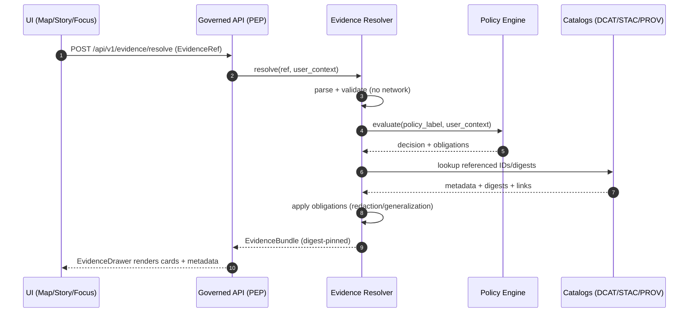

<!-- [KFM_META_BLOCK_V2]
doc_id: kfm://doc/478f8a5f-0f53-4b6d-829a-b7a25b954194
title: "ADR 0006 Notes — EvidenceRef & EvidenceBundle Resolution"
type: standard
version: v1
status: draft
owners: TBD (Platform + Governance)
created: 2026-03-01
updated: 2026-03-01
policy_label: public
related:
  - docs/adr/dossiers/0006-evidence-ref-and-bundle-resolution/README.md
  - docs/standards/KFM_DCAT_PROFILE.md
  - docs/standards/KFM_STAC_PROFILE.md
  - docs/standards/KFM_PROV_PROFILE.md
tags: [kfm, adr, dossier, evidence, citations, resolver, trust-membrane]
notes:
  - "Notes directory README: purpose, constraints, examples, and test vectors for EvidenceRef → EvidenceBundle resolution."
[/KFM_META_BLOCK_V2] -->

# ADR 0006 Notes — EvidenceRef & EvidenceBundle Resolution
**One-line purpose:** Working notes + examples + test vectors for the EvidenceRef → EvidenceBundle resolver contract (**cite-or-abstain**, **fail-closed**).


> [!IMPORTANT]
> This is a **notes** README for the ADR dossier. It is **not** the ADR decision record itself.

---

## Quick navigation
- [Purpose](#purpose)
- [Where this fits](#where-this-fits)
- [Directory contract](#directory-contract)
- [Confirmed invariants](#confirmed-invariants)
- [EvidenceRef notes](#evidenceref-notes)
- [EvidenceBundle notes](#evidencebundle-notes)
- [Resolution flow](#resolution-flow)
- [Policy and obligations](#policy-and-obligations)
- [CI gates and tests](#ci-gates-and-tests)
- [Open questions](#open-questions)
- [Appendix: examples](#appendix-examples)

---

## Purpose
This directory captures **supporting material** for ADR-0006:
- EvidenceRef scheme notes and parsing rules
- EvidenceBundle structure notes (human “cards” + machine metadata)
- Resolution flow diagrams (Map/Story/Focus Mode)
- Contract-test vectors and “fail-closed” error expectations
- Performance + caching notes (only if they preserve determinism + policy safety)

<a id="where-this-fits"></a>
## Where this fits
`docs/adr/dossiers/0006-evidence-ref-and-bundle-resolution/notes/` supports the end-to-end KFM trust surface:

- **Map Explorer:** click feature → open Evidence Drawer → resolver returns the same EvidenceBundle you’d get from a citation link
- **Story publishing:** every citation **must resolve** before merge/publish
- **Focus Mode:** every answer is a governed run; citations are EvidenceRefs; all citations must resolve or the model must abstain

---

## Directory contract

### Where it lives
This README documents the **notes** subdirectory for ADR dossier **0006**:
`docs/adr/dossiers/0006-evidence-ref-and-bundle-resolution/notes/`

### Acceptable inputs
✅ Add:
- short design notes (MD)
- diagrams (Mermaid preferred)
- test vectors (JSON fixtures)
- threat model notes (policy leakage / sensitive metadata concerns)
- “decision-needed” questions with proposed options + tradeoffs

### Exclusions
🚫 Do **not** add:
- any secrets, tokens, keys
- any restricted coordinates or sensitive partner data
- any “free-floating” claims without EvidenceRefs (notes can discuss concepts, but anything presented as factual in the product must be resolvable)
- implementation screenshots or dumps that reveal restricted internal IDs

### Suggested directory tree (PROPOSED)
> [!NOTE]
> This is a suggested structure. If these files don’t exist yet, create them incrementally.

```text
notes/
  README.md                     # (this file)
  evidence-ref-schemes.md        # scheme list + examples
  bundle-contract.md             # required fields + rules
  resolver-error-matrix.md       # fail-closed error model
  ci-contract-tests.md           # test plan + fixtures list
  examples/
    evidence_refs.json           # example refs (safe/public)
    expected_bundles.json        # expected resolver outputs (policy-safe)
```

---

## Confirmed invariants

### Invariant 1 — Citations are EvidenceRefs, not pasted URLs
- A “citation” is an **EvidenceRef** that resolves into an **EvidenceBundle**.
- If a citation can’t be verified as resolvable + policy-allowed, the system must **abstain or narrow scope**.

### Invariant 2 — Evidence resolution is the central trust API
- Evidence resolver takes an EvidenceRef (or structured reference), applies policy, and returns an EvidenceBundle.
- UI should be able to use the evidence resolver in **≤ 2 calls**.

### Invariant 3 — Bundles are immutable by digest
- Evidence bundles are treated as **digest-pinned** immutable results.
- Resolver must not return restricted artifacts for unauthorized roles.

### Invariant 4 — CI blocks merge/publish if citations fail
- Story Nodes cannot be merged if citation validation fails (syntax/resolution/policy/rights checks).

---

## EvidenceRef notes

### What EvidenceRefs are for
EvidenceRefs are **stable, parseable identifiers** that point to inspectable evidence:
- dataset metadata (DCAT)
- geospatial assets (STAC items/assets)
- lineage/provenance (PROV, run receipts)
- scanned docs/OCR spans (doc pages + spans)
- graph entities/edges (graph://)

### Minimal scheme set (CONFIRMED in design docs)
- `dcat://...`
- `stac://...#asset=...`
- `prov://...`
- `doc://...#page=...&span=...`
- `graph://...`

> [!IMPORTANT]
> **Parsing rule:** EvidenceRefs must be parseable *without network calls*. (Resolution may consult catalogs and policy after parsing.)

### Document citations (CONFIRMED example)
Example doc EvidenceRef:
```text
doc://sha256:abcd...#page=12&span=1832:1935
```

**Interpretation notes:**
- `sha256:...` pins the referenced artifact
- `page=12` anchors the visual page
- `span=1832:1935` is a stable text span (character offsets) within the OCR artifact

> [!TIP]
> Prefer **character offsets** for text highlighting. Add bounding boxes only if you have a stable mapping between OCR text and the page image.

---

## EvidenceBundle notes

### Bundle shape (CONFIRMED template)
The resolver returns an EvidenceBundle that contains:
- a stable `bundle_id` (digest)
- `dataset_version_id`
- `policy` decision + obligations
- `license` / rights metadata
- provenance pointers (run receipt IDs)
- referenced artifacts with digests + media types
- checks (e.g., catalog_valid / links_ok)
- an `audit_ref` suitable for review workflows

Example (template-style):
```json
{
  "bundle_id": "sha256:bundle...",
  "dataset_version_id": "2026-02.abcd1234",
  "title": "Storm event record: 2026-02-19",
  "policy": {
    "decision": "allow",
    "policy_label": "public",
    "obligations_applied": []
  },
  "license": { "spdx": "CC-BY-4.0", "attribution": "Source org" },
  "provenance": { "run_id": "kfm://run/2026-02-20T12:00:00Z.abcd" },
  "artifacts": [
    {
      "href": "processed/events.parquet",
      "digest": "sha256:2222",
      "media_type": "application/x-parquet"
    }
  ],
  "checks": { "catalog_valid": true, "links_ok": true },
  "audit_ref": "kfm://audit/entry/123"
}
```

### Bundling rules (CONFIRMED)
- Bundles are **immutable by digest**
- Bundles may include **multiple evidence cards** (dataset + receipt + asset)
- Bundles must **not** include restricted artifacts for unauthorized roles

---

## Resolution flow

### High-level: UI → EvidenceRef → Resolver → EvidenceBundle


### Focus Mode: citations are a hard gate (CONFIRMED control loop)
> [!IMPORTANT]
> Citation verification is the hard gate. If citations cannot be verified as resolvable + policy-allowed, Focus Mode must abstain or reduce scope.

---

## Policy and obligations

### Policy posture (CONFIRMED)
- Default-deny
- Resolver returns **policy-safe errors**
- Restricted evidence must not leak metadata (even IDs/paths that imply existence)

### Obligations (CONFIRMED concept; implementation details may vary)
Examples of obligations:
- generalize geometry
- remove restricted fields
- apply minimum-count suppression for reidentification risk
- block asset downloads / return metadata-only bundle

> [!WARNING]
> If an obligation is required to safely serve data (e.g., coordinate generalization), the resolver must record it in `obligations_applied` and the UX must surface it.

---

## CI gates and tests

### Citation linting (CONFIRMED requirements)
CI must validate:
- EvidenceRef syntax
- resolver can resolve refs in a test environment
- policy check (allowed for intended story policy label)
- rights check (if media included, rights metadata exists)

### Evidence resolver contract tests (CONFIRMED examples)
Minimum contract tests should include:
- “public” evidence resolves to a bundle with allowed artifacts
- “restricted” evidence returns **403** with **no sensitive metadata leakage**
- deterministic outputs (golden tests)

### Resolver error matrix (PROPOSED)
| Scenario | Status | Response requirements |
|---|---:|---|
| Invalid EvidenceRef syntax | 400 | No lookup; parse error only |
| Well-formed but not found | 404 | No inference; no “guessing” |
| Not authorized | 403 | No leakage (no restricted IDs, no paths) |
| Policy requires abstention | 451/403 | Explain in policy-safe terms; include audit_ref |

> [!NOTE]
> Status codes are proposed; align with the repo’s API error model once confirmed.

---

## Open questions

Track these as “decision-needed” notes and link them back to ADR-0006 when resolved:

1. **EvidenceRef canonical grammar**
   - Confirm exact allowed character set and escaping rules per scheme.
2. **Bundle determinism boundary**
   - What fields are included in the bundle digest?
   - Ensure policy context (role/entitlements) is part of digest inputs (or addressed via explicit variant keys).
3. **Caching**
   - Cache key MUST vary by policy context.
   - What TTL is acceptable for public bundles vs. restricted bundles?
4. **Artifact delivery mechanics**
   - When rights restrict mirroring, do we return metadata-only cards with external pointers?
5. **OCI evidence bundles (optional module)**
   - Consider digest-pinned OCI artifacts for distributing bundles + catalogs + receipts.

---

## Appendix: examples

### A. Example EvidenceRefs (safe/public)
```text
dcat://<TBD>@<dataset_version_id>
stac://<TBD>#asset=<asset_key>
prov://<TBD>
doc://sha256:<ocr_artifact_digest>#page=12&span=1832:1935
graph://<TBD>
```

### B. “Two-click” UX requirement reminder
- click feature → resolve evidence → view bundle  
- click citation → resolve evidence → view same bundle

---

<a id="appendix-examples"></a>
<details>
  <summary><strong>Appendix: practical checklist for PR reviewers</strong></summary>

- [ ] Any new Story Node claims: citations are EvidenceRefs (not URLs)
- [ ] CI shows citation linting pass (syntax + resolvable + policy + rights)
- [ ] Evidence resolver contract tests updated with fixtures if schema changed
- [ ] Restricted evidence cases return 403 and leak nothing
- [ ] Determinism tests updated (golden bundles) if canonicalization changed

</details>

---

**Back to top:** [↑](#adr-0006-notes--evidenceref--evidencebundle-resolution)
