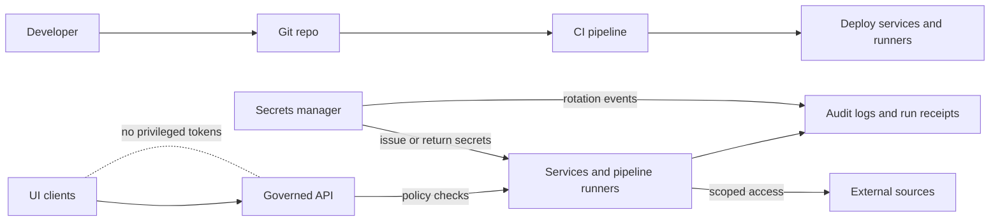

<!-- [KFM_META_BLOCK_V2]
doc_id: kfm://doc/c6e1f9ca-669d-480a-8a01-d88d3bd0f2f8
title: ADR Dossier 0012 — Secrets Management and Rotation
type: adr
version: v1
status: draft
owners: TBD
created: 2026-03-01
updated: 2026-03-01
policy_label: public
related:
  - docs/adr/0012-secrets-management-and-rotation.md # TODO: add/link canonical ADR record (if stored elsewhere)
  - docs/governance/ROOT_GOVERNANCE.md # TODO: link if present
  - docs/standards/KFM_MARKDOWN_WORK_PROTOCOL.md # TODO: link if present
tags: [kfm, adr, security, secrets, rotation]
notes:
  - Dossier: collects context, options, and implementation checklist for ADR 0012.
  - This dossier intentionally contains no secret material (values, private keys, endpoints).
[/KFM_META_BLOCK_V2] -->

# ADR Dossier 0012 — Secrets Management and Rotation
**Purpose:** Define and govern how KFM stores, delivers, rotates, and audits secrets across pipelines, services, and runtime—without breaking the trust membrane.


> [!WARNING]
> **No secrets belong here.** Do not paste secret values, private keys, tokens, client secrets, or internal endpoints into this dossier, issues, PRs, or commit history.
> If a secret is accidentally committed anywhere, treat it as compromised and rotate immediately (see “Leak Response Runbook”).

---

## Navigation
- [What this dossier is](#what-this-dossier-is)
- [Where this fits in the repo](#where-this-fits-in-the-repo)
- [Non-negotiable invariants](#non-negotiable-invariants)
- [Secret inventory](#secret-inventory)
- [Architecture](#architecture)
- [Rotation policy](#rotation-policy)
- [Audit and evidence requirements](#audit-and-evidence-requirements)
- [Implementation plan](#implementation-plan)
- [Definition of Done](#definition-of-done)
- [Runbooks](#runbooks)
- [Open questions](#open-questions)
- [Appendix: Templates](#appendix-templates)

---

## What this dossier is
This dossier is the **evidence pack + execution checklist** for ADR 0012.

It should contain:
- ✅ **Confirmed** KFM security invariants (what must not regress)
- 🧪 **Proposed** implementation options and tradeoffs
- ❓ **Unknown** items requiring verification in the current repo / environment
- A “thin-slice” plan to implement secrets management + rotation safely

> [!NOTE]
> The actual “decision record” (the ADR) should capture: **decision, rationale, alternatives, consequences, rollback plan**, and be linked from PRs that change core invariants.

[Back to top](#adr-dossier-0012--secrets-management-and-rotation)

---

## Where this fits in the repo
This folder is intended to live at:

`docs/adr/dossiers/0012-secrets-management-and-rotation/`

### Recommended dossier contents
> These are recommended artifacts. Add them as needed; do not assume they exist yet.

```text
docs/adr/dossiers/0012-secrets-management-and-rotation/
  README.md                       # This file (dossier entrypoint)
  ADR.md                          # TODO: decision record (or link to canonical ADR file)
  threat-model.md                 # TODO: threat model + attack surfaces + mitigations
  rotation-runbook.md             # TODO: operational rotation runbook (step-by-step)
  leak-response-runbook.md        # TODO: what to do when secrets leak
  diagrams/                       # optional
    secrets-lifecycle.mmd         # optional mermaid source
  fixtures/                       # optional (sanitized)
    secret-rotation-event.example.json
    secret-inventory.example.csv
```

### Acceptable inputs for this folder
- **Sanitized** configuration examples (names/refs only; no values)
- Threat model notes (attack surfaces, mitigations, residual risk)
- Vendor/tool comparisons (cloud secrets manager vs Vault vs others)
- CI gate definitions (secret scanning, policy checks)
- Audit event schema for “secret rotated” events
- Runbooks and checklists

### Exclusions
- Any secret values (API keys, tokens, passwords)
- Private keys, cert private material, signing keys
- Break-glass credentials
- `.env` files containing secrets
- Unredacted logs containing secrets

[Back to top](#adr-dossier-0012--secrets-management-and-rotation)

---

## Non-negotiable invariants
These are *system-level* constraints. They apply regardless of which vendor/tool is chosen.

### ✅ Confirmed invariants (must implement)
- **Secrets are stored in a secrets manager (not in the repo).**
- **Pipeline runners use scoped credentials per source** (minimize blast radius).
- **UI never receives privileged tokens beyond what is needed for the session.**
- **Secrets are rotated and rotation events are recorded in audit logs.**

### 🧪 Proposed invariants (strongly recommended)
- Prefer **short-lived / dynamic credentials** over long-lived static secrets.
- Avoid “secrets sprawl”: no secrets in config files, YAML, or Git history (even temporarily).
- Secrets are delivered to workloads in a way that **minimizes disk persistence** (prefer in-memory where possible).
- Rotation is **automated** (no human calendar rotation).

### ❓ Unknown (requires verification)
- What is the runtime platform (Kubernetes, VM services, serverless, hybrid)?
- What identity provider is used (OIDC provider, service identity, etc.)?
- What audit log system is canonical (and where rotation events should land)?
- Are there existing secret-scanning CI gates (and are they blocking)?

[Back to top](#adr-dossier-0012--secrets-management-and-rotation)

---

## Secret inventory
This section defines the *taxonomy* and ownership model. It should be kept up to date.

### Secret classes (baseline)
| Secret class | Examples (no values) | Primary consumers | Typical blast radius | Owner (role) | Notes |
|---|---|---|---|---|---|
| Source connector credentials | API key, OAuth client secret, DB creds | Ingest / pipeline runners | One source / one dataset | Source steward / operator | MUST be per-source scoped |
| Service-to-service auth | service tokens, mTLS client creds | API, evidence resolver, internal services | One service boundary | Platform/security | Prefer short-lived |
| CI/CD credentials | registry token, deploy key | CI pipelines | Broad if mishandled | Platform/security | Prefer federated auth over static secrets |
| Encryption keys (at-rest) | KMS key refs, envelope keys | storage/indexing services | Potentially broad | Platform/security | Treat “root” key as critical |
| Signing keys | JWT signing key ref | auth services | Broad if leaked | Platform/security | Consider key rotation + key IDs |

> [!TIP]
> Put the inventory into a machine-friendly artifact (CSV/JSON) under `fixtures/` (sanitized), and validate it in CI:
> - every secret has an owner, purpose, scope, and rotation policy
> - every secret is mapped to a rotation runbook step

[Back to top](#adr-dossier-0012--secrets-management-and-rotation)

---

## Architecture

### Target posture (vendor-agnostic)
- A **central secrets manager** is the source of truth.
- Workloads authenticate to the secrets manager using **workload identity** (not shared static credentials).
- Workloads receive secrets just-in-time, use them, and **do not persist** them unnecessarily.
- **Rotation** is automated and **audited**.
- The UI does not hold privileged secrets; privileged actions happen behind the **governed API + policy boundary**.



### Threat model highlights (summary)
- Primary risk: **secret exfiltration** via Git history, logs, overly-broad access, or compromised runtime.
- Primary mitigation: **least privilege + centralized secrets + automated rotation + audit logging**.
- Residual risk: “secret zero” / root-of-trust compromise (KMS/IAM compromise, Vault root token compromise).

[Back to top](#adr-dossier-0012--secrets-management-and-rotation)

---

## Rotation policy

### Rotation principles
- Rotate **more frequently** when:
  - the secret grants broad access
  - the secret is hard to scope
  - the integration is public-facing
- Rotate **automatically** whenever possible.
- Prefer **short-lived secrets** (TTL-based) so “rotation” becomes routine rather than a special event.

### Proposed rotation tiers
> Adjust these to match your threat model and operational capacity.

| Tier | Secret types | Suggested posture | Operational notes |
|---|---|---|---|
| Tier 0 (highest) | signing keys, KMS roots, break-glass | very tight control + strong audit | requires careful rollout; may require dual-key periods |
| Tier 1 | service-to-service auth, privileged deploy tokens | short-lived, automated | ensure consumers support reload/refresh |
| Tier 2 | source connector creds (scoped) | automated rotation on schedule | per-source to reduce blast radius |
| Tier 3 | low-risk tokens (read-only, constrained) | rotate regularly | still must be audited |

### Rotation mechanics (patterns)
- **Dynamic secrets** (best): secrets manager issues time-limited credentials on demand.
- **Versioned secrets** (common): secret has versions; consumers fetch “current” version; rotation advances version.
- **Dual-read window** (safer): services accept “current + previous” for a controlled cutover period.

[Back to top](#adr-dossier-0012--secrets-management-and-rotation)

---

## Audit and evidence requirements
Rotation must be **observable** and **traceable**.

### Minimum audit record for a rotation event (sanitized)
- secret reference (name/path/id), never the value
- time rotated
- actor (human or automation identity)
- reason (scheduled, suspected leak, access change, etc.)
- affected components (workloads / pipelines)
- result (success/failure) and remediation notes

#### Example event (sanitized)
```json
{
  "event_type": "secret.rotation",
  "event_id": "rot_2026-03-01T120000Z_abcdef",
  "secret_ref": "kfm://secret/source/noaa_nwis/api_key",
  "rotated_at": "2026-03-01T12:00:00Z",
  "rotated_by": "kfm://agent/rotation-bot",
  "reason": "scheduled",
  "previous_version": "v12",
  "new_version": "v13",
  "affected_components": [
    "kfm://service/ingest-runner",
    "kfm://pipeline/source-noaa-nwis"
  ],
  "result": "success",
  "notes": "No downtime. Connector confirmed with new credentials."
}
```

> [!IMPORTANT]
> Rotation events should be emitted into the same audit/logging fabric used for governed runs (run receipts), so investigators can correlate:
> secret change → pipeline runs → data outputs → user-visible impacts.

[Back to top](#adr-dossier-0012--secrets-management-and-rotation)

---

## Implementation plan
Deliver this as **thin slices** (reversible increments) with clear gates.

### Slice 1 — “No secrets in repo” gates
- [ ] Add/confirm secret-scanning in CI (blocking)
- [ ] Add/confirm pre-commit hooks for local scanning (non-blocking but recommended)
- [ ] Add/confirm `.env.example` patterns (no real `.env` committed)
- [ ] Add docs for “what to do if a secret is leaked”

### Slice 2 — Central secrets manager + scoped access
- [ ] Select a secrets manager (decision item)
- [ ] Define secret naming + ownership + scope conventions
- [ ] Update pipeline runner to use per-source credential references
- [ ] Ensure UI cannot access privileged tokens (session-only, least privilege)

### Slice 3 — Automated rotation + auditing
- [ ] Implement rotation automation for at least one low-risk secret in non-prod
- [ ] Add rotation event emission to audit logs
- [ ] Validate consumers can refresh without downtime (or document restart behavior)
- [ ] Add periodic verification job: “are any secrets older than policy permits?”

### Slice 4 — Expand to all secret classes
- [ ] Migrate remaining static secrets
- [ ] Add dual-read windows where needed (service auth / signing keys)
- [ ] Document and test break-glass workflows
- [ ] Run a tabletop exercise: simulated leak + rotation + recovery

[Back to top](#adr-dossier-0012--secrets-management-and-rotation)

---

## Definition of Done
This ADR is “done” when all of the following are true:

### Governance + policy
- [ ] ADR 0012 decision record exists and includes: decision, rationale, alternatives, consequences, rollback plan
- [ ] Every secret class has an owner and documented rotation policy
- [ ] No secret values appear in repo history (or, if they ever did, they have been rotated and incident-recorded)

### Technical
- [ ] Secrets are stored in a secrets manager (not in repo)
- [ ] Pipeline runners use scoped credentials per source
- [ ] UI never receives privileged tokens beyond session-need
- [ ] Rotation is automated for all Tier 1+ secrets (or has an explicit exception + compensating controls)
- [ ] Rotation events are emitted to audit logs/ledger and are queryable
- [ ] CI blocks merges that introduce secrets (secret scanning gate)

### Operational
- [ ] Rotation runbook exists and has been tested in non-prod
- [ ] Leak response runbook exists and has been rehearsed
- [ ] Monitoring alerts exist for suspected secret misuse (where feasible)

[Back to top](#adr-dossier-0012--secrets-management-and-rotation)

---

## Runbooks
> TODO: add these files (or link to canonical locations)

- `rotation-runbook.md` — scheduled rotation workflow (per secret class)
- `leak-response-runbook.md` — what to do when a secret leaks
- `threat-model.md` — threat model checklist and mitigations

[Back to top](#adr-dossier-0012--secrets-management-and-rotation)

---

## Open questions
These must be resolved (or explicitly deferred) in the ADR decision record.

- ❓ Which secrets manager will be used (managed cloud service vs self-managed vs Vault)?
- ❓ What is the runtime platform for KFM services/pipelines (Kubernetes, VM, hybrid)?
- ❓ How will workloads authenticate to the secrets manager (OIDC/workload identity vs static)?
- ❓ Where are audit logs stored, and what is the retention/access policy?
- ❓ Do any integrations require ABAC-like controls beyond RBAC + policy labels?
- ❓ What is the break-glass procedure and where is it documented?

[Back to top](#adr-dossier-0012--secrets-management-and-rotation)

---

## Appendix: Templates

<details>
<summary><strong>Template: Secret reference naming convention (sanitized)</strong></summary>

- Use stable references that do not encode environments in the secret value.
- Prefer names that communicate scope:

Examples:
- `kfm://secret/source/<source_slug>/<credential_purpose>`
- `kfm://secret/service/<service_slug>/<credential_purpose>`

Do not embed:
- hostnames, internal URLs, account IDs, or operational details that aid targeting.

</details>

<details>
<summary><strong>Template: ADR decision section skeleton</strong></summary>

- Decision
- Context
- Options considered
- Rationale
- Consequences (positive/negative)
- Rollback plan
- Security considerations
- Verification steps (tests, gates)
- Links to this dossier’s artifacts

</details>
