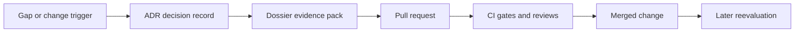

<!-- [KFM_META_BLOCK_V2]
doc_id: kfm://doc/5fd3aec8-63dc-4d19-be3c-0bca3024a7a4
title: ADR Dossiers
type: standard
version: v1
status: draft
owners: TBD
created: 2026-03-01
updated: 2026-03-01
policy_label: public
related:
  - ../
tags: [kfm, adr, dossiers]
notes:
  - Directory contract for ADR supporting dossiers (evidence packs).
[/KFM_META_BLOCK_V2] -->

# ADR Dossiers
Supporting evidence packs for Architecture Decision Records (ADRs).


**Location:** `docs/adr/dossiers/`  
**Applies to:** every ADR that needs deeper research, evaluation, or artifacts beyond the ADR narrative.

> **NOTE**
> A dossier is *supporting material* for an ADR — not a substitute for the ADR.  
> Keep the ADR itself short, decision-focused, and reviewable. Put the “receipts” here.

---

## Navigation
- [Purpose](#purpose)
- [What goes in a dossier](#what-goes-in-a-dossier)
- [What must not go in a dossier](#what-must-not-go-in-a-dossier)
- [Recommended structure](#recommended-structure)
- [Workflow](#workflow)
- [Definition of done](#definition-of-done)
- [Sensitivity and licensing](#sensitivity-and-licensing)
- [Templates](#templates)

---

## Purpose
This folder holds **ADR dossiers**: structured, searchable bundles of supporting material used to make an architectural decision *traceable and reversible*.

A dossier exists to answer questions like:

- What problem were we solving?
- What options did we consider?
- What evidence (benchmarks, prototypes, policy constraints, references) informed the choice?
- What are the risks and rollback plan?

---

## What goes in a dossier
Acceptable inputs (commit to git as Markdown whenever possible):

- **Context & constraints**
  - problem statement, scope boundaries, non-goals
  - constraints (policy, licensing, performance, delivery gates, staffing)
- **Alternatives**
  - one file per alternative, with pros/cons and failure modes
- **Evaluation**
  - decision criteria + a comparison matrix
  - benchmarks (with reproduction notes) and/or prototype findings
- **Evidence references**
  - links to governed evidence objects (datasets, run receipts, catalogs, tickets)
  - citations/quotes (short, license-compliant excerpts only)
- **Review artifacts**
  - stakeholder questions + answers
  - “what would change my mind?” triggers
- **Small supporting assets**
  - diagrams, tiny screenshots, small images (keep binaries minimal)

> **TIP**
> If you produced a *new data artifact* (e.g., an OCR corpus, extracted entities, derived layer),
> that belongs in the governed data lifecycle (`data/...`) with provenance — and this dossier
> should link to it.

---

## What must not go in a dossier
Exclusions (default-deny):

- **Secrets** (API keys, tokens, private endpoints, credentials)
- **PII** or sensitive personal data (unless explicitly approved and access-controlled)
- **Sensitive location coordinates** (use generalized geography if needed)
- **Unlicensed or redistributable content** (full PDFs/books/articles, proprietary reports)
- **Large binaries** (videos, big PDFs, datasets) — store elsewhere and link
- **Runtime truth sources**
  - don’t “smuggle” facts into production via dossiers  
  - production evidence must resolve via governed catalogs / evidence references

---

## Recommended structure
**Proposed convention (adjust if the repo already has a different ADR numbering scheme):**

- One dossier folder per ADR
- Folder name matches ADR identifier + slug:  
  `NNNN-short-slug/` (example: `0007-policy-enforcement-boundary/`)

### Minimal dossier skeleton
```text
docs/adr/dossiers/                                         | # ADR dossiers (deep evidence packs that complement the canonical ADR files)
├─ README.md                                                | # You are here: dossier conventions, naming rules, DoD, and review expectations
│
├─ NNNN-short-slug/                                         | # One dossier per ADR (NNNN matches ADR number; slug is stable/kebab-case)
│  ├─ README.md                                             | # Dossier index + links back to ADR + status/owners + “what’s inside”
│  ├─ context.md                                            | # Problem statement, why now, constraints, assumptions, non-goals
│  ├─ evidence_refs.md                                      | # EvidenceRefs/citations/links used to justify claims (policy-safe; cite-or-abstain)
│  ├─ evaluation.md                                         | # Decision criteria + comparison matrix + rationale for recommendation
│  ├─ options/                                              | # Option writeups (comparable structure for fair evaluation)
│  │  ├─ option-a.md                                        | # Option A details (approach, impacts, tradeoffs, compatibility)
│  │  └─ option-b.md                                        | # Option B details (approach, impacts, tradeoffs, compatibility)
│  ├─ risks.md                                              | # OPTIONAL: risks, mitigations, rollback notes, residual risk
│  ├─ experiments/                                          | # OPTIONAL: prototypes, benchmarks, run receipts, reproducibility notes
│  ├─ notes/                                                | # OPTIONAL: scratch notes / meeting notes (non-normative; promote key info upward)
│  └─ assets/                                               | # OPTIONAL: small images/diagrams only (policy-safe; prefer source + manifest)
│
└─ ...                                                      | # Additional dossiers (repeat the NNNN-short-slug pattern)
```

#### Dossier parts
| Path | Required | Purpose |
|---|---:|---|
| `README.md` | ✅ | Index + links + status |
| `context.md` | ✅ | Problem, constraints, non-goals |
| `options/` | ✅ | One file per alternative |
| `evaluation.md` | ✅ | Criteria + comparison matrix + chosen option |
| `evidence_refs.md` | ✅ | EvidenceRefs, citations, related artifacts |
| `risks.md` | ⭕ | Risks, mitigations, rollback notes |
| `experiments/` | ⭕ | Prototype notes, benchmarks, run receipts |
| `notes/` | ⭕ | Meeting notes, scratch work |
| `assets/` | ⭕ | Small images/diagrams (minimize binaries) |

### Relationship diagram


---

## Workflow

### 1) Create the dossier folder
```bash
# Example (edit to match your ADR numbering / slug conventions)
ADR_ID="0007"
SLUG="short-slug"
DIR="docs/adr/dossiers/${ADR_ID}-${SLUG}"

mkdir -p "${DIR}"/{options,experiments,notes,assets}
touch "${DIR}"/{README.md,context.md,evidence_refs.md,evaluation.md}
```

### 2) Link dossier ↔ ADR
In the ADR document, add a link to the dossier index:

- `Dossier: ./dossiers/NNNN-short-slug/README.md`

In the dossier `README.md`, add a backlink to the ADR:

- `ADR: ../../NNNN-short-slug.md` *(or whatever the ADR filename is in your repo)*

> **WARNING**
> Don’t rely on implicit structure. If the ADR naming scheme differs, update links immediately.
> Broken links break traceability.

### 3) Fill the dossier in “decision order”
1. `context.md`: problem statement + constraints
2. `options/*.md`: alternatives + pros/cons + operational implications
3. `evaluation.md`: criteria + matrix + chosen option
4. `evidence_refs.md`: evidence links and citations supporting key claims
5. `risks.md`: risks + mitigations + rollback plan details

---

## Definition of done
A dossier is “done enough” when it supports a clean ADR review.

Checklist:

- [ ] **Scope is clear**: problem, constraints, and non-goals are written down
- [ ] **Alternatives are explicit**: at least 2 options, with tradeoffs and why rejected
- [ ] **Criteria are stated**: what success means (quality attributes, governance, cost, time)
- [ ] **Evidence exists**: links to sources, prototypes, benchmarks, or policy constraints
- [ ] **Repro notes exist** (if benchmarks/prototypes are included): how to rerun or validate
- [ ] **Risks + rollback** are captured (even if “rollback = revert PR”)
- [ ] **Policy label is correct**: public vs restricted, and redaction notes if needed
- [ ] **Links work**: dossier ↔ ADR cross-links are valid

---

## Sensitivity and licensing

### Policy labeling
- Default dossier docs to `policy_label: public` *only if* content is safe for broad sharing.
- If a dossier includes restricted details (security, sensitive locations, non-public agreements),
  prefer:
  1) a **redacted public summary** in this repo, and  
  2) a pointer to the controlled system-of-record location.

### Licensing and attribution
- Treat licensing as a *decision input*, not paperwork:
  - record the license/rights status for any external material you rely on
  - prefer linking to original sources over copying content
- Keep direct quotes short and cite the source.

---

## Templates

<details>
<summary><strong>Dossier README.md template</strong></summary>

```md
<!-- [KFM_META_BLOCK_V2]
doc_id: kfm://doc/<uuid>
title: ADR Dossier — NNNN: <Decision title>
type: standard
version: v1
status: draft
owners: <team or names>
created: YYYY-MM-DD
updated: YYYY-MM-DD
policy_label: public|restricted|...
related:
  - ../../NNNN-<slug>.md
tags: [kfm, adr, dossier]
notes:
  - Supporting evidence pack for ADR NNNN.
[/KFM_META_BLOCK_V2] -->

# ADR Dossier — NNNN: <Decision title>

- **ADR:** `../../NNNN-<slug>.md`
- **Status:** draft|review|accepted|superseded
- **Owners:** <names>

## Contents
- [Context](./context.md)
- [Options](./options/)
- [Evaluation](./evaluation.md)
- [Evidence refs](./evidence_refs.md)
- [Risks](./risks.md)
```

</details>

<details>
<summary><strong>Evaluation matrix snippet</strong></summary>

```md
## Evaluation criteria
- Governance and policy enforcement
- Reproducibility and provenance
- Performance and scalability
- Operability (observability, rollback, maintenance)
- Cost and delivery risk

## Comparison matrix (example)
| Criteria | Option A | Option B | Notes |
|---|---|---|---|
| Governance | ✅ | ⚠️ | explain |
| Rebuildable from artifacts | ✅ | ✅ | explain |
| Complexity | ⚠️ | ✅ | explain |
| Rollback clarity | ✅ | ⚠️ | explain |
```

</details>

---

[Back to top](#adr-dossiers)
