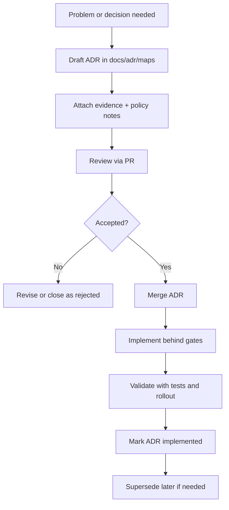

<!-- [KFM_META_BLOCK_V2]
doc_id: kfm://doc/5f1d2c5a-4d6a-4a08-9a3b-2b2c6d2d1e9a
title: docs/adr/maps/README.md
type: standard
version: v1
status: draft
owners: TBD
created: 2026-03-01
updated: 2026-03-01
policy_label: internal
related: []
tags: [kfm, adr, maps]
notes:
  - Index + operating rules for map-related Architecture Decision Records (ADRs).
  - Evidence-first: every decision should link to benchmarks, prototypes, or policy tests.
[/KFM_META_BLOCK_V2] -->

# Maps ADRs
Map/Cartography Architecture Decision Records for KFM (rendering, tiling, projections, basemaps, and policy-bound map outputs).


**Owners:** `TBD` (TODO: set CODEOWNERS / maintainers for `docs/adr/maps/`)

---

## Quick links
- [Purpose](#purpose)
- [Scope](#scope)
- [How to add a new map ADR](#how-to-add-a-new-map-adr)
- [Naming and status conventions](#naming-and-status-conventions)
- [Decision checklist](#decision-checklist)
- [ADR index](#adr-index)
- [Directory layout](#directory-layout)
- [Appendix: Map ADR template](#appendix-map-adr-template)

---

## Purpose
This directory holds **Architecture Decision Records (ADRs)** that govern **map-specific** technical and policy decisions for the KFM platform.

ADRs here should answer questions like:
- Which **map rendering engine** do we standardize on (web + server-side)?
- What is the **projection/CRS policy** for authoritative display vs analysis?
- What is the **tile strategy** (vector tiles, raster tiles, hybrid), and where are tiles generated?
- How do we enforce **policy labels / redaction obligations** at map time (especially for sensitive locations)?
- What are the **performance and observability** expectations for map endpoints and tile services?

> [!NOTE]
> This folder documents **decisions**, not implementation tutorials. Keep ADRs short, defensible, and evidence-linked.

[Back to top](#maps-adrs)

---

## Scope
### In scope
- **Map UI decisions**: renderer, styling system, symbology strategy, accessibility constraints.
- **Serving decisions**: tile formats, cache strategy, API boundary behavior (what is served where).
- **Spatial reference decisions**: CRS selection, reprojection behavior, tolerances, tradeoffs.
- **Cartographic decisions**: generalization rules, labeling strategy, scale-dependent styling.
- **Policy decisions impacting maps**: coordinate precision limits, aggregation/generalization methods, “default-deny” behaviors.

### Out of scope
- Dataset onboarding details (belongs in dataset specs + promotion artifacts).
- General API ADRs not specific to maps.
- UI component implementation details (belongs in UI docs/runbooks).
- “How to navigate in the field” or other non-product operational guidance.

[Back to top](#maps-adrs)

---

## How to add a new map ADR



### Minimum “done” checklist for a new ADR
- [ ] **Context**: what problem are we solving, and why now?
- [ ] **Decision**: clear, testable statement of what we’re doing.
- [ ] **Alternatives**: at least 2 considered (even if brief).
- [ ] **Consequences**: tradeoffs, what gets harder/easier.
- [ ] **Evidence**: links to benchmarks, prototypes, spike results, UX notes, or incident learnings.
- [ ] **Policy**: expected policy labels and obligations for map outputs (redaction, precision, access).
- [ ] **Operational plan**: rollout + rollback, and how we will observe success.

> [!WARNING]
> If a decision affects exposure risk (e.g., precise coordinates, vulnerability targeting, restricted cultural sites), the ADR MUST explicitly describe the generalization/redaction approach and where it is enforced.

[Back to top](#maps-adrs)

---

## Naming and status conventions

### File naming (PROPOSED)
Use a monotonically increasing ID plus a short slug:

- `ADR-0001-map-rendering-engine.md`
- `ADR-0002-vector-tiles-and-tile-matrix.md`
- `ADR-0003-crs-and-reprojection-policy.md`

> [!TIP]
> If the repo already has an ADR numbering rule, follow that instead and update this README to match.

### Status values (recommended)
| Status | Meaning |
|---|---|
| `proposed` | Drafted and under review |
| `accepted` | Approved decision (implementation may follow) |
| `implemented` | Landed in code + validated |
| `superseded` | Replaced by a later ADR |
| `rejected` | Not adopted (keep for memory) |

### Cross-linking rules
- If an ADR replaces another: include **“Supersedes: ADR-XXXX”** and update the old ADR with **“Superseded by: ADR-YYYY”**.
- If an ADR requires policy changes: link to the corresponding policy ADR or policy PR.

[Back to top](#maps-adrs)

---

## Decision checklist
Use this checklist to avoid “pretty maps that break governance.”

### 1) Trust boundary and governance
- Does the decision preserve the **trust membrane** (clients use governed APIs; no direct storage/DB access)?
- Does it preserve the **truth path** posture (inputs, transforms, and outputs remain auditable and evidence-linked)?
- What **policy label** applies to resulting map layers/tiles?

### 2) Spatial reference and projection
- What CRS is considered authoritative for:
  - storage
  - analysis
  - rendering/display
- What reprojection rules apply (server-side vs client-side)?
- What precision/accuracy risks exist (distortion, measurement error, SRID mismatch)?

### 3) Tiling, caching, and performance
- Tile type: vector, raster, hybrid
- Tile matrix scheme and zoom range
- Cache strategy (CDN, edge, server, in-process)
- Backpressure and rate-limits for tile endpoints
- Observability: latency percentiles, cache hit rate, error budget signals

### 4) Styling and UX
- Style authoring workflow (design tokens, JSON styles, code)
- Accessibility: color contrast, symbol size at scale, text legibility
- Legends, attribution, scale bar, and metadata affordances
- Evidence UI: can users trace what they see back to sources?

### 5) Sensitive location handling
- Any risk of exposing:
  - vulnerable sites
  - culturally restricted places
  - private/personally identifying geolocation
- If yes, specify:
  - generalization method (aggregation, jitter, bounding regions)
  - minimum zoom level allowed for detail
  - enforcement point (API vs tile generator vs UI)
  - auditability (how do we prove it happened)

[Back to top](#maps-adrs)

---

## ADR index
> Keep this table current. Every new ADR added to this directory should add a row here.

| ADR | Title | Status | Date | Owners | Notes |
|---|---|---|---:|---|---|
| ADR-0000 | (placeholder) Create maps ADR index | draft | 2026-03-01 | TBD | Replace once first real ADR lands |

[Back to top](#maps-adrs)

---

## Directory layout
### Current
```text
docs/
  adr/
    maps/
      README.md
      (ADRs live here)
```

### Suggested future structure (PROPOSED)
```text
docs/adr/maps/
  README.md
  ADR-0001-<slug>.md
  ADR-0002-<slug>.md
  ADR-0003-<slug>.md
  _attachments/
    ADR-0002/
      benchmark-results.md
      screenshots/
      notes.md
```

> [!NOTE]
> `_attachments/` is optional—use it when the evidence is too large/noisy to embed inline (benchmarks, screenshots, prototype notes).

[Back to top](#maps-adrs)

---

## Appendix: Map ADR template
Copy/paste this into a new file (then fill it in).

```markdown
# ADR-XXXX: <short title>

- **Status:** proposed | accepted | implemented | superseded | rejected
- **Date:** YYYY-MM-DD
- **Owners:** <team or handles>
- **Related:** <links to issues/PRs/design docs>
- **Supersedes:** <ADR-YYYY> (optional)
- **Superseded by:** <ADR-ZZZZ> (optional)
- **Policy label:** public | internal | restricted | ... (per repo policy vocabulary)

## Context
What problem are we solving? What is the current behavior? What constraints apply (policy, cost, UX, performance)?

## Decision
A crisp statement of what we will do.

## Alternatives considered
1. <Option A> — pros/cons
2. <Option B> — pros/cons
3. <Option C> — pros/cons

## Consequences
- Positive:
- Negative:
- Follow-ups required:

## Evidence
Link to:
- benchmarks (latency, size, cost)
- prototypes/screenshots
- user research notes
- incidents/postmortems
- policy tests / contract tests

## Policy and safety considerations
- What could this expose?
- What redaction/generalization is required (if any)?
- Where is enforcement (API, tile builder, UI)?
- How is it tested and audited?

## Rollout and rollback
- Rollout plan:
- Feature flags / staged delivery:
- Rollback plan:

## Open questions
List any remaining unknowns and the minimum steps to resolve them.
```

[Back to top](#maps-adrs)# ADR Maps

Curated views of ADRs by area, status, gates, zones, and policy labels.
