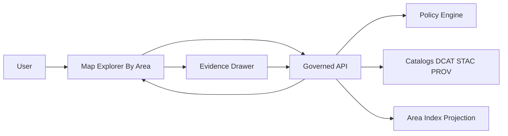

<!-- [KFM_META_BLOCK_V2]
doc_id: kfm://doc/7d64dafd-ee01-47bd-9b1f-f2374be72c16
title: ADR — Map Explorer: Browse By Area
type: adr
version: v1
status: draft
owners:
  - TODO
created: 2026-03-01
updated: 2026-03-01
policy_label: public
related:
  - docs/architecture/adr/README.md
  - docs/templates/TEMPLATE__API_CONTRACT_EXTENSION.md
  - docs/standards/KFM_MARKDOWN_WORK_PROTOCOL.md
tags:
  - kfm
  - adr
  - maps
  - ui
  - information-architecture
notes:
  - Defines contracts + IA expectations for a “By Area” browse mode.
  - Treat endpoints and schemas as Proposed until merged into contracts/.
[/KFM_META_BLOCK_V2] -->

# Map Explorer: Browse By Area
_Architecture Decision Record (ADR) for a first-class “By Area” browse mode in Map Explorer._


**Repo location:** `docs/adr/maps/by-area.md`  
**One-line purpose:** Provide a governed, place-first browse experience (state → county → place) that preserves the trust membrane and evidence-first UX.

> **Decision intent:** Let users start from “where” while keeping all access policy-evaluated and all map content evidence-linkable.

---

## Navigation
- [Status](#status)
- [Context](#context)
- [Decision](#decision)
- [Evidence basis](#evidence-basis)
- [Decision drivers](#decision-drivers)
- [Design](#design)
- [Consequences](#consequences)
- [Assumptions, risks, tradeoffs](#assumptions-risks-tradeoffs)
- [Minimum verification steps](#minimum-verification-steps)
- [Alternatives considered](#alternatives-considered)
- [Rollback plan](#rollback-plan)
- [Implementation plan](#implementation-plan)
- [Definition of done](#definition-of-done)
- [Open questions](#open-questions)
- [References](#references)

---

## Status
- **State:** Draft
- **Decision type:** Information architecture + API contract surface
- **Target release:** TODO
- **Reviewers:** TODO
- **Supersedes:** None
- **Superseded by:** N/A

---

## Context
KFM is a governed, evidence-first system: Map Explorer must be able to show layers and features while always providing an evidence path (dataset version + license/rights + policy label + provenance) via the evidence drawer.

Many users start exploration with a geographic place (“Show me … in Douglas County”, “... around Fort Scott”, “... in the Arkansas River basin”). The platform needs a consistent, policy-safe way to translate “place” into a navigable hierarchy **without hard-coding storage access into the UI**.

### Non-negotiable constraints
- **Trust membrane:** UI clients must not access storage or databases directly; all reads happen through governed APIs that apply policy, redaction, and logging.
- **Evidence-first UX:** Any layer/feature shown in the by-area experience must remain evidence-linkable (dataset_version_id + EvidenceRef → EvidenceBundle).
- **Rebuildable projections:** “Area indexes” and “area-to-layer matches” should be rebuildable from promoted artifacts and catalogs, not treated as canonical truth.

---

## Decision
Implement **“Browse By Area”** as a first-class entry point in Map Explorer.

This decision includes:
1. A stable **area identity scheme** and **area hierarchy** (e.g., state → region → county → place).
2. A **governed API surface** to list areas, resolve an area, and list content relevant to an area (layers, stories, datasets), with policy filtering.
3. A **rebuildable area index** derived from canonical boundary datasets and catalogs.
4. A **UI route pattern** that supports deep-linking to an area (so Story Nodes and external links can reference a stable “where” view).

> **NOTE:** This ADR decides the *shape* of “By Area” (contracts + IA) and the invariants it must honor. Exact schema fields and endpoint URLs are **Proposed** until added to `contracts/` and implemented.

---

## Evidence basis
This ADR uses the project’s existing invariants as constraints, and proposes new contract surfaces.

| Claim | Category | Notes |
|---|---|---|
| UI clients must not access storage/DB directly; access goes through governed APIs (trust membrane) | Confirmed | Constraint on all “By Area” designs |
| Map Explorer includes an evidence drawer that surfaces license + version info and supports keyboard navigation | Confirmed | “By Area” must not bypass/replace this |
| An “Area index” should be rebuildable projection derived from promoted artifacts + catalogs | Proposed | Aligns with “canonical vs rebuildable stores” principle |
| Specific endpoints such as `GET /api/v1/areas` | Proposed | Must be added via API contract change |
| Area ID format `kfm://area/...` | Proposed | Must be standardized in controlled vocab |

---

## Decision drivers
| Driver | Why it matters | Priority |
|---|---|---|
| Place-first exploration | Matches user mental model (“where”) | High |
| Governance & safety | Must not leak restricted geometries/locations | High |
| Evidence-first trust | Area browsing must keep evidence links intact | High |
| Performance | Lists + simplified geometries must be fast | Medium |
| Reversibility | Feature-flag + rollback without breaking other modes | Medium |

---

## Design

### High-level flow


### Where this fits in the repo
This ADR is one of the **maps** ADRs.

Proposed directory structure:
```text
docs/
  adr/
    maps/
      by-area.md
      by-theme.md            # optional, future ADR
      layer-metadata.md      # optional, future ADR
```

**Acceptable inputs**
- Links to API contract diffs and schemas (preferred)
- Links to dataset onboarding specs for boundary datasets
- Policy decisions (OPA fixtures, redaction obligations) that affect area browsing

**Exclusions**
- This ADR does **not** define cartographic styling, basemaps, or symbology.
- This ADR does **not** define a specific database/index technology; only the contract + invariants.

---

## Area model

### Area types
This ADR standardizes the concept of an **Area** as:
- a stable ID
- a display name
- a type
- a parent (optional)
- a geometry (full, simplified, or bbox depending on policy + payload size)
- a policy label and obligations for what can be shown

Proposed baseline types:
- `state`
- `region` (KFM-defined; e.g., planning regions)
- `county`
- `place` (city/town/CDP)
- `basin` (optional, for watersheds)
- `custom` (curated polygons; requires governance review)

> **WARNING:** “site” or “point-of-interest” areas are not enabled by default. They can create sensitive-location risks; if introduced, they must default to generalized public views or be restricted.

### Area identity
Proposed area identifier format:
- `kfm://area/<type>/<authority>/<code>@<version>`

Examples:
- `kfm://area/county/us-census/20045@v1`
- `kfm://area/place/us-gnis/1234567@v1`

Rules:
- `authority` must be explicit (prevents collisions).
- `code` must be the upstream stable code (or KFM-controlled slug for `region`).
- `version` changes only when boundary definitions change (historical/bitemporal handling can be introduced later).

---

## API contract surface (Proposed)
This ADR proposes adding (or formalizing) the following governed endpoints. They MUST:
- policy-filter results,
- avoid leaking restricted metadata in deny cases,
- return dataset_version_id and evidence references where applicable.

| Endpoint | Purpose | Notes |
|---|---|---|
| `GET /api/v1/areas` | List areas (filter by type, parent, search) | Minimal payload (id, name, type, bbox, policy_label) |
| `GET /api/v1/areas/{area_id}` | Resolve an area | Simplified geometry for UI unless privileged |
| `GET /api/v1/areas/{area_id}/layers` | Layers relevant to area | Each layer includes dataset_version_id + EvidenceRef |
| `GET /api/v1/areas/{area_id}/stories` | Story Nodes relevant to area | Policy-filtered; supports deep links |
| `POST /api/v1/evidence/resolve` | Resolve EvidenceRef → EvidenceBundle | Used by evidence drawer & Focus Mode |

---

## Area index projection (Rebuildable)
The **area index** is a rebuildable projection (e.g., in PostGIS/search) generated from:
- promoted boundary datasets (counties/places/watersheds/etc),
- catalog triplet (DCAT/STAC/PROV),
- optional curated “region” definitions (treated as a governed config dataset).

Outputs (examples):
- `areas` index: id, name, type, parent_id, bbox, geom_simplified_ref, policy_label
- `area_layer_coverage` index: area_id, dataset_id, dataset_version_id, coverage_rank, evidence_ref

Rebuild rule:
- Area index can be dropped and rebuilt from promoted artifacts + catalogs at any time.

---

## UI information architecture (Proposed)
- Add a top-level browse mode toggle: **By Area | By Theme | Search**
- By Area browse sequence:
  1. Choose area type (County / Place / Basin / Region)
  2. Pick from list (searchable)
  3. Map pans/zooms to area bbox and loads default layers
  4. Layer panel is pre-filtered to layers with coverage in area (policy-filtered)
  5. Evidence drawer remains available from any feature click

Deep link patterns:
- `/map/area/<area_id>`
- `/story/<story_id>?area=<area_id>`

---

## Consequences

### Positive
- Users can navigate by “where” without needing prior knowledge of dataset names.
- Area links become stable shareable entry points (useful for Story Nodes and Focus Mode context).
- Policy filtering is centralized in the API (UI remains policy-display only).

### Negative / costs
- Requires at least one canonical boundary dataset onboarded and maintained.
- Requires new API contracts + tests (policy fixtures, performance limits).
- Requires a new rebuildable projection pipeline (area index).

### Governance & safety
- Any “area” derived from sensitive sources must be restricted or generalized.
- “Area → layer” matching must not leak restricted layers through counts or metadata.

---

## Assumptions, risks, tradeoffs

### Assumptions
- At least one authoritative boundary dataset can be onboarded and promoted for initial “By Area” (county/place).
- The API layer can enforce policy consistently for area and layer discovery.
- UI can deep-link to area ID without needing direct DB access.

### Risks
- **Sensitive location leakage:** area endpoints might reveal existence of restricted layers unless deny responses are carefully designed.
- **ID churn:** area IDs may change if boundaries are not versioned cleanly.
- **Performance:** listing places (cities/CDPs) could be large; needs caching/pagination.

### Tradeoffs
- **Hierarchy vs search:** hierarchy improves discoverability but must be searchable to avoid long scrolling.
- **Simplified geometry vs accuracy:** simplified polygons improve UX but must be generated deterministically and referenced as derived artifacts.

---

## Minimum verification steps
Before implementing, verify the following to convert Unknown → Confirmed:

1. **Repo reality checks**
   - Confirm existing Map UI tech stack and routing conventions.
   - Confirm whether any `areas`-like endpoint already exists in the OpenAPI contract.

2. **Boundary data availability**
   - Identify authoritative sources for Kansas county/place boundaries.
   - Confirm license/rights are compatible with intended publication.

3. **Policy behavior**
   - Confirm how policy labels are assigned and enforced for discovery endpoints.
   - Add fixtures: public vs restricted area and layer discovery.

4. **Evidence drawer contract**
   - Confirm evidence drawer minimum fields and the EvidenceRef → EvidenceBundle resolution path.

---

## Alternatives considered
1. **By Theme only** (no by-area)
   - ✅ Simpler UI
   - ❌ Conflicts with user mental model; harder to find relevant layers
2. **Search-first** (no hierarchy)
   - ✅ Works for expert users
   - ❌ Not discoverable; doesn’t teach geography/context
3. **Story-first navigation**
   - ✅ Strong narrative guidance
   - ❌ Not a replacement for exploratory map browsing; still needs area deep links
4. **Hard-coded area taxonomy in UI**
   - ✅ Fast initial build
   - ❌ Creates drift from catalogs and undermines governance model

---

## Rollback plan
- Ship as a **feature flag**:
  - UI: hide “By Area” mode behind config
  - API: keep endpoints but mark experimental; or gate by version
- Rollback steps:
  1. Disable feature flag
  2. Remove By Area routes from UI navigation
  3. Keep area index pipeline (optional) if other features use it
- Data safety:
  - No promoted artifacts are deleted; rollback is UI/API surface only.

---

## Implementation plan
1. **Area identity + schema**
   - Define Area schema (contracts) and controlled vocab for area types/authorities.
2. **Boundary dataset onboarding**
   - Onboard at least: Kansas counties + Kansas places (sources TBD).
   - Ensure catalogs (DCAT/STAC/PROV) + receipts exist.
3. **Area index builder**
   - Build projection job: promoted boundaries → area index.
   - Add CI gate: index rebuild is deterministic for same inputs.
4. **API endpoints**
   - Implement endpoints + policy filtering + tests.
5. **UI By Area**
   - Add mode toggle, list, search, deep links.
   - Ensure evidence drawer integration is unchanged.
6. **Observability**
   - Add metrics: endpoint latency, cache hit rate, denied requests count (aggregate).

---

## Definition of done
- [ ] Area schema and controlled vocab are versioned under `contracts/` (path TBD)
- [ ] At least one boundary dataset is promoted with catalogs + receipts
- [ ] Area index can be rebuilt from promoted artifacts (documented command)
- [ ] API endpoints exist and pass:
  - [ ] policy fixture tests (allow/deny + obligations)
  - [ ] schema validation
  - [ ] EvidenceRef link checks
- [ ] UI By Area supports:
  - [ ] deep linking to an area
  - [ ] keyboard navigation for area lists
  - [ ] evidence drawer still shows dataset version + license + policy label
- [ ] Rollback is one config change (feature flag)

---

## Open questions
- Which boundary authorities are primary for Kansas (Census, GNIS, HUC)?
- Do we need “region” definitions (planning districts) in v1, or start with county/place only?
- How do we represent historical boundary changes (bitemporal) without overcomplicating v1?
- What is the default caching strategy (ETag by dataset_version_id?) for `GET /areas`?

---

## References
- TODO: Link to repo’s API contract extension template
- TODO: Link to Map Explorer baseline UI acceptance criteria
- TODO: Link to policy pack + fixtures guidance

---

<details>
<summary>Appendix: Example response shape (Proposed)</summary>

```json
{
  "id": "kfm://area/county/us-census/20045@v1",
  "type": "county",
  "name": "Douglas County, KS",
  "parent_id": "kfm://area/state/usps/KS@v1",
  "bbox": [-95.6, 38.8, -95.0, 39.1],
  "policy_label": "public",
  "links": {
    "self": "/api/v1/areas/kfm%3A%2F%2Farea%2Fcounty%2Fus-census%2F20045%40v1",
    "layers": "/api/v1/areas/.../layers"
  }
}
```

</details>

---

<a id="top"></a>
_Back to top_: [Navigation](#navigation)# ADRs by Area

- TODO
