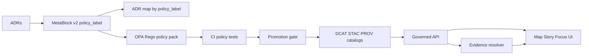

<!-- [KFM_META_BLOCK_V2]
doc_id: kfm://doc/7f8b6d6c-1a4b-4f11-9a9f-8f2d9f3bfe2a
title: ADR Map — By Policy Label
type: standard
version: v1
status: draft
owners: <team or names>
created: 2026-03-01
updated: 2026-03-01
policy_label: internal
related:
  - kfm://doc/policy-label-vocab@v1  # TODO: replace with real doc_id/path
tags: [kfm, adr, governance, policy_label, map]
notes:
  - Index ADRs grouped by policy_label for fast review + safe publication gates.
  - Classified internal because it can reveal the existence of restricted/embargoed decisions.
[/KFM_META_BLOCK_V2] -->

# ADR Map: By Policy Label
Index Architecture Decision Records (ADRs) by `policy_label` so reviewers can quickly find decisions that impact access, redaction, and the trust membrane.


---

## Navigation
- [Why this map exists](#why-this-map-exists)
- [Controlled vocabulary](#controlled-vocabulary)
- [Map: ADRs by policy_label](#map-adrs-by-policy_label)
- [How to add or update entries](#how-to-add-or-update-entries)
- [Automation](#automation-optional)
- [Appendix](#appendix)

---

## Where this fits in the repo

```text
docs/
  adr/
    maps/
      by-policy-label.md  ← you are here
```

### Acceptable inputs
- Links to ADRs (relative links preferred).
- One-line summaries per ADR.
- Optional: “superseded by …” cross-links.

### Exclusions
- Do **not** paste full ADR content here (keep ADRs atomic + linkable).
- Do **not** publish a version of this file externally unless it is **redacted** to avoid leaking restricted/embargoed ADR existence.
- Do **not** invent new `policy_label` values here; update the controlled vocabulary first.

---

## Why this map exists

**Confirmed constraints (from KFM governance docs):**
- `policy_label` is treated as the primary classification input; policy evaluation returns **allow/deny** plus **obligations** (redaction/generalization + notices) and reason codes used for audit + UX.
- Promotion gates and runtime surfaces are intended to **fail closed** unless policy artifacts are present and validated (including policy tests in CI).

**What this file adds:**
- A “review surface” for decisions: ADRs that touch policy, redaction, catalog exposure, and client trust boundaries should be discoverable by the same label system used everywhere else.

### Trust flow (conceptual)



---

## Controlled vocabulary

This map assumes `policy_label` is a **controlled vocabulary**. Starter labels used across KFM specs:

| policy_label | Meaning (intent) | Default posture | Typical obligations / notes |
|---|---|---|---|
| `public` | Safe for public release | allow (for public read) | none |
| `public_generalized` | Public **derived** representation that has been generalized/redacted | allow (public read) | `show_notice` + generalized geometry / suppressed fields |
| `restricted` | Sensitive, rights unclear, or needs gating | deny for public | role-gated; avoid existence leaks |
| `restricted_sensitive_location` | Restricted + extra location protection | deny for public | **no precise coordinates** in public outputs |
| `internal` | Non-public operational docs | deny for public | internal-only; may still require auth + audit |
| `embargoed` | Time-limited restriction (future public) | deny until release | treat as restricted until explicit release |
| `quarantine` | Not safe to promote/publish | deny | isolate until QA/rights/policy resolved |

> NOTE: If a label is unknown or missing, treat the document as **quarantine** (fail closed) until governance resolves it.

---

## Map: ADRs by policy_label

### Conventions for entries

Use this entry format:

- **[ADR-####: <title>](../<adr-file>.md)** — <one-line summary> _(status: draft|accepted|superseded; updated: YYYY-MM-DD)_

If you don’t have an ADR number convention yet, use `ADR-UNNUMBERED` temporarily and fix it once numbering is adopted.

---

## `public`

**What belongs here:** decisions safe to expose publicly (including implementation decisions that do not disclose restricted datasets, sensitive locations, or private operational details).

**ADRs**
- _None listed yet._

[Back to top](#adr-map-by-policy-label)

---

## `public_generalized`

**What belongs here:** decisions that define **how** we generalize/redact to produce a public-safe derivative (e.g., hex bin sizes, minimum cell size, attribute suppression rules, UI notices).

**ADRs**
- _None listed yet._

[Back to top](#adr-map-by-policy-label)

---

## `restricted`

**What belongs here:** decisions that gate access based on role, rights, or sensitivity, including error-handling patterns that avoid leaking restricted existence.

**ADRs**
- _None listed yet._

[Back to top](#adr-map-by-policy-label)

---

## `restricted_sensitive_location`

**What belongs here:** decisions involving vulnerable sites, culturally restricted knowledge, endangered species, or other location-sensitive subjects (must avoid precise coordinate disclosure).

**ADRs**
- _None listed yet._

[Back to top](#adr-map-by-policy-label)

---

## `internal`

**What belongs here:** operational policies, incident procedures, runbooks, and security-sensitive architecture decisions not meant for public release.

**ADRs**
- _None listed yet._

[Back to top](#adr-map-by-policy-label)

---

## `embargoed`

**What belongs here:** decisions about time-based release, coordinated announcements, or scheduled data drops.

**ADRs**
- _None listed yet._

[Back to top](#adr-map-by-policy-label)

---

## `quarantine`

**What belongs here:** decisions documenting why something is blocked (validation failures, rights uncertainty, unresolved sensitivity), and what evidence is required to promote it.

**ADRs**
- _None listed yet._

[Back to top](#adr-map-by-policy-label)

---

## How to add or update entries

### 1) Ensure the ADR is governable
- Add a MetaBlock v2 to the ADR (type `adr`) with a valid `policy_label`.
- Keep the ADR self-contained: decision, rationale, alternatives, consequences, rollback plan.

### 2) Add the ADR to this map
- Add a bullet link under the appropriate `policy_label` section.
- If the ADR is `restricted`, `embargoed`, or `internal`, be mindful of whether a *public* docs surface exists. If so, maintain a redacted public index separately.

### 3) Validate (fail closed)
- Run link checks and markdown linting (where available).
- Ensure policy tests still pass when ADR changes affect policy semantics.

---

## Automation (optional)

This map can be generated by scanning ADR MetaBlocks and grouping by `policy_label`.

```bash
# TODO: add a generator (example interface)
python tools/adr_index/by_policy_label.py \
  --adr-root docs/adr \
  --output docs/adr/maps/by-policy-label.md
```

Minimum generator behavior:
- Parse MetaBlock v2 blocks.
- Fail if `policy_label` is missing/unknown.
- Produce stable, deterministic output (sorted by label, then ADR id).

---

## Appendix

### A. MetaBlock v2 snippet for ADRs

```text
[KFM_META_BLOCK_V2]
doc_id: kfm://doc/<uuid>
title: <ADR title>
type: adr
version: v1
status: draft|review|published|superseded
owners: <team or names>
created: YYYY-MM-DD
updated: YYYY-MM-DD
policy_label: public|public_generalized|restricted|restricted_sensitive_location|internal|embargoed|quarantine
related:
  - <links or kfm:// ids>
tags:
  - kfm
  - adr
notes:
  - decision: <one line>
[/KFM_META_BLOCK_V2]
```

### B. References (internal)

- *Kansas Frontier Matrix (KFM) — Definitive Design & Governance Guide (vNext Draft Consolidation).* (2026-02-20)
- *Kansas Frontier Matrix (KFM) — Implementation Blueprint v5 Expanded.* (2026-02-20)
