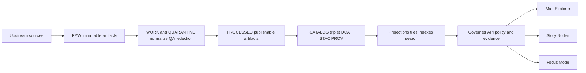

<!-- [KFM_META_BLOCK_V2]
doc_id: kfm://doc/4b9b1e2a-3f73-4d3d-97bf-6b5d6b6f1c4f
title: ADR: Maps by Promotion Gate
type: adr
version: v1
status: draft
owners: TBD (KFM maintainers)
created: 2026-03-01
updated: 2026-03-01
policy_label: public
related:
  - KFM Promotion Contract v1 (Definitive Design & Governance Guide vNext, 2026-02-20)
  - KFM Map Explorer + Story Node + Evidence Drawer requirements (Tooling the KFM pipeline; KFM Ultimate Blueprint 2026-02-20)
tags:
  - kfm
  - adr
  - maps
  - promotion-gates
notes:
  - Defines which map artifacts are required at each Promotion Contract gate (A–F) and optional production posture checks (G).
[/KFM_META_BLOCK_V2] -->

# Maps by Promotion Gate

**Purpose:** Define (1) *what a map-related artifact must prove* before it can appear in **PUBLISHED** KFM surfaces, and (2) *where to hang map ADRs* so the Promotion Contract remains auditable.

> **Fail-closed rule:** If a layer, tile set, story map, or Focus Mode answer can be shown to a user, it must be traceable to a promoted `dataset_version_id` + resolvable evidence bundle. If not, it stays out of PUBLISHED.

---

## Badges

> TODO: wire these to real repo paths + CI jobs once confirmed.


-informational)


---

## Quick navigation

- [Context](#context)
- [Decision](#decision)
- [Truth path and where maps sit](#truth-path-and-where-maps-sit)
- [Promotion Gate map](#promotion-gate-map)
- [Gate-to-ADR index](#gate-to-adr-index)
- [Implementation notes](#implementation-notes)
- [Consequences](#consequences)
- [Alternatives considered](#alternatives-considered)
- [Open questions](#open-questions)
- [Appendix](#appendix)

---

## Context

KFM treats **maps as governed evidence experiences**, not just visualization. That means:

- Datasets move through zones (RAW → WORK/QUARANTINE → PROCESSED → CATALOG/TRIPLET → PUBLISHED).
- **Promotion Contract** gates block publication unless required artifacts + validations exist.
- Map Explorer, Story Nodes, and Focus Mode must surface **dataset version + license/rights + provenance** (evidence-first UX).
- Map outputs (tiles, styles, saved map state) are either **canonical artifacts** (stored + versioned) or **rebuildable projections**, but *either way* they must be reproducible and evidence-linked.

This ADR maps the Promotion Contract gates onto map-specific artifacts and checks.

---

## Decision

1. **Adopt Promotion Contract v1 gate names (A–F) plus optional production posture checks (G)** as the canonical gate vocabulary for map publication.
2. **Treat map delivery artifacts as governed outputs** when they can affect what a user sees:
   - vector tile bundles (e.g., PMTiles)  
   - raster delivery artifacts (e.g., COGs)  
   - style JSON, legends, and any “baked” symbology parameters  
   - Story Node map-state sidecars  
3. **Default tile strategy for MVP:** **prebuilt PMTiles for large layers** + a small feature query endpoint for identify-on-click. Revisit server-side dynamic tiles if/when filters require it.  
4. **Evidence Drawer is a gate surface:** it must show minimum required fields (license, dataset version, provenance, redactions, etc.) and be accessible (keyboard navigable).

> NOTE: A separate ADR should exist for any “DECISION NEEDED” subtopic (tile strategy, symbology rules, export controls). This file is the *index + gate map*.

---

## Truth path and where maps sit



**Interpretation:**
- Map UI must never bypass the Governed API/policy boundary.
- PUBLISHED map surfaces should only reference **promoted dataset versions** (and their projections) that have passed the gates below.

---

## Promotion Gate map

### Gate A — Identity and versioning

**Goal:** No map can “float” without an immutable dataset version identity.

**Map-specific requirements**
- Every layer reference includes `dataset_version_id` (not just dataset slug).
- UI cache keys include `dataset_version_id` (do not assume datasets are stable).
- Any *derived map artifact* (tiles, styles) is content-addressed or includes a digest and is bound to the producing `dataset_version_id`.

**Example CI checks**
- Lint: layer registry entries must include `dataset_version_id`.
- Golden tests: `spec_hash` stable (prevents version confusion).
- Verify tile bundle digest matches receipt.

---

### Gate B — Licensing and rights metadata

**Goal:** Nothing renders (or exports) without explicit rights signals.

**Map-specific requirements**
- Layer panel and evidence drawer show:
  - license
  - rights holder
  - attribution text (user-facing)
- Any export function (image, geojson, csv, etc.) attaches license + attribution automatically.

**Example CI checks**
- Fail if any dataset/layer lacks license/rights fields.
- UI snapshot tests confirm license + attribution render for sample datasets.

---

### Gate C — Sensitivity classification and redaction plan

**Goal:** Policy labels and obligations are visible and enforced.

**Map-specific requirements**
- Each dataset version used by a layer has a `policy_label`.
- If obligations exist (generalize geometry, remove fields, suppress export):
  - they are applied **before** the artifact is exposed
  - they are reflected in the UI (“Geometry generalized due to policy…”)
- For sensitive locations: **never show “hidden” points.** Only show generalized representations (bins/aggregations) + explicit notice.

**Example CI checks**
- OPA fixture tests: default-deny; obligations honored for sample restricted dataset.
- Map rendering tests ensure restricted layers are denied or generalized.

---

### Gate D — Catalog triplet validation

**Goal:** EvidenceRefs resolve without guessing.

**Map-specific requirements**
- DCAT record exists and links to distributions used in maps.
- STAC collections/items exist for spatiotemporal assets (when applicable).
- PROV lineage exists for processed artifacts and derived map assets.
- Clicking a feature (or a story citation) yields an EvidenceRef that resolves to an EvidenceBundle.

**Example CI checks**
- Validate DCAT/STAC/PROV schemas + cross-links.
- Linkcheck: evidence refs resolve and are policy-allowed for a public user.

---

### Gate E — Run receipt and checksums

**Goal:** Every map-visible artifact is reproducible.

**Map-specific requirements**
- A `run_receipt` exists for each producing run and enumerates:
  - inputs
  - outputs (including tiles, styles, thumbnails if generated)
  - checksums/digests
  - environment (container digest, parameters)
- Evidence drawer exposes freshness + validation status (based on receipts + QA outputs).

**Example CI checks**
- Receipt schema validation; required fields present.
- Digest verification for a representative artifact set (PMTiles/COG/GeoParquet).

---

### Gate F — Policy tests and contract tests

**Goal:** Policy + interfaces are enforceable and regression-safe.

**Map-specific requirements**
- OPA policy tests pass for each promoted dataset version (fixtures-driven).
- Evidence resolver resolves at least one EvidenceRef in CI for that dataset version.
- API contracts/schemas validate.
- UI E2E proves the trust surface:
  - feature click opens evidence drawer
  - drawer shows **license + version**
  - keyboard navigation works

**Example CI checks**
- Conftest/OPA tests (deny-by-default enforced).
- Contract tests for `/datasets`, `/stac`, `/evidence/resolve`, `/story`.
- Playwright/Cypress E2E: click → evidence drawer; verify fields.

---

### Gate G — Optional but recommended production posture checks

**Goal:** Production-grade integrity, performance, and accessibility.

**Map-specific requirements**
- Supply-chain posture:
  - SBOM + build provenance for pipeline images and API/UI artifacts.
- Performance posture:
  - smoke tests for tile rendering and evidence resolve latency.
- Accessibility posture:
  - keyboard navigation smoke checks for Evidence Drawer and Layer Panel.

**Example CI checks**
- SBOM generation + attestation verification.
- Performance smoke job with thresholds (P95 tile render, P95 evidence resolve).
- a11y smoke (keyboard trap checks; focus order sanity).

---

## Gate-to-ADR index

> The links below are **placeholders**. Create the referenced ADRs before relying on them.

| Gate | Map ADRs to link here | Why it matters |
|---|---|---|
| A | `./deterministic-layer-identity.md` (TODO) | Prevents version confusion in layers, caches, and exports. |
| B | `./attribution-and-export-notices.md` (TODO) | Prevents silent license violations. |
| C | `./sensitive-location-generalization.md` (TODO) | Prevents precise leakage and “hidden points”. |
| D | `./evidence-ref-contract.md` (TODO) | Guarantees citations resolve for feature clicks + stories. |
| E | `./tiles-as-processed-artifacts.md` (TODO) | Makes tiles reproducible + auditable like other artifacts. |
| F | `./ui-trust-surface-tests.md` (TODO) | Keeps evidence drawer + policy behavior from regressing. |
| G | `./perf-and-a11y-smoke-gates.md` (TODO) | Ensures maps remain fast + accessible under growth. |

---

## Implementation notes

### Suggested artifact conventions (not confirmed in repo)

> These are *examples* to make the required relationships concrete. Confirm actual repo layout + conventions before implementing.

- **Tile bundles** (PMTiles) should be treated as PROCESSED outputs for large feature layers.
- **Style artifacts** should be versioned by digest and referenced from map layer config.
- **Map state sidecars** should be stored alongside Story Nodes and include:
  - bbox/zoom
  - active layers + style params
  - time window
  - filters

### Evidence Drawer: minimum required fields

At minimum, the Evidence Drawer should render:

- evidence bundle ID + digest  
- dataset version ID + dataset name  
- license + rights holder + attribution text  
- freshness (last run timestamp) + validation status  
- provenance chain (run receipt link)  
- artifact links (only if policy allows)  
- redactions applied (obligations) with explanation  

---

## Consequences

**Positive**
- Map UX becomes an enforceable trust surface (not a “best effort”).
- Tile strategy and caching align with reproducibility + audits.
- Map publication becomes reviewable with the same gates as data.

**Costs / friction**
- Additional CI checks (policy, evidence resolve, E2E) increase pipeline time.
- Treating tiles/styles as artifacts requires explicit storage + provenance.

---

## Alternatives considered

1. **Server-side dynamic tiles first (PostGIS → tile server → MVT)**  
   - Pros: flexible styling + filtering  
   - Cons: more runtime complexity; harder to make fully reproducible

2. **Ship raw GeoJSON to browser**  
   - Pros: simplest to prototype  
   - Cons: performance collapse on large layers; harder to enforce export controls

---

## Open questions

- Do we require **tile bundles** for *all* vector layers, or only above a size/feature threshold?
- How do we express “style changes” as governed revisions (new artifact digest vs config-only)?
- What is the standard “policy badge” vocabulary in the UI (public, restricted, partner, etc.)?
- What is the canonical representation of “validation status” in the evidence drawer (QA report IDs, thresholds, or boolean pass/fail)?

---

## Appendix

### A. Minimal map-state sidecar sketch (example)

```json
{
  "kfm_map_state_version": "v1",
  "view": { "bbox": [-102.1, 36.9, -94.6, 40.0], "zoom": 6.2 },
  "time": { "start": "1900-01-01", "end": "1950-12-31" },
  "layers": [
    {
      "dataset_version_id": "kfm://dataset/noaa_ncei_storm_events@<version>",
      "style_ref": "sha256:<digest>",
      "opacity": 0.8,
      "filters": []
    }
  ]
}
```

### B. Backlinks

- TODO: link to global Promotion Contract spec.
- TODO: link to Story Node v3 template and publishing workflow.

---

*Back to top:* [↑](#maps-by-promotion-gate)# ADRs by Promotion Gate

- TODO
