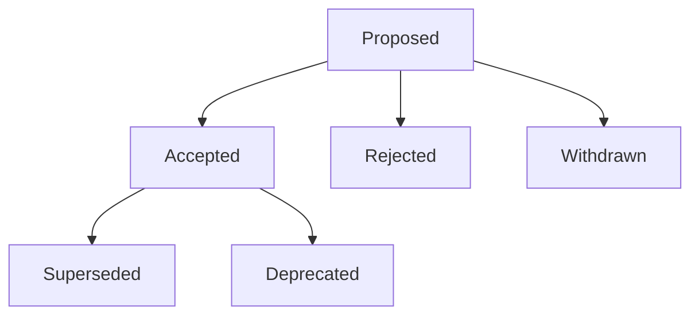

<!-- [KFM_META_BLOCK_V2]
doc_id: kfm://doc/8974871f-d4cc-46d5-a014-b02bb62e8ea0
title: ADR Map — By Status
type: guide
version: v1
status: draft
owners: TBD
created: 2026-03-01
updated: 2026-03-01
policy_label: public
related:
  - docs/adr/
tags:
  - kfm
  - adr
  - governance
  - architecture
notes:
  - Index of Architecture Decision Records (ADRs), grouped by decision + doc lifecycle status.
  - Keep doc_id stable; do not regenerate on edits.
[/KFM_META_BLOCK_V2] -->

# ADR Map — By Status
> One-page index of **Architecture Decision Records (ADRs)** grouped by **decision status** (and secondarily by **document lifecycle** status).


<!-- TODO: replace badges with repo-native badge conventions once available -->

---

## Quick navigation
- [Status taxonomy](#status-taxonomy)
- [Lifecycle diagram](#lifecycle-diagram)
- [Index by decision status](#index-by-decision-status)
  - [Proposed](#proposed)
  - [Accepted](#accepted)
  - [Superseded](#superseded)
  - [Deprecated](#deprecated)
  - [Rejected](#rejected)
  - [Withdrawn](#withdrawn)
- [Index by doc lifecycle](#index-by-doc-lifecycle)
- [Maintenance rules](#maintenance-rules)
- [Appendix: suggested ADR header fields](#appendix-suggested-adr-header-fields)

---

## Status taxonomy

### Two kinds of “status”
**Document lifecycle status (CONFIRMED vocab):** `draft | review | published`  
This comes from KFM MetaBlock v2 and applies to the *document artifact* itself. (Example: a draft ADR that is not ready for review.)

**Decision status (PROPOSED vocab):** `proposed | accepted | superseded | deprecated | rejected | withdrawn`  
This applies to the *decision outcome* and should be stated inside the ADR body (e.g., in a `## Decision status` section).

> NOTE  
> This map groups ADRs primarily by **decision status** because it answers “what decisions are in effect?”  
> The doc lifecycle view answers “which ADR documents are still moving through review?”

### Decision status definitions (PROPOSED)
| Decision status | Meaning | Must include | Must NOT include |
|---|---|---|---|
| **Proposed** | Under discussion; not yet adopted | owner, review target/date (if known) | “effective date” unless explicitly conditional |
| **Accepted** | Adopted and in force | rationale + consequences + rollback plan | “TBD” placeholders in the actual decision |
| **Superseded** | Replaced by a newer ADR | link to superseding ADR | ambiguous replacement (must be explicit) |
| **Deprecated** | Still accepted, but being phased out | deprecation rationale + migration plan (if applicable) | indefinite “someday” deprecations |
| **Rejected** | Considered but not adopted | rationale + why alternatives won | “accepted” consequences |
| **Withdrawn** | Proposed but pulled before decision | why withdrawn | pretending it never existed (keep history) |

---

## Lifecycle diagram



---

## Index by decision status

> TIP  
> Keep rows sorted by **Updated (desc)** inside each table.

### Proposed

| ADR | Summary | Owners | Updated | Links |
|---|---|---|---|---|
| *(none yet)* | — | — | — | — |

### Accepted

| ADR | Summary | Owners | Updated | Supersedes | Links |
|---|---|---|---|---|---|
| *(none yet)* | — | — | — | — | — |

### Superseded

| ADR | Summary | Owners | Updated | Superseded by | Links |
|---|---|---|---|---|---|
| *(none yet)* | — | — | — | — | — |

### Deprecated

| ADR | Summary | Owners | Updated | Replacement | Links |
|---|---|---|---|---|---|
| *(none yet)* | — | — | — | — | — |

### Rejected

| ADR | Summary | Owners | Updated | Links |
|---|---|---|---|---|
| *(none yet)* | — | — | — | — |

### Withdrawn

| ADR | Summary | Owners | Updated | Links |
|---|---|---|---|---|
| *(none yet)* | — | — | — | — |

---

## Index by doc lifecycle

This section is useful for review queues and steward workflows.

### Draft (doc lifecycle)

| ADR | Decision status | Owners | Updated | Links |
|---|---|---|---|---|
| *(none yet)* | — | — | — | — |

### Review (doc lifecycle)

| ADR | Decision status | Owners | Updated | Links |
|---|---|---|---|---|
| *(none yet)* | — | — | — | — |

### Published (doc lifecycle)

| ADR | Decision status | Owners | Updated | Links |
|---|---|---|---|---|
| *(none yet)* | — | — | — | — |

---

## Maintenance rules

### Update trigger (minimum)
- Any PR that **adds, changes decision status, or supersedes** an ADR must update this map.
- If an ADR impacts **core invariants** (policy, IDs, catalogs, trust membrane), the PR description should link the ADR.

### Required ADR content (minimum)
Each ADR should include:
- **Decision**
- **Rationale**
- **Alternatives considered**
- **Consequences**
- **Rollback plan**

> WARNING  
> This file is *not* generated yet. If/when automation is added, reserve a “GENERATED SECTION” and keep manual notes above/below it.

### “Fail closed” consistency checks (recommended)
- An ADR must appear in **exactly one** decision-status section.
- If decision status is **Superseded**, it must name the superseding ADR.
- If decision status is **Deprecated**, it must say what replaces it (or explicitly “no replacement”).

_Back to top: [Quick navigation](#quick-navigation)_

---

## Appendix: suggested ADR header fields

> PROPOSED convention (until a canonical ADR template exists in-repo)

At the top of each ADR (after MetaBlock), include:

- **Decision status:** Proposed | Accepted | Superseded | Deprecated | Rejected | Withdrawn
- **Decision date:** YYYY-MM-DD (when Accepted/Rejected/Deprecated/Superseded)
- **Effective date:** YYYY-MM-DD (optional; when behavior should begin)
- **Supersedes / Superseded by:** ADR links (when applicable)
- **Owners:** team or individuals

Example snippet:

```markdown
## Decision status
Accepted

## Decision
<what we will do>

## Rationale
<why>

## Alternatives
- <alt 1>
- <alt 2>

## Consequences
<what changes; what becomes harder>

## Rollback plan
<how to revert safely>
```# ADRs by Status

- TODO
