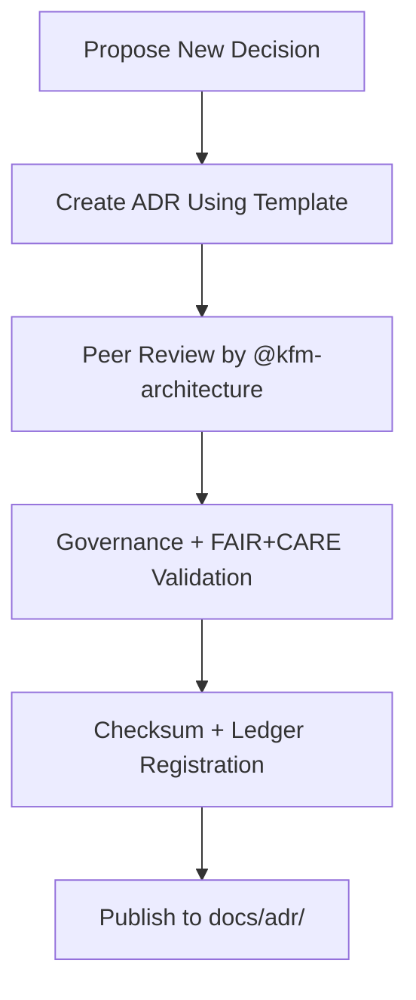

<div align="center">

# 📄 **Kansas Frontier Matrix — ADR Templates & Governance Guide (v2.1.1 · Tier-Ω+∞ Certified)**  
`docs/adr/templates/README.md`

**Mission:** Provide standardized **Architecture Decision Record (ADR)** templates and guidance for ethical, reproducible,  
and FAIR+CARE-aligned decision documentation within the **Kansas Frontier Matrix (KFM)** repository.

[](../../../docs/)
[](../../../docs/standards/faircare-validation.md)
[](../../../data/reports/audit/data_provenance_ledger.json)
[](../../../LICENSE)

</div>

---

## 📚 Overview

This directory contains **templates, decision guides, and best practices** for documenting major architectural or governance choices under KFM.  
All templates align with the **MCP-DL v6.4.3** documentation standard and support FAIR+CARE traceability.

Each ADR template:
- Defines a consistent structure for capturing technical rationale and consequences.  
- Integrates governance and provenance references for reproducibility.  
- Is validated through CI workflows for metadata completeness and FAIR+CARE compliance.

---

## 🗂️ Directory Layout

```bash
docs/adr/templates/
├── README.md                      # This file — ADR template governance overview
├── adr-template.md                 # Standard ADR creation template
├── adr-decision-guide.md           # Step-by-step ADR authoring and review guide
└── governance-signoff-template.md  # FAIR+CARE and provenance signoff record (optional)
```

---

## ⚙️ ADR Creation Workflow


<!-- END OF MERMAID -->

---

## 🧱 Template Structure Requirements

| Field | Description | Example |
|:--|:--|:--|
| **Title** | Short, descriptive title summarizing decision. | “Adopt CIDOC CRM for Knowledge Graph Schema” |
| **ADR ID** | Unique number assigned sequentially. | ADR-0002 |
| **Date / Status** | Creation date and lifecycle state. | “2025-10-07 · Accepted” |
| **Context** | Background and motivation for the decision. | Explains why a problem required resolution. |
| **Decision** | The conclusion and selected approach. | “Use Neo4j CIDOC CRM-based schema.” |
| **Consequences** | Trade-offs, dependencies, or risks. | “Requires RDF alignment for exports.” |
| **Governance Validation** | FAIR+CARE and MCP compliance record. | “Approved by Governance Council Q4 2025.” |

---

## 🧠 FAIR + CARE Integration in ADR Authoring

| Principle | Implementation | Verification |
|:--|:--|:--|
| **Findable** | ADRs indexed in `manifest.zip` and governance ledger. | CI Metadata Scan |
| **Accessible** | Markdown format under open CC-BY 4.0 license. | GitHub Repository |
| **Interoperable** | Machine-readable YAML metadata for CI/CD. | `policy-check.yml` |
| **Reusable** | ADR template reused across architecture domains. | Docs Validation |
| **Collective Benefit (CARE)** | All decisions reviewed for social, cultural, and environmental impact. | Governance Council |

---

## 🧩 Governance & Validation Integration

| Workflow | Function | Output |
|:--|:--|:--|
| `policy-check.yml` | Ensures frontmatter completeness for ADRs. | `reports/audit/policy_check.json` |
| `docs-validate.yml` | Validates Markdown syntax and diagram rendering. | `reports/validation/docs_validation.json` |
| `governance-ledger.yml` | Logs checksums and approval signatures. | `data/reports/audit/data_provenance_ledger.json` |

---

## 🧾 Example ADR Metadata (Frontmatter)

```yaml
---
adr_id: "ADR-0004"
title: "Migration to STAC/DCAT Hybrid Metadata Model"
status: "Proposed"
date: "2025-11-16"
authors: ["@kfm-architecture","@kfm-data"]
reviewers: ["@kfm-governance","@kfm-docs"]
governance_approval: "Pending FAIR+CARE Review"
checksum: "sha256:9e3ac4b82f61b7..."
license: "CC-BY 4.0"
---
```

---

## 🔍 ADR Status Lifecycle

| Status | Description |
|:--|:--|
| **Proposed** | Drafted and pending review. |
| **Accepted** | Approved by the Architecture Council and logged in the governance ledger. |
| **Superseded** | Replaced by a more recent decision; previous version retained for traceability. |
| **Rejected** | Considered but not implemented, retained for transparency. |

---

## 🧾 Version History

| Version | Date | Author | Summary |
|:--|:--|:--|:--|
| **v2.1.1** | 2025-11-16 | @kfm-architecture | Standardized ADR templates, added governance metadata and FAIR+CARE mapping. |
| v2.0.0 | 2025-10-25 | @kfm-governance | Introduced governance signoff and CI validation hooks. |
| v1.0.0 | 2025-10-04 | @kfm-architecture | Initial ADR template directory creation. |

---

<div align="center">

**Kansas Frontier Matrix © 2025**  
*“Every Decision Documented — Every Document Accountable.”*  
📍 `docs/adr/templates/README.md` — Template governance and authoring guide for Kansas Frontier Matrix ADRs.

</div>

