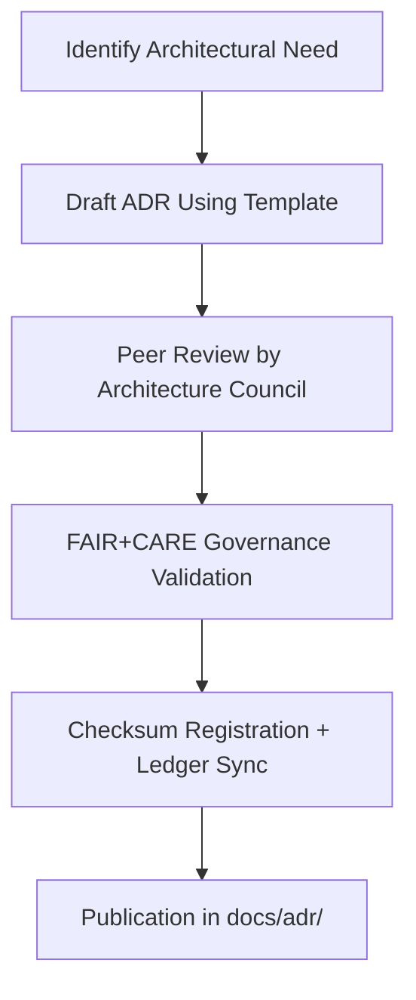
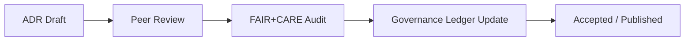

<div align="center">

# 🧭 **Kansas Frontier Matrix — ADR Decision Authoring & Review Guide (v2.1.1 · Tier-Ω+∞ Certified)**  
`docs/adr/templates/adr-decision-guide.md`

**Mission:** Provide a structured methodology for authoring, reviewing, and validating **Architecture Decision Records (ADRs)**  
within the **Kansas Frontier Matrix (KFM)** — ensuring reproducibility, FAIR+CARE ethics alignment, and governance traceability.

[](../../../docs/)
[](../../../docs/standards/faircare-validation.md)
[](../../../data/reports/audit/data_provenance_ledger.json)
[](../../../LICENSE)

</div>

---

## 📚 Overview

This guide describes **how to author and govern ADRs** under the **Master Coder Protocol (MCP-DL v6.4.3)**,  
enforcing consistent structure, metadata completeness, and FAIR+CARE accountability.

ADRs serve as the **living record** of key architectural and governance decisions in the KFM ecosystem,  
capturing their **rationale**, **context**, **trade-offs**, and **impact** across technical, ethical, and operational domains.

---

## 🧩 ADR Authoring Lifecycle


<!-- END OF MERMAID -->

---

## 🧱 ADR Writing Standards

| Section | Purpose | Example |
|:--|:--|:--|
| **Title** | Short summary of decision context. | “Adopt STAC/DCAT Hybrid Metadata Model.” |
| **ADR ID** | Unique identifier, e.g., ADR-0003. | Sequential numbering by commit. |
| **Status** | Proposed, Accepted, Superseded, Rejected. | “Accepted” |
| **Context** | Problem space and background. | Rationale for ontology selection. |
| **Decision** | The technical or governance choice made. | “Adopt Neo4j + CIDOC CRM model.” |
| **Consequences** | Results, trade-offs, and dependencies. | “Improves semantic reasoning; increases data modeling complexity.” |
| **Governance Validation** | FAIR+CARE audit result and sign-off. | “Approved by @kfm-governance (Q4 2025)” |
| **Ledger Entry** | Checksum and provenance record. | `data_provenance_ledger.json` |

---

## ⚙️ Review Roles & Responsibilities

| Role | Responsibility | Tooling / Workflow |
|:--|:--|:--|
| **ADR Author (@kfm-architecture)** | Drafts and formats the ADR. | `adr-template.md` |
| **Peer Reviewer (@kfm-data, @kfm-ai)** | Provides domain-specific input. | GitHub PR review |
| **Governance Lead (@kfm-governance)** | Validates ethical and FAIR+CARE alignment. | `faircare-validate.yml` |
| **Documentation Lead (@kfm-docs)** | Confirms metadata and format compliance. | `policy-check.yml` |
| **Ledger Maintainer (@kfm-security)** | Verifies checksum and provenance logs. | `governance-ledger.yml` |

---

## 🧠 FAIR + CARE Governance in ADRs

| Principle | Implementation in ADRs | Validation Workflow |
|:--|:--|:--|
| **Findable** | Indexed ADR metadata and searchable manifest. | `docs-validate.yml` |
| **Accessible** | Markdown ADRs under CC-BY 4.0 license. | Repository Review |
| **Interoperable** | Machine-readable YAML frontmatter. | `policy-check.yml` |
| **Reusable** | Templates reused across subsystems. | ADR Template Validation |
| **Collective Benefit (CARE)** | Governance Council ensures equitable design decisions. | `faircare-validate.yml` |

---

## 🧮 Governance Review Process

| Phase | Step | Validation Method | Output |
|:--|:--|:--|:--|
| **1. Drafting** | Author creates ADR from template. | MCP-DL Format | `adr-template.md` |
| **2. Peer Review** | Technical and domain feedback collected. | GitHub PR | Peer comments |
| **3. FAIR+CARE Audit** | Ethical and cultural impact reviewed. | Governance Board | `data_care_assessment.json` |
| **4. Approval** | Governance signature recorded. | `governance-ledger.yml` | Checksum record |
| **5. Publication** | ADR committed to repository. | Docs-Validate CI | Updated manifest |

---

## 🧾 Example Governance Metadata (ADR Frontmatter)

```yaml
---
adr_id: "ADR-0005"
title: "Implement FAIR+CARE Design Audit Pipeline"
status: "Accepted"
date: "2025-11-16"
authors: ["@kfm-governance","@kfm-architecture"]
reviewers: ["@kfm-ai","@kfm-docs"]
governance_validation: "Approved – FAIR+CARE Council Q4 2025"
checksum: "sha256:83b8e91e932a4dc52a9b76a25..."
ledger_entry: "data/reports/audit/data_provenance_ledger.json"
license: "CC-BY 4.0"
---
```

---

## 🔍 ADR Decision Validation Workflows

| Workflow | Function | Output |
|:--|:--|:--|
| `policy-check.yml` | Validates metadata and governance compliance. | `reports/audit/policy_check.json` |
| `docs-validate.yml` | Verifies Markdown structure and frontmatter integrity. | `reports/validation/docs_validation.json` |
| `faircare-validate.yml` | Confirms ethical review results. | `reports/fair/data_care_assessment.json` |
| `governance-ledger.yml` | Logs decisions and checksum signatures. | `data/reports/audit/data_provenance_ledger.json` |

---

## 🧩 ADR Status Lifecycle

| Status | Description | Next Action |
|:--|:--|:--|
| **Proposed** | New ADR created and pending peer review. | Await review & FAIR+CARE validation. |
| **Accepted** | Governance council approved decision. | Add checksum and merge to main. |
| **Deprecated** | Superseded by later ADR. | Reference successor ADR. |
| **Rejected** | Decision not adopted but retained for transparency. | Archive with rationale. |

---

## 🧾 Best Practices

- Use **clear, concise, and neutral language** in ADRs.  
- Document **alternatives considered** and why they were rejected.  
- Link **related ADRs**, diagrams, or datasets for provenance.  
- Include **ethical impact assessments** for decisions affecting people or communities.  
- Use **FAIR+CARE audit results** to guide acceptance criteria.  

---

## 🧠 ADR Governance Diagram


<!-- END OF MERMAID -->

---

## 🧾 Version History

| Version | Date | Author | Summary |
|:--|:--|:--|:--|
| **v2.1.1** | 2025-11-16 | @kfm-architecture | Added ADR governance lifecycle, FAIR+CARE review process, and checksum validation. |
| v2.0.0 | 2025-10-25 | @kfm-governance | Introduced structured peer review and audit workflow. |
| v1.0.0 | 2025-10-04 | @kfm-architecture | Initial ADR authoring and validation guide. |

---

<div align="center">

**Kansas Frontier Matrix © 2025**  
*“Architecture Decisions Define Provenance.”*  
📍 `docs/adr/templates/adr-decision-guide.md` — Authoring and governance guide for Kansas Frontier Matrix ADRs.

</div>

