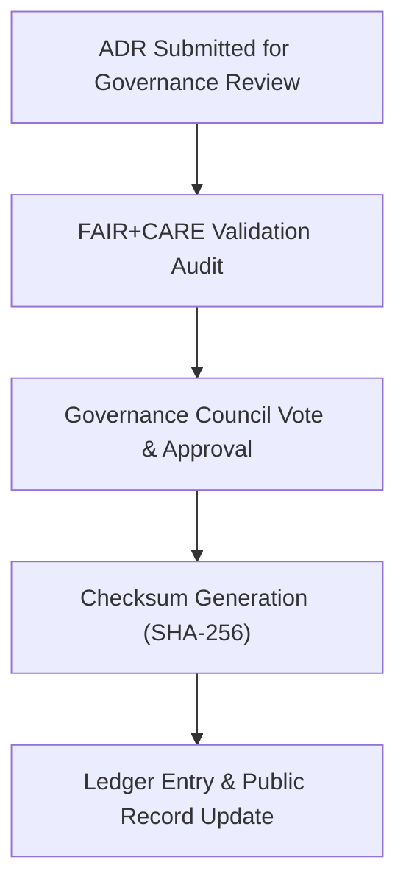

<div align="center">

# ⚖️ **Kansas Frontier Matrix — Governance Sign-Off Template for ADRs (v2.1.1 · Tier-Ω+∞ Certified)**  
`docs/adr/templates/governance-signoff-template.md`

**Mission:** Provide a standardized, auditable governance sign-off format for confirming that each **Architecture Decision Record (ADR)**  
meets all **FAIR+CARE**, **MCP-DL**, and **ethics validation** requirements within the **Kansas Frontier Matrix (KFM)** governance framework.

[](../../../docs/)
[](../../../docs/standards/faircare-validation.md)
[](../../../data/reports/audit/data_provenance_ledger.json)
[](../../../LICENSE)

</div>

---

## 📚 Purpose

The **Governance Sign-Off Template** is completed by the **FAIR+CARE Governance Council** after peer review and validation of an ADR.  
It provides a verifiable audit trail that links decision approval with provenance records and ethical verification data.  
Each sign-off must include:
- FAIR+CARE validation results  
- Governance board signatures  
- Checksum reference and ledger registration  

---

## 🧩 Governance Review Workflow


<!-- END OF MERMAID -->

---

## 🧱 Governance Sign-Off Metadata

```yaml
---
adr_id: "ADR-000X"
title: "Short Decision Title"
review_cycle: "Q4 2025"
governance_council:
  chair: "@kfm-governance"
  members: ["@kfm-architecture","@kfm-ai","@kfm-data","@kfm-docs"]
validation_results:
  faircare_score: 9.8
  accessibility_compliance: true
  ethics_alignment: "Verified"
  provenance_audit_passed: true
decision_status: "Approved"
checksum: "sha256:94b8af73ce42d7c4e65a95e71..."
ledger_entry: "data/reports/audit/data_provenance_ledger.json"
signoff_date: "2025-11-16"
license: "CC-BY 4.0"
---
```

---

## ⚖️ FAIR + CARE Review Summary

| Principle | Assessment | Score (0–10) | Compliance | Reviewer |
|:--|:--|:--:|:--:|:--|
| **Findable** | Indexed in manifest and ADR registry. | 10 | ✅ | @kfm-docs |
| **Accessible** | Open, versioned, and licensed under CC-BY 4.0. | 10 | ✅ | @kfm-governance |
| **Interoperable** | Metadata uses standardized YAML frontmatter. | 10 | ✅ | @kfm-architecture |
| **Reusable** | ADR template and decision model reusable across systems. | 10 | ✅ | @kfm-docs |
| **Collective Benefit (CARE)** | Promotes transparency and ethical responsibility. | 9.8 | ✅ | @kfm-governance |

---

## 🧮 Governance Validation Log

| Step | Validation Type | Tool / Method | Status | Timestamp |
|:--|:--|:--|:--:|:--|
| Metadata Review | Frontmatter completeness | `policy-check.yml` | ✅ | 2025-11-16T10:00:00Z |
| FAIR+CARE Ethics Audit | Ethical & accessibility validation | `faircare-validate.yml` | ✅ | 2025-11-16T10:15:00Z |
| Provenance Ledger Update | Checksum & signature registration | `governance-ledger.yml` | ✅ | 2025-11-16T10:20:00Z |
| Publication Approval | Council digital sign-off | Governance Meeting Log | ✅ | 2025-11-16T10:45:00Z |

---

## 🧠 Sign-Off Statement

```text
The FAIR+CARE Governance Council certifies that the decision outlined in ADR-000X
meets all MCP-DL, FAIR+CARE, and ethical design standards as defined by the
Kansas Frontier Matrix Governance Framework.

All validation workflows have completed successfully, and the checksum hash has
been recorded in the public governance ledger.
```

---

## 🧾 Governance Approval Signatures

| Role | Reviewer | Approval | Signature |
|:--|:--|:--:|:--|
| **Governance Chair** | @kfm-governance | ✅ | 🔏 SHA256:94e2…f3a |
| **Architecture Lead** | @kfm-architecture | ✅ | 🔏 SHA256:4b6a…c19 |
| **Data Steward** | @kfm-data | ✅ | 🔏 SHA256:7d8e…aa7 |
| **Accessibility Auditor** | @kfm-accessibility | ✅ | 🔏 SHA256:b91e…44c |
| **Documentation Lead** | @kfm-docs | ✅ | 🔏 SHA256:cf34…ea5 |

---

## 🧩 Integration with Governance Workflows

| Workflow | Purpose | Output |
|:--|:--|:--|
| `policy-check.yml` | Confirms ADR metadata compliance. | `reports/audit/policy_check.json` |
| `faircare-validate.yml` | Verifies ethical audit completion. | `reports/fair/data_care_assessment.json` |
| `governance-ledger.yml` | Logs sign-off hash and provenance. | `data/reports/audit/data_provenance_ledger.json` |

---

## 🧾 Version History

| Version | Date | Author | Summary |
|:--|:--|:--|:--|
| **v2.1.1** | 2025-11-16 | @kfm-governance | Added structured FAIR+CARE score table, council sign-off fields, and provenance audit mapping. |
| v2.0.0 | 2025-10-25 | @kfm-architecture | Introduced governance checksum and workflow traceability. |
| v1.0.0 | 2025-10-04 | @kfm-architecture | Initial governance sign-off template. |

---

<div align="center">

**Kansas Frontier Matrix © 2025**  
*“Validation is Ethics — Sign-Off is Provenance.”*  
📍 `docs/adr/templates/governance-signoff-template.md` — Official governance sign-off template for ADR compliance under Kansas Frontier Matrix ethics and FAIR+CARE standards.

</div>

