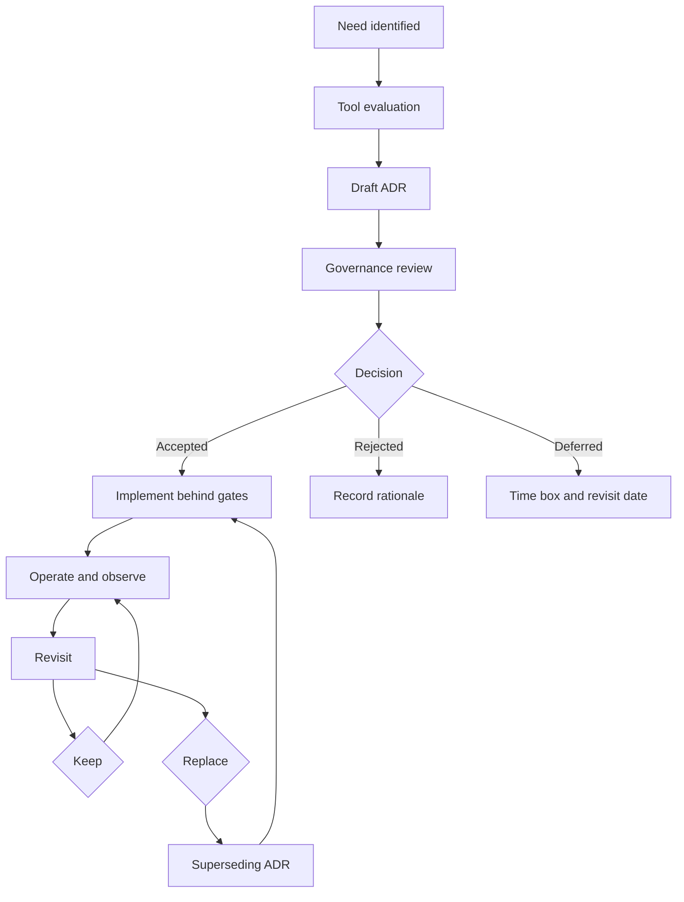

<!-- [KFM_META_BLOCK_V2]
doc_id: kfm://doc/167f0a78-5017-4a2b-a88e-c2e1cec6135f
title: Tools ADRs
type: standard
version: v1
status: draft
owners: TODO
created: 2026-03-01
updated: 2026-03-01
policy_label: restricted
related:
  - docs/adr/README.md
  - docs/adr/tools
tags: [kfm, adr, tools, governance]
notes:
  - This README defines how we decide, record, and govern tool choices.
  - Replace TODOs once repo conventions are confirmed.
[/KFM_META_BLOCK_V2] -->

# Tools ADRs

Evidence-first, governed decisions for tool selection, integration, and lifecycle management.

**Status:** draft • **Owners:** TODO • **Scope:** docs/adr/tools


<!-- TODO: Replace / add badges tied to actual CI workflows once known (linkcheck, policy tests, security scanning, SBOM, etc.). -->

---

## Quick navigation

- [Purpose](#purpose)
- [Where this fits](#where-this-fits)
- [What belongs here](#what-belongs-here)
- [What must not go here](#what-must-not-go-here)
- [ADR lifecycle](#adr-lifecycle)
- [How to add a new tool ADR](#how-to-add-a-new-tool-adr)
- [Definition of done](#definition-of-done)
- [Tool decision checklist](#tool-decision-checklist)
- [Tool ADR index](#tool-adr-index)
- [Directory tree](#directory-tree)
- [Appendix](#appendix)

---

## Purpose

This directory contains Architecture Decision Records (ADRs) that answer:

- **What tool did we choose?**
- **Why did we choose it (evidence + constraints)?**
- **How does the tool fit the KFM trust membrane and truth path?**
- **What are the operational obligations (security, licensing, privacy, cost, maintenance)?**
- **How do we roll it back or replace it (exit plan)?**

KFM is **map-first**, **time-aware**, and **governed**. Tooling is part of governance: a tool decision can change what is measurable, reproducible, secure, and publishable.

> **Default-deny posture:** If licensing, security posture, or policy implications are unclear, the ADR must either (1) block adoption, or (2) propose a safe, constrained pilot with explicit gates and rollback.

---

## Where this fits

`docs/adr/tools/` is a **decision surface** for tool choices that affect one or more of:

- ingestion, validation, normalization
- catalog and provenance (DCAT, STAC, PROV)
- storage, indexing, tile generation
- governed APIs and policy enforcement
- observability, audit, incident response
- UI delivery and build pipeline
- ML/AI toolchains used for derived layers or Focus Mode supporting services

This folder is **not** where we write tutorials or runbooks. Those live in runbooks / ops docs (location TBD).

---

## What belongs here

Acceptable inputs for `docs/adr/tools/`:

- Tool selection decisions (new tool introduction, tool replacement, deprecation)
- Tool configuration patterns that are “architecturally binding” (e.g., policy enforcement mode, audit log requirements, reproducibility constraints)
- Tool lifecycle decisions (support window, upgrade policy, pinning, SBOM, vulnerability response)
- Governance decisions about tools (license acceptability, data egress constraints, supply chain controls)

Typical tool categories (examples only):

| Category | Decision examples | Notes |
|---|---|---|
| Policy enforcement | policy engine integration, evaluation mode, obligation handling | Must preserve trust membrane |
| Storage | object store, spatial DB, time-aware storage | Must preserve truth path immutability |
| Indexing and search | full-text, vector, spatial indexes | Rebuildability requirements |
| Data validation | schema validators, STAC/DCAT validators | CI-enforced gates |
| Observability | metrics/logging/tracing stack | Audit requirements |
| UI toolchain | UI framework, map rendering stack | Accessibility + performance |
| CI and supply chain | SBOM, signing, provenance, scanning | Reproducible builds |
| ML toolchain | training/inference frameworks, feature stores | Must emit provenance and receipts |

---

## What must not go here

Exclusions (do **not** put these in `docs/adr/tools/`):

- Dataset onboarding steps and dataset-specific decisions (use dataset registry/spec docs)
- Day-to-day operational instructions (runbooks)
- General architecture decisions not tied to a tool (use broader ADR directories)
- Unreviewed experiments without a clear “exit plan” and “no-prod” boundary

---

## ADR lifecycle



**Statuses** (recommended vocabulary):

- `draft` — proposed, not approved
- `review` — under review, merge not yet approved
- `accepted` — approved and binding
- `deprecated` — still present but planned for removal
- `superseded` — replaced by a newer ADR (link required)

> **Rule:** An ADR is never deleted; it is deprecated or superseded.

---

## How to add a new tool ADR

1. Create a new ADR file in this folder using the naming convention:

   - `NNNN-tool-short-title.md`
   - Example: `0007-policy-engine-opa.md`  
     *(Example only. Replace with your repo’s actual naming scheme if different.)*

2. Include:
   - the decision (what we chose)
   - considered alternatives
   - evidence (benchmarks, POC notes, constraints)
   - governance analysis (license, security, privacy, data egress)
   - integration and rollout plan
   - rollback / exit plan
   - test plan + CI gates
   - observability + audit plan

3. Add an entry to the [Tool ADR index](#tool-adr-index).

4. Ensure any required CI gates pass (see [Definition of done](#definition-of-done)).

---

## Definition of done

A tool ADR is “Done” when:

- [ ] **Decision is explicit** (chosen option + scope)
- [ ] **Alternatives are documented** (at least 2, unless truly none)
- [ ] **Evidence is attached** (POC notes, test results, constraints)
- [ ] **License and rights** reviewed (allowed, compatible, obligations recorded)
- [ ] **Security posture** reviewed (threat model impacts, supply chain plan)
- [ ] **Operational ownership** is assigned (team/role)
- [ ] **Integration plan** is buildable (phased if needed)
- [ ] **Rollback / exit plan** exists (how to revert or replace)
- [ ] **Observability plan** exists (logs/metrics/traces, audit requirements)
- [ ] **Policy implications** are clear (trust membrane, redaction obligations)
- [ ] **Follow-up tasks** are created (issues/epics; links if available)

---

## Tool decision checklist

Use this checklist in the ADR body (copy/paste):

### Tool decision checklist template

- **Context**
  - What problem does this tool solve?
  - Which KFM components are impacted?

- **Constraints**
  - Data sensitivity / policy labels affected?
  - Offline/airgapped requirements?
  - Performance, scale, latency, cost ceilings?

- **Options considered**
  - Option A
  - Option B
  - Option C

- **Decision**
  - Chosen option:
  - Decision date:
  - Decision owners:

- **Governance and compliance**
  - License:
  - Data egress:
  - Retention:
  - Audit log requirements:
  - Accessibility requirements (if UI tool):

- **Security and supply chain**
  - SBOM:
  - Signing / provenance:
  - Vulnerability scanning:
  - Patch cadence:
  - Secrets handling:

- **Operations**
  - On-call ownership:
  - Runbooks location:
  - Monitoring:
  - SLOs:

- **Reproducibility**
  - Version pinning strategy:
  - Deterministic build plan:
  - Migration plan:

- **Exit plan**
  - How to roll back:
  - How to replace:
  - Data migration/compat risks:

---

## Tool ADR index

> **This table is intentionally empty by default.** Populate it as ADRs are created.

| ADR | Tool | Status | Date | Scope | Summary | Owner |
|---|---|---:|---:|---|---|---|
| TODO | TODO | draft | YYYY-MM-DD | TODO | TODO | TODO |

**Index maintenance rule:** Every new ADR must add one row here.

---

## Directory tree

> Replace with the real output of `tree docs/adr/tools` once available.

```text
docs/adr/tools/                                            # ADR helper tooling (optional scripts + tool-specific ADR stubs)
├─ README.md                                               # Tooling overview (what exists, how to run, invariants enforced, exit codes)
├─ TODO-0001-example-tool-adr.md                           # Placeholder tool ADR (example: add adr-lint + required sections/links)
└─ TODO-0002-example-tool-adr.md                           # Placeholder tool ADR (example: add adr-indexer + generated index contract)
```

---

## Appendix

### Recommended ADR structure

Use this header skeleton for each tool ADR:

```markdown
# ADR NNNN: Tool name short decision

- Status: draft|review|accepted|deprecated|superseded
- Date: YYYY-MM-DD
- Owners: Team or names
- Related: links to epics/issues/other ADRs

## Context
## Decision drivers
## Options considered
## Decision
## Consequences
## Security and supply chain
## Governance and policy
## Observability and audit
## Rollout plan
## Rollback and exit plan
## References
```

### Notes on KFM invariants

Tooling choices must not violate:

- **Truth path**: upstream ➜ RAW ➜ WORK ➜ PROCESSED ➜ CATALOG ➜ PUBLISHED  
- **Trust membrane**: clients do not bypass governed APIs + policy boundary  
- **Cite-or-abstain**: user-facing outputs must be traceable to evidence  
- **Rebuildability**: derived projections and indexes must be reproducible from canonical artifacts

(These invariants are defined in KFM’s governing design docs; see references below.)# ADR Tools

Helper scripts for ADR numbering, linting, indexing, link checking, and evidence checks.
