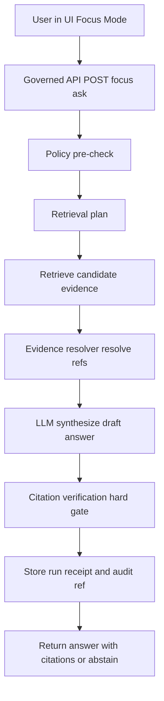

<!-- [KFM_META_BLOCK_V2]
doc_id: kfm://doc/7b2d4b17-0f10-4d0e-9f6c-641d6b0a6bb2
title: Focus Mode Overview
type: standard
version: v1
status: draft
owners: ["TBD"]
created: 2026-03-04
updated: 2026-03-04
policy_label: public
related: ["docs/ai/", "docs/standards/", "contracts/schemas/ (TBD)"]
tags: ["kfm", "focus-mode", "ai", "governance", "evidence"]
notes: [
  "Design overview for Focus Mode as governed, evidence-led Q&A (cite-or-abstain).",
  "This doc is a contract surface: it defines invariants and non-goals.",
  "Replace TBD paths with repo-relative links once locations are finalized."
]
[/KFM_META_BLOCK_V2] -->

# Focus Mode Overview
Evidence-led Q&A that **cites resolvable evidence or abstains** (no unverifiable answers).

> **Status:** Draft (design spec)  
> **Owners:** TBD (add CODEOWNERS entry)  
> **Scope:** Focus Mode only (Map Explorer / Story Mode referenced only where they intersect)  
> **Trust posture:** Default-deny, fail-closed, cite-or-abstain

**Badges (placeholders):**
- 
- 
- 

**Quick nav:**  
- [Scope](#scope) · [Where it fits](#where-it-fits) · [Non-negotiables](#non-negotiables) · [Request contract](#focus-mode-request-contract) · [Control loop](#control-loop) · [Evidence model](#evidence-model) · [Policy and safety](#policy-and-safety) · [UX requirements](#ux-requirements) · [CI gates](#ci-gates-and-definition-of-done) · [Unknowns](#unknowns-and-minimum-verification-steps)

---

## Scope

### CONFIRMED: What Focus Mode is
Focus Mode is a **governed workflow** that answers user questions using only admissible evidence, producing:
- an answer,
- citations as **EvidenceRefs** that resolve to **EvidenceBundles**, and
- an **audit_ref** for review and traceability.

Focus Mode behaves like a research assistant with sources, **not** a general chat agent.

### CONFIRMED: What this file covers
- The “trust membrane” responsibilities for Focus Mode (policy + evidence resolution + audit).
- The end-to-end control loop (policy → retrieve → bundle → synthesize → verify → receipt).
- Required UX surfaces (abstention, policy notices, evidence drawer hooks).
- Merge-blocking gates (evaluation harness, citation resolvability, refusal correctness).

### EXCLUSIONS (fail-closed)
This document does **not** specify:
- dataset-specific retrieval logic,
- UI styling,
- model choice benchmarks,
- production infra topology (k8s, cloud), except where it affects invariants.

---

## Where it fits

### CONFIRMED: Layering rule (trust membrane)
Clients (UI) must not directly access storage or databases. All access crosses the governed API boundary, where policy and evidence resolution are enforced. Domain logic must not bypass repository/adapter interfaces to reach infrastructure.

### CONFIRMED: Focus Mode in the overall architecture
- **UI** hosts the chat experience and renders citations/evidence cards.
- **Governed API** orchestrates Focus Mode and enforces policy.
- **Evidence resolver** resolves EvidenceRefs to EvidenceBundles and applies policy obligations.
- **Datastores and indexes** (PostGIS / graph / search / catalogs) are retrieval sources, but not “truth” unless results map back to evidence.
- **LLM runtime** (e.g., Ollama) generates text **only** from provided, policy-filtered context.



---

## Non-negotiables

### CONFIRMED: Cite-or-abstain is the primary anti-hallucination mechanism
- Focus Mode must **verify** every citation resolves and is policy-allowed.
- If citations cannot be verified: **revise to supported scope or abstain**.

### CONFIRMED: “Citation” definition
A citation is an **EvidenceRef** that resolves via the evidence resolver into an **EvidenceBundle** (metadata, artifacts, provenance, policy decision). It is **not** a pasted URL.

### CONFIRMED: Focus Mode emits a governed run receipt
A Focus Mode query is a governed operation that must emit a receipt capturing:
- inputs,
- outputs (by digest),
- environment/model version,
- validation results,
- policy decisions.

### CONFIRMED: Abstention is a feature (and must not leak restricted existence)
- Abstention must be explained in policy-safe terms.
- Provide safe alternatives where possible.
- Do not show “ghost metadata” about restricted datasets unless policy allows.

---

## Focus Mode request contract

### CONFIRMED: Inputs
- `user_query` (string)
- `view_state` (optional): map bbox, time window, active layers (context hint)
- `principal` context: user role + policy context

### CONFIRMED: Outputs
- `answer` (text)
- `citations[]` (EvidenceRefs; resolvable)
- `audit_ref` (run id for review)

### PROPOSED: Endpoint naming (must be kept consistent)
- `POST /api/v1/focus/ask` for Q&A
- `POST /api/v1/evidence/resolve` for EvidenceRef → EvidenceBundle

(If the repo uses different paths, update this doc and keep backward compatibility at the API boundary.)

---

## Control loop

### CONFIRMED: Required steps (implementation guidance)
1. **Policy pre-check**: determine whether the query is allowed for this role/topic.
2. **Retrieval plan**: choose candidate datasets and indexes using query intent + view_state.
3. **Retrieve evidence**: query catalogs, search index, graph, or PostGIS for admissible evidence.
4. **Build evidence bundles**: resolve EvidenceRefs to EvidenceBundles; apply redaction obligations.
5. **Synthesize answer**: model generates an answer referencing evidence bundle IDs.
6. **Citation verification (hard gate)**: verify every citation resolves and is policy-allowed; otherwise revise or abstain.
7. **Produce audit receipt**: store query, evidence bundle digests, policy decisions, model version, latency, output hash.

### CONFIRMED: Hard gate rule
Step 6 is the enforcement point. If citations cannot be verified, the response must abstain or reduce scope.

---

## Evidence model

### CONFIRMED: EvidenceBundle minimum fields (conceptual)
An EvidenceBundle should be inspectable by humans and verifiable by machines:
- bundle id and digest
- dataset_version_id
- license/rights metadata
- provenance/run id
- artifact hrefs and digests (policy-filtered)
- policy decision result (allow/deny + obligations + reason codes)
- audit_ref

### PROPOSED: EvidenceBundle “card” UX
When a user clicks a citation in Focus Mode, show an EvidenceDrawer card with:
- dataset version + license
- freshness/last run timestamp
- validation status
- redactions applied (obligations)
- provenance chain (run receipt link)

---

## Retrieval indexes

### CONFIRMED: Allowed projections (buildable)
Focus Mode may use multiple retrieval projections:
- catalog search (DCAT/STAC) for datasets by theme/coverage
- text search index for OCR corpora and documents
- graph edges for entity resolution and relationship traversal
- PostGIS for bbox/time filtering
- vector index (optional) for semantic retrieval

### CONFIRMED: Mapping requirement
Retrieval results must map back to EvidenceRefs that resolve to bundles.
There is no allowed “raw text from index” without evidence linking.

---

## Policy and safety

### CONFIRMED: Prompt injection and exfiltration defenses
Focus Mode must resist:
- prompt injection from documents (e.g., malicious OCR text)
- exfiltration attempts (“show me restricted dataset list”)

Minimum defenses:
- tool allowlist (model cannot call arbitrary tools)
- explicit system policy refusing restricted disclosures
- evidence resolver is the only authority for citations
- filter/redact restricted text **before** the model receives it

### CONFIRMED: API error behavior must avoid sensitive existence leaks
- Use a stable error model with `error_code`, `message` (policy-safe), `audit_ref`, optional remediation hints.
- Align 403/404 behavior with policy and avoid leaking via differential errors.

---

## UX requirements

### CONFIRMED: Focus Mode UI components (conceptual)
- ChatPanel
- inline EvidenceSnippets (citations)
- PolicyNotice (why something is withheld)
- ExportAnswer (download report with audit_ref + citations)

### CONFIRMED: Accessibility minimums
- Evidence drawer and core controls keyboard-navigable
- policy badges not color-only
- safe markdown rendering (sanitization + CSP)

### CONFIRMED: Abstention UX
When abstaining:
- say what is missing in policy-safe terms
- suggest what is allowed (public alternatives, broadened scope)
- include audit_ref for steward follow-up
- do not reveal restricted existence unless policy allows

---

## CI gates and Definition of Done

### CONFIRMED: Focus Mode must ship with an evaluation harness
The evaluation harness should include tests for:
- citation coverage (percent of factual claims supported by citations)
- citation resolvability (100% resolve for allowed users)
- refusal correctness (restricted questions get policy-safe refusals)
- sensitivity leakage (no restricted coordinates/metadata)
- regression tests (golden queries across dataset versions)

Run in CI for Focus Mode changes and before each release.

### CONFIRMED: Merge-blocking expectation
Focus Mode work is not “done” until golden-query regressions block merges and citation verifier behavior is enforced.

### PROPOSED: Work package deliverables (names may vary by repo)
- orchestrator module
- API route for focus ask
- evaluation harness tests
- focus response schema contract

---

## Non-goals and exclusions

### CONFIRMED: Hard exclusions
- No unsourced answers (no citations → abstain).
- No UI direct-to-DB/storage access.
- No “freeform tool use” by the model (must be allowlisted and mediated).
- No disclosure of restricted dataset existence/metadata unless policy allows.

### PROPOSED: Deferred features (explicitly out of MVP)
- multi-agent tool execution
- long-running “research jobs” outside governed run receipts
- automated story publishing from Focus Mode

---

## Unknowns and minimum verification steps

### UNKNOWN: What exists in code today
This doc is a design contract. Verify current implementation status by:
1. Capture repo commit hash and directory tree.
2. Locate actual focus endpoints and schemas (if any).
3. Confirm CI workflows include focus evaluation harness gates.
4. Confirm evidence resolver exists and is called by Focus Mode (integration test).

### UNKNOWN: Exact DTO shapes and schema paths
To make CONFIRMED:
- add/locate `contracts/schemas/focus_response_v1.schema.json` (or equivalent)
- link this doc to those schema files
- add examples that match contract tests

---

## Appendix: PROPOSED response shape (illustrative)
> This is a **shape hint** only. The authoritative contract must live in `contracts/schemas/*`.

```json
{
  "answer": "…",
  "citations": [
    { "evidence_ref": "kfm://evidence/sha256:...", "bundle_id": "sha256:..." }
  ],
  "audit_ref": "kfm://audit/entry/...",
  "policy": { "decision": "allow", "obligations_applied": [] },
  "dataset_version_ids": ["2026-02.abcd1234"]
}
```

---

### Back to top
- [Back to top](#focus-mode-overview)
