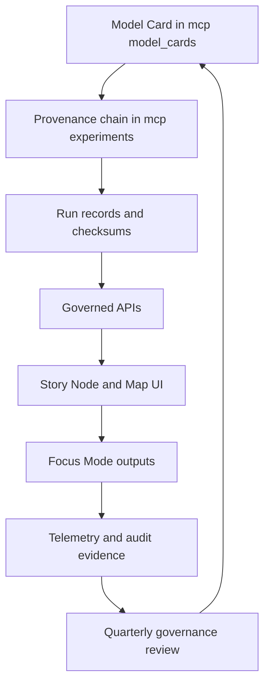

<!-- [KFM_META_BLOCK_V2]
doc_id: kfm://doc/95466668-e72c-44b2-b485-ed7e353e40fa
title: Model Cards Index
type: standard
version: v1
status: draft
owners: ["KFM AI Governance Board", "KFM Climate Working Group", "KFM Geospatial Working Group", "KFM Hydrology Working Group"]
created: 2026-03-04
updated: 2026-03-04
policy_label: restricted
related: [
  "../../mcp/model_cards/",
  "../standards/governance/ROOT-GOVERNANCE.md",
  "../standards/faircare/FAIRCARE-GUIDE.md",
  "../standards/sovereignty/INDIGENOUS-DATA-PROTECTION.md"
]
tags: [kfm, ai, model-cards, governance, provenance]
notes: ["Manual index of governed model cards with evidence labels (CONFIRMED/PROPOSED/UNKNOWN)."]
[/KFM_META_BLOCK_V2] -->

# Model Cards Index
One place to find all **KFM model cards** and their key governance metadata.

> **IMPACT**
>
> **Status:** **draft** (content), **active** (maintenance)  
> **Owners:** KFM AI Governance Board (primary)  
> **Scope:** Model cards under `mcp/model_cards/` (CONFIRMED subset; see registry table)  
> **Badges:**     
> **Jump to:** [Scope](#scope) · [Registry](#model-card-registry) · [Quickstart](#quickstart) · [Governance](#governance-and-review) · [Update Process](#updating-this-index) · [Appendix](#appendix-field-reference)

---

## Scope

**PROPOSED:** Standardize model-card metadata on `KFM_META_BLOCK_V2` (an HTML comment block) rather than YAML front matter, so metadata is non-rendering and consistent across KFM docs.

**UNKNOWN:** Whether every model card has already been migrated off YAML front matter. Verify by checking the first ~30 lines of each `mcp/model_cards/*.md` for either `---` front matter or a `KFM_META_BLOCK_V2` block.

**UNKNOWN:** This index may not list *every* model card currently in the repository. If `mcp/model_cards/` contains more files than listed below, add them to the registry table.

---

## Where this fits in the repo

**CONFIRMED:** This file lives at `docs/ai/MODEL_CARDS_INDEX.md` and links to model cards at `mcp/model_cards/*.md`.

**PROPOSED:** Treat this index as the **human-friendly entrypoint**, while CI uses a **machine-readable registry** (see [Updating this index](#updating-this-index)).

---

## Acceptable inputs

- **CONFIRMED:** Markdown model cards in `mcp/model_cards/`.
- **PROPOSED:** Each model card includes a `KFM_META_BLOCK_V2` header with required governance fields (e.g., `intent`, `doc_uuid`, `release_stage`, `lifecycle`, `fair_category`, `care_label`, `policy_label`). Keep minimal YAML front matter *only* if required by a docs-site generator.
- **PROPOSED:** A generated `docs/ai/model_cards.index.json` (or similar) produced in CI from model-card metadata headers.

## Exclusions

- **CONFIRMED:** Do **not** put model weights, private dataset extracts, or raw telemetry here.
- **CONFIRMED:** Do **not** add or infer sensitive locations, sacred sites, or coordinates.
- **PROPOSED:** Do **not** link directly to internal storage/DB URLs; link to governed APIs or repo paths only.

---

## Directory layout

**CONFIRMED (example layout referenced by model cards):**

```text
KansasFrontierMatrix/
├── mcp/
│   ├── model_cards/
│   │   ├── climate_anomaly_net_v3.md
│   │   ├── geo_alignment_net_v4.md
│   │   ├── hydrology_seq2seq_v11.md
│   │   └── focus_mode_transformer_v3.md
│   └── experiments/
│       └── YYYY-MM-DD_<DOMAIN>-EXP-###.md
├── data/
│   └── provenance/
│       └── experiments/
│           └── <model_id>/<timestamp>/
└── releases/
    └── v11.0.0/
        └── mcp-modelcards-telemetry.json
```

---

## Model card registry

**Legend:**
- **Evidence:** `CONFIRMED` = explicitly present in model-card front matter (or model-card content) as indexed from the model card files.
- **Evidence:** `UNKNOWN` = not yet verified in this index; confirm by opening the model card file.

> **IMPORTANT**
> This registry is intentionally metadata-light. The model card itself is the authoritative surface.

| Model | Path | Intent | Version | Last updated | Lifecycle | Sensitivity | FAIR | CARE | Status | Evidence |
|---|---|---|---:|---:|---|---|---|---|---|---|
| Climate Anomaly Net v3 | [`mcp/model_cards/climate_anomaly_net_v3.md`](../../mcp/model_cards/climate_anomaly_net_v3.md) | `climate-anomaly-net-v3` | v11.0.0 | 2025-12-12 | LTS | Low | F1-A1-I2-R2 | Responsible · Ethics · Stewardship | Active / Enforced | CONFIRMED |
| Geo Alignment Net v4 | [`mcp/model_cards/geo_alignment_net_v4.md`](../../mcp/model_cards/geo_alignment_net_v4.md) | `geo-alignment-net-v4` | v11.0.0 | 2025-12-12 | LTS | Mixed | F1-A1-I2-R2 | Collective Benefit · Ethics · Responsibility | Active / Enforced | CONFIRMED |
| Hydrology Seq2Seq v11 | [`mcp/model_cards/hydrology_seq2seq_v11.md`](../../mcp/model_cards/hydrology_seq2seq_v11.md) | `hydrology-seq2seq-v11` | v11.0.0 | 2025-12-12 | LTS | Mixed | F1-A1-I2-R3 | Collective Benefit · Responsibility · Ethics | Active / Enforced | CONFIRMED |
| Focus Mode Transformer v3 | [`mcp/model_cards/focus_mode_transformer_v3.md`](../../mcp/model_cards/focus_mode_transformer_v3.md) | `focus-mode-transformer-v3` | v11.0.0 | 2025-12-12 | LTS | Mixed | F1-A1-I3-R3 | Collective Benefit · Authority to Control · Responsibility · Ethics | Active / Enforced | CONFIRMED |

### Grouping by domain

- **Climate:** Climate Anomaly Net v3
- **Geospatial:** Geo Alignment Net v4
- **Hydrology:** Hydrology Seq2Seq v11
- **Narrative/Reasoning:** Focus Mode Transformer v3

---

## Quickstart

### Open a model card

```bash
# From repo root
$ ls -1 mcp/model_cards/
$ sed -n '1,120p' mcp/model_cards/climate_anomaly_net_v3.md
```

### Find all model cards (best-effort)

**PROPOSED:** If you have ripgrep installed:

```bash
# List files that declare doc_kind: "Model Card"
$ rg -n --glob 'mcp/model_cards/*.md' 'doc_kind:\s*"Model Card"'

# List each model card's title, intent, version
$ rg -n --glob 'mcp/model_cards/*.md' '^(title|intent|version):'
```

---

## Governance and review

**CONFIRMED:** The indexed model cards reference governance, FAIR+CARE, and Indigenous data protection standards.

- Governance Charter: [`docs/standards/governance/ROOT-GOVERNANCE.md`](../standards/governance/ROOT-GOVERNANCE.md)
- FAIR+CARE Guide: [`docs/standards/faircare/FAIRCARE-GUIDE.md`](../standards/faircare/FAIRCARE-GUIDE.md)
- Indigenous Data Protection: [`docs/standards/sovereignty/INDIGENOUS-DATA-PROTECTION.md`](../standards/sovereignty/INDIGENOUS-DATA-PROTECTION.md)

### Review expectations

- **CONFIRMED:** The listed model cards are marked **Stable / Governed**, **LTS**, and reviewed on a **quarterly** cycle (working-group + governance council).
- **PROPOSED:** Any new model card must name an explicit **review_cycle** owner group and be included in quarterly review agendas.

### AI transformation safety (index-level reminders)

**CONFIRMED:** Model cards include explicit allow/deny lists for AI transforms (e.g., allow summarize/extract; prohibit fabricating provenance/results and exposing sensitive coordinates).

---

## Diagrams



---

## Updating this index

### Manual update

**PROPOSED:** When a new model card is added under `mcp/model_cards/`:

1. Add a new row in the [Model card registry](#model-card-registry).
2. Keep the registry table **sorted by domain**, then **model name**.
3. Ensure the model card includes:
   - `intent`, `doc_uuid`, `semantic_document_id`
   - `release_stage`, `lifecycle`, `review_cycle`
   - `fair_category`, `care_label`, `sensitivity`
   - `signature_ref`, `attestation_ref`, `sbom_ref`, `manifest_ref` (or explicit `UNKNOWN` placeholders)

### Automation (recommended)

**PROPOSED:** Add a tiny generator that parses front matter and rewrites only the registry table.

```python
# pseudocode: scripts/gen_model_cards_index.py
# - parse YAML front matter from mcp/model_cards/*.md
# - emit a sorted table into docs/ai/MODEL_CARDS_INDEX.md between sentinel comments
# - fail CI if table is out of date
```

---

## Gates and definition of done

- [ ] **CONFIRMED:** Each model card in `mcp/model_cards/` is linked in the registry.
- [ ] **PROPOSED:** CI checks that every model card has required front matter fields.
- [ ] **PROPOSED:** Link-check passes for governance/ethics/sovereignty references.
- [ ] **PROPOSED:** Every model card has a version-pinned integrity posture (signature, attestation, SBOM pointers).
- [ ] **PROPOSED:** Quarterly review date recorded (or scheduled) for every `Stable / Governed` card.

---

## FAQ

### Why do we keep both model cards and an index?

- **CONFIRMED:** Model cards are the canonical artifact and include governance metadata.
- **PROPOSED:** The index improves discovery, review scheduling, and CI enforcement.

### What if a model card is deprecated?

- **PROPOSED:** Keep it in the registry, but set `Status` to `Deprecated` and add a `Superseded by` note (linking to successor model card).

---

## Appendix: field reference

<details>
<summary>YAML front matter fields used by this index</summary>

The following fields are expected (best-effort) across KFM model cards.

- `title` — human display name
- `path` — canonical repo path
- `version`, `last_updated`
- `release_stage`, `lifecycle`, `review_cycle`
- `intent` — stable identifier used in registries/APIs
- `semantic_document_id`, `doc_uuid`, `event_source_id`
- `classification`, `sensitivity`
- `fair_category`, `care_label`
- `governance_ref`, `ethics_ref`, `sovereignty_policy`
- `signature_ref`, `attestation_ref`, `sbom_ref`, `manifest_ref`
- `telemetry_ref`, `telemetry_schema`
- `provenance_chain`
- `ai_transform_permissions`, `ai_transform_prohibited`

</details>

---

[Back to top](#model-cards-index)
