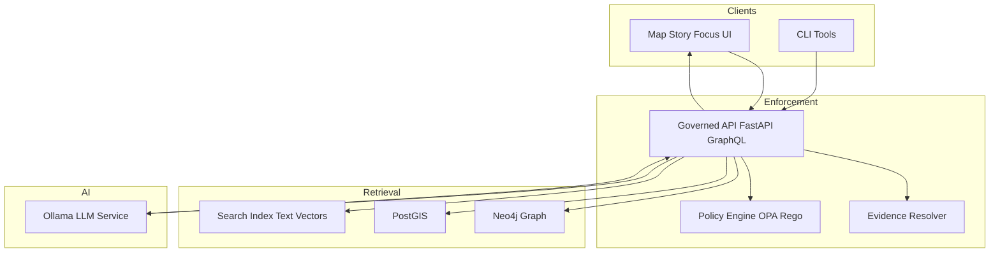

<!-- [KFM_META_BLOCK_V2]
doc_id: kfm://doc/7d4c6c1e-3c2a-4c7c-8a5e-6b2c55b7d2a1
title: Ollama Integration
type: standard
version: v1
status: draft
owners: ["kfm-ai-platform", "kfm-api-platform"]
created: 2026-03-04
updated: 2026-03-04
policy_label: restricted
related: []
tags: [kfm, ai, ollama, focus-mode, governance, opa, rag]
notes: [
  "This doc is normative where labeled CONFIRMED; otherwise it proposes patterns for review.",
  "URLs included for operator convenience; prefer governed/internal mirrors where available."
]
[/KFM_META_BLOCK_V2] -->

# Ollama Integration
One-line purpose: Run KFM Focus Mode on **local, containerized LLMs** via Ollama **without breaking the trust membrane** (governed APIs, citations, policy, audit).

---

## Impact
**Status:** draft • **Owners:** `kfm-ai-platform`, `kfm-api-platform` • **Policy:** restricted

  

**Quick nav**
- [Scope](#scope)
- [Where it fits](#where-it-fits)
- [Contracts](#contracts)
- [Local quickstart](#local-quickstart)
- [Deployment patterns](#deployment-patterns)
- [Model management](#model-management)
- [Security and governance](#security-and-governance)
- [Testing gates](#testing-gates)
- [Appendix: API examples](#appendix-api-examples)

---

## Scope

### Goals
- **CONFIRMED:** UI calls the **governed API**; the API orchestrates retrieval (Neo4j/PostGIS/search) and delegates generation to **Ollama**; an **OPA governance check** enforces policy (citations, sensitivity) before returning to UI.【KFM sources: see Notes & Citations in this PR/commit】
- **CONFIRMED:** Ollama is **only** the “LLM generation” step; it does not become a datastore and must not directly query KFM databases.【KFM sources: see Notes & Citations in this PR/commit】

### Non-goals
- Turning Ollama into a “direct tool runner” with arbitrary network/filesystem access.
- Allowing the browser/UI to talk to Ollama directly.
- Treating LLM output as canonical truth (unless explicitly promoted through governed dataset/story promotion lanes).

---

## Where it fits

### Architecture contract (trust membrane)
**CONFIRMED:** Clients (UI/CLI) talk only to the **Governed API**; policy and evidence resolution happen server-side; projections and canonical stores remain behind the API boundary.【KFM sources: see Notes & Citations in this PR/commit】



### Focus Mode pipeline (runtime)
**CONFIRMED:** Focus Mode’s end-to-end flow is: parse intent → retrieve knowledge → call Ollama → governance check → return answer with citations.【KFM sources: see Notes & Citations in this PR/commit】

---

## Contracts

### Service endpoints
**CONFIRMED (Ollama):**
- Base URL: `http://localhost:11434/api`
- Chat: `POST /api/chat`
- Completion: `POST /api/generate`
- Embeddings: `POST /api/embed` (supersedes `/api/embeddings`)

> IMPORTANT: KFM should standardize on `/api/chat` for conversational Focus Mode and `/api/embed` for embeddings/RAG.

### Environment variables (recommended)
These are **PROPOSED** names; use a repo-wide env convention if one already exists.

- `KFM_OLLAMA_BASE_URL` (default `http://ollama:11434`)
- `KFM_OLLAMA_CHAT_MODEL` (example: `gemma3`, `llama3.2`, etc.)
- `KFM_OLLAMA_EMBED_MODEL` (example: `embeddinggemma`, `all-minilm`, etc.)
- `KFM_OLLAMA_TIMEOUT_SECS` (default `60`)
- `KFM_OLLAMA_STREAM` (`true|false`, default `true`)
- `KFM_OLLAMA_KEEP_ALIVE` (default `5m`)

### API boundary (KFM)
**CONFIRMED:** Focus Mode should be exposed via a governed endpoint (illustrative): `POST /api/v1/focus/ask`, and it **must cite or abstain**.【KFM sources: see Notes & Citations in this PR/commit】

**PROPOSED request envelope (minimum viable):**
```json
{
  "question": "string",
  "session_id": "string",
  "constraints": {
    "policy_label_max": "public",
    "time_range": {"start": "YYYY-MM-DD", "end": "YYYY-MM-DD"},
    "bbox": [-102.05, 36.99, -94.61, 40.00]
  }
}
```

**PROPOSED response envelope (minimum viable):**
```json
{
  "answer_markdown": "string",
  "citations": [
    {"ref": "[1]", "evidence_ref": "kfm://evidence/...", "title": "string", "digest": "sha256:..."}
  ],
  "provenance": {
    "run_id": "kfm://run/...",
    "model": {"name": "gemma3", "tag": "latest"},
    "policy": {"decision": "allow", "obligations_applied": []}
  }
}
```

---

## Local quickstart

### Option A (native Ollama on host)
**CONFIRMED:** Ollama serves an HTTP API on `http://localhost:11434/api` once running.

1) Install Ollama (platform-specific — see Ollama docs)
2) Start the service (if not auto-started by installer)
3) Pull a model:
```bash
ollama pull gemma3
```

4) Sanity check:
```bash
curl http://localhost:11434/api/version
```

### Option B (Docker Compose)
**CONFIRMED (KFM pattern):** Run Ollama as a separate service; the API calls it via service DNS at `http://ollama:11434` (compose network).【KFM sources: see Notes & Citations in this PR/commit】

```yaml
services:
  api:
    build: ./backend
    environment:
      - KFM_OLLAMA_BASE_URL=http://ollama:11434
      - KFM_OLLAMA_CHAT_MODEL=gemma3
      - KFM_OLLAMA_EMBED_MODEL=embeddinggemma
    depends_on:
      - ollama

  ollama:
    image: ollama/ollama:latest
    ports:
      # SECURITY TIP: bind to localhost only unless you intentionally expose on LAN
      - "127.0.0.1:11434:11434"
    volumes:
      - ollama:/root/.ollama
    restart: unless-stopped
    # GPU support varies by platform; enable only where supported and governed.

volumes:
  ollama:
```

---

## Deployment patterns

### Pattern 1: External Ollama service (recommended default)
**CONFIRMED:** Run Ollama as a separate service; the API calls `http://ollama-service:11434/api/...` and can scale independently.【KFM sources: see Notes & Citations in this PR/commit】

**Pros**
- Independent scaling
- Clear fault isolation
- Easier multi-model hosting

**Cons**
- Network hop (usually negligible)

### Pattern 2: Sidecar per API pod (use sparingly)
**CONFIRMED:** Sidecar reduces latency but increases memory footprint because each pod loads a model copy.【KFM sources: see Notes & Citations in this PR/commit】

**When to use**
- Dedicated per-tenant isolation (needs governance review)
- Specialized low-latency deployments

---

## Model management

### Model selection
- **CONFIRMED:** Use at least one **chat** model for Focus Mode.
- **CONFIRMED:** Use an **embedding** model for RAG/semantic search if you are generating/storing vectors.

**PROPOSED practice (pinning)**
- Track `model:tag` (e.g., `llama3.2:latest`) **and** record any available digest/version at runtime.
- Keep an internal allowlist of model names + licenses.

### Custom models via Modelfile
**CONFIRMED (Ollama):** Modelfiles support `FROM`, `PARAMETER`, `TEMPLATE`, `SYSTEM`, `ADAPTER`, `LICENSE`, and `REQUIRES` to define model behavior and provenance.【See Notes & Citations】

**PROPOSED: `models/kfm-focus/Modelfile`**
```text
FROM gemma3

# Keep deterministic-ish defaults; tune in staging with eval harnesses
PARAMETER temperature 0.2
PARAMETER num_ctx 8192

SYSTEM """
You are KFM Focus Mode.
Rules:
1) Cite or abstain. Every factual claim MUST include a citation marker like [1].
2) If sources are insufficient or policy forbids, respond with: "UNKNOWN (insufficient evidence)" and explain what evidence is needed.
3) Never reveal secrets. Never claim you queried systems you did not query.
4) Output must be concise, use Markdown, and end with a Citations section.
"""

# TEMPLATE is optional; use only if you need strict formatting control.
LICENSE "Apache-2.0"
```

### Fine-tunes and adapters
**CONFIRMED (KFM concept):** LoRA / adapter-based improvements are plausible and should be governed (curation, QA, license review).【KFM sources: see Notes & Citations in this PR/commit】

**PROPOSED governance**
- Adapters require:
  - Model card + license
  - Evaluation results (citation correctness, refusal behavior)
  - Reproducible build recipe
  - Promotion gate approval

---

## Security and governance

### Input filtering (Prompt Gate)
**CONFIRMED:** Sanitize user input before sending to Ollama (prompt injection stripping/escaping, disallowed request filtering).【KFM sources: see Notes & Citations in this PR/commit】

### Output filtering (OPA + “cite-or-abstain”)
**CONFIRMED:** Apply runtime governance checks after Ollama returns draft output; enforce citations and policy labels; fail closed when checks fail.【KFM sources: see Notes & Citations in this PR/commit】

**Example Rego policy (illustrative)**
```rego
package kfm.ai

default allow_answer = false

# Allow only if at least one citation marker exists like "[1]"
allow_answer {
  re_match("\\[\\d+\\]", input.answer)
}
```

### No unapproved tools
**CONFIRMED:** Focus Mode should run with least privilege; by default it only generates text and cannot access internet/filesystem/tools unless explicitly allowed by policy and adapter layer design.【KFM sources: see Notes & Citations in this PR/commit】

### Logging, audit, provenance
**CONFIRMED (KFM):** Log each step of the pipeline (retrieval context, prompt template used, raw model response, policy outcomes) for maintainers; preserve explainability without exposing secrets.【KFM sources: see Notes & Citations in this PR/commit】

**PROPOSED minimum audit record**
- `run_id`, `request_id`, `user/session scope` (redacted as required)
- model name/tag (+ version if available)
- retrieval evidence refs + digests
- policy decision + obligations applied
- citation validation results (pass/fail)

> WARNING: Do not store raw prompts containing sensitive data unless policy explicitly allows and storage is protected; prefer storing hashes + evidence refs.

---

## Testing gates

### CI gates (minimum)
**CONFIRMED (KFM intent):** Add automated tests that ensure Focus Mode outputs include citations; encode in policy and/or unit tests so changing behavior breaks CI.【KFM sources: see Notes & Citations in this PR/commit】

**PROPOSED test layers**
- Unit tests: `ollama_client` wrapper (timeouts, retries, schema)
- Contract tests: `POST /api/v1/focus/ask` returns:
  - either policy-approved answer with `[n]` citations
  - or explicit abstain response
- OPA tests (conftest): deny if citations absent, policy label exceeded, or restricted evidence returned

### Definition of Done (checklist)
- [ ] Ollama service reachable from API in dev (`/api/version`)
- [ ] Focus Mode endpoint wired to retrieval + Ollama + OPA checks
- [ ] “Cite or abstain” enforced in code AND policy tests
- [ ] Logs include run_id, model, evidence refs, and policy decision (no secrets)
- [ ] Model allowlist + license tracking documented
- [ ] Docker/compose example works on CPU-only
- [ ] GPU enablement documented as optional (with governance + security notes)
- [ ] Troubleshooting section validated by at least one dev runbook session

---

## Troubleshooting

### API cannot connect to Ollama
- Confirm `KFM_OLLAMA_BASE_URL` is correct (`http://ollama:11434` inside compose network).
- Confirm Ollama port binding isn’t restricted to host-only when API is in another container.
- Check `curl http://ollama:11434/api/version` from within the API container.

### Slow responses
- Use smaller dev model (3B–7B) for local iteration.
- Reduce context size (but keep enough for citations).
- Consider external-service scaling pattern (more Ollama instances) rather than sidecars.

---

## Appendix: API examples

### Chat
```bash
curl http://localhost:11434/api/chat -d '{
  "model": "gemma3",
  "messages": [
    {"role": "user", "content": "Explain the 1930s drought in Kansas with citations [1] style."}
  ],
  "stream": false
}'
```

### Generate (non-chat)
```bash
curl http://localhost:11434/api/generate -d '{
  "model": "gemma3",
  "prompt": "Return a JSON object with keys answer and citations.",
  "format": "json",
  "stream": false
}'
```

### Embeddings (preferred)
```bash
curl -X POST http://localhost:11434/api/embed \
  -H "Content-Type: application/json" \
  -d '{
    "model": "embeddinggemma",
    "input": "Kansas rainfall anomaly 1934"
  }'
```

### Version
```bash
curl http://localhost:11434/api/version
```
