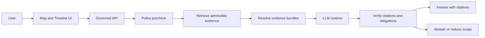
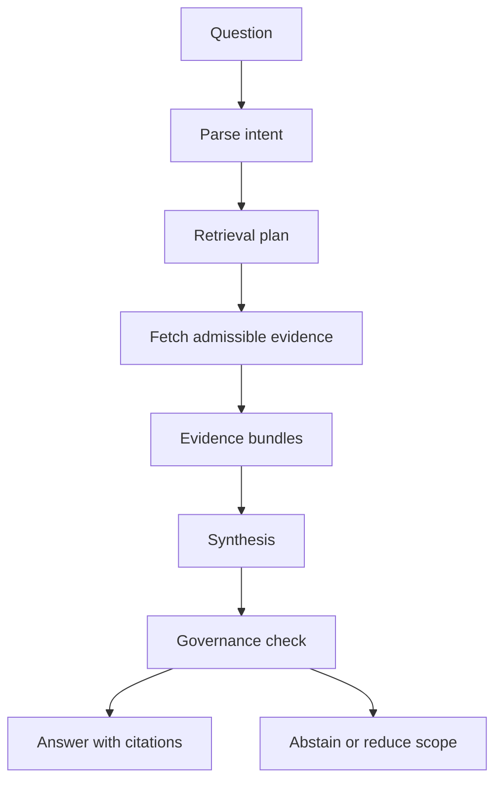

<!-- [KFM_META_BLOCK_V2]
doc_id: kfm://doc/7f6a0f3e-9a6a-4b0a-9fcb-8d1c5a3170d7
title: KFM AI
type: standard
version: v1
status: draft
owners: ["TODO: @kfm-ai", "TODO: @kfm-governance"]
created: 2026-03-04
updated: 2026-03-04
policy_label: restricted
related: ["docs/", "apps/api/", "apps/ui/", "packages/evidence/", "packages/policy/", "mcp/model_cards/"]
tags: ["kfm", "ai", "focus-mode", "governance", "ollama", "evidence-first"]
notes: [
  "Default-deny metadata until governance review confirms publication level.",
  "All claims in this doc are tagged CONFIRMED / PROPOSED / UNKNOWN."
]
[/KFM_META_BLOCK_V2] -->

# docs/ai
Evidence-first AI docs for Focus Mode, model governance, and “cite-or-abstain” behavior.

---

## Impact
**Status:** `draft` (do not treat as policy source-of-truth until reviewed)  
**Owners:** TODO `@kfm-ai`, TODO `@kfm-governance`  
**Policy label:** `restricted` (default-deny until reclassified)


**Quick nav**
- [Scope](#scope)
- [Where this fits](#where-this-fits)
- [Inputs](#inputs)
- [Exclusions](#exclusions)
- [Quickstart](#quickstart)
- [Architecture](#architecture)
- [Governance](#governance)
- [Registries](#registries)
- [Definition of Done](#definition-of-done)
- [Appendix](#appendix)

---

## Scope

- **[CONFIRMED]** KFM AI documentation must preserve the “truth path” posture and evidence-first UX: AI output is grounded in retrieved, admissible evidence and must not bypass governance.
- **[CONFIRMED]** This directory is the home for *documentation* about AI surfaces (Focus Mode, model cards, eval, prompts, safety), not a place to store secrets, raw datasets, or unreviewed outputs.
- **[PROPOSED]** This directory becomes the single entrypoint for AI governance: model lifecycle, evaluation gates, telemetry, and policy enforcement patterns.

Back to top: [↑](#docsai)

---

## Where this fits

- **[CONFIRMED]** UI clients must not call models or databases directly; all AI interactions cross the governed API boundary.
- **[CONFIRMED]** Focus Mode is the “AI assistant” surface: it orchestrates retrieval and then calls an LLM runtime (e.g., Ollama) for synthesis, with a final governance/citation check.
- **[PROPOSED]** Agentic automation (Watcher/Planner/Executor) is allowed only if it *cannot* bypass governance and only proposes changes via PRs with provenance.



Back to top: [↑](#docsai)

---

## Inputs

Acceptable inputs for `docs/ai/` (documentation and specs):

- **[CONFIRMED]** Model cards (versioned, signed references, intended use and non-goals).
- **[CONFIRMED]** Prompting and grounding policies (what is allowed to be said, and what must be redacted or abstained).
- **[CONFIRMED]** Evaluation protocols (offline evals, regression checks, red-team checklists).
- **[PROPOSED]** Run-receipt formats and “citation verification” gate specs for Focus Mode.
- **[PROPOSED]** Agent architecture docs (if agents exist) with strict W-P-E constraints and governance wiring.

---

## Exclusions

Do **not** put these into `docs/ai/`:

- **[CONFIRMED]** Secrets, tokens, private keys, API credentials.
- **[CONFIRMED]** Raw datasets, raw exports, or any unredacted sensitive coordinates.
- **[CONFIRMED]** Generated answers that are not attached to a run receipt and evidence bundle.
- **[PROPOSED]** “Self-modifying” automation instructions (anything that bypasses PR review, policy gates, or auditing).

---

## Directory tree

**[UNKNOWN]** The current on-disk contents of `docs/ai/` are not verified in this doc.

**[PROPOSED]** Recommended layout:

```text
docs/ai/
├── README.md                        # this file
├── focus-mode/
│   ├── OVERVIEW.md                  # Focus Mode contracts + behavior
│   ├── CITATIONS.md                 # cite-or-abstain rules + verification
│   └── PROMPTS.md                   # approved prompt patterns (no secrets)
├── model-governance/
│   ├── MODEL_CARDS.md               # how to write + review model cards
│   ├── EVALS.md                     # evaluation protocol + gates
│   └── SAFETY.md                    # redaction + sensitive handling
├── agents/
│   └── WPE.md                       # Watcher Planner Executor pattern (if used)
└── references/
   └── SOURCES.md                    # curated internal references for AI layer
```

---

## Quickstart

**Goal:** give a “first successful loop” for Focus Mode without promising exact commands that may differ per repo.

- **[PROPOSED]** Start the local LLM runtime (example: Ollama):
```bash
ollama serve
```

- **[PROPOSED]** Pull a pinned model used by dev (example only; replace with repo-approved model):
```bash
ollama pull <approved-model>:<tag>
```

- **[UNKNOWN]** Start the governed API (command depends on repo tooling).  
  Expected outcome:
  - **[CONFIRMED]** UI calls only the API
  - **[CONFIRMED]** API performs retrieval, then calls the LLM runtime
  - **[CONFIRMED]** response is rejected or abstained if citation/obligation checks fail

---

## Architecture

### Focus Mode control loop

- **[CONFIRMED]** Parse intent → retrieve admissible evidence → synthesize → verify citations/obligations → return answer (or abstain).
- **[CONFIRMED]** Datastores remain the sources of truth; the LLM does not directly query or mutate them.



Back to top: [↑](#docsai)

---

## Governance

### Non-negotiable invariants

- **[CONFIRMED]** **No direct access**: UI and clients do not access DBs, object stores, or model endpoints directly.
- **[CONFIRMED]** **Default-deny**: if policy is unclear or missing, deny exposure and abstain.
- **[CONFIRMED]** **Cite-or-abstain**: user-visible claims must be backed by evidence references, or the system must abstain/reduce scope.
- **[PROPOSED]** **Deterministic receipts**: every AI response produces a run receipt capturing inputs, policy decisions, evidence refs, and artifact hashes.

### Safety and sensitive handling

- **[CONFIRMED]** Do not expose sensitive locations or de-anonymize. If sensitivity classification is unclear, treat as restricted and require governance review.
- **[PROPOSED]** Add a redaction obligation system (masking, aggregation, delayed release) that is enforced as a hard gate before any response is returned.

---

## Registries

### AI surfaces registry

This table is meant to be operational and testable (not marketing).

| Surface | Purpose | Output | Governance gates |
|---|---|---|---|
| Focus Mode Q&A | Evidence-grounded answers | Answer + citations + run receipt | Policy check, citation verification, redaction obligations |
| Model Cards | Define model use boundaries | Versioned doc | Review + signatures + provenance |
| Evaluation Runs | Regressions and safety checks | Metrics + artifacts | Thresholds + reproducibility |
| Agents (W-P-E) | Proposed automation | PRs only | Idempotency, policy gates, no merge privileges |

- **[CONFIRMED]** Focus Mode must be governed and citation-aware.
- **[PROPOSED]** W-P-E agents are acceptable only if they can’t bypass governance and only create PRs.

### AI artifacts and promotion gates

| Artifact | Zone | Minimum gates (expected) |
|---|---|---|
| Prompt spec | WORK | lint, policy checks, review |
| Model card | PROCESSED | versioning, provenance refs, signatures |
| Eval report | PROCESSED | deterministic rerun, thresholds, audit trail |
| Run receipt | PUBLISHED | immutable record, hashes, policy decisions, evidence refs |

- **[CONFIRMED]** KFM-style lifecycle gates exist conceptually (truth path posture).
- **[UNKNOWN]** Which exact gate scripts exist in-repo today.

Back to top: [↑](#docsai)

---

## Definition of Done

This README (and the docs/ai area) is “done” when:

- [ ] **[CONFIRMED]** Purpose + where-it-fits + inputs + exclusions are present.
- [ ] **[PROPOSED]** Directory tree matches reality (replace PROPOSED with CONFIRMED after verification).
- [ ] **[CONFIRMED]** At least one Mermaid diagram exists (and avoids `|` in node text).
- [ ] **[PROPOSED]** AI surfaces registry is aligned to actual modules and paths.
- [ ] **[PROPOSED]** Links to policy, evidence, and model card sources resolve inside the repo.
- [ ] **[PROPOSED]** A “citation verification” spec exists and is referenced by CI gates.
- [ ] **[CONFIRMED]** No secrets or sensitive raw data are present in this directory.

---

## FAQ

**What belongs here vs in code?**  
- **[CONFIRMED]** Docs, contracts, and governance guidance belong here.  
- **[CONFIRMED]** Executable enforcement belongs in code + policy + CI.

**Can we store “good example answers” here?**  
- **[PROPOSED]** Only if they are synthetic fixtures or fully redacted and accompanied by run receipts and evidence references.

---

## Appendix

<details>
<summary>Example run receipt shape (PROPOSED)</summary>

```json
{
  "run_id": "focus-2026-03-04T12:00:00Z-abc123",
  "question": "…",
  "policy": {
    "decision": "allow",
    "obligations": ["redact_coordinates"]
  },
  "evidence": [
    {"evidence_ref": "kfm:evidence:…", "hash": "sha256:…"}
  ],
  "model": {
    "runtime": "ollama",
    "model_id": "<approved-model>:<tag>"
  },
  "artifacts": [
    {"path": "…", "digest": "sha256:…"}
  ]
}
```

</details>

<details>
<summary>Glossary (partial)</summary>

- **[CONFIRMED] Evidence bundle:** a resolved, policy-filtered set of admissible references used for grounding.
- **[CONFIRMED] Trust membrane:** the policy boundary that all requests must cross before data or AI output is returned.
- **[CONFIRMED] Cite-or-abstain:** if you can’t cite admissible evidence, you do not answer (or you narrow the scope).

</details>

Back to top: [↑](#docsai)
