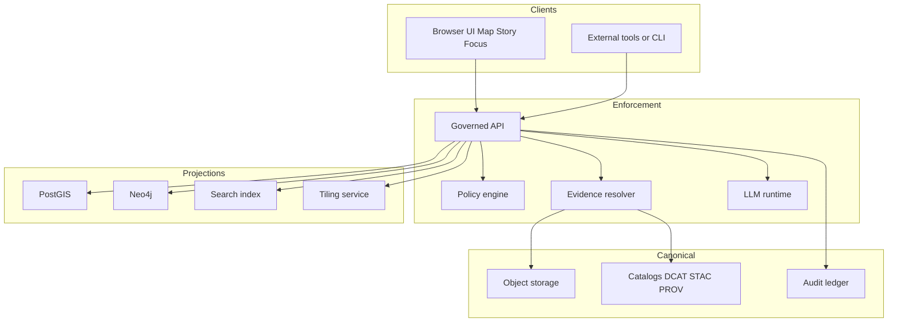
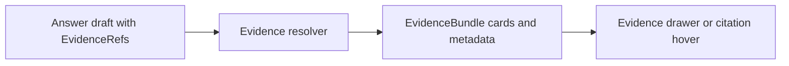
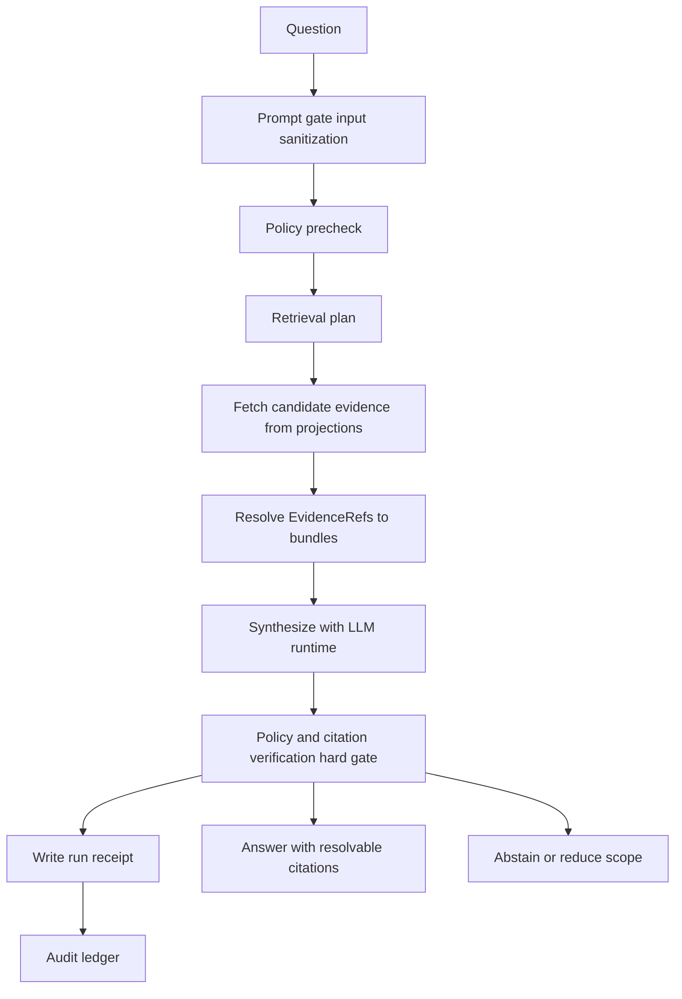

<!-- [KFM_META_BLOCK_V2]
doc_id: kfm://doc/7f6a0f3e-9a6a-4b0a-9fcb-8d1c5a3170d7
title: docs/ai — KFM AI
type: standard
version: v1.1
status: draft
owners: ["TODO: @kfm-ai", "TODO: @kfm-governance"]
created: 2026-03-04
updated: 2026-03-05
policy_label: restricted
related: [
  "docs/ai/",
  "docs/ (VERIFY: repo tree)",
  "apps/api/ (VERIFY: repo tree)",
  "apps/ui/ (VERIFY: repo tree)",
  "packages/evidence/ (VERIFY: repo tree)",
  "packages/policy/ (VERIFY: repo tree)",
  "mcp/model_cards/ (VERIFY: repo tree)"
]
tags: ["kfm", "ai", "focus-mode", "governance", "ollama", "evidence-first", "cite-or-abstain"]
notes: [
  "Default-deny until governance review confirms publication level.",
  "All meaningful claims are tagged CONFIRMED / PROPOSED / UNKNOWN.",
  "Do not claim concrete repo module paths exist until verified against the live repo tree and OpenAPI."
]
[/KFM_META_BLOCK_V2] -->

# docs/ai
Evidence-first documentation for **Focus Mode** and **AI governance** in Kansas Frontier Matrix (KFM).

---

## Impact
**Status:** `draft` (not a policy source-of-truth until reviewed)  
**Owners:** TODO `@kfm-ai`, TODO `@kfm-governance`  
**Policy label:** `restricted` (default-deny until reclassified)


**Quick nav**
- [Scope](#scope)
- [Where this fits](#where-this-fits)
- [Core contracts](#core-contracts)
- [Inputs](#inputs)
- [Exclusions](#exclusions)
- [Directory tree](#directory-tree)
- [Quickstart](#quickstart)
- [Architecture](#architecture)
- [Governance](#governance)
- [Evals and hallucination controls](#evals-and-hallucination-controls)
- [Registries](#registries)
- [Reality check](#reality-check)
- [Definition of Done](#definition-of-done)
- [FAQ](#faq)
- [Appendix](#appendix)

---

## Scope

### In-scope
- **[CONFIRMED]** Document the **Focus Mode control loop** as an evidence-grounded, governed run: policy precheck → retrieval → evidence bundling → synthesis → **hard citation verification** → receipt → answer (or abstain).  
- **[CONFIRMED]** Document the **EvidenceRef → EvidenceBundle** contract (why KFM “citations” are resolvable evidence references, not pasted URLs).  
- **[CONFIRMED]** Document governance expectations for AI outputs: **default-deny**, **policy labels**, and **obligations** (redaction/generalization) before user-visible output is returned.

### Out-of-scope
- **[CONFIRMED]** Secrets, tokens, private keys, credentials, or unredacted sensitive coordinates.  
- **[CONFIRMED]** Raw datasets or raw exports (those belong in the KFM data lifecycle zones, not in docs).  
- **[CONFIRMED]** “Self-modifying” instructions that bypass PR review, policy gates, or auditing.

### Non-goals
- **[CONFIRMED]** This directory is **not** the enforcement mechanism. Enforcement lives in governed APIs + policy packs + CI tests.  
- **[PROPOSED]** This directory becomes the single entrypoint for AI governance *after* governance review and after links/paths are verified.

Back to top: [↑](#docsai)

---

## Where this fits

- **[CONFIRMED]** **Trust membrane:** clients (UI, external tools) must not access databases, object storage, or model endpoints directly; all access crosses the governed API boundary and policy enforcement.  
- **[CONFIRMED]** **Evidence as a first-class trust surface:** map/story/focus experiences should make **license, dataset version, policy badges, and evidence** visible and clickable (via an evidence drawer / evidence cards).  
- **[PROPOSED]** Focus Mode uses a local LLM runtime (e.g., Ollama) *as a text generator only*; the backend supplies curated context and enforces policy/citation gates.



Back to top: [↑](#docsai)

---

## Core contracts

### Evidence resolution contract
- **[CONFIRMED]** In KFM, a “citation” is an **EvidenceRef** that resolves—via an evidence resolver—into an **EvidenceBundle** (metadata + artifacts + provenance + digests) suitable for inspection and reproducibility.  
- **[CONFIRMED]** **Hard gate:** citations must resolve and be policy-allowed; otherwise the system must **abstain or reduce scope**.  
- **[PROPOSED]** The UI should be able to resolve evidence for display in **≤ 2 calls** (e.g., fetch answer, then resolve all EvidenceRefs in one batch).



### Run receipts
- **[CONFIRMED]** Every Focus Mode run should emit an **audit/run receipt** capturing: inputs, policy decisions, evidence references/hashes, and the model/runtime identifier.  
- **[PROPOSED]** Receipts should be immutable and addressable (e.g., `kfm://run/...`) and linkable from UI trust surfaces.

### Policy labels and obligations
- **[CONFIRMED]** `policy_label` is a primary classification input; policy evaluation returns **allow/deny** plus **obligations** (e.g., generalize geometry, remove attributes), with reason codes suitable for auditing and UX.  
- **[PROPOSED]** Obligation application should be testable (fixtures) and enforced as fail-closed in CI/runtime.

### API surface (illustrative; verify in repo)
- **[CONFIRMED]** KFM’s governed API design includes endpoints for **evidence resolution** and **Focus Mode Q&A**, with “must cite or abstain” posture.  
- **[UNKNOWN]** The exact endpoint paths and OpenAPI schemas present in the live repo at `HEAD`.

| Endpoint (illustrative) | Purpose | Expected policy posture |
|---|---|---|
| `POST /api/v1/evidence/resolve` | Resolve EvidenceRefs to EvidenceBundles | Fail closed if unresolvable/unauthorized |
| `POST /api/v1/focus/ask` | Focus Mode Q&A (governed run + receipt) | Must cite or abstain; log retrieval context |
| `GET /api/v1/catalog/datasets` | Dataset discovery | Hide restricted by default; role filter |
| `GET /api/v1/lineage/{dataset_id}` | Lineage and receipts | May redact sensitive fields; include commit refs when available |

Back to top: [↑](#docsai)

---

## Inputs

Acceptable inputs for `docs/ai/`:

- **[CONFIRMED]** Focus Mode contracts: control loop, evidence bundling rules, citation formats, refusal/abstention patterns.
- **[CONFIRMED]** Evidence resolver contract docs: EvidenceRef schemes, EvidenceBundle templates, UI “trust surfaces”.
- **[CONFIRMED]** Governance docs: policy labels, obligations, default-deny expectations, sensitive handling guidelines.
- **[CONFIRMED]** Evaluation docs: golden questions, regression criteria, red-team checklists, leakage tests.
- **[CONFIRMED]** Model cards (format + review requirements), including intended use, non-goals, and governance posture.
- **[PROPOSED]** Run receipt schemas and verification guidance (hashing, determinism, replay).
- **[PROPOSED]** Agent architecture docs (if used) constrained to “propose via PR only” with full provenance.

---

## Exclusions

Do **not** put these into `docs/ai/`:

- **[CONFIRMED]** Secrets, tokens, credentials, private keys.
- **[CONFIRMED]** Raw datasets, raw exports, or any unredacted sensitive coordinates/fields.
- **[CONFIRMED]** Generated answers that are not attached to a run receipt and resolvable evidence references.
- **[PROPOSED]** “Automation” instructions that bypass PR review, policy enforcement, or audit logging.

---

## Directory tree

- **[UNKNOWN]** Current on-disk contents of `docs/ai/` in the live repo (must be verified via repo tree).
- **[PROPOSED]** Recommended layout:

```text
docs/ai/
├── README.md                        # this file
├── contracts/
│   ├── EVIDENCE_REFS.md             # EvidenceRef schemes + formatting rules
│   ├── EVIDENCE_BUNDLES.md          # EvidenceBundle template + UI expectations
│   └── RUN_RECEIPTS.md              # receipt schema + hashing + replay guidance
├── focus-mode/
│   ├── OVERVIEW.md                  # Focus Mode behavior + constraints
│   ├── CITATIONS.md                 # cite-or-abstain + “hard gate” definition
│   ├── PROMPTING.md                 # approved prompt patterns (no secrets)
│   └── SAFETY.md                    # prompt gate + injection notes (doc-level)
├── governance/
│   ├── POLICY_LABELS.md             # label taxonomy + obligations
│   ├── SENSITIVITY.md               # sensitive handling + redaction playbooks
│   └── REVIEW_PROCESS.md            # how AI changes get reviewed
├── evals/
│   ├── HARNESS.md                   # how evals run + artifacts emitted
│   ├── GOLDEN_QUERIES.md            # curated questions + expected behaviors
│   └── RED_TEAM.md                  # adversarial + leakage test checklist
└── agents/
    └── WPE.md                       # Watcher Planner Executor pattern (if used)
```

Back to top: [↑](#docsai)

---

## Quickstart

**Goal:** a first governed Focus Mode loop without making repo-specific promises.

- **[PROPOSED]** Start the local LLM runtime (example: Ollama):
```bash
ollama serve
```

- **[PROPOSED]** Pull a repo-approved model (example only; replace with approved model+tag):
```bash
ollama pull <approved-model>:<tag>
```

- **[UNKNOWN]** Start the governed API (command depends on repo tooling). Expected outcome:
  - **[CONFIRMED]** Clients call only the API (not DBs, object storage, or model endpoints).
  - **[CONFIRMED]** The API does retrieval + evidence resolution, then calls the LLM runtime for synthesis.
  - **[CONFIRMED]** The response is rejected or reduced (abstain) if citation/policy checks fail.

- **[PROPOSED]** Smoke test (pseudocode; verify endpoint + auth):
```bash
curl -X POST http://localhost:8000/api/v1/focus/ask \
  -H 'Content-Type: application/json' \
  -d '{"question":"What do we know about 1930s drought impacts in Kansas?","max_citations":8}'
```

---

## Architecture

### Focus Mode control loop
- **[CONFIRMED]** Treat each Focus Mode request as a **governed run** with a receipt.
- **[CONFIRMED]** Control loop: policy precheck → retrieval → evidence bundling → synthesis → hard citation verification → receipt → answer/abstain.
- **[CONFIRMED]** The LLM runtime is **least-privilege**: no direct DB/file/internet access; it only sees curated context and returns text.



### Evidence-first UX integration points
- **[CONFIRMED]** Evidence should be viewable from Map/Story/Focus via a shared trust surface (evidence drawer / evidence cards).
- **[PROPOSED]** A Focus Mode answer should reference EvidenceRefs that the UI can resolve to EvidenceBundles for inspection (license, version, provenance).

Back to top: [↑](#docsai)

---

## Governance

### Non-negotiable invariants
- **[CONFIRMED]** **No direct access:** clients do not access DBs/object storage/model endpoints directly.
- **[CONFIRMED]** **Default-deny:** if policy is unclear or missing, deny exposure and abstain.
- **[CONFIRMED]** **Cite-or-abstain:** user-visible claims must be backed by resolvable, policy-allowed evidence.
- **[CONFIRMED]** **Fail closed:** broken evidence links, missing license, missing policy label, or missing receipts block promotion/publishing.

### Safety and sensitive handling
- **[CONFIRMED]** If sensitivity classification is unclear, treat as restricted and require governance review.
- **[CONFIRMED]** Do not expose or help de-anonymize sensitive locations; prefer aggregation/generalization and explicit abstention.
- **[PROPOSED]** Maintain a redaction obligation library (generalize geometry, remove attributes, delay release) enforced by policy tests.

---

## Evals and hallucination controls

- **[CONFIRMED]** Primary anti-hallucination mechanism is **hard citation verification**: if citations cannot be verified, the system abstains or reduces scope.
- **[PROPOSED]** Maintain an evaluation harness:
  - golden questions (expected behaviors + citations)
  - policy denial tests (restricted leakage = fail)
  - citation resolvability tests (broken evidence = fail)
  - regression diffs stored as CI artifacts

### Suggested eval metrics (starter)
- **[PROPOSED]** Citation resolvability rate: % of citations that resolve to EvidenceBundles.
- **[PROPOSED]** Abstain correctness: abstains when evidence is insufficient or policy denies.
- **[PROPOSED]** Restricted leakage: 0 tolerated (hard fail).
- **[PROPOSED]** Latency budget: track retrieval time, evidence resolution time, LLM time separately.

---

## Registries

### AI surfaces registry

| Surface | Purpose | Output | Governance gates |
|---|---|---|---|
| Focus Mode Q&A | Evidence-grounded answers | Answer + EvidenceRefs + run receipt | Policy engine, evidence resolver, hard citation verification, audit |
| Evidence Resolver | Resolve citations to inspectable bundles | EvidenceBundle | Fail closed; policy obligations applied |
| Story publishing | Narrative with governed citations | Story + citations + review state | Citation resolution gate; review required |
| Model cards | Boundaries for models/prompts | Versioned doc | Review workflow; provenance refs |
| Evals | Detect regressions/leakage | Reports + artifacts | Thresholds; reproducibility |

### AI artifacts and promotion alignment
- **[CONFIRMED]** KFM data lifecycle zones exist (RAW → WORK → PROCESSED → PUBLISHED) and promotion is gated fail-closed.
- **[PROPOSED]** Suggested placement for AI-related artifacts:

| Artifact | Zone | Minimum gates (expected) |
|---|---|---|
| Prompt spec | WORK | lint, policy checks, review |
| Model card | PROCESSED | versioning, provenance refs, review |
| Eval report | PROCESSED | deterministic rerun, thresholds, audit trail |
| Run receipt | PUBLISHED | immutable record, hashes, policy decisions, EvidenceRefs |

Back to top: [↑](#docsai)

---

## Reality check

This section exists to prevent “docs hallucinations” (claiming things exist in-repo when they don’t).

### Current unknowns (must verify)
- **[UNKNOWN]** Which modules/paths exist today (e.g., `apps/api`, `packages/policy`, evidence resolver service).
- **[UNKNOWN]** The exact OpenAPI routes and auth model for `focus/ask` and `evidence/resolve`.
- **[UNKNOWN]** Whether the eval harness is implemented and wired into CI as a merge-blocking gate.
- **[UNKNOWN]** Which policy labels/obligations are canonical in the current policy pack.

### Smallest verification steps (attach outputs to next revision)
- **[CONFIRMED]** Capture repo commit hash + root tree: `git rev-parse HEAD` and `tree -L 3`.  
- **[CONFIRMED]** Search for key contracts in code: evidence resolver route, policy pack, receipt schema, focus route.
- **[CONFIRMED]** Extract CI gate list from `.github/workflows/` and identify which checks block merges.
- **[PROPOSED]** Run a single vertical slice dataset through promotion gates and confirm:
  - catalogs validate and cross-link
  - EvidenceRefs resolve to bundles
  - Focus Mode returns citations or abstains
  - receipts are emitted and auditable

Back to top: [↑](#docsai)

---

## Definition of Done

This README (and `docs/ai/`) is “done” when:

- [ ] **[CONFIRMED]** Purpose + where-it-fits + inputs + exclusions are present.
- [ ] **[CONFIRMED]** At least one Mermaid diagram exists (and avoids `|` in node text).
- [ ] **[PROPOSED]** Directory tree matches reality (promote PROPOSED → CONFIRMED after repo verification).
- [ ] **[PROPOSED]** Links to policy/evidence/model-card sources resolve inside the repo.
- [ ] **[PROPOSED]** A citation verification spec exists and is referenced by CI gates.
- [ ] **[PROPOSED]** An eval harness exists (golden queries + leakage tests) and is merge-blocking.
- [ ] **[CONFIRMED]** No secrets or sensitive raw data are present in this directory.

---

## FAQ

**What belongs here vs in code?**  
- **[CONFIRMED]** Docs, contracts, registries, and governance guidance belong here.  
- **[CONFIRMED]** Executable enforcement belongs in code + policy + CI.

**Can we store “good example answers” here?**  
- **[PROPOSED]** Only as synthetic fixtures or fully redacted examples accompanied by run receipts and resolvable EvidenceRefs.

---

## Appendix

<details>
<summary>Example EvidenceBundle shape (CONFIRMED template; fields may vary)</summary>

```json
{
  "bundle_id": "sha256:bundle...",
  "dataset_version_id": "2026-02.abcd1234",
  "title": "Example evidence card",
  "policy": {
    "decision": "allow",
    "policy_label": "public",
    "obligations_applied": []
  },
  "license": {"spdx": "CC-BY-4.0", "attribution": "Source org"},
  "provenance": {"run_id": "kfm://run/2026-02-20T12:00:00Z.abcd"},
  "artifacts": [
    {"href": "processed/example.parquet", "digest": "sha256:2222", "media_type": "application/x-parquet"}
  ],
  "checks": {"catalog_valid": true, "links_ok": true},
  "audit_ref": "kfm://audit/entry/123"
}
```

</details>

<details>
<summary>Example run receipt shape (PROPOSED for Focus Mode)</summary>

```json
{
  "run_id": "kfm://run/2026-03-05T18:00:00Z.focus.abc123",
  "actor": {"principal": "user:<id>", "role": "researcher"},
  "operation": "focus.ask",
  "question": "…",
  "policy": {
    "decision": "allow",
    "reason_codes": [],
    "obligations": ["redact_coordinates"]
  },
  "retrieval": {
    "stores": ["neo4j", "postgis", "search"],
    "query_digest": "sha256:…"
  },
  "evidence": [
    {"evidence_ref": "doc://…", "bundle_id": "sha256:bundle…"}
  ],
  "model": {
    "runtime": "ollama",
    "model_id": "<approved-model>:<tag>"
  },
  "artifacts": [
    {"path": "audit/focus/…/receipt.json", "digest": "sha256:…"}
  ],
  "created_at": "2026-03-05T18:00:00Z"
}
```

</details>

<details>
<summary>Glossary (partial)</summary>

- **[CONFIRMED] EvidenceRef:** a structured reference (not a pasted URL) that resolves via an evidence resolver.
- **[CONFIRMED] EvidenceBundle:** policy-filtered metadata + artifacts + provenance + digests used to inspect/reproduce a claim.
- **[CONFIRMED] Trust membrane:** architecture boundary where all access is policy-filtered, audited, and served via governed APIs.
- **[CONFIRMED] Cite-or-abstain:** if you can’t produce resolvable, policy-allowed evidence, you do not answer (or you narrow scope).

</details>

Back to top: [↑](#docsai)
