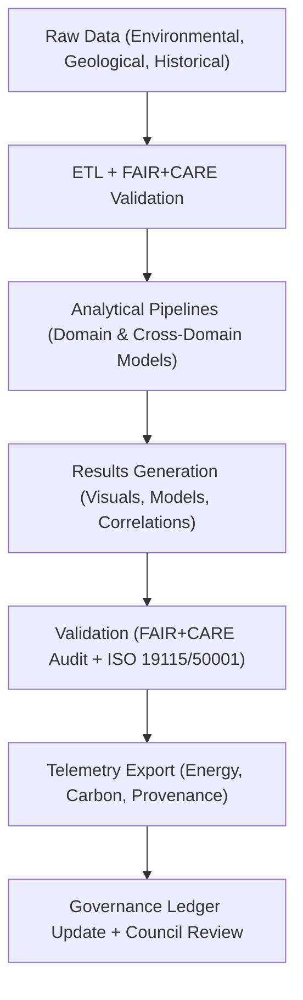

<div align="center">

# 📘 **Kansas Frontier Matrix — Analyses Overview**
`docs/analyses/README.md`

**Purpose:**  
Provide a comprehensive directory and governance summary for all analytical frameworks and workflows within the **Kansas Frontier Matrix (KFM)**.  
Each analytical stream—hydrology, climatology, geology, ecology, and historical-environmental correlation—adheres to **FAIR+CARE**, **ISO 19115**, and **MCP-DL v6.3** standards for reproducibility, sustainability, and ethical governance.

[](../../README.md)
[](../../../LICENSE)
[](../../../docs/standards/README.md)
[](../../../releases/)
</div>

---

## 🧭 Overview

The **Analyses Layer** consolidates all domain-specific and cross-domain research modules within the KFM ecosystem.  
Each analytical pipeline includes:
- **datasets/** — FAIR+CARE-registered raw and derived data  
- **methods/** — reproducible workflows and algorithms  
- **results/** — validated outputs and visualizations  
- **metadata/** — provenance and telemetry tracking  

All workflows follow the **NASA-grade structured analytical model** with sustainability metrics and energy-carbon tracking through ISO 50001 telemetry.

---

## 🗂️ Directory Layout

```
docs/analyses/
├── README.md                                   # This document
├── hydrology/                                  # Hydrology, drought, and flood analytics
│   ├── README.md
│   ├── drought-flood-correlation/
│   │   ├── datasets/
│   │   ├── methods/
│   │   ├── results/
│   │   └── metadata/
├── climatology/                               # Climate trend and projection analyses
│   ├── README.md
│   ├── datasets/
│   ├── methods/
│   ├── results/
│   └── validation.md
├── geology/                                   # Geophysical and geological modeling
│   ├── README.md
│   ├── datasets/
│   ├── methods/
│   ├── results/
│   └── metadata/
├── ecology/                                   # Biodiversity and ecosystem models
│   ├── README.md
│   ├── datasets/
│   ├── methods/
│   ├── results/
│   └── metadata/
├── historical/                                # Historical–environmental correlation analyses
│   ├── README.md
│   ├── datasets/
│   ├── methods/
│   ├── results/
│   └── governance.md
├── cross-domain/                              # Integrated, multi-domain analyses
│   ├── README.md
│   ├── datasets/
│   ├── methods/
│   ├── results/
│   └── metadata/
└── metadata/                                  # FAIR+CARE provenance & audit registry
    ├── README.md
    └── audit-reports/
```

---

## 🧩 Analytical Governance Workflow



---

## ⚙️ FAIR+CARE Integration Across Analyses

| Pillar | Implementation | Verification Source |
|--------|----------------|--------------------|
| **Findable** | STAC/DCAT-indexed metadata and dataset registry | `datasets/metadata/` |
| **Accessible** | Public FAIR+CARE portal access to approved datasets | Governance Ledger |
| **Interoperable** | Common geospatial and temporal schemas (EPSG:4326, UTC) | Telemetry Schema |
| **Reusable** | Provenance, licensing, and versioning stored in manifest | `manifest_ref` |
| **Collective Benefit** | Results support sustainable and equitable resource management | FAIR+CARE Council |
| **Authority to Control** | IDGB verifies consent for all restricted cultural datasets | Governance Charter |
| **Responsibility** | Energy & carbon telemetry integrated for sustainability | `telemetry_ref` |
| **Ethics** | AI outputs audited for bias, context, and cultural sensitivity | FAIR+CARE Ethics Review |

---

## 🌍 Key Analytical Datasets

| Source | Description | Format | FAIR+CARE Status |
|--------|-------------|---------|------------------|
| **NOAA / Daymet / USGS** | Hydrology, precipitation, drought, and streamflow datasets | CSV / NetCDF | ✅ Certified |
| **NASA EarthData / PRISM** | Climate anomalies and trend projections | NetCDF / GeoTIFF | ✅ Certified |
| **NRCS SSURGO / STATSGO** | Soil structure and infiltration metrics | GeoPackage | ✅ Certified |
| **KU Biodiversity / GBIF** | Species occurrence and ecological diversity data | CSV / JSON-LD | ✅ Certified |
| **KHS / DPLA / Chronicling America** | Historical and cultural environmental archives | JSON-LD / OCR | ✅ Certified |

---

## 🧮 Sustainability & Telemetry Metrics

| Metric | Description | Target | Unit |
|---------|-------------|---------|------|
| **Energy Usage (E)** | Mean energy consumption per workflow | ≤ 15 | Joules |
| **Carbon Emissions (C)** | CO₂ equivalent per analysis | ≤ 0.006 | gCO₂e |
| **Telemetry Coverage** | Percentage of analyses with full telemetry | ≥ 95 | % |
| **FAIR+CARE Validation Pass Rate** | Successful audit rate | 100 | % |

Telemetry logs are stored in `focus-telemetry.json` and validated against ISO 50001 sustainability metrics.

---

## 🧾 Governance Ledger Snapshot (JSON)

```json
{
  "ledger_id": "kfm-analyses-ledger-v10.2.2",
  "analyses": ["Hydrology", "Climatology", "Geology", "Ecology", "Historical", "Cross-Domain"],
  "energy_joules": 68.2,
  "carbon_gCO2e": 0.024,
  "faircare_status": "Certified",
  "validation_status": "Passed",
  "validated_by": ["FAIR+CARE Council", "Governance Secretariat"],
  "timestamp": "2025-11-10T15:30:00Z"
}
```

---

## 🕰️ Version History

| Version | Date | Author | Summary |
|----------|------|---------|----------|
| v10.2.2 | 2025-11-10 | FAIR+CARE Council | Updated directory alignment, added cross-domain governance integration, and ISO telemetry metrics. |
| v10.2.0 | 2025-11-09 | KFM Data Governance Group | Linked metadata registry and FAIR+CARE validation modules across analyses. |
| v10.1.0 | 2025-11-08 | KFM Core Team | Established analyses index with hydrology, ecology, and governance pathways. |

---

<div align="center">

**© 2025 Kansas Frontier Matrix — CC-BY 4.0**  
Governed under **Master Coder Protocol v6.3** · FAIR+CARE Certified · Diamond⁹ Ω / Crown∞Ω Ultimate Certified  

[⬅ Back to Documentation Index](../README.md) · [Governance Charter →](../../docs/standards/governance/ROOT-GOVERNANCE.md)

</div>
