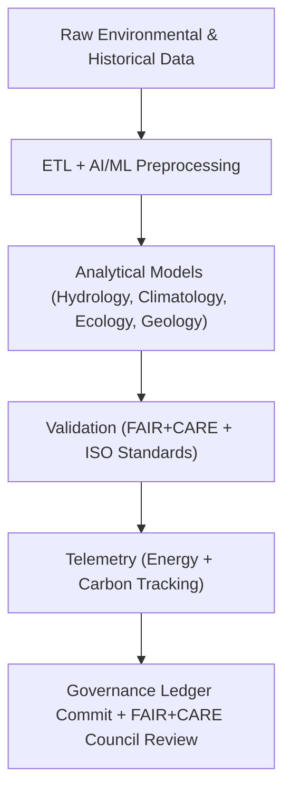

<div align="center">

# 📘 **Kansas Frontier Matrix — Analyses Overview**
`docs/analyses/README.md`

**Purpose:**  
Provide a centralized directory and governance summary for all analytical workflows within the **Kansas Frontier Matrix (KFM)** — including hydrology, climatology, geology, ecology, and historical-environmental correlation modules.  
Each analytical stream adheres to **FAIR+CARE**, **ISO 19115**, and **MCP-DL v6.3** documentation and telemetry standards for reproducibility and sustainability.

[](../../README.md)
[](../../../LICENSE)
[](../../../docs/standards/README.md)
[](../../../releases/)
</div>

---

## 🧭 Overview

The **Analyses Directory** consolidates KFM’s scientific and AI-powered research modules across multiple environmental domains.  
Each subdirectory defines a complete pipeline — **data ingestion**, **AI/ML transformation**, **validation**, **telemetry logging**, and **governance linkage** — following FAIR+CARE open-science standards.

Analytical domains currently implemented:

| Domain | Focus Area | Key Outputs |
|--------|-------------|--------------|
| **Hydrology** | Drought–flood correlation, basin resilience, and sustainability metrics | Correlation matrices, maps, FAIR+CARE validation reports |
| **Climatology** | Temperature and precipitation trends, climate extremes, and forecast validation | Historical anomalies and predictive climate models |
| **Geology** | Surface, subsurface, and geophysical data integration | Stratigraphic models and resource sustainability dashboards |
| **Ecology** | Species distribution, biodiversity modeling, and conservation telemetry | Habitat overlays, ecological health indices |
| **Historical Integration** | Linking human and environmental change across Kansas | AI-assisted narrative and archival correlation |

---

## 🗂️ Directory Layout

```plaintext
docs/analyses/
├── README.md                                   # This document (Analyses overview)
├── hydrology/                                  # Hydrology and drought–flood analytics
│   ├── README.md
│   ├── drought-flood-correlation/
│   │   ├── README.md
│   │   └── methods/
│   │       ├── preprocessing.md
│   │       ├── temporal-alignment.md
│   │       ├── correlation-analysis.md
│   │       ├── spatial-modeling.md
│   │       ├── validation.md
│   │       └── datasets/
│   │           ├── raw/
│   │           ├── processed/
│   │           ├── derived/
│   │           └── metadata/
├── climatology/                               # Climate trend and projection analyses
│   ├── README.md
│   ├── datasets/
│   ├── temporal-modeling.md
│   └── validation.md
├── geology/                                   # Geophysical and geological models
│   ├── README.md
│   ├── seismic-modeling.md
│   └── validation.md
├── ecology/                                   # Biodiversity and ecosystem analyses
│   ├── README.md
│   ├── species-distribution-modeling.md
│   ├── conservation-validation.md
│   └── datasets/
│       └── metadata/
└── historical/                                # Human-environmental linkages
    ├── README.md
    ├── archival-correlation.md
    └── governance.md
```

---

## 🧩 Analytical Governance Framework



---

## ⚙️ Cross-Domain FAIR+CARE Integration

| Pillar | Implementation | Verification Source |
|--------|----------------|--------------------|
| **Findable** | STAC/DCAT 3.0-compliant metadata for all outputs | `datasets/metadata/` |
| **Accessible** | Public access through FAIR+CARE dashboards | Governance Ledger |
| **Interoperable** | All outputs in GeoJSON, NetCDF, or GeoTIFF formats | `telemetry_schema` |
| **Reusable** | Full provenance, licensing, and parameter tracking | `manifest_ref` |
| **Collective Benefit** | Promotes water, climate, and land management ethics | FAIR+CARE Council |
| **Authority to Control** | Governance Council approval required for public release | Governance Charter |
| **Responsibility** | ISO 50001 telemetry for every analytical workflow | `telemetry_ref` |
| **Ethics** | AI transparency and sensitivity masking applied | FAIR+CARE Ethics Audit |

---

## 🌍 Key Analytical Datasets

| Source | Description | Format | Status |
|--------|-------------|--------|--------|
| **NOAA NCEI / Daymet / USGS NWIS** | Hydrologic, climate, and atmospheric time-series | CSV / NetCDF | ✅ Certified |
| **NASA EarthData / PRISM** | Climate anomaly and drought index archives | NetCDF / GeoTIFF | ✅ Certified |
| **NRCS SSURGO / STATSGO** | Soil, infiltration, and hydrologic groups | GeoPackage | ✅ Certified |
| **KU Biodiversity / GBIF** | Species and habitat occurrence data | CSV / JSON-LD | ✅ Certified |
| **KHS / DPLA / Chronicling America** | Historical archives for environmental correlation | JSON-LD / OCR text | ✅ Certified |

---

## 🧮 Sustainability & Telemetry Metrics

| Metric | Description | Target | Unit |
|---------|-------------|---------|------|
| **Energy (J)** | Mean energy used per analysis run | ≤ 15 | Joules |
| **Carbon (gCO₂e)** | CO₂ emissions equivalent | ≤ 0.006 | gCO₂e |
| **Telemetry Coverage (%)** | FAIR+CARE traceability completeness | ≥ 95 | % |
| **Validation Compliance (%)** | FAIR+CARE audit pass rate | 100 | % |

All analyses export telemetry to the centralized **Governance Ledger** for validation and sustainability monitoring.

---

## 🧾 Governance Ledger Example

```json
{
  "ledger_id": "analyses-ledger-2025-11-09-1001",
  "modules": [
    "Hydrology",
    "Climatology",
    "Geology",
    "Ecology",
    "Historical Integration"
  ],
  "energy_joules": 68.2,
  "carbon_gCO2e": 0.025,
  "validation_status": "Pass",
  "faircare_status": "Certified",
  "auditor": "FAIR+CARE Council",
  "timestamp": "2025-11-09T14:05:00Z"
}
```

---

## 🕰️ Version History

| Version | Date | Author | Summary |
|----------|------|--------|----------|
| v10.2.2 | 2025-11-09 | FAIR+CARE Council | Created unified analyses overview with updated directory map, cross-domain governance, and ISO telemetry metrics. |
| v10.2.0 | 2025-11-09 | KFM Data Governance Group | Integrated FAIR+CARE audit trail across all analysis modules. |
| v10.1.0 | 2025-11-08 | KFM Core Team | Initial analyses index with hydrology focus and governance placeholders. |

---

<div align="center">

© 2025 Kansas Frontier Matrix Project  
Master Coder Protocol v6.3 · FAIR+CARE Certified · Diamond⁹ Ω / Crown∞Ω Ultimate Certified  

[Back to Documentation Index](../README.md) · [Governance Charter](../../docs/standards/governance/ROOT-GOVERNANCE.md)

</div>

