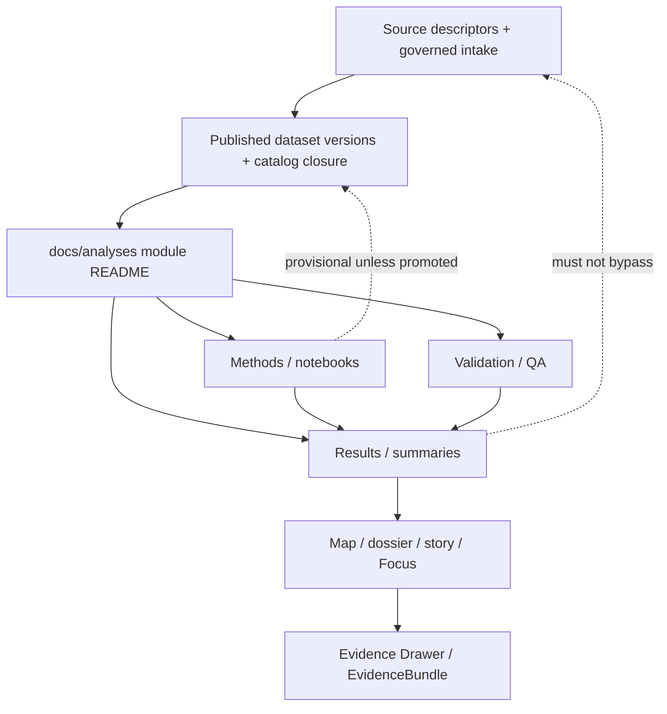

<!-- [KFM_META_BLOCK_V2]
doc_id: kfm://doc/<uuid-NEEDS-VERIFICATION>
title: Kansas Frontier Matrix — Analyses Index
type: standard
version: v1
status: draft
owners: <owners-NEEDS-VERIFICATION>
created: <created-NEEDS-VERIFICATION>
updated: <updated-NEEDS-VERIFICATION>
policy_label: <policy-label-NEEDS-VERIFICATION>
related: [<docs/analyses/remote-sensing/README.md (corpus-evidenced; repo presence NEEDS VERIFICATION)>, <docs/analyses/archaeology/results/README.md (corpus-evidenced; repo presence NEEDS VERIFICATION)>, <docs/analyses/_templates/analysis_readme.md (corpus-evidenced; repo presence NEEDS VERIFICATION)>]
tags: [kfm, analyses, evidence-first, map-first, time-aware]
notes: [Drafted from the March 2026 KFM corpus; current-session workspace exposed PDFs only; replace placeholders after direct repo inspection.]
[/KFM_META_BLOCK_V2] -->

# Kansas Frontier Matrix — Analyses Index

Parent index for governed analysis modules, results, notebooks, and validation under `docs/analyses/`.

> **Status:** experimental  
> **Owners:** `<owners-NEEDS-VERIFICATION>`  
>       
> **Quick jump:** [Scope](#scope) · [Repo fit](#repo-fit) · [Inputs](#inputs) · [Exclusions](#exclusions) · [Directory tree](#directory-tree) · [Quickstart](#quickstart) · [Usage](#usage) · [Diagram](#diagram) · [Tables](#tables) · [Task list](#task-list) · [FAQ](#faq)

> [!CAUTION]
> This draft is faithful to the March 2026 KFM documentation corpus, but the current-session workspace did **not** expose a mounted repo tree, schemas, workflows, or runtime logs. Paths below are either the target file itself or **corpus-evidenced examples** and must be verified against the live repository before merge.

## Scope

`docs/analyses/` is the documentation layer for analytical work that must stay **downstream of governed evidence, release state, and visible uncertainty**.

In KFM, analysis is not a detached notebook performance and not a second truth system. Every analysis-facing README should make five things easy to answer:

1. What question or analytical lane is being addressed?
2. Which governed inputs support it?
3. What method, model, or transformation is being applied?
4. What uncertainty, sensitivity, or rights burden qualifies it?
5. Which downstream surfaces may reuse it safely?

Use this directory for module indexes, results registries, notebook indexes, validation notes, and governance notes that help reviewers and contributors move cleanly from **analysis** to **evidence** to **release context**.

## Repo fit

| Item | Value |
| --- | --- |
| Path | `docs/analyses/README.md` |
| Role | Parent index and contribution boundary for analysis documentation |
| Upstream | [`../README.md`](../README.md) *(NEEDS VERIFICATION in current-session workspace)* |
| Downstream | [`./remote-sensing/README.md`](./remote-sensing/README.md), [`./archaeology/results/README.md`](./archaeology/results/README.md), [`./ecology/datasets/derived/README.md`](./ecology/datasets/derived/README.md), and [`./_templates/analysis_readme.md`](./_templates/analysis_readme.md) *(all corpus-evidenced; repo presence NEEDS VERIFICATION)* |
| Adjacent governed layers | Catalog/release/provenance artifacts, governance docs, schemas, and runtime surfaces exist in corpus doctrine, but exact mounted paths remain **NEEDS VERIFICATION** |

## Inputs

| Accepted input | What belongs here |
| --- | --- |
| Module overviews | Domain or method indexes that explain scope, grain, outputs, and review burden |
| Results documentation | Tables, figures, generalized maps, derived datasets, and summary registries tied to governed inputs |
| Notebook indexes | Reproducible notebooks or notebook registries that either feed released outputs or are clearly scoped as internal/provisional |
| Validation and QA docs | Accuracy reports, diagnostics, uncertainty notes, comparison runs, and review summaries |
| Governance notes | FAIR+CARE, sensitivity, redaction/generalization, and AI transform limits for analytical outputs |
| Evidence and release links | STAC/DCAT/PROV references, release manifests, validation reports, and provenance links where analysis depends on published artifacts |

## Exclusions

| Do not put this here | Why not | Put it here instead |
| --- | --- | --- |
| Raw captures, workbench scratch outputs, or quarantine artifacts | These are upstream lifecycle states, not analysis-facing documentation | Governed intake / artifact lifecycle locations *(exact repo path NEEDS VERIFICATION)* |
| Canonical dataset truth or release control records | Analyses may point to them, but should not replace them | Catalog / release / provenance artifacts |
| Policy bundles, decision registries, and proof packs | These govern publication; they are not analysis indexes | Governance / contract / release layers |
| Detached AI prose or uncited summaries | KFM requires evidence-linked outputs or abstention | Nowhere until evidence-linked and policy-safe |
| Exact sensitive locations or culturally restricted detail in public docs | Public analysis docs must preserve rights, safety, and review posture | Generalized or steward-only documentation paths |
| UI-only feature specs | Interface doctrine belongs with product-surface docs, not analysis indexes | Interface / product-surface docs |

## Directory tree

**Corpus-evidenced shape only — current repo tree still needs direct verification.**

```text
docs/analyses/
├── README.md                           # This file
├── _templates/                        # corpus-evidenced; repo presence NEEDS VERIFICATION
│   └── analysis_readme.md
├── remote-sensing/                    # corpus-evidenced
│   ├── README.md
│   ├── change-detection/
│   ├── multispectral/
│   ├── time-series/
│   └── validation/
├── archaeology/                       # corpus-evidenced
│   └── results/
│       ├── README.md
│       ├── geophysics/
│       ├── notebooks/
│       └── paleoenvironment/
└── ecology/                           # corpus-evidenced
    └── datasets/
        └── derived/
```

Treat the tree above as an **evidence-backed draft of intended structure**, not as a claim that every directory is mounted today.

## Quickstart

1. Add or revise a child README under `docs/analyses/<domain>/<module>/README.md`.
2. Declare the module’s analytical claim type, scope, temporal basis, and sensitivity posture.
3. Link the module to published or explicitly scoped inputs, not to silent raw or quarantine material.
4. Surface validation, uncertainty, and any generalization/redaction rules before polished outputs.
5. Link back to this parent index and sideways to sibling validation, results, or notebook indexes.

```bash
# Corpus-evidenced template path; verify before use in the live repo
cp docs/analyses/_templates/analysis_readme.md docs/analyses/<domain>/<module>/README.md
```

## Usage

### Add a new analysis module

Keep the first commit small and explicit:

1. State the module purpose in one line.
2. Declare what analytical status the module can hold: descriptive, inferential, predictive, scenario, or mixed.
3. Point to governed inputs and expected outputs.
4. Record the minimum reproducibility bundle: methods, parameters, code/notebook reference, validation, and provenance links.
5. Declare whether Story or Focus reuse is allowed, restricted, or prohibited.
6. If the repo keeps richer machine-readable doc metadata, keep release/provenance refs, sensitivity posture, provenance chain, and AI transform permissions/restrictions synchronized with the human-readable body.

### Review an existing module

Review for **boundary integrity** before polish:

1. Does it point to published or explicitly scoped inputs?
2. Does it distinguish observed, inferred, modeled, corrected, generalized, or documentary states?
3. Does it show uncertainty or review burden where claims are consequential?
4. Does it avoid implying current implementation depth that the repo has not confirmed?
5. Does it preserve a route back to evidence, release, or validation?

## Diagram


```mermaid
flowchart TD
  A["Source descriptors + governed intake"] --> B["Published dataset versions + catalog closure"]
  B --> C["docs/analyses module README"]
  C --> D["Methods / notebooks"]
  C --> E["Results / summaries"]
  C --> F["Validation / QA"]
  D --> E
  F --> E
  E --> G["Map / dossier / story / Focus"]
  G --> H["Evidence Drawer / EvidenceBundle"]
  D -. provisional unless promoted .-> B
  E -. must not bypass .-> A
```

Plain-language rule: `docs/analyses/` explains, indexes, and constrains analytical work, but it does **not** create a second truth path.

## Tables

### Analysis document classes

| Class | Typical path shape | What it should hold | What it must link back to |
| --- | --- | --- | --- |
| Domain index | `docs/analyses/<domain>/README.md` | Overview of one analytical lane | Parent index, child modules, governing inputs |
| Module README | `docs/analyses/<domain>/<module>/README.md` | Method, inputs, outputs, limits, downstream use | Published inputs, validation, provenance/release links |
| Results index | `.../results/README.md` | Result families, figures, generalized outputs, summary datasets | Methods, validation, sensitivity handling |
| Notebook index | `.../notebooks/README.md` | Notebook inventory, reproducibility posture, output destinations | Results or release-backed outputs |
| Validation index | `.../validation/README.md` | QA methods, metrics, cross-checks, known limits | Module README, datasets/releases, correction path |

### Minimum module contract

| Element | Required | Why it matters in KFM |
| --- | --- | --- |
| Purpose + scope | Yes | Prevents shapeless analytical sprawl |
| Input links | Yes | Keeps analysis downstream of governed evidence |
| Method / parameter summary | Yes | Makes results rerunnable and reviewable |
| Validation / uncertainty | Yes | Prevents polished outputs from hiding inference cost |
| Sensitivity / rights posture | Yes | Public-safe analysis depends on visible constraints |
| Provenance / release links | Yes when release-facing | Connects docs to STAC/DCAT/PROV, manifests, or equivalent release evidence |
| AI / Focus Mode limits | Yes when applicable | Stops detached summaries from becoming surrogate truth |

## Task list

- [ ] Parent index title, purpose, and repo fit are accurate for the live repo.
- [ ] Owners, policy label, and related paths are replaced with repo-confirmed values.
- [ ] Each child analysis README links back to this index.
- [ ] Each public-facing module points to governed inputs or clearly marks provisional status.
- [ ] Validation and uncertainty are visible wherever results could drive interpretation.
- [ ] Sensitivity, generalization, or withholding rules are explicit for restricted domains.
- [ ] No child README implies mounted workflows, schemas, or release automation unless verified.
- [ ] At least one diagram and one directory map stay current as the tree evolves.

## FAQ

**Can `docs/analyses/` point directly to raw or quarantine data?**  
No. Analysis docs can describe upstream provenance, but public or review-facing analysis documentation should point to governed, admissible inputs or make provisional status explicit.

**Can notebooks live under `docs/analyses/`?**  
Yes—when they are indexed, reproducible, and clearly related to released or reviewable outputs. Transient scratch work should not be documented here as if it were governed truth.

**Can Focus Mode summaries live here as free text?**  
Only as evidence-linked, policy-safe analytical summaries. Detached AI narrative without evidence routes is out of scope.

**What about sensitive archaeology, biodiversity, or Indigenous/community-linked material?**  
Public analysis docs should prefer generalized or withheld presentation and make review/sensitivity posture explicit. Exact disclosure is never the default.

[Back to top](#kansas-frontier-matrix--analyses-index)

## Appendix

<details>
<summary><strong>Corpus-evidenced paths referenced in this draft</strong></summary>

- [`docs/analyses/_templates/analysis_readme.md`](./_templates/analysis_readme.md)
- [`docs/analyses/remote-sensing/README.md`](./remote-sensing/README.md)
- [`docs/analyses/remote-sensing/time-series/README.md`](./remote-sensing/time-series/README.md)
- [`docs/analyses/remote-sensing/change-detection/README.md`](./remote-sensing/change-detection/README.md)
- [`docs/analyses/remote-sensing/multispectral/README.md`](./remote-sensing/multispectral/README.md)
- [`docs/analyses/remote-sensing/validation/README.md`](./remote-sensing/validation/README.md)
- [`docs/analyses/archaeology/results/README.md`](./archaeology/results/README.md)
- [`docs/analyses/archaeology/results/notebooks/README.md`](./archaeology/results/notebooks/README.md)
- [`docs/analyses/archaeology/results/geophysics/README.md`](./archaeology/results/geophysics/README.md)
- [`docs/analyses/archaeology/results/paleoenvironment/README.md`](./archaeology/results/paleoenvironment/README.md)
- [`docs/analyses/ecology/datasets/derived/README.md`](./ecology/datasets/derived/README.md)

These examples were evidenced in the documentation corpus, but their presence in the live repo still needs direct confirmation.
</details>

<details>
<summary><strong>Open verification items before merge</strong></summary>

- Confirm the mounted `docs/analyses/` tree and replace corpus-evidenced examples with repo-confirmed paths where needed.
- Confirm owners, policy label, and any required related links for the KFM meta block.
- Confirm whether [`../README.md`](../README.md) is the correct upstream docs index path.
- Confirm actual schema, manifest, telemetry, and governance reference locations used by analysis modules.
- Confirm which domain lanes are already implemented versus planned.

</details>

[Back to top](#kansas-frontier-matrix--analyses-index)# Analyses

This directory stores analyses-related documentation for Kansas Frontier Matrix.

- Add documents here as work is produced.
- Keep filenames descriptive and scoped to a single topic.
