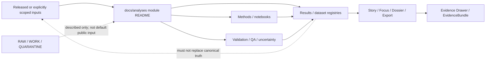

<!-- [KFM_META_BLOCK_V2]
doc_id: kfm://doc/<uuid-NEEDS-VERIFICATION>
title: Kansas Frontier Matrix — Analyses Index
type: standard
version: v1
status: draft
owners: <owners-NEEDS-VERIFICATION>
created: <created-NEEDS-VERIFICATION>
updated: <updated-NEEDS-VERIFICATION>
policy_label: <policy-label-NEEDS-VERIFICATION>
related: [docs/analyses/remote-sensing/README.md (corpus-evidenced; repo presence NEEDS VERIFICATION), docs/analyses/archaeology/results/notebooks/README.md (corpus-evidenced; repo presence NEEDS VERIFICATION), docs/analyses/ecology/datasets/derived/README.md (corpus-evidenced; repo presence NEEDS VERIFICATION), docs/analyses/_templates/analysis_readme.md (corpus-evidenced; repo presence NEEDS VERIFICATION)]
tags: [kfm, analyses, evidence-first, map-first, time-aware]
notes: [Drafted from the March 2026 KFM corpus; current-session workspace exposed PDFs and repo-grounded sprint evidence, but not a mounted repo tree; replace placeholders after direct repo inspection.]
[/KFM_META_BLOCK_V2] -->

# Kansas Frontier Matrix — Analyses Index

Parent index for governed analysis modules, results registries, notebook indexes, and validation surfaces under `docs/analyses/`.

> **Status:** experimental  
> **Owners:** `<owners-NEEDS-VERIFICATION>`  
>       
> **Quick jump:** [Scope](#scope) · [Repo fit](#repo-fit) · [Inputs](#inputs) · [Exclusions](#exclusions) · [Directory tree](#directory-tree) · [Quickstart](#quickstart) · [Usage](#usage) · [Diagram](#diagram) · [Tables](#tables) · [Task list](#task-list) · [FAQ](#faq) · [Appendix](#appendix)  
> **Evidence posture:** `CONFIRMED` doctrine · `INFERRED` child-doc structure from adjacent corpus docs · `NEEDS VERIFICATION` live repo presence and mounted paths

> [!CAUTION]
> This draft is grounded in the March 2026 KFM corpus and repo-grounded workspace research, but the current session did **not** expose a mounted repo tree, workflow YAML, schema registry, or runtime logs. Relative links below are written repo-natively where the corpus supports them; live path presence, ownership, dates, and automation claims still need direct repo verification before merge.

## Scope

`docs/analyses/` is the documentation layer for analytical work that must remain **downstream of governed evidence, release state, policy posture, and visible uncertainty**.

In KFM, analysis is not a second truth system, not a detached notebook graveyard, and not a place for persuasive uncited prose. It is where analytical questions, methods, results, validation, and reuse limits stay inspectable enough to support later review, publication, correction, and bounded synthesis.

A strong analysis README should make five questions easy to answer:

1. What question, lane, or result family is being documented?
2. Which governed or explicitly scoped inputs support it?
3. What method, notebook, model, or transformation produced the output?
4. What uncertainty, rights, or sensitivity burden qualifies interpretation?
5. Which downstream surfaces may reuse it safely?

## Repo fit

| Item | Value |
| --- | --- |
| Path | `docs/analyses/README.md` |
| Role | Parent index and contribution boundary for analysis-facing documentation |
| Upstream | [`../README.md`](../README.md) *(NEEDS VERIFICATION in the current session)* |
| Downstream examples | [`./remote-sensing/README.md`](./remote-sensing/README.md), [`./archaeology/results/notebooks/README.md`](./archaeology/results/notebooks/README.md), [`./ecology/datasets/derived/README.md`](./ecology/datasets/derived/README.md), [`./_templates/analysis_readme.md`](./_templates/analysis_readme.md) *(corpus-evidenced; repo presence NEEDS VERIFICATION)* |
| Adjacent governed layers | Catalog, provenance, policy, contracts, schemas, product surfaces, and release artifacts are doctrinally required, but their exact mounted paths remain **NEEDS VERIFICATION** |

## Inputs

| Accepted input | What belongs here |
| --- | --- |
| Domain indexes | Parent overviews for an analytical lane such as remote sensing, archaeology results, or ecology |
| Module READMEs | Method scope, inputs, outputs, limits, and downstream reuse rules for one analysis module |
| Results registries | Safe summaries, derived outputs, tables, figures, maps, and result families linked to their analytical basis |
| Notebook indexes | Reproducible notebook inventories and notebook-generated result navigation |
| Validation notes | QA methods, uncertainty summaries, cross-checks, field validation, and known limitations |
| Governance notes | FAIR+CARE posture, masking/generalization rules, rights handling, and AI transform limits |
| Evidence and release links | STAC/DCAT/PROV references, manifests, proof packs, dataset versions, and release-aligned artifacts where applicable |

## Exclusions

| Do not put this here | Why not | Put it here instead |
| --- | --- | --- |
| RAW, WORK, or QUARANTINE artifacts | These are upstream lifecycle states, not analysis-facing documentation | Upstream lifecycle zones *(exact repo path NEEDS VERIFICATION)* |
| Canonical dataset truth records | Analyses may point to them but should not silently replace them | Catalog / release / provenance artifacts |
| Policy bundles and approval records | They govern access and publication, but are not analysis indexes | Governance / contract / release layers |
| Detached AI summaries or speculative prose | KFM requires evidence-linked, policy-safe outputs or abstention | Nowhere until evidence-linked and review-safe |
| Exact sensitive coordinates or culturally restricted detail in public docs | Public analysis documentation must preserve rights and safety posture | Generalized or steward-only documentation paths |
| UI-only feature briefs | Product-surface design belongs with app and shell docs | Interface / product-surface documentation |

## Directory tree

**INFERRED from corpus-evidenced child docs and patterns — confirm against the mounted repo before merge.**

```text
docs/analyses/
├── README.md
├── _templates/
│   └── analysis_readme.md
├── remote-sensing/
│   ├── README.md
│   ├── change-detection/
│   ├── multispectral/
│   ├── sar-lidar-fusion/
│   ├── time-series/
│   └── validation/
├── archaeology/
│   └── results/
│       ├── notebooks/
│       ├── geophysics/
│       └── cultural-landscapes/
└── ecology/
    ├── datasets/
    │   └── derived/
    ├── ecosystem-services.md
    └── landcover-analysis.md
```

Treat the tree above as a **corpus-evidenced planning surface**, not as proof that every path is mounted in the current workspace.

## Quickstart

Start small, explicit, and reviewable.

1. Copy the analysis README template into the target module path.
2. Fill the KFM meta block and the top-of-file impact block with repo-verified values.
3. Declare inputs, methods, outputs, validation, sensitivity posture, and provenance/release links.
4. Link back to this parent index and sideways to any notebook, results, validation, or governance docs that shape interpretation.

```bash
# Corpus-evidenced template path; verify in the mounted repo before use
cp docs/analyses/_templates/analysis_readme.md \
   docs/analyses/<domain>/<module>/README.md
```

For release-facing modules, keep human-readable README content aligned with any machine-readable schema, telemetry, manifest, STAC, DCAT, or PROV references that the module exposes.

## Usage

### Create or expand a module

Keep the first revision narrow enough to review in one pass:

1. State the module purpose in one line.
2. Declare the module type: overview, methods, results, notebooks, validation, dataset registry, or mixed.
3. Point to governed or explicitly scoped inputs.
4. Summarize the analytical method and output family.
5. Surface uncertainty, masking, withholding, or rights constraints early.
6. Declare whether Story, Focus, Dossier, Compare, or Export reuse is allowed, restricted, or prohibited.

### Review an existing module

Review **boundary integrity before polish**:

1. Does the doc point to published or explicitly scoped inputs?
2. Does it distinguish observed, inferred, modeled, corrected, generalized, or provisional states?
3. Does it expose uncertainty or review burden where claims matter?
4. Does it avoid implying schemas, workflows, pipelines, or enforcement that the repo has not verified?
5. Does it preserve a path from claim to evidence, validation, and release context?

## Diagram


```mermaid
flowchart LR
  A["Released or explicitly scoped inputs"] --> B["docs/analyses module README"]
  B --> C["Methods / notebooks"]
  B --> D["Results / dataset registries"]
  B --> E["Validation / QA / uncertainty"]
  C --> D
  E --> D
  D --> F["Story / Focus / Dossier / Export"]
  F --> G["Evidence Drawer / EvidenceBundle"]
  H["RAW / WORK / QUARANTINE"] -. described only; not default public input .-> B
  D -. must not replace canonical truth .-> A
```

Plain-language rule: `docs/analyses/` explains, indexes, and constrains analytical work; it does **not** bypass the truth path or quietly promote derived outputs into sovereign truth.

## Tables

### Analysis document classes

| Class | Typical path shape | What it should hold | What it must link back to |
| --- | --- | --- | --- |
| Domain index | `docs/analyses/<domain>/README.md` | Overview of one analytical lane and its child modules | Parent index, child modules, governing inputs |
| Module README | `docs/analyses/<domain>/<module>/README.md` | Method, inputs, outputs, limits, reuse rules | Inputs, validation, provenance/release links |
| Results registry | `.../results/README.md` | Result families, figures, maps, generalized outputs, summary datasets | Method docs, sensitivity handling, validation |
| Notebook index | `.../notebooks/README.md` | Notebook inventory, reproducibility posture, output destinations | Results, provenance, or release-backed outputs |
| Dataset registry | `.../datasets/derived/README.md` | Derived dataset families, metadata posture, provenance chain | Origin registry, STAC/DCAT/PROV, validation |
| Validation index | `.../validation/README.md` | QA methods, metrics, cross-checks, correction path | Module README, datasets/releases, field checks where applicable |

### Observed child patterns (corpus-evidenced)

| Pattern | Evidenced examples | Repeating structure | Why it matters |
| --- | --- | --- | --- |
| Method + results module | `remote-sensing/change-detection/`, `remote-sensing/time-series/` | `methods/`, `results/`, `reports/`, `governance.md` | Keeps algorithm notes, publish-safe summaries, and validation posture separated but linkable |
| Notebook-heavy results registry | `archaeology/results/notebooks/` | `spatial/`, `temporal/`, `environmental/`, `geophysics/`, `predictive/`, `explainability/`, `stac/`, `metadata/`, `provenance/` | Makes notebook families reproducible without flattening them into one giant directory |
| Metadata-rich dataset registry | `ecology/datasets/derived/` | provenance chain, schema refs, telemetry refs, STAC/DCAT/PROV links | Signals that derived datasets are governed artifacts, not loose exports |

### Minimum module contract

| Element | Required | Why it matters in KFM |
| --- | --- | --- |
| Purpose + scope | Yes | Prevents shapeless analytical sprawl |
| Input links | Yes | Keeps analysis downstream of governed evidence |
| Output family | Yes | Clarifies what kind of result is being documented |
| Method / parameter summary | Yes | Makes results reviewable and rerunnable |
| Validation / uncertainty | Yes | Prevents polished outputs from hiding inference cost |
| Sensitivity / rights posture | Yes | Public-safe analysis depends on visible constraints |
| Provenance / release links | Yes when release-facing | Connects docs to inspectable artifacts and discoverability surfaces |
| Downstream reuse rules | Yes when surfaced in Story / Focus / Export | Prevents detached summaries from behaving like truth |

## Task list

- [ ] Replace all meta-block and impact-block placeholders with repo-verified values.
- [ ] Confirm the mounted `docs/analyses/` tree and update links that are only corpus-evidenced today.
- [ ] Confirm whether [`../README.md`](../README.md) is the correct upstream docs index.
- [ ] Ensure each child analysis README links back to this parent index.
- [ ] Require every child doc to declare scope, inputs, outputs, validation, sensitivity posture, and provenance/release links.
- [ ] Keep uncertainty and withholding/generalization rules explicit for archaeology, biodiversity, and other higher-sensitivity lanes.
- [ ] Do **not** claim workflow, schema, telemetry, or CI enforcement unless the mounted repo proves it.
- [ ] Keep the directory tree and diagram synchronized as the analysis surface evolves.

## FAQ

**Can `docs/analyses/` point directly to RAW or QUARANTINE data?**  
No. Analysis docs may describe upstream provenance, but public- or review-facing analysis documentation should point to governed, admissible inputs or mark provisional status explicitly.

**Can notebooks live under `docs/analyses/`?**  
Yes—when they are indexed, reproducible, and clearly tied to released or reviewable outputs. Scratch notebooks should not be documented here as if they were governed truth.

**Can a results README replace catalog or release truth?**  
No. Results docs can summarize, compare, and contextualize released outputs, but they should not silently become the canonical record.

**Can Focus Mode summaries live here as free text?**  
Only as evidence-linked, policy-safe summaries whose scope and reuse limits are explicit.

**What about sensitive archaeology or biodiversity material?**  
Public analysis docs should default to generalized or withheld presentation and make review/sensitivity posture explicit. Exact disclosure is never the default.

[Back to top](#kansas-frontier-matrix--analyses-index)

## Appendix

<details>
<summary><strong>Corpus-evidenced child paths and neighboring patterns</strong></summary>

### Remote sensing branch
- [`docs/analyses/remote-sensing/README.md`](./remote-sensing/README.md)
- [`docs/analyses/remote-sensing/time-series/README.md`](./remote-sensing/time-series/README.md)
- [`docs/analyses/remote-sensing/change-detection/README.md`](./remote-sensing/change-detection/README.md)
- [`docs/analyses/remote-sensing/multispectral/README.md`](./remote-sensing/multispectral/README.md)
- [`docs/analyses/remote-sensing/sar-lidar-fusion/README.md`](./remote-sensing/sar-lidar-fusion/README.md)

### Archaeology results branch
- [`docs/analyses/archaeology/results/notebooks/README.md`](./archaeology/results/notebooks/README.md)
- [`docs/analyses/archaeology/results/geophysics/electromagnetic/README.md`](./archaeology/results/geophysics/electromagnetic/README.md)
- [`docs/analyses/archaeology/results/cultural-landscapes/ecological-affordances/README.md`](./archaeology/results/cultural-landscapes/ecological-affordances/README.md)

### Ecology branch
- [`docs/analyses/ecology/datasets/derived/README.md`](./ecology/datasets/derived/README.md)
- [`docs/analyses/ecology/ecosystem-services.md`](./ecology/ecosystem-services.md)
- [`docs/analyses/ecology/landcover-analysis.md`](./ecology/landcover-analysis.md)

### Template path
- [`docs/analyses/_templates/analysis_readme.md`](./_templates/analysis_readme.md)

These examples were evidenced in the attached corpus, but their live repo presence still needs direct confirmation.
</details>

<details>
<summary><strong>Open verification items before merge</strong></summary>

- Confirm the mounted `docs/analyses/` tree and replace any corpus-evidenced examples that are not actually present.
- Confirm owners, policy label, doc UUID, and created/updated dates from repo history or documentation governance rules.
- Confirm whether the repository already has a canonical docs index above this file and whether its path is `../README.md`.
- Confirm the actual locations of schemas, manifests, telemetry, governance docs, and release artifacts referenced by child analysis docs.
- Confirm which analysis lanes are live, which are scaffolded, and which remain proposal-only.
- Confirm whether analysis docs have any existing lint, schema, provenance, or accessibility checks wired into CI.

</details>

[Back to top](#kansas-frontier-matrix--analyses-index)
