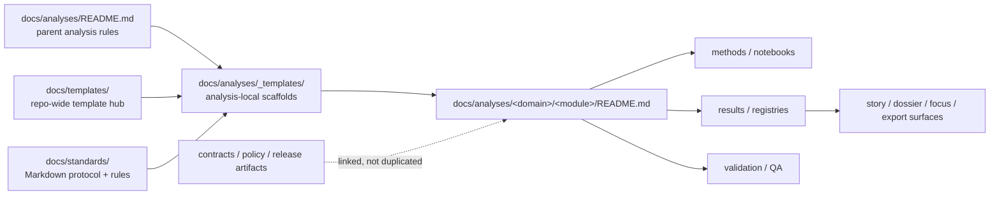

<!-- [KFM_META_BLOCK_V2]
doc_id: kfm://doc/<uuid-NEEDS-VERIFICATION>
title: Kansas Frontier Matrix — Analysis Templates
type: standard
version: v1
status: draft
owners: @bartytime4life
created: <YYYY-MM-DD-NEEDS-VERIFICATION>
updated: 2026-03-31
policy_label: <NEEDS-VERIFICATION>
related: [docs/analyses/README.md, docs/templates/README.md, docs/standards/KFM_MARKDOWN_WORK_PROTOCOL.md, docs/standards/markdown-rules.md, .github/CODEOWNERS]
tags: [kfm, analyses, templates, markdown]
notes: [Current session directly confirms the target README content; broader directory inventory and file-history details still need mounted-checkout verification. Recent project-context inspection reported README.md present here and a parent reference to docs/analyses/_templates/analysis_readme.md.]
[/KFM_META_BLOCK_V2] -->

# Kansas Frontier Matrix — Analysis Templates

Reusable analysis-local scaffolds for KFM analysis documentation, kept narrow, evidence-first, and honest about inventory state.

> **Status:** experimental  
> **Owners:** `@bartytime4life`  
> **Badges:**      
> **Quick jumps:** [Scope](#scope) · [Repo fit](#repo-fit) · [Inputs](#inputs) · [Exclusions](#exclusions) · [Directory tree](#directory-tree) · [Quickstart](#quickstart) · [Usage](#usage) · [Diagram](#diagram) · [Template registry](#template-registry) · [Task list](#task-list) · [FAQ](#faq) · [Appendix](#appendix)  
> **Evidence posture:** **CONFIRMED** target README surface supplied in this session · **INFERRED** recent README-only directory inventory from project context · **INFERRED** parent-referenced `analysis_readme.md` scaffold path · **NEEDS VERIFICATION** current mounted inventory beyond this file

> [!IMPORTANT]
> This directory is an **analysis-local scaffold shelf**, not a second truth path. Templates here should help authors produce better governed analysis docs; they must not become a dumping ground for filled-in reports, notebook output, policy bundles, schema truth, or uncited prose.

> [!NOTE]
> This rewrite directly confirms the target README content supplied in the current session. Broader directory inventory should still be re-checked in a mounted checkout before copy paths or file counts are treated as settled repo fact.

## Scope

This directory exists to hold **reusable Markdown scaffolds** that are specific to the `docs/analyses/` subtree.

In practical terms, that means templates here should help analysis modules answer the same recurring questions the parent analyses index already expects:

1. What question, result family, or decision surface does this analysis support?
2. Which inputs, releases, notebooks, and evidence objects does it depend on?
3. What method was used, at what scope, and with what limits?
4. What uncertainty, sensitivity, or rights posture changes what can be shown?
5. What downstream surfaces may reuse the result, and under what release boundary?

The intended use is narrow by design: make analysis documentation easier to create, easier to review, and harder to drift away from KFM’s truth posture.

[Back to top](#kansas-frontier-matrix--analysis-templates)

## Repo fit

**Path:** `docs/analyses/_templates/README.md`  
**Role:** Directory README for analysis-specific documentation scaffolds.  
**Upstream:** [`../README.md`](../README.md)  
**Adjacent governed references:** [`../../templates/README.md`](../../templates/README.md), [`../../standards/KFM_MARKDOWN_WORK_PROTOCOL.md`](../../standards/KFM_MARKDOWN_WORK_PROTOCOL.md), [`../../standards/markdown-rules.md`](../../standards/markdown-rules.md), [`../../../.github/CODEOWNERS`](../../../.github/CODEOWNERS)  
**Downstream consumers:** analysis module READMEs under `docs/analyses/<domain>/...`

This directory sits between two useful layers:

- the **parent analyses index**, which defines what analysis documentation must explain; and
- the broader **docs template hub**, which governs reusable document scaffolds across the repo.

That split matters. Repo-wide templates belong in `docs/templates/`. Analysis-specific scaffolds belong here only when they encode recurring needs that are unique to analysis work inside `docs/analyses/`.

## Inputs

The following kinds of files belong here:

- Reusable README scaffolds for analysis modules.
- Reusable scaffolds for analysis-adjacent index pages when the pattern clearly repeats across multiple analysis lanes.
- Small, review-friendly Markdown fragments or author prompts that help authors preserve KFM truth labels, release linkage, uncertainty language, and evidence routing.
- Analysis-local template material that complements the parent analyses index without duplicating canonical doctrine from `docs/standards/` or `docs/templates/`.

### What a good analysis template should force authors to declare

| Area | Why it matters |
|---|---|
| Module purpose | Prevents shapeless “analysis about everything” docs. |
| Accepted inputs | Makes notebook, dataset, release, and evidence dependencies visible. |
| Method and boundaries | Prevents result prose from outrunning method reality. |
| Outputs and downstream reuse | Clarifies whether the doc feeds maps, dossiers, exports, comparisons, or only internal review. |
| Validation posture | Makes uncertainty, checks, and failure modes inspectable. |
| Sensitivity / rights posture | Prevents exactness, publication scope, or reuse from being implied away. |
| Repo fit and links | Keeps each module native to the repo and easier to maintain. |

## Exclusions

The following do **not** belong here:

- Filled-in analysis module READMEs.
- One-off drafts or working notes.
- Notebook output, figures, caches, exports, or generated artifacts.
- RAW / WORK / QUARANTINE material.
- Canonical dataset truth records or release artifacts.
- Policy bundles, Rego, JSON Schema, OpenAPI, or executable contract truth.
- UI-only feature briefs that are not reusable analysis documentation scaffolds.
- Sensitive coordinates, publication decisions, or steward-only material that should live in governed review or policy surfaces instead.

### Send these elsewhere

| Does not belong here | Put it here instead |
|---|---|
| Filled-in analysis docs | `docs/analyses/<domain>/...` |
| Repo-wide reusable doc templates | `docs/templates/` |
| Markdown work rules / authoring doctrine | `docs/standards/` |
| Contracts, schemas, vocab registries | `contracts/`, `schemas/`, `policy/` |
| Tests, fixtures, validators | `tests/`, `tools/`, `scripts/` |
| Release-backed evidence objects | catalog / release / evidence-bearing surfaces, not template shelves |

[Back to top](#kansas-frontier-matrix--analysis-templates)

## Directory tree

### Current-session-confirmed target surface

```text
docs/analyses/_templates/
└── README.md
```

### Parent-referenced scaffold surface

The parent analyses index reportedly points at an analysis README scaffold path. Treat that reference as intended design until a mounted checkout re-verifies the file.

```text
docs/analyses/_templates/
└── analysis_readme.md   # INFERRED / NEEDS VERIFICATION
```

A recent project-context inspection also reported no additional files in this directory, but treat that broader inventory as **NEEDS VERIFICATION** until it is rechecked in a mounted checkout.

## Quickstart

In a mounted checkout, start by verifying what is actually present before you write or copy anything.

```bash
ls -la docs/analyses/_templates
find docs/analyses/_templates -maxdepth 1 -type f | sort

sed -n '1,260p' docs/analyses/README.md
sed -n '1,260p' docs/templates/README.md
sed -n '1,220p' docs/standards/KFM_MARKDOWN_WORK_PROTOCOL.md
sed -n '1,220p' docs/standards/markdown-rules.md
sed -n '1,120p' .github/CODEOWNERS
```

When the analysis README scaffold is present, use it from here rather than rebuilding structure ad hoc:

```bash
cp docs/analyses/_templates/analysis_readme.md \
  docs/analyses/<domain>/<module>/README.md
```

If that file is **not** present, stop and resolve the mismatch first. Either:

1. add the missing scaffold here, or
2. revise the parent analyses index so it points at the real template location.

## Usage

### Create or revise an analysis-local scaffold

1. Verify that the pattern is genuinely reusable across more than one analysis lane.
2. Keep the scaffold Markdown-only and review-friendly.
3. Preserve KFM truth labels where uncertainty or repo mismatch matters.
4. Link outward to standards and parent analysis guidance instead of restating all doctrine locally.
5. Avoid hard-coding repo state that is not directly visible.

### Apply a scaffold to a module

1. Copy the scaffold into the target module path.
2. Replace placeholders with repo-verified values.
3. Keep path, upstream/downstream links, and accepted-input boundaries explicit.
4. Add method, validation, uncertainty, and release linkage before expanding prose.
5. Keep analysis docs subordinate to evidence, release state, and policy posture.

### Review a scaffold before merge

Check that the scaffold:

- improves repeatability instead of adding another prose style,
- stays specific to `docs/analyses/`,
- does not duplicate schema, policy, or contract truth,
- does not hide unknowns behind polished wording,
- and makes downstream analysis docs easier to review in Git.

[Back to top](#kansas-frontier-matrix--analysis-templates)

## Diagram



Above: analysis-local scaffolds sit between the parent analyses contract and repo-wide standards, then fan outward into per-module analysis READMEs that should link to methods, results, and validation without becoming shadow policy or contract surfaces.

## Template registry

| Template surface | Status | Purpose | Notes |
|---|---|---|---|
| `README.md` | **CONFIRMED** | Directory contract for the analysis-local template shelf. | Target file supplied in the current session. |
| `analysis_readme.md` | **INFERRED / NEEDS VERIFICATION** | Expected scaffold for per-module analysis READMEs. | Reportedly referenced by the parent analyses index, but not directly re-verified in a mounted checkout during this rewrite. |

### Promotion rule for adding more templates here

Add another file here only when all of the following are true:

- the pattern repeats across multiple analysis lanes,
- it is meaningfully analysis-specific,
- it cannot live more cleanly in `docs/templates/`,
- it does not become a shadow contract/policy surface,
- and at least one real downstream consumer is visible or imminent.

## Task list

- [ ] Re-verify current mounted contents of `docs/analyses/_templates/`.
- [ ] Verify whether `docs/analyses/_templates/analysis_readme.md` exists in the mounted repo.
- [ ] If missing, decide whether to add it here or update `docs/analyses/README.md` to the real scaffold path.
- [ ] Keep this directory limited to analysis-local reusable scaffolds.
- [ ] Preserve links to the parent analyses index and the repo-wide template hub.
- [ ] Keep owner and status blocks aligned with current repo conventions.
- [ ] Avoid turning template shelves into truth-bearing release surfaces.
- [ ] Prove at least one real consumer README uses the scaffold before calling this directory stable.

## FAQ

### Why have analysis-local templates if `docs/templates/` already exists?

Because some documentation patterns are shared across the repo, while others are specific to governed analysis work. This directory should only exist for the latter.

### Does `analysis_readme.md` exist today?

A recent project-context inspection did not directly re-verify it in a mounted checkout, even though the parent analyses index reportedly points to it. Treat it as an intended scaffold path until the file is rechecked directly.

### Should templates here contain STAC, DCAT, PROV, policy, or schema truth?

No. They may *point authors toward* those surfaces, but they should not replace the canonical contract, policy, or release-bearing layers.

### Can notebook output, charts, or generated figures live here?

No. Those are analysis artifacts or module contents, not reusable templates.

### What is the failure mode this README is trying to prevent?

Two common ones: a template shelf that silently becomes a miscellaneous dump, and analysis docs that look polished but no longer expose method, uncertainty, evidence, or release linkage clearly.

[Back to top](#kansas-frontier-matrix--analysis-templates)

## Appendix

<details>
<summary>Illustrative opener for a future <code>analysis_readme.md</code> scaffold (PROPOSED, not confirmed mounted inventory)</summary>

```markdown
# <Analysis Module Title>

One-line purpose statement for this analysis module.

> **Status:** draft|review|published
> **Owners:** <owners>
> **Quick jumps:** Scope · Repo fit · Inputs · Method · Outputs · Validation · Sensitivity · Links

## Scope
State the analysis question, geography, time scope, and non-goals.

## Repo fit
Path, upstream links, downstream consumers, adjacent notebook/results/validation docs.

## Inputs
Named datasets, releases, notebooks, evidence objects, and required dependencies.

## Method
Short method summary with truth labels where needed.

## Outputs
Describe result classes and allowed downstream reuse.

## Validation
Checks performed, known uncertainty, failure modes, open verification items.

## Sensitivity / rights
Exactness limits, generalization rules, publication constraints, steward review notes.

## Links
Relative links to notebooks, results, validation, release, and parent analysis index.
```

</details>