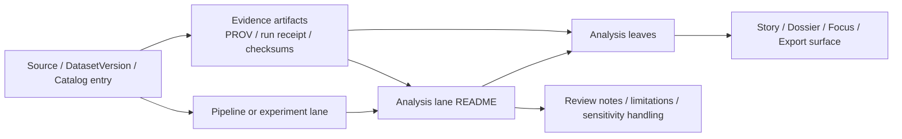

<!-- [KFM_META_BLOCK_V2]
doc_id: kfm://doc/NEEDS-VERIFICATION
title: Analysis Lane README Template
type: standard
version: v1
status: draft
owners: NEEDS VERIFICATION
created: YYYY-MM-DD
updated: YYYY-MM-DD
policy_label: public
related: [docs/analyses/README.md, docs/README.md, docs/analyses/<lane>/README.md]
tags: [kfm, analyses, template]
notes: [Template file for analysis-lane READMEs; replace placeholders and verify adjacent paths after mounted repo inspection.]
[/KFM_META_BLOCK_V2] -->

# Analysis Lane README Template

Copy this file into an analysis directory and replace the placeholders with lane-specific scope, evidence routing, ownership, and review metadata.

> [!NOTE]
> **Status:** experimental  
> **Owners:** NEEDS VERIFICATION  
>     
> **Quick jumps:** [Scope](#scope) · [Repo fit](#repo-fit) · [Accepted inputs](#accepted-inputs) · [Exclusions](#exclusions) · [Current verified baseline](#current-verified-baseline) · [Directory tree](#directory-tree) · [Quickstart](#quickstart) · [Usage](#usage) · [Diagram](#diagram) · [Analysis contract](#analysis-contract--minimum-evidence-pack) · [Task list](#task-list--definition-of-done) · [FAQ](#faq)  
> **Repo fit:** `docs/analyses/_templates/analysis_readme.md` → copy into `docs/analyses/<lane>/README.md` or the lane-local equivalent. Upstream references usually include `docs/analyses/README.md` and `docs/README.md`; downstream references usually include analysis leaves, Story Node notes, linked experiments, and evidence artifacts. **Verify all local paths after copy.**

> [!IMPORTANT]
> This template is for an **analysis lane README**: a routing surface that explains what a lane owns, how it connects to evidence, and how readers should navigate related analysis leaves. It is **not** the owner of raw source onboarding, cross-cutting governance doctrine, or implementation-heavy pipeline contracts.

> [!WARNING]
> Current-session visibility may be partial. Do not let this template imply that a lane, pipeline, contract, workflow, or artifact already exists unless the mounted repository directly proves it. Replace placeholders, confirm local inventory, and keep unresolved items visibly marked.

## Scope

Use this README to define a single analysis lane such as `<lane>`, `<theme>`, or `<study-family>`. A good lane README should make five things obvious:

- what belongs in the lane
- what does **not** belong in the lane
- how analysis leaves connect to data, methods, and evidence
- what readers should trust, question, or verify
- what completion looks like before a lane feels reviewable

Typical lane uses include:

- Story Node support pages
- method notes tied to named evidence
- cross-dataset interpretation pages
- lane-local conventions for outputs, figures, and uncertainty statements
- routing from analysis leaves to the data, pipeline, experiment, and evidence surfaces that support them

## Repo fit

| Path | Role | Relationship |
| --- | --- | --- |
| `docs/analyses/_templates/analysis_readme.md` | source template | this file before copy |
| `docs/analyses/<lane>/README.md` | lane index | the copied and completed version of this file |
| `docs/analyses/<lane>/<analysis>.md` | analysis leaf | narrow page for one analysis, narrative, or method slice |
| `data/<domain-or-lane>/...` | evidence/data lane | verify before linking; keep dataset ownership there |
| `src/pipelines/<domain-or-lane>/...` | implementation lane | verify before linking; do not restate pipeline contracts here |
| `mcp/experiments/<domain-or-lane>/...` | experiments/notebooks | optional support surface when analysis depends on exploratory or model-fitting work |
| `docs/governance/...` | policy/governance | use for cross-cutting rules, not lane-local repetition |

## Accepted inputs

Place these here when they are primarily **analysis-facing** artifacts:

- analysis leaves with a narrow question, window, or claim
- links to dataset versions, STAC items/collections, DCAT records, or outward catalog entries
- evidence bundles, run receipts, checksums, or configuration hashes that support a visible conclusion
- notebooks or experiments that explain a method used in the lane
- small figures, quicklooks, maps, or tables that clarify the lane’s outputs
- lane-local guidance for uncertainty, sensitivity, generalization, or review expectations
- Story Node support pages that connect the visible narrative to inspectable evidence

## Exclusions

Do **not** place the following here:

- raw source onboarding or connector contracts → keep in the source, ingest, or data architecture lane
- cross-cutting governance, publication law, or security policy → keep in the owning governance/security documentation
- full pipeline implementation guides → keep in `src/pipelines/...` or the owning runbook lane
- uncited conclusions presented as if they were settled fact
- sensitive or unpublished evidence that should remain withheld, generalized, or steward-reviewed
- copy-pasted dataset catalogs, schema dumps, or long log output that belongs in linked artifacts instead
- claims that a workflow, API, contract, or release behavior exists when the mounted repo does not directly prove it

## Status vocabulary used in this lane

| Label | Use here |
| --- | --- |
| **CONFIRMED** | Directly verified from mounted repo evidence, attached project doctrine, or linked source artifacts |
| **INFERRED** | Small structural completion consistent with KFM doctrine, but not directly mounted as implementation fact |
| **PROPOSED** | Recommended structure, guidance, or next step |
| **UNKNOWN** | Not verified strongly enough in the current session |
| **NEEDS VERIFICATION** | Explicit review flag for paths, owners, metadata, inventory, or behavior |

## Current verified baseline

Start each copied lane README with a short, evidence-aware snapshot. A minimal pattern is:

| Item | Verified state | Notes |
| --- | --- | --- |
| Lane purpose | `CONFIRMED` / `INFERRED` / `UNKNOWN` | Brief statement of what this lane owns |
| Adjacent lane inventory | `NEEDS VERIFICATION` until inspected | Do not assume nearby files exist |
| Data/evidence links | `CONFIRMED` only when directly visible | Prefer dataset/version references over vague nouns |
| Pipeline links | `UNKNOWN` until mounted repo confirms them | Avoid bluffing implementation depth |
| Story/report outputs | `PROPOSED` until linked pages exist | Name intended surfaces without overstating maturity |

For many lanes, the initial verified snapshot will be intentionally small. That is acceptable. KFM favors explicit limits over persuasive smoothing.

## Directory tree

Illustrative shape only. Replace with the real local tree after inspection.

```text
docs/
└── analyses/
    ├── _templates/
    │   └── analysis_readme.md
    └── <lane>/
        ├── README.md
        ├── <analysis-a>.md
        ├── <analysis-b>.md
        ├── assets/                 # OPTIONAL / NEEDS VERIFICATION
        ├── figures/                # OPTIONAL / NEEDS VERIFICATION
        └── references/             # OPTIONAL / NEEDS VERIFICATION
```

## Quickstart

1. Copy this template into the target lane.

   ```bash
   cp docs/analyses/_templates/analysis_readme.md docs/analyses/<lane>/README.md
   ```

2. Replace all placeholders:
   - `NEEDS VERIFICATION`
   - `<lane>`
   - `YYYY-MM-DD`
   - repo paths that were only sketched here

3. Verify local inventory before writing claims:
   - adjacent README files
   - analysis leaves
   - linked data paths
   - linked pipeline or experiment paths
   - ownership and status markers

4. Fill the lane’s **Current verified baseline** with only what the current session proves.

5. Add at least one meaningful diagram that explains real routing or dependency structure.

6. Confirm the lane’s evidence contract:
   - what a leaf must link to
   - what QA or validation artifacts matter
   - how uncertainty is labeled
   - what sensitive content must be withheld or generalized

7. Remove or rewrite any statement that sounds implementation-certain without proof.

## Usage

### Add a new analysis leaf

1. Create a narrow page for one analysis question, method slice, or narrative object.
2. Link the leaf back to this lane README.
3. Link outward to the relevant dataset versions, catalog entries, receipts, notebooks, or figures.
4. Mark uncertainty explicitly.
5. Keep heavyweight logs, schemas, and raw evidence in their owning artifacts; summarize and route instead.

### Update the lane README

Update this file when any of the following changes:

- the lane boundary changes
- the verified file inventory changes
- a new analysis family becomes important enough to deserve routing here
- evidence requirements become stricter
- a linked data or pipeline surface materially changes
- a sensitivity or publication rule changes how analysis outputs should be written

### Keep the lane evidence-first

Each lane README should make it easy to answer:

- What evidence does this lane rely on?
- Which outputs are public-safe, generalized, or withheld?
- What is directly verified today?
- What remains planned or unverified?
- Where does a reader go for deeper implementation or deeper evidence?

## Diagram



## Analysis contract — minimum evidence pack

Use this as a compact lane contract. Trim or extend only when the mounted lane proves a different local pattern.

| Artifact or link | Minimum expectation | Why it belongs here |
| --- | --- | --- |
| Lane purpose | one-paragraph statement | tells readers what this lane owns |
| Analysis leaves | stable filenames + short descriptions | keeps navigation legible |
| Dataset references | dataset version, STAC, DCAT, or equivalent link | prevents “mystery input” analysis |
| Provenance links | PROV, run receipt, checksum, config hash, or evidence bundle link | keeps conclusions reconstructable |
| Method surface | notebook, runbook, method note, or concise explanation | clarifies how the result was produced |
| Output surface | figures, maps, quicklooks, story links, export refs | shows where lane outputs appear |
| Uncertainty / sensitivity note | visible label and rule | preserves trust posture |
| QA / validation note | what was checked and where the proof lives | avoids unverifiable polish |

### Lane-local metadata to verify

When the lane actually has them, prefer explicit refs instead of vague prose.

| Ref family | Typical placeholder |
| --- | --- |
| SBOM | `<lane-or-release-sbom-ref>` |
| Manifest | `<lane-or-release-manifest-ref>` |
| STAC profile | `stac_extensions/kfm_timeseries.json` or `stac_extensions/kfm_raster.json` when applicable |
| DCAT profile | `<lane-dcat-profile-ref>` |
| PROV profile | `<lane-prov-profile-ref>` |
| Telemetry schema | `<lane-telemetry-schema-ref>` |

## Suggested per-analysis leaf shape

Use this as an illustrative starter, not as a rigid law.

```md
# <Analysis title>

One-line purpose for the analysis leaf.

## What this page is
- Question or claim
- Spatial / temporal scope
- Why this leaf exists

## Inputs
- DatasetVersion or catalog refs
- Method / experiment refs
- Evidence bundle or receipt refs

## Method
- Short method summary
- Any major transforms, joins, or model fits
- Limits that matter for interpretation

## Outputs
- Maps, charts, tables, or Story Node links
- Public-safe / generalized / withheld notes where relevant

## Evidence and provenance
- PROV / run receipt / checksums / config hash
- Linked dataset versions or release refs

## Status notes
- CONFIRMED:
- INFERRED:
- PROPOSED:
- UNKNOWN:
- NEEDS VERIFICATION:
```

## Tables worth keeping in lane READMEs

Use tables where they clarify routing or ownership.

| Good table type | Best use |
| --- | --- |
| repo-fit table | path ownership and routing |
| verified snapshot table | current evidence state |
| artifact matrix | evidence, methods, outputs |
| leaf registry | what pages exist in the lane |
| definition-of-done table | review and completion checks |

## Task list — definition of done

A lane README is ready for review when all applicable checks below pass.

- [ ] H1, one-line purpose, and top impact block are present
- [ ] KFM meta block placeholders are replaced or intentionally preserved with a visible note
- [ ] lane scope is narrow and non-generic
- [ ] repo-fit paths are verified
- [ ] accepted inputs and exclusions are explicit
- [ ] current verified baseline is present and honest
- [ ] directory tree reflects the mounted lane or is clearly marked illustrative
- [ ] at least one Mermaid diagram explains real structure
- [ ] tables are used where they help
- [ ] analysis leaves are routed to evidence, methods, and outputs
- [ ] uncertainty, sensitivity, and withheld/generalized cases are described where relevant
- [ ] commands are runnable or labeled illustrative
- [ ] no sentence overclaims implementation depth
- [ ] long appendix content is wrapped in `<details>` where needed

## FAQ

### Should this README duplicate pipeline contracts?

No. Link to the owning pipeline or runbook lane. This file should explain analysis routing and trust posture, not become a second implementation manual.

### Can this README claim that a dataset, API, or workflow is live?

Only when the mounted repo, attached artifacts, or directly visible proof objects confirm it.

### When should I create a new analysis leaf instead of expanding this README?

Create a new leaf when the page has its own question, method, dataset combination, or output surface.

### What if the lane has only one page right now?

Keep the README anyway. In early lanes, structure and routing are still useful, and a small verified snapshot is better than a padded one.

### What if evidence is incomplete?

Keep the lane small, mark the gap, and route to what is known. Do not smooth the gap away.

## Appendix

<details>
<summary><strong>Placeholder inventory to replace before commit</strong></summary>

| Placeholder | Replace with |
| --- | --- |
| `NEEDS VERIFICATION` | real owner, status, date, or keep with an explanatory note |
| `<lane>` | actual lane name |
| `docs/analyses/<lane>/README.md` | real target path |
| `<analysis-a>.md` / `<analysis-b>.md` | actual leaf filenames |
| `<lane-or-release-sbom-ref>` | real SBOM ref, or remove if not applicable |
| `<lane-dcat-profile-ref>` | actual DCAT profile ref |
| `<lane-prov-profile-ref>` | actual PROV profile ref |
| `<lane-telemetry-schema-ref>` | actual telemetry schema ref |

</details>

<details>
<summary><strong>Optional lane-specific additions</strong></summary>

Add only when the mounted lane genuinely needs them:

- glossary of lane-local terms
- small registry of datasets or study areas
- correction / supersession notes
- quality thresholds or review gates
- figure inventory
- release or publication matrix
- lane-specific accessibility or sensitivity guidance

</details>

[Back to top](#analysis-lane-readme-template)
