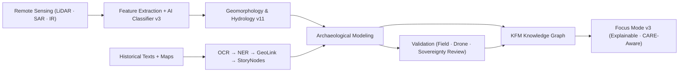

<div align="center">

# 🏺 **Kansas Frontier Matrix — Archaeology Analyses Index (v11)**  
`docs/analyses/archaeology/README.md`  
**Diamond⁹ Ω / Crown∞Ω Ultimate Certified**  
**FAIR+CARE + Tribal Sovereignty-Aligned · Scientifically Rigorous · Culturally Respectful**

</div>

---

# 📘 Overview

The **Archaeology Domain (KFM v11)** is a unified analytical environment merging:

- 🛰 **Remote sensing** (LiDAR, SAR, thermal IR, multispectral, DEM derivatives)  
- 🧭 **Spatial historical geography** (treaties, plats, diaries, surveys, archival photographs)  
- 🧬 **Entity extraction from historical texts** (OCR → NER → GeoLink → StoryNodes)  
- 🌊 **Hydrological reconstruction** (paleo-channels, floodplains, watershed models)  
- 🌿 **Ecological co-analysis** (biomes, soils, slope, resources)  
- 🗺 **Indigenous cultural landscapes** (CARE-restricted + sovereignty protections)  
- 🏞 **3D archaeology** (3D terrain, predicted excavation volumes, architectural inference)  
- 🤖 **AI-assisted archaeological inference** (Focus Mode v3, Explainability v3.2, narrative risk filters)  

KFM v11 treats archaeological data as **high-sensitivity cultural knowledge**, governed by:

- **CARE Principles**
- **Sovereignty-Aligned Data Policies**
- **FAIR+CARE Council**
- **Indigenous Data Governance Board (IDGB)**

No sensitive site geometries are ever revealed at full resolution.

---

# 🗂️ Directory Layout (v11-Expanded)

```text
docs/
└── analyses/
    └── archaeology/                      # Archaeology domain root
        ├── README.md                     # This file
        │
        ├── datasets/                     # All archaeological source material
        │   ├── lidar/                    # Hillshade, slope, roughness, CHM, DEM
        │   ├── sar/                      # Sentinel-1, UAVSAR, moisture anomalies
        │   ├── historical_maps/          # Plats, railroad surveys, treaty boundaries
        │   ├── manuscripts/              # Diaries, reports, archival letters, NER outputs
        │   ├── geophysics/               # Magnetometry, GPR, resistivity (governed)
        │   ├── soils/                    # SSURGO/STATSGO infiltration & composition
        │   ├── hydrology/                # Palaeo-streams, WID data, flooding models
        │   └── sovereignty/              # CARE + sovereignty-restricted datasets
        │
        ├── methods/
        │   ├── remote_sensing/           # LiDAR+SAR fusion, feature extraction
        │   ├── geoprocessing/            # Slope, roughness, curvature, landform models
        │   ├── nlp/                      # OCR → NER → Linking → Story Node generation
        │   ├── predictive_models/        # AI-based site prediction (Focus v3)
        │   ├── treaty_alignment/         # Boundary alignment, centroid modeling
        │   ├── deformation_models/       # Earthwork geometry normalization
        │   └── cultural_landscape/       # Landscape change & movement corridors
        │
        ├── results/
        │   ├── site_probability_maps/    # Raster probability surfaces (H3 generalized)
        │   ├── geomorphology/            # Landform classifications
        │   ├── hydrology_overlays/       # Paleo-water maps
        │   ├── text_entity_graphs/       # Linked archival–spatial entities
        │   ├── cultural_routes/          # Hypothesized interaction spheres & paths
        │   └── storynodes/               # Story Node v3 collections & narratives
        │
        ├── validation/
        │   ├── field_notes/              # Field logbooks (redacted)
        │   ├── drone_surveys/            # Low-res orthos + validation metadata
        │   ├── peer_review/              # Internal/external archaeological reviewers
        │   └── confidence_metrics/       # Statistical/ML validation reports
        │
        ├── visualization/
        │   ├── maplibre_layers/          # 2D layers (privacy-hardened)
        │   ├── cesium_tiles/             # 3D terrain tilesets and overlays
        │   ├── embeddings/               # PCA/UMAP embeddings of text/spatial data
        │   └── dashboards/               # FAIR+CARE visualization outputs
        │
        └── metadata/
            ├── provenance/               # PROV-O lineage bundles
            ├── audit/                    # FAIR+CARE audit snapshots
            └── stac/                     # STAC Items/Collections (generalized)
```

---

# 🧩 Core v11 Analytical Modules (Expanded)

## 🛰 1. Remote Sensing & Feature Extraction
- LiDAR derivatives: slope, curvature, openness, relief.
- SAR coherence/texture for soil disturbance signatures.
- Thermal IR → nocturnal heat retention analysis.
- AI Feature Classifier v3.1 (explainable + bias controlled).

Outputs:
- H3-generalized feature clusters  
- Anomaly heatmaps  
- Confidence-weighted probability surfaces  

---

## 🗺 2. Historical Cartography & Treaty Alignment
- 1850s–1930s plats rectified with TPS warping.
- Treaty polygons validated against legal descriptions.
- Historical trail extraction using OCR trajectory analysis.

Outputs:
- Multi-epoch georeferenced boundary atlas  
- “Lost routes” inferred via elevation cost modeling  

---

## 🧬 3. NLP & Text-Based Archaeology
Pipeline:
1. OCR v4  
2. Domain-tuned NER (persons, places, rivers, settlements)  
3. GeoLink v3  
4. Entity clustering  
5. Story Node v3 synthesis  

Outputs:
- Temporal entity graphs  
- Historical interaction spheres  
- NER provenance bundles  

---

## 🏞 4. Geomorphology & Settlement Viability
- Paleo-hydrology reconstruction  
- Resource catchment modeling  
- Slope + soils + distance-to-water viability scoring  

Outputs:
- Multi-factor suitability layers  
- Settlement corridors  

---

## 🧪 5. Validation Framework v11
- Drone orthophotos (governed)  
- Field validation logs with sensitivity flags  
- Inter-rater reliability scoring  
- Tribal review and cultural consultation logs  

---

# ⚖️ FAIR + CARE + Sovereignty Enforcement (v11)

| Pillar | v11 Implementation |
|-------|---------------------|
| **Collective Benefit** | Archaeology analyses must benefit Tribal communities first. |
| **Authority to Control** | Sensitive-site geometry generalized to H3 r7–r9. |
| **Responsibility** | Counsel review required for Story Node publication. |
| **Ethics** | AI outputs filtered through cultural sensitivity scoring. |
| **CARE+** | Zero tolerance for disclosure of sacred sites, burials, or private cultural knowledge. |

---

# 🔐 Sensitive Site Handling (v11)

- Full-resolution coordinates **never** stored in STAC items.  
- Only H3 aggregated centroids displayed in MapLibre/Cesium.  
- Story Nodes referencing sensitive content auto-redacted.  
- Sovereignty flags injected into:
  - Focus Mode v3 response  
  - All downstream analytics  
  - All provenance bundles  

---

# 🔄 Integrated v11 Workflow



---

# 🧾 Example v11 Metadata Record

```json
{
  "id": "archaeology_analysis_v11_2025Q4",
  "modules": [
    "remote_sensing",
    "historical_cartography",
    "nlp_entity_extraction",
    "geomorphology_modeling",
    "validation_framework_v11"
  ],
  "sovereignty_protected": true,
  "sensitive_geometries_generalized": "H3-r8",
  "faircare_status": "certified",
  "energy_wh": 4.82,
  "carbon_gco2e": 0.53,
  "governance_registered": true,
  "created": "2025-11-24T18:00:00Z",
  "validator": "@kfm-archaeology"
}
```

---

# 🕰 Version History

| Version | Date | Summary |
|--------:|------|---------|
| **v11.0.0** | 2025-11-24 | Full v11 rebuild; CARE+ sovereignty extensions; AI v3 integration; new directory schema. |
| v10.1.0 | 2025-11-11 | Initial Platinum-template archaeology index. |

---

<div align="center">

© 2025 Kansas Frontier Matrix · CC-BY 4.0  
**Diamond⁹ Ω / Crown∞Ω Ultimate Certified**  
FAIR+CARE · Sovereignty Aligned · MCP-DL v6.3 · KFM-MDP v11

[Back to Analyses](../README.md) · [Sovereignty Policy](../../standards/sovereignty/INDIGENOUS-DATA-PROTECTION.md)
</div>