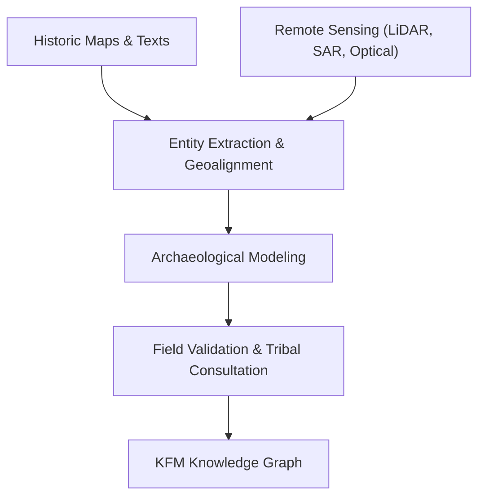

<div align="center">

# 🏺 **Kansas Frontier Matrix — Archaeology Analyses Index**
`docs/analyses/archaeology/README.md`

**Purpose:**  
Serve as the central knowledge hub for **Archaeological and Historical Landscape Analyses** within the Kansas Frontier Matrix (KFM).  
This layer synthesizes geospatial, archival, and environmental data to reveal patterns of past human habitation and landscape transformation across Kansas.

[](../../../../docs/)  
[](../../../../LICENSE)  
[](../../../../docs/standards/fairstandards.md)  
[](../../../../releases/v10.1.0/)
</div>

---

## 📘 Overview

KFM’s **Archaeology domain** integrates remote sensing, soil, hydrology, and archival text to reconstruct historical settlement patterns, trade routes, and ecological footprints.  
By leveraging AI-assisted spatial inference, this layer connects physical traces on the land with ethnographic, treaty, and historical documentation.

Key goals include:
- Identifying **lost settlements**, **burial mounds**, and **trail systems** using LiDAR and SAR data.  
- Mapping cultural landscapes through **archival map rectification** and **text mining**.  
- Supporting **Tribal sovereignty** and **heritage protection** under FAIR+CARE principles.  
- Cross-validating archaeological hypotheses using hydrological, ecological, and climatic layers.

---

## 🗂️ Directory Layout
```
docs/
└── analyses/
    └── archaeology/
        ├── datasets/            # Source materials: LiDAR, plats, archives, treaties
        ├── methods/             # Analytical pipelines, geoprocessing, NLP extraction
        ├── results/             # Spatial products, site probability maps, reports
        ├── validation/          # Peer reviews, field logs, and confidence metrics
        ├── visualization/       # MapLibre & Cesium renderings, overlays, and story maps
        └── README.md            # This index file
```

---

## 🧩 Core Analytical Modules

| Module | Description | Key Outputs |
|:--|:--|:--|
| **Site Detection** | Uses LiDAR hillshade and SAR moisture patterns to detect anthropogenic anomalies. | Probability rasters, confidence scores |
| **Historic Overlay** | Aligns 19th-century plats, maps, and diaries with modern coordinates. | GeoJSON overlays, georeferenced raster layers |
| **Text Mining** | Extracts archaeological entities and events from archival texts and treaties. | Named entity lists, semantic timelines |
| **Hydrological Context** | Integrates ancient stream paths and flood models for settlement viability. | Paleo-channel maps, hydrology overlays |
| **Validation & Fieldwork** | Links drone imagery and GPS surveys to remote-sensed hypotheses. | Validation logs, correlation reports |

---

## ⚙️ Analytical Workflow Integration



---

## 🧾 FAIR + CARE Alignment

| Principle | Implementation |
|:--|:--|
| **Findable** | All archaeological datasets carry persistent STAC/DCAT identifiers |
| **Accessible** | FAIR+CARE-compliant access respecting Tribal consent |
| **Interoperable** | CIDOC CRM, GeoSPARQL, and OWL-Time vocabularies |
| **Reusable** | CC-BY 4.0 license, reproducible notebooks |
| **Collective Benefit** | Ensures research benefits Indigenous communities |
| **Authority to Control** | Data sharing decisions led by cultural custodians |
| **Responsibility** | Ethical review by FAIR+CARE Council and Heritage Board |
| **Ethics** | No exposure of sensitive or sacred site locations |

---

## ⚖️ Governance Integration

- **Governance Framework:** KFM Data Governance v4.2 with cultural sovereignty extensions.  
- **Audit Trails:** SPDX manifests linked to site-level provenance.  
- **Validation:** Review board includes Tribal cultural liaisons and KFM FAIR+CARE Council.  
- **Telemetry:** Focus Mode dashboard monitors archaeological workflow lineage.

---

## 🕰️ Version History

| Version | Date | Author | Summary |
|:--|:--|:--|:--|
| v10.1.0 | 2025-11-11 | AI Architect (assistant) | Created archaeology analyses index following Platinum Template v7.1 |

---

<div align="center">

© 2025 Kansas Frontier Matrix — Master Coder Protocol v6.3 · FAIR+CARE Certified · Diamond⁹ Ω / Crown∞ Ω Ultimate Certified  
[Back to Analyses Index](../) · [Governance Charter](../../../../docs/standards/governance/ROOT-GOVERNANCE.md)
</div>

