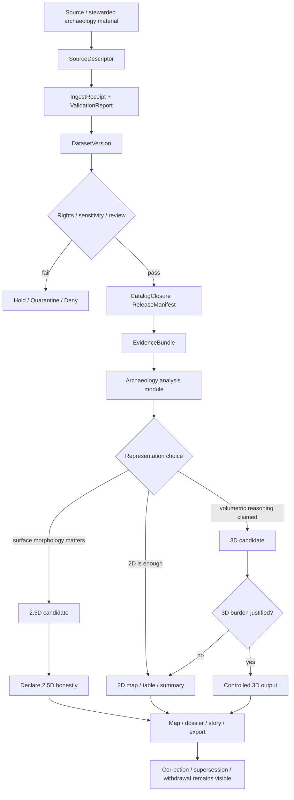

<!-- [KFM_META_BLOCK_V2]
doc_id: kfm://doc/<uuid-NEEDS-VERIFICATION>
title: Archaeology Analyses
type: standard
version: v1
status: draft
owners: <owners-NEEDS-VERIFICATION>
created: YYYY-MM-DD
updated: YYYY-MM-DD
policy_label: <policy_label-NEEDS-VERIFICATION>
related: [../../../contracts/README.md, ../../../schemas/README.md, ../../../policy/README.md, <downstream-archaeology-results-NEEDS-VERIFICATION>]
tags: [kfm, archaeology, analyses]
notes: [Current-session evidence was PDF-only; top-level repo doc surfaces are confirmed, but archaeology directory inventory, owners, dates, and downstream module files still need direct repo verification.]
[/KFM_META_BLOCK_V2] -->

# Archaeology Analyses

Govern release-aware, evidence-linked archaeology analysis documentation for Kansas Frontier Matrix.

> [!IMPORTANT]
> **Status:** experimental  
> **Owners:** `<owners-NEEDS-VERIFICATION>`  
>      
> **Quick jump:** [Scope](#scope) · [Repo fit](#repo-fit) · [Accepted inputs](#accepted-inputs) · [Exclusions](#exclusions) · [Directory tree](#directory-tree) · [Quickstart](#quickstart) · [Usage](#usage) · [Diagram](#diagram) · [Reference tables](#reference-tables) · [Task list](#task-list) · [FAQ](#faq) · [Appendix](#appendix)

**Status vocabulary used here:** **CONFIRMED**, **INFERRED**, **PROPOSED**, **UNKNOWN**, **NEEDS VERIFICATION**.

---

## Scope

Archaeology is a governed KFM lane, not a loose bucket for maps, reconstructions, screenshots, or narrative prose.

Use this directory to document **archaeology analyses** that are already tied to declared evidence, declared time/support semantics, and an explicit publication posture. The job of this README is to make four things immediately visible:

1. what release-backed archaeology analysis is being described
2. what precision posture applies
3. why the chosen representation is 2D, 2.5D, or 3D
4. how correction, supersession, or withdrawal will remain visible later

> [!WARNING]
> Do **not** use this directory to launder exact site data, unpublished field notes, culturally sensitive content, or speculative reconstruction into public-safe documentation.

Archaeology work in KFM should stay downstream of the same trust objects used elsewhere in the system: declared source intake, declared validation, declared release, declared evidence linkage, and declared correction behavior.

---

## Repo fit

| Direction | Link / path | Role in repo | Status |
| --- | --- | --- | --- |
| **This file** | `docs/analyses/archaeology/README.md` | Directory guide and review contract for archaeology analysis docs | **Target of current task** |
| **Upstream repo surfaces** | [contracts](../../../contracts/README.md) · [schemas](../../../schemas/README.md) · [policy](../../../policy/README.md) · [tests](../../../tests/README.md) · [workflow notes](../../../.github/workflows/README.md) | Contract, schema, policy, validation, and workflow context that archaeology docs should link to rather than duplicate | **CONFIRMED repo doc surfaces** |
| **Doctrinal upstream** | `SourceDescriptor` · `DatasetVersion` · `DecisionEnvelope` · `ReleaseManifest` / `ReleaseProofPack` · `EvidenceBundle` · `CorrectionNotice` | The evidence/policy lineage archaeology outputs are expected to inherit | **CONFIRMED doctrine** |
| **Likely downstream modules** | `./results/` · `./results/site-distributions/README.md` | Release-safe archaeology result modules | **PROPOSED / NEEDS VERIFICATION** |
| **Downstream product surfaces** | Map / dossier / story / export surfaces on governed APIs | Where public-safe archaeology analysis may eventually appear | **CONFIRMED doctrine; repo path UNKNOWN** |

### Upstream/downstream reading

Upstream reading should answer: *what evidence and release state back this analysis?*  
Downstream reading should answer: *what public-safe archaeology outputs does this analysis support, and how do they stay correctable?*

---

## Accepted inputs

| Fits here | Minimum expectation |
| --- | --- |
| **Directory-level archaeology analysis indexes** | State purpose, release basis, precision posture, and representation rule |
| **Generalized site-distribution or clustering summaries** | Avoid exact sensitive coordinates on public surfaces |
| **Place/time-aware interpretation notes** | Declare support, time scope, and uncertainty cues |
| **Preservation / damage / condition assessments** | Keep evidence route and correction path visible |
| **2.5D / 3D analysis notes** | Name the representation honestly and justify the burden |
| **Correction / supersession notes for archaeology outputs** | Preserve lineage instead of replacing history silently |
| **Links to governed map / dossier / story / export outputs** | Only when release state and evidence route are explicit |

---

## Exclusions

| Do **not** put this here | Put it where instead |
| --- | --- |
| **Raw field capture, unpublished trench notes, sensitive ingest drops, or unresolved materials** | The governed truth path (`RAW -> WORK/QUARANTINE -> PROCESSED -> CATALOG -> PUBLISHED`), not README-space |
| **Machine-readable schemas** | [../../../schemas/README.md](../../../schemas/README.md) |
| **Contract-family prose or starter contract docs** | [../../../contracts/README.md](../../../contracts/README.md) |
| **Policy registries, reason/obligation bundles, or authorization logic** | [../../../policy/README.md](../../../policy/README.md) |
| **Fixtures, validation harness notes, or e2e proof artifacts** | [../../../tests/README.md](../../../tests/README.md) |
| **Exact site coordinates or unrestricted precise exports** | Steward-only workflows or generalized release-safe derivatives |
| **Speculative reconstructions presented as established fact** | Review-only drafts until verified and policy-cleared |

---

## Directory tree

> [!NOTE]
> The tree below is **status-aware**. Only this README path is the current target. Other entries are the safest corpus-aligned starter shape, not confirmed mounted inventory.

```text
docs/analyses/archaeology/
├── README.md                              # This directory guide
├── results/                               # PROPOSED: release-safe archaeology result modules
│   └── site-distributions/                # PROPOSED: named in corpus-level concept work
│       └── README.md                      # PROPOSED downstream results guide
└── appendices/                            # PROPOSED: extended reference notes
```

---

## Quickstart

1. Start from a **released** or explicitly **review-only** archaeology subject.
2. Declare the **release basis**, **support/time semantics**, and **precision posture**.
3. Prefer the **smallest honest representation**:
   - **2D** by default
   - **2.5D** when surface morphology matters
   - **3D** only when 2D is insufficient and the added burden is documented
4. Link outward to **contracts**, **schemas**, **policy**, and **tests** instead of inventing local shadow versions.
5. Record how **correction** or **supersession** will stay visible before publication.

Illustrative submodule starter block:

```md
> Status: draft
> Release basis: <dataset-version-or-release-proof-pack>
> Precision posture: generalized | steward-only | withheld
> Representation: 2D | 2.5D | 3D
> Correction path: <correction-notice-or-none>
```

---

## Usage

### Add a new analysis module

Create a downstream module only when the analysis can answer these questions plainly:

- What release-backed material does this summarize?
- What is the smallest meaningful support or grain?
- Is any sensitive geometry generalized, withheld, or restricted?
- Does the document feed a map, a dossier, a story, an export, or only internal review?

### Update an existing analysis without breaking lineage

When archaeology analysis changes, prefer:

- **supersession**
- **narrowing**
- **withdrawal**
- **replacement with visible note**

Do not silently overwrite interpretive history when a correction note or supersession note is the more truthful operation.

### Handle 3D honestly

If a module includes 3D language, make the burden explicit:

- Why is **2D insufficient**?
- Is the artifact actually **2.5D** rather than full 3D?
- What new sensitivity, rights, or interpretive risk appears once the output becomes volumetric or scene-like?
- How does the 3D view inherit the same evidence, release, and correction rules as 2D surfaces?

> [!CAUTION]
> “Looks better in 3D” is not a sufficient reason. In KFM, controlled 3D is conditional, not decorative.

---

## Diagram


```mermaid
flowchart TD
    A[Source / stewarded archaeology material] --> B[SourceDescriptor]
    B --> C[IngestReceipt + ValidationReport]
    C --> D[DatasetVersion]
    D --> E{Rights / sensitivity / review}
    E -->|fail| Q[Hold / Quarantine / Deny]
    E -->|pass| F[CatalogClosure + ReleaseManifest]
    F --> G[EvidenceBundle]
    G --> H[Archaeology analysis module]
    H --> I{Representation choice}
    I -->|2D is enough| J[2D map / table / summary]
    I -->|surface morphology matters| K[2.5D candidate]
    I -->|volumetric reasoning claimed| L[3D candidate]
    K --> M[Declare 2.5D honestly]
    L --> N{3D burden justified?}
    N -->|no| J
    N -->|yes| O[Controlled 3D output]
    M --> P[Map / dossier / story / export]
    J --> P
    O --> P
    P --> R[Correction / supersession / withdrawal remains visible]
```

This flow is intentionally evidence-first: the document belongs **after** release-backed archaeology evidence and **before** downstream surfaces, not as a shortcut around them.

---

## Reference tables

### Representation and publication matrix

| Representation | Best use here | Default publication posture | Must say explicitly |
| --- | --- | --- | --- |
| **2D** | Distribution maps, chronology overlays, comparison views, settlement or heritage summaries | Public-safe if generalized and cleared | Time scope, support, uncertainty, release basis |
| **2.5D** | DEM/DTM/DSM-style surface reasoning, ortho-draped sections, condition or morphology review | Usually review-first; public release depends on sensitivity and support clarity | That the output is **2.5D**, not full 3D |
| **3D** | Volumetric or spatially complex archaeology where 2D is insufficient | Controlled and burden-bearing; never default spectacle | Why 2D is insufficient, what evidence backs the model, what new risk it introduces, how correction works |

### Reviewer questions this README should answer fast

| Review question | Minimum visible answer |
| --- | --- |
| **What evidence release backs this analysis?** | Named release basis or clear review-only status |
| **What precision class applies?** | Generalized, steward-only, withheld, or equivalent |
| **Why this representation?** | 2D default, or explicit 2.5D/3D reason |
| **What surfaces may consume this output?** | Map, dossier, story, export, review-only, or not yet assigned |
| **How will correction stay visible?** | Supersession, correction note, withdrawal, or replacement path |

---

## Task list

**Definition of done for this directory and its submodules**

- [ ] Release basis is named
- [ ] Support and time semantics are declared
- [ ] Rights / sensitivity posture is stated
- [ ] Precision posture is explicit
- [ ] Representation is labeled **2D**, **2.5D**, or **3D**
- [ ] Upstream links to contracts, schemas, policy, and tests are present where relevant
- [ ] Downstream module paths are checked against actual repo state before commit
- [ ] Correction or supersession behavior is described
- [ ] Any 3D claim includes a burden justification
- [ ] Long supporting reference material is collapsed into `<details>` blocks

---

## FAQ

### Is archaeology the first KFM thin slice?

No. The doctrinal sequencing keeps **hydrology** as the preferred first governed thin slice because it is public-safe, place/time-rich, and operationally legible. Archaeology is a later lane and should expand only after earlier governance foundations are real.

### Can exact site coordinates live here?

Not by default. This directory should favor **generalized**, **withheld**, or otherwise policy-cleared public-safe outputs unless a stricter review path explicitly permits more precision.

### Can 2.5D and 3D be treated as the same thing?

No. A surface grid, DEM, or draped orthoimage is not the same as a full 3D object or volume. Name the representation honestly.

### Should schemas, policy bundles, or tests live beside archaeology prose here?

No. Link to those repo-root surfaces; do not fork them into archaeology-local copies.

### Are downstream `results/` folders confirmed repo inventory?

Not from current-session mounted evidence. Treat them as **PROPOSED** until direct repo inspection confirms them.

---

## Appendix

<details>
<summary><strong>Appendix A — Publishing review prompts</strong></summary>

<br>

Use these prompts before publishing or revising any archaeology analysis module:

1. **Subject**
   - What place, feature, assemblage, trench, route, or heritage context is actually being discussed?
   - What is the smallest honest support for the claim?

2. **Evidence**
   - What release-backed material supports the analysis?
   - Are documentary, observational, modeled, and derived materials kept distinct?

3. **Precision**
   - Would a more precise geometry create cultural, stewardship, rights, or site-protection risk?
   - If generalized, what transform or reduction principle was applied?

4. **Representation**
   - Is this really 2D, 2.5D, or 3D?
   - Does the representation improve reasoning, or only appearance?

5. **Correction**
   - If this output becomes stale or disputed, what changes visibly?
   - Is supersession preferable to overwrite?

</details>

<details>
<summary><strong>Appendix B — PROPOSED downstream module pattern</strong></summary>

<br>

The source corpus contains a **PROPOSED** downstream archaeology results pattern centered on a file named:

`docs/analyses/archaeology/results/site-distributions/README.md`

If that pattern is adopted in the mounted repo later, the downstream module should stay narrow and operational. A strong starter shape would include:

- a release basis
- a public-safe precision statement
- a directory layout
- explicit correction / supersession handling
- standards or ontology alignment only if actually adopted
- accessibility expectations for public-safe outputs
- clear separation between descriptive summary and machine contracts

Possible downstream conventions mentioned in concept work, but **not confirmed here as mounted repo fact**, include:

- FAIR+CARE framing
- CIDOC-CRM / GeoSPARQL alignment
- STAC / DCAT registration language
- generalized spatial outputs for sensitive archaeology results

Treat all of those as **PROPOSED** until direct repo inspection confirms them.

</details>

[Back to top](#archaeology-analyses)
