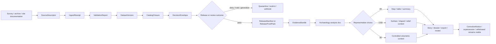

<!-- [KFM_META_BLOCK_V2]
doc_id: kfm://doc/<uuid-NEEDS-VERIFICATION>
title: Archaeology Analyses
type: standard
version: v1
status: draft
owners: <owners-NEEDS-VERIFICATION>
created: <created-NEEDS-VERIFICATION>
updated: <updated-NEEDS-VERIFICATION>
policy_label: <policy_label-NEEDS-VERIFICATION>
related: [../../../contracts/README.md, ../../../schemas/README.md, ../../../policy/README.md, <downstream-archaeology-results-NEEDS-VERIFICATION>]
tags: [kfm, archaeology, analyses]
notes: [Current-session evidence was PDF-only; upstream repo doc surfaces are confirmed by attached repo-grounded evidence, but archaeology directory inventory, owners, dates, policy label, and downstream module files still need direct repo verification.]
[/KFM_META_BLOCK_V2] -->

# Archaeology Analyses

Govern release-aware, evidence-linked archaeology analysis documentation for Kansas Frontier Matrix.

> [!IMPORTANT]
> **Status:** experimental  
> **Owners:** `<owners-NEEDS-VERIFICATION>`  
>      
> **Quick jump:** [Scope](#scope) · [Repo fit](#repo-fit) · [Accepted inputs](#accepted-inputs) · [Exclusions](#exclusions) · [Directory tree](#directory-tree) · [Quickstart](#quickstart) · [Usage](#usage) · [Diagram](#diagram) · [Reference tables](#reference-tables) · [Task list](#task-list) · [FAQ](#faq) · [Appendix](#appendix)

**Status vocabulary used here:** **CONFIRMED**, **INFERRED**, **PROPOSED**, **UNKNOWN**, **NEEDS VERIFICATION**.

---

## Scope

**CONFIRMED:** KFM treats **archaeology and heritage 2.5D/3D context** as a named Kansas operating lane rather than a decorative topic.  
**UNKNOWN:** the current session did **not** expose a mounted archaeology directory tree, so this README documents doctrine, burden, and review shape first, and treats downstream archaeology subpaths conservatively.

Use this directory for archaeology analyses that are already tied to:

- declared evidence or an explicit review-only basis
- declared support and time semantics
- an explicit precision posture
- an explicit publication posture
- visible correction or supersession behavior

This README is meant to make five things immediately legible:

1. what archaeology analysis is being described
2. what evidence and release/review basis support it
3. what precision and sensitivity posture applies
4. why the chosen representation is **2D**, **2.5D**, or **3D**
5. how correction, supersession, or withdrawal will remain visible later

> [!WARNING]
> Do **not** use this directory to launder exact site data, unpublished field notes, culturally sensitive material, or speculative reconstructions into public-safe documentation.

Archaeology work in KFM stays downstream of the same trust objects used elsewhere in the system: source declaration, validation, dataset versioning, policy decision, release proof, EvidenceBundle linkage, and correction lineage.

---

## Repo fit

| Direction | Link / path | Role in repo | Status |
| --- | --- | --- | --- |
| **This file** | `docs/analyses/archaeology/README.md` | Directory guide and review contract for archaeology analysis docs | **Target of current task** |
| **Upstream repo surfaces** | [contracts](../../../contracts/README.md) · [schemas](../../../schemas/README.md) · [policy](../../../policy/README.md) · [tests](../../../tests/README.md) · [workflow notes](../../../.github/workflows/README.md) | Contract, schema, policy, validation, and workflow context that archaeology docs should link to rather than duplicate | **CONFIRMED by attached repo-grounded summary; direct tree still not rechecked here** |
| **Doctrinal upstream** | `SourceDescriptor` · `DatasetVersion` · `DecisionEnvelope` · `ReleaseManifest` / `ReleaseProofPack` · `EvidenceBundle` · `CorrectionNotice` | The minimum evidence/policy lineage archaeology outputs are expected to inherit | **CONFIRMED doctrine** |
| **Named downstream archaeology result docs** | `./results/site-distributions/README.md` · `./results/site-distributions/heatmaps/README.md` · `./results/notebooks/README.md` | Attached design packets explicitly name these as archaeology result surfaces | **INFERRED from attached design packets · NEEDS VERIFICATION against repo tree** |
| **Downstream product surfaces** | Map / dossier / story / export surfaces on governed APIs | Where public-safe archaeology outputs may eventually appear | **CONFIRMED doctrine; exact repo/runtime paths UNKNOWN** |

### Upstream/downstream reading

Upstream reading should answer: *what evidence and release state back this analysis?*  
Downstream reading should answer: *what public-safe archaeology outputs does this analysis support, and how do they stay correctable?*

---

## Accepted inputs

| Fits here | Minimum expectation |
| --- | --- |
| **Directory-level archaeology analysis indexes** | State purpose, release or review basis, precision posture, and representation rule |
| **Generalized site-distribution summaries** | Avoid exact sensitive coordinates on public surfaces |
| **Generalized heatmap or density indexes** | State the generalization method or public-safe reduction posture |
| **Archaeology notebook indexes** | Keep notebook summaries downstream of governed evidence and note whether outputs are public-safe or review-only |
| **Place/time-aware interpretation notes** | Declare support, time scope, and uncertainty cues |
| **Preservation / damage / condition assessments** | Keep evidence route and correction path visible |
| **2.5D / 3D analysis notes** | Name the representation honestly and justify the burden |
| **Correction / supersession notes for archaeology outputs** | Preserve lineage instead of silently replacing history |
| **Links to governed map / dossier / story / export outputs** | Only when release or review state and evidence route are explicit |

---

## Exclusions

| Do **not** put this here | Put it where instead |
| --- | --- |
| **Raw field capture, unpublished trench notes, sensitive ingest drops, or unresolved materials** | The governed truth path (`RAW -> WORK/QUARANTINE -> PROCESSED -> CATALOG -> PUBLISHED`), not README-space |
| **Exact site coordinates or unrestricted precise exports** | Steward-only or generalized release-safe derivatives |
| **Machine-readable schemas** | [../../../schemas/README.md](../../../schemas/README.md) |
| **Contract-family prose or starter contract docs** | [../../../contracts/README.md](../../../contracts/README.md) |
| **Policy registries, reason/obligation bundles, or authorization logic** | [../../../policy/README.md](../../../policy/README.md) |
| **Fixtures, validation harness notes, or e2e proof artifacts** | [../../../tests/README.md](../../../tests/README.md) |
| **Speculative reconstructions presented as established fact** | Review-only drafts until verified and policy-cleared |
| **Archaeology-local shadow copies of shared governance docs** | Link outward to root governance surfaces instead |

---

## Directory tree

> [!NOTE]
> The tree below is **evidence-aware**. Only this README path is the direct task target. Other entries are either explicitly named in attached design packets or included as cautious starter scaffolding.

```text
docs/analyses/archaeology/
├── README.md                                      # This directory guide
└── results/
    ├── site-distributions/                        # INFERRED from attached design packets
    │   ├── README.md                              # INFERRED; repo verification needed
    │   └── heatmaps/
    │       └── README.md                          # INFERRED; repo verification needed
    └── notebooks/
        └── README.md                              # INFERRED; repo verification needed
```

---

## Quickstart

1. Start from a **released** archaeology subject or an explicitly **review-only** subject.
2. Declare the **release basis** or **review basis**.
3. Declare the **support** and **time semantics**.
4. Make the **precision posture** explicit: generalized, steward-only, withheld, or equivalent.
5. Prefer the **smallest honest representation**:
   - **2D** by default
   - **2.5D** when surface morphology or draped context matters
   - **3D** only when 2D is insufficient and the added burden is documented
6. Link outward to **contracts**, **schemas**, **policy**, and **tests** instead of inventing local shadow versions.
7. Record how **correction**, **supersession**, or **withdrawal** will stay visible before publication.

Illustrative starter block for a submodule:

```md
> Status: draft
> Basis: <release-manifest-or-review-only-NEEDS-VERIFICATION>
> Support / time semantics: <declared-grain-and-time-basis>
> Precision posture: generalized | steward-only | withheld
> Representation: 2D | 2.5D | 3D
> Downstream surface: map | dossier | story | export | review-only
> Correction path: <correction-notice-or-none>
```

---

## Usage

### Add a new analysis module

Create a downstream archaeology module only when the document can answer these questions plainly:

- What released or review-only material does this summarize?
- What is the smallest meaningful support or grain?
- Is any sensitive geometry generalized, withheld, or restricted?
- Does the document feed a map, a dossier, a story, an export, or only internal review?

### Update an existing analysis without breaking lineage

When archaeology analysis changes, prefer:

- **supersession**
- **narrowing**
- **withdrawal**
- **replacement with visible note**

Do not silently overwrite interpretive history when a correction note or supersession note is the more truthful operation.

### Distinguish 2.5D from 3D honestly

For archaeology, this distinction is part of the review burden, not cosmetic vocabulary.

- **2D** covers generalized site distributions, chronology overlays, tables, and plan-view interpretation.
- **2.5D** covers surface or relief-aware contexts such as draped imagery, terrain-backed views, section surfaces, or other height-bearing surfaces that are not full volumetric models.
- **3D** covers genuinely volumetric or trench/stratigraphic reasoning where removing the third dimension would materially change the claim.

> [!CAUTION]
> “Looks better in 3D” is not a sufficient reason. In KFM, controlled 3D is conditional, burden-bearing, and must inherit the same evidence, policy, release, and correction rules as 2D.

---

## Diagram


```mermaid
flowchart LR
    A[Survey / archive / site documentation] --> B[SourceDescriptor]
    B --> C[IngestReceipt]
    C --> D[ValidationReport]
    D --> E[DatasetVersion]
    E --> F[CatalogClosure]
    F --> G[DecisionEnvelope]
    G --> H{Release or review outcome}
    H -->|deny / hold / generalize| Q[Quarantine / restrict / withhold]
    H -->|pass| I[ReleaseManifest or ReleaseProofPack]
    I --> J[EvidenceBundle]
    J --> K[Archaeology analysis doc]
    K --> L{Representation choice}
    L -->|2D| M[Map / table / summary]
    L -->|2.5D| N[Surface / draped / relief context]
    L -->|3D| O[Controlled volumetric context]
    M --> P[Story / dossier / export / review]
    N --> P
    O --> P
    P --> R[CorrectionNotice / supersession / withdrawal remains visible]
```

This flow is intentionally evidence-first: archaeology prose belongs **after** declared evidence and decision objects, and **before** downstream public-safe surfaces.

---

## Reference tables

### Minimum contract linkage for archaeology modules

| Contract / proof object | Why it matters here | Minimum visible cue in the doc |
| --- | --- | --- |
| **SourceDescriptor** | Declares source identity, rights posture, support, time semantics, and publication intent | Name the source family or source basis, not just the topic |
| **DatasetVersion** | Anchors the authoritative candidate or released subject set | State the release-backed or review-only basis |
| **DecisionEnvelope** | Records policy result, obligations, and audience posture | Make precision and publication posture explicit |
| **ReleaseManifest / ReleaseProofPack** | Proves what was actually released and under what gates | State the release basis when a document is outward-facing |
| **EvidenceBundle** | Packages inspectable support for a claim, feature, story node, or export | Keep consequential claims one hop from evidence |
| **CorrectionNotice** | Preserves visible lineage when results are corrected or withdrawn | State how change remains visible later |

### Representation and publication matrix

| Representation | Best use here | Default publication posture | Must say explicitly |
| --- | --- | --- | --- |
| **2D** | Distribution maps, chronology overlays, comparison views, heritage summaries | Public-safe if generalized and cleared | Time scope, support, uncertainty, release/review basis |
| **2.5D** | DEM/DTM-backed surface reasoning, draped orthos, section surfaces, preservation review | Usually review-first; public release depends on sensitivity and support clarity | That the output is **2.5D**, not full 3D |
| **3D** | Volumetric or trench/stratigraphic reasoning where 2D is insufficient | Controlled and burden-bearing; never default spectacle | Why 2D is insufficient, what evidence backs the model, what added risk it introduces, and how correction works |

### Reviewer questions this README should answer fast

| Review question | Minimum visible answer |
| --- | --- |
| **What evidence or review basis backs this analysis?** | Named release basis or clear review-only status |
| **What precision class applies?** | Generalized, steward-only, withheld, or equivalent |
| **Why this representation?** | 2D default, or explicit 2.5D/3D reason |
| **What surfaces may consume this output?** | Map, dossier, story, export, review-only, or not yet assigned |
| **How will correction stay visible?** | Supersession, correction note, withdrawal, or replacement path |

---

## Task list

**Definition of done for this directory and its submodules**

- [ ] Release basis or review basis is named
- [ ] Support and time semantics are declared
- [ ] Rights / sensitivity posture is stated
- [ ] Precision posture is explicit
- [ ] Representation is labeled **2D**, **2.5D**, or **3D**
- [ ] At least one upstream evidence / contract / policy route is linked where relevant
- [ ] Any INFERRED downstream path is rechecked against the actual repo before commit
- [ ] Correction or supersession behavior is described
- [ ] Any 3D claim includes a burden justification
- [ ] Long supporting reference material is collapsed into `<details>` blocks

---

## FAQ

### Is archaeology the first KFM thin slice?

No. Hydrology remains the preferred first governed thin slice because it is public-safe, place/time-rich, and operationally legible. Archaeology is a later lane and should expand only after earlier governance foundations are real.

### Can exact site coordinates live here?

Not by default. This directory should favor **generalized**, **withheld**, or otherwise policy-cleared public-safe outputs unless a stricter review path explicitly permits more precision.

### Can 2.5D and 3D be treated as the same thing?

No. A draped surface, DTM-backed view, or relief context is not the same thing as a volumetric trench or stratigraphic reconstruction. Name the representation honestly.

### Should schemas, policy bundles, or tests live beside archaeology prose here?

No. Link to shared repo-root surfaces; do not fork them into archaeology-local copies.

### Are downstream `results/` folders confirmed repo inventory?

Not from current-session mounted evidence. Treat named downstream archaeology result paths as **INFERRED** until direct repo inspection confirms them.

---

## Appendix

<details>
<summary><strong>Appendix A — Publishing review prompts</strong></summary>

<br>

Use these prompts before publishing or revising any archaeology analysis module:

1. **Subject**
   - What place, feature, assemblage, trench, route, or heritage context is actually being discussed?
   - What is the smallest honest support for the claim?

2. **Evidence**
   - What released or review-only material supports the analysis?
   - Are documentary, observational, modeled, and derived materials kept distinct?

3. **Precision**
   - Would a more precise geometry create cultural, stewardship, rights, or site-protection risk?
   - If generalized, what transform, reduction, or masking principle was applied?

4. **Representation**
   - Is this really 2D, 2.5D, or 3D?
   - Does the representation improve reasoning, or only appearance?

5. **Correction**
   - If this output becomes stale or disputed, what changes visibly?
   - Is supersession preferable to overwrite?

</details>

<details>
<summary><strong>Appendix B — INFERRED downstream archaeology pattern from attached design packets</strong></summary>

<br>

The attached design packets explicitly name several archaeology result docs, but the current session did **not** directly reverify the mounted repo tree.

Named paths in the attached packets include:

```text
docs/analyses/archaeology/results/site-distributions/README.md
docs/analyses/archaeology/results/site-distributions/heatmaps/README.md
docs/analyses/archaeology/results/notebooks/README.md
```

Those packets also name supporting working paths such as:

```text
src/pipelines/archaeology/site_distributions/
data/work/archaeology/site_distributions/
```

Treat these as **INFERRED path evidence from attached design material**, not as settled current repo fact.

What those packets suggest, without upgrading them to mounted-repo certainty:

- `site-distributions/` is the likely home for generalized cluster and density outputs
- `heatmaps/` is a likely public-safe derivative submodule
- `notebooks/` is a likely governed index for reproducible archaeology analysis notebooks
- public-safe archaeology results are expected to favor generalized geometries and explicit redaction posture

</details>

<details>
<summary><strong>Appendix C — 2.5D vs 3D quick examples</strong></summary>

<br>

| Example | Best label | Why |
| --- | --- | --- |
| Generalized site distribution map | **2D** | Plan-view reasoning only |
| DTM-backed site context with draped imagery | **2.5D** | Height-aware surface context, not full volume |
| Stratigraphic surface slices draped on a terrain model | **2.5D** | Surface interpretation with relief |
| Volumetric trench or cave reconstruction | **3D** | The claim depends on volume, not just surface |
| Extruded boundary models of stratigraphic units | **3D** | Volumetric reasoning materially matters |

</details>

[Back to top](#archaeology-analyses)