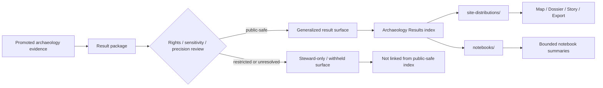

<!-- [KFM_META_BLOCK_V2]
doc_id: kfm://doc/<REVIEW-REQUIRED-UUID>
title: Archaeology Results
type: standard
version: v1
status: draft
owners: <REVIEW-REQUIRED: archaeology stewards>
created: <REVIEW-REQUIRED>
updated: <REVIEW-REQUIRED>
policy_label: <REVIEW-REQUIRED: public|restricted|mixed>
related: [<REVIEW-REQUIRED: ../README.md>, <REVIEW-REQUIRED: ./site-distributions/README.md>, <REVIEW-REQUIRED: ./notebooks/README.md>]
tags: [kfm, archaeology, results]
notes: [Current-session workspace evidence was PDF-only; mounted repo paths, owners, dates, and related links require verification before commit.]
[/KFM_META_BLOCK_V2] -->

<a id="top"></a>

# Archaeology Results

Public-safe index for promoted archaeology result surfaces and their governed publication boundaries inside KFM.

| Field | Value |
| --- | --- |
| Status | `experimental` |
| Owners | `<REVIEW-REQUIRED: archaeology stewards>` |
| Badges |      |
| Quick jump | [Scope](#scope) · [Repo fit](#repo-fit) · [Inputs](#inputs) · [Exclusions](#exclusions) · [Directory tree](#directory-tree) · [Quickstart](#quickstart) · [Usage](#usage) · [Diagram](#diagram) · [Reference tables](#reference-tables) · [Task list](#task-list) · [FAQ](#faq) · [Appendix](#appendix) |

> [!IMPORTANT]
> This README is doctrine-grounded, but **mounted repository verification was not available in this session**. Treat all path, ownership, timestamp, and child-directory details marked `INFERRED`, `UNKNOWN`, `NEEDS VERIFICATION`, or `REVIEW-REQUIRED` as commit-review items rather than settled repo fact.

## Scope

This directory is the results-layer landing zone for **promoted archaeology outputs** that are safe to index, describe, compare, and route into governed KFM surfaces.

At this layer, archaeology is not a loose collection of maps, notebooks, figures, or scene files. Results remain downstream of evidence, rights, sensitivity handling, review, release state, and correction lineage. This README therefore acts as both an index and a publication-boundary guardrail.

### Results-layer posture used here

| Area | Status | Meaning in this draft |
| --- | --- | --- |
| KFM archaeology publication doctrine | `CONFIRMED` | Supported by the visible KFM corpus |
| Archaeology rights / sensitivity burden | `CONFIRMED` | Public-safe release must tolerate generalization, withholding, or review escalation |
| Current repo topology and adjacent files | `UNKNOWN` | No mounted repo tree was directly inspectable in this session |
| `docs/analyses/archaeology/results/README.md` as exact mounted path | `INFERRED` | Strongly suggested by the provided target and supporting archaeology materials, but not repo-verified here |
| `site-distributions/` and `notebooks/` as child modules | `INFERRED` | Supported by the user-provided baseline and supporting archaeology materials, but not mounted-path verified |
| Meta-block placeholders | `NEEDS VERIFICATION` | Must be replaced from mounted repo truth before commit |

### What belongs here, in one sentence

**Promoted, public-safe, evidence-linked archaeology result surfaces** belong here.

[Back to top](#top)

## Repo fit

**Path:** `docs/analyses/archaeology/results/README.md` — `INFERRED`

**Upstream:** `../README.md` — `NEEDS VERIFICATION`  
**Downstream:** `./site-distributions/README.md`, `./notebooks/README.md` — `INFERRED`

### Role in the repository

This README should help maintainers and reviewers answer four questions quickly:

1. Is this archaeology output **promoted** or still a working candidate?
2. Is it safe to expose at this results layer, or does it belong in a steward-restricted lane?
3. Is the result **generalized, partial, modeled, or interpretive** in a way that must remain visible?
4. Does the result link onward to governed evidence, rather than quietly replacing it?

### Repo-native expectation

This directory should behave as an **index of bounded result surfaces**, not as a sovereign source of archaeological truth.

[Back to top](#top)

## Inputs

### Accepted inputs

This directory may contain or index:

- promoted archaeology result summaries
- generalized site-distribution outputs
- public-safe density, cluster, or pattern surfaces
- result-level README files for steward-cleared child modules
- notebook indexes **only when their exposure class is explicit**
- links to release-backed manifests, proofs, or evidence hooks **once mounted paths are verified**
- bounded 2.5D / 3D result surfaces **only when 2D is materially insufficient and the same evidence/policy/correction burdens still apply**

### Minimum expectations for anything linked here

Any child result surface should make these items easy to inspect:

| Expectation | Why it matters |
| --- | --- |
| What the result represents | prevents vague or decorative publication |
| Whether it is observational, analytical, modeled, or interpretive | keeps method and claim type visible |
| What publication class applies | avoids accidental exposure drift |
| What precision controls were used | especially important for archaeological sensitivity |
| What was generalized, withheld, or omitted | prevents exactness from being implied |
| What evidence / provenance route supports it | keeps inspectability alive |
| What review or release state applies | shows whether the result is stable, draft, or pending |

### Typical input examples

- generalized density or distribution outputs
- result notes derived from steward-reviewed trench, site, or survey material
- publication-safe figures or derivative rasters
- bounded notebook indexes pointing to released analysis artifacts

[Back to top](#top)

## Exclusions

This directory is **not** the place for:

- RAW, WORK, or QUARANTINE archaeology material
- exact site coordinates or other precision beyond the approved publication class
- unreviewed notebooks or exploratory scratch outputs
- unpublished candidate interpretations
- raw trench photography or raw geophysics deliverables awaiting steward review
- direct dumps of derived AI output without evidence linkage and review context
- spectacle-first 3D scenes published merely because they are visually impressive

### Put these elsewhere instead

| Material | Keep it out of `results/` because... | Put it in... |
| --- | --- | --- |
| RAW captures, field notes, trench logs, draft ingest outputs | not publication-safe | upstream intake / working lanes |
| Exact locations and other sensitive coordinates | may create stewardship or exposure risk | steward-restricted surfaces |
| Unreviewed notebooks and intermediate models | not yet promoted | internal analysis or methods lanes |
| Release proofs, manifests, receipts | these are trust objects, not result prose | release / catalog / proof-pack surfaces |
| Public stories, civic explainers, or app views | downstream publication surfaces | governed product surfaces |
| Human remains or otherwise restricted materials without explicit steward clearance | sensitivity and rights burden is higher | steward-only review lanes |

[Back to top](#top)

## Directory tree

```text
docs/analyses/archaeology/results/
├── README.md                         # this file
├── site-distributions/               # INFERRED; verify mounted path
│   └── README.md                     # generalized distributions, clusters, density surfaces
└── notebooks/                        # INFERRED; verify mounted path
    └── README.md                     # index of publication-safe or explicitly bounded notebooks
```

> [!NOTE]
> The tree above is intentionally conservative. Supporting archaeology materials suggest additional result families may exist or may be planned, but only the two child modules named in the user-provided baseline are kept in the main tree until the mounted repo confirms more.

[Back to top](#top)

## Quickstart

### Add a new archaeology result module safely

1. Confirm the source output is **promoted**, not merely generated.
2. Confirm the publication class and precision controls are explicit.
3. Decide whether the result belongs here or in a steward-restricted lane.
4. Create or update the child README for that result family.
5. State whether the result is observational, analytical, modeled, or interpretive.
6. Declare what was generalized, withheld, or left unresolved.
7. Link only to governed, reviewable artifacts.
8. Add or update the module entry in [Known result modules](#known-result-modules).

### Commit-review checklist

```bash
# Illustrative review checklist — verify against mounted repo reality
# 1. Replace REVIEW-REQUIRED placeholders in the meta block
# 2. Verify upstream/downstream relative links
# 3. Confirm child directories actually exist
# 4. Confirm policy label and exposure class
# 5. Confirm no exact-location disclosure is implied
# 6. Confirm modeled / generalized / partial states are labeled in-place
```

[Back to top](#top)

## Usage

### For maintainers

Use this README as the first stop when adding a new archaeology result surface. The question is not just “does this look useful?” but also:

- is it promoted,
- is it public-safe,
- is its precision appropriate,
- and does it stay downstream of governed evidence?

### For reviewers

Review this directory as a **publication boundary**, not just a docs folder. Good review questions include:

- Does the result inherit the truth path rather than bypass it?
- Is the exposure class obvious?
- Are generalized and withheld aspects visible?
- Does the result distinguish observed findings from modeled or interpretive overlays?
- Does any 3D or 2.5D material carry real reasoning burden rather than visual surplus?

### For product / UX work

Treat this README as an index of archaeology result surfaces that may later appear in map, dossier, story, compare, or export contexts. Those downstream surfaces should gain clarity from this registry, not permission to overstate what archaeology evidence can support.

[Back to top](#top)

## Diagram



[Back to top](#top)

## Reference tables

### Results-layer rules

| Rule | Why it matters |
| --- | --- |
| Results stay downstream of evidence and release state | prevents summaries from replacing canonical support |
| Promotion is required; generation alone is not enough | generated output is not automatically publishable |
| Generalization must be visible, not implied away | readers should not mistake safe outputs for exact records |
| Notebook indexes need an explicit exposure class | avoids accidental publication through documentation |
| 2D remains the default explanatory surface | lowers governance burden for public reasoning |
| 3D or 2.5D must justify itself | archaeology volumetrics should improve reasoning, not just presentation |
| Exact-location risk must fail closed | archaeology sensitivity is not a cosmetic concern |

### Publication state cues

| Surface cue | Use it when... | Reader takeaway |
| --- | --- | --- |
| `promoted` | the result passed its release boundary | safe to treat as governed output within stated scope |
| `generalized` | precision was intentionally reduced | do not treat as exact location or exact geometry |
| `partial` | coverage or interpretation is incomplete | absence may reflect incomplete scope, not nonexistence |
| `modeled` | the output is analytical or simulated | useful, but not a direct observation |
| `restricted / withheld` | public exposure would be unsafe or unresolved | steward review is still carrying the burden |
| `source-dependent` | the result relies on external or still-bounded support | confidence and reuse should stay proportional |

### Known result modules

| Module | Intended role | Exposure | Status in this draft | Notes |
| --- | --- | --- | --- | --- |
| `site-distributions/` | generalized site distributions, clusters, density, probability-style surfaces | public-safe / generalized | `INFERRED` | supporting archaeology material suggests generalized outputs here |
| `notebooks/` | index of archaeology notebooks or notebook-backed outputs | mixed / likely internal-first | `INFERRED` | only publication-safe notebooks or bounded notebook indexes should appear |
| additional result families | future promoted archaeology result sets | TBD | `UNKNOWN` | verify mounted repo before adding to main tree |

### Result-doc content expectations

| Section | Keep it concise | Why it belongs |
| --- | --- | --- |
| Purpose | yes | clarifies what the result is actually for |
| Method / basis | yes | distinguishes observed vs modeled vs interpretive |
| Publication limits | yes | makes generalization and withholding visible |
| Evidence / provenance hooks | yes | preserves inspectability |
| Status / review state | yes | avoids false finality |
| Related modules | yes | helps GitHub navigation without duplicating canonical records |

[Back to top](#top)

## Task list

- [ ] Verify whether `docs/analyses/archaeology/results/README.md` already exists in the mounted repo.
- [ ] Confirm the exact upstream archaeology README path.
- [ ] Confirm whether `site-distributions/` exists and is still the preferred public-safe result module name.
- [ ] Confirm whether `notebooks/` belongs under `results/` in the mounted repo, and whether its exposure class is internal, mixed, or public-safe.
- [ ] Replace all `REVIEW-REQUIRED` placeholders in the KFM meta block.
- [ ] Confirm owners, dates, UUID, and policy label from mounted repo truth.
- [ ] Verify whether additional archaeology result families exist beside the two named child modules.
- [ ] Add verified links to manifests, schemas, or proof artifacts only after path confirmation.
- [ ] Confirm whether this root README should be labeled `public`, `restricted`, or `mixed`.
- [ ] Check neighboring docs for local badge, heading, metadata, and README conventions.

[Back to top](#top)

## FAQ

### Why are generalized results acceptable here, but exact records are not?

Because archaeology publication burden is not only technical. It includes rights, sensitivity, precision, and stewardship risk. This layer should therefore prefer generalized, public-safe results over exact disclosures.

### Do notebooks belong in `results/`?

Sometimes. A notebook **index** may belong here if its exposure class is explicit and the linked artifacts are publication-safe. Unreviewed notebooks or sensitive notebook outputs should not be indexed here.

### When should a result use 3D?

Only when 2D is materially insufficient and the additional governance burden has been accepted. Archaeology can justify 3D for trench, stratigraphic, or subsurface reasoning, but that does not relax evidence, policy, or correction requirements.

### Can this README link directly to maps, stories, or exports?

Yes, but only when those surfaces are governed, reviewable, and consistent with the same publication class and precision rules described here.

### Is this directory the same thing as the archaeology datasets lane?

No. Datasets, evidence objects, manifests, and proofs remain distinct from result-oriented navigation. This README should point toward them, not absorb their role.

[Back to top](#top)

## Appendix

<details>
<summary><strong>Publication checklist for archaeology result docs</strong></summary>

### Before a child result README is added here

- publication class is explicit
- precision policy is explicit
- result type is explicit: observational / analytical / modeled / interpretive
- provenance or evidence route is named
- generalized or withheld material is declared
- linked surfaces do not bypass governed publication surfaces
- status language does not imply mounted implementation that has not been verified
- any 3D / 2.5D reasoning burden is explained

### Language to avoid

- “authoritative map” for a derived result surface
- “complete” when coverage is partial
- “exact” when coordinates were generalized
- “verified” when only planning or doctrine material is visible
- “safe to publish” without a stated publication basis

</details>

<details>
<summary><strong>Status vocabulary used in this README</strong></summary>

| Label | Use here |
| --- | --- |
| `CONFIRMED` | directly supported by visible KFM corpus evidence |
| `INFERRED` | strongly suggested by the visible corpus or user-provided baseline, but not mounted-path verified |
| `PROPOSED` | recommended structure or future-safe packaging move |
| `UNKNOWN` | not directly verified in this session |
| `NEEDS VERIFICATION` | must be checked against the mounted repo before commit |

</details>

<details>
<summary><strong>Possible future sibling result families mentioned in supporting archaeology material (`INFERRED` only)</strong></summary>

The following families appeared in supporting archaeology planning material, but **are not treated as mounted repo fact in this README**:

| Candidate module | Likely role | Caution |
| --- | --- | --- |
| `cultural-landscapes/` | movement, settlement, territorial, or route reconstructions | likely needs strong generalization and interpretation labeling |
| `stratigraphy/` | layer sequencing, phased sections, chronology surfaces | trench/unit precision may require tighter controls |
| `artifacts/` | artifact distributions, classifications, typology results | restricted or human-remains-related material may need exclusion or steward review |
| `geophysics/` | interpreted GPR / magnetometry outputs | raw grids and donor-restricted materials may not be public-safe |
| `paleoenvironment/` | eco-sample and environmental context correlations | licensing and sampling sensitivity may vary |
| `ai-interpretations/` | bounded, evidence-linked archaeology summaries | must stay clearly downstream of evidence and review |

If these modules exist in the mounted repo, add them only after verifying paths, exposure class, and local naming conventions.

</details>

---

Built for a KFM archaeology review posture: doctrine first, precision visible, and public-safe result claims kept proportional to evidence.

[Back to top](#top)